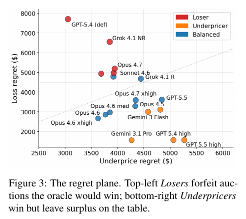

# Can LLM Agents Price Competitively? A Dynamic Multi-Attribute Auction Benchmark for Agentic Commerce

**Authors:** Shimaa Ahmed, Yiwei Cai, Mohsen Minaei, Rahul Rachuri (Visa Research; listed alphabetically)
**Published:** 2026-07 · [Source](https://arxiv.org/abs/2608.00102)
**Lens:** `eval-designer` · **Digested:** 2026-10-01

## TLDR

Bazaar puts one LLM merchant in a repeated sealed-bid auction against three adaptive rule-based specialist bots, selling to 24 synthetic customers whose hidden additive value curves span three abstract attributes with 5 levels each (125 configurations). Because customer utilities and merchant costs are closed-form, every run has an exact hindsight oracle, and the gap to that oracle splits into loss regret (auctions the agent should have won) and underprice regret (margin left on auctions it did win). Across 11 frontier LLMs from Anthropic, OpenAI, Google and xAI, 10 seeds per variant (GPT-5.5 xhigh: 3) over roughly 79 rounds, with pairwise permutation tests (10,000 shuffles) sorting 21 model-variants into four tiers, total profit spans 11x: $2,976 for Claude Opus 4.6 at extended thinking (xhigh) down to $266 for GPT-5.4 at its no-effort default. Profit tracks margin per win (r = 0.99) much more tightly than win rate (r = 0.88): Gemini 3.1 Pro wins 77.9% of auctions against 67.8% for Opus 4.6 and still earns less, at $1.83 per win versus $2.22 to $2.39 for Opus 4.6. A per-customer Thompson Sampling bandit given the same binary win/loss signal earns $1,426, more than 6 of the 11 base LLMs. Thinking budget is the single largest lever (GPT-5.4 from none to high: 7.3x profit, efficiency 0.025 to 0.225) but it swaps failure modes rather than removing them: GPT-5.4's loss share of regret falls from 72% to 24% while its underprice regret rises from $3,054 to $5,058, turning a Loser into an Underpricer. An unannounced attribute-preference swap hitting 12 of the 24 customers at staggered rounds in 31 to 40 reveals a strong-learner / weak-adapter reversal: the fastest pre-shock climbers (GPT-5.3 +46 pp, Opus 4.5 +40 pp in win rate over rounds 1 to 30) lose about 19 pp afterwards and do not recover, while Gemini 3.1 Pro recovers fastest, writes strategy notes a third the length of rivals, and costs 4.8x less per seed than Opus 4.6 ($186 vs $890). Even the best agent captures only 32% of hindsight-optimal profit (efficiency 0.321). For eval builders the useful part is the instrument: decompose the money number into the two ways of losing money, put a bandit under the LLMs as a floor, and inject a shift the agent is not told about; those three moves surfaced everything the leaderboard hid.

## Key Takeaway

The agent that wins the most auctions is not the one that makes the most money, and the agent that learns fastest is the one that adapts worst. Gemini 3.1 Pro out-wins Opus 4.6 by 10 points (77.9% vs 67.8%) and still earns less, because profit tracks margin per win at r = 0.99 and win rate at only r = 0.88; the two fastest learners before the demand shock (GPT-5.3 +46 pp, Opus 4.5 +40 pp) are among the worst afterwards, losing about 19 pp and never recovering. Confidence earned fast hardens into lock-in: models write themselves instructions like "ABSOLUTELY IDENTICAL, DO NOT CHANGE", label the first post-shock loss "an anomaly", and after five straight losses blame competitor costs rather than consider that preferences changed. More thinking budget does not cure this; it moves a model from losing auctions it should win to underpricing the ones it does win.

## Implications

- **Split the money number into the two ways of losing money**: Bazaar's loss regret (auctions the oracle would have won) versus underprice regret (margin left on won auctions) is what made the thinking-budget finding visible. GPT-5.4's loss share dropped from 72% to 24% at high effort while underprice regret rose from $3,054 to $5,058; the total barely tells you that. For a buying agent, mirror this as "items it should have won but lost" versus "items it won but overpaid for," and report both every run.
- **Report margin per transaction next to win rate, not instead of it**: profit correlates with margin per win at r = 0.99 and with win rate at r = 0.88. An agent that closes more deals is not the one that makes or saves the most money. Gemini 3.1 Pro wins 10 points more often than Opus 4.6 and earns less. Any eval whose headline is a completion or win rate is hiding the margin.
- **Build the counterparty with closed-form utilities so you own an exact oracle, then re-check the ranking with a frozen counterparty**: the oracle ceiling is endogenous because bots cut margins when the agent plays well, which compresses the agent's own ceiling. The authors recompute the oracle with the across-model median competitor utility; only the top-2 swap (Opus 4.6 0.293 vs Gemini 3.1 Pro 0.276). If you cannot do this, your "percent of optimal" is not comparable across agents.
- **Put a bandit under the LLMs**: a per-customer Thompson Sampling bandit with the same binary win/loss feedback earns $1,426, above 6 of 11 base LLMs, and EXP4 earns $1,023. An LLM agent that cannot beat a 1933 algorithm on the same action space should not be spending anyone's money. The LLM edge shows up in margin ($2.22 vs $1.17 per win) and in post-shock recovery speed (best LLMs within 5 to 10 rounds, TS only by round s+30), not in raw win rate.
- **Inject an unannounced, staggered shift and score recovery as its own metric**: shock recovery (win rate in the final post-shock window minus the pre-shock R26 to R30 peak) ranges from +3.3 pp (Gemini 3.1 Pro) to -19.2 pp (Opus 4.5, GPT-5.3). Traces show models detect losses within a few rounds; the bottleneck is revision, not detection. A stationary eval would have ranked the lock-in models at the top.
- **Pin and publish thinking mode and effort level for every row**: the same GPT-5.4 weights earn $266 at effort none and $1,936 at high (7.3x). At provider defaults, three of four families regress with the newer model (Opus 4.7 efficiency 0.100 vs Opus 4.6 0.295 vs Opus 4.5 0.181; GPT-5.3 0.163 vs GPT-5.4 0.025 and GPT-5.5 0.100). "Version recency is a poor predictor of out-of-the-box competence," so an eval row without its effort setting is not reproducible.
- **Report cost per run beside outcome**: per-seed API cost varies about 14x across leaderboard models in the main text (and about 50x, $26 to $1,295, in the appendix sweep). Opus 4.6 at $890 per seed pays 4.8x Gemini 3.1 Pro's $186 for 14% more profit. Input tokens are 90%+ of spend because per-customer sessions accumulate context; OpenAI cells cached 20 to 85% of input tokens, Anthropic cells essentially none under this session pattern.
- **Run small anchor probes that change the counterparty economics before you trust the ranking**: under an adversarial-pricing probe (12 customers, 67% with negative moat, 3 seeds) the main-dataset leader Opus 4.6 fell to third on profit and Gemini 3.1 Pro led; under a margin-extraction probe the two were within 6% of each other. The authors label these confirmatory, not independently powered, which is the right discipline for 3-seed side experiments.

## How to Apply It (method)

**Scenario:** You are building an eval for an agent that buys on a person's behalf in a live secondary market (used gravel-bike parts, event tickets, discontinued components): the agent bids against other buyers for listings that differ on a few attributes, and the person wants the best value, not the most purchases. Before the agent touches real money you want an exact answer to "how far from optimal was it, and in which direction?" Bazaar is seller-side; the steps below mirror it to the buyer side, with the principal's utility playing the role of the customer's hidden value curve and competing buyers playing the role of the specialist bots.

**Steps:**

1. **Define a small factored action space**: 3 attributes with 5 levels each gives 125 configurations plus a price. Keep attribute names abstract (A, B, C), as the paper does, so the model cannot import priors from labels like "carbon" or "front row." Each round the agent emits one bid per listing: `(a, b, c) @ $p`.

2. **Write closed-form utilities for the principal and costs for the counterparties**: Bazaar uses additive customer value `V(x) = sum_k V_k[x_k]` and additive merchant cost `c(x) = c_0 + sum_k C_k[x_k]` with a shared base cost of $70 and a level ladder of `[0, 1, 3, 6, 12]`. Build the 24-counterparty population from three value-curve shapes (flat `[0, 1, 1.5, 1.8, 2]`, mid `[0, 2, 6, 10, 11]`, late `[0, 2, 4, 7, 13]`) with noise in [-0.3, 0.3] on nonzero entries, keeping curves monotone. From the 27 shape triples drop flat/flat/flat, flat/flat/mid and flat/flat/late; the paper keeps 24: 4 singles, 12 duals, 8 triples. The point of closed form is the oracle in step 8.

3. **Give the agent a structural edge and the rivals a cost edge**: the focal agent is a generalist (cost multiplier 0.75 on every attribute); each of three rivals is a specialist (0.4 on its specialty, 1.0 elsewhere) that always offers its specialty configuration `(4,0,0)`, `(0,4,0)` or `(0,0,4)` and adapts only price.

4. **Make the rivals adaptive but asymmetric**: open each counterparty at a $3 margin over cost; after a win raise that counterparty's margin by a step from U(0.5, 1.5); after a loss lower it by U(0.25, 0.75), floored at $1 over cost. The asymmetry is deliberate: rivals climb faster than they cede, so one underbid does not break them. Seed the rivals' RNG from the experiment seed.

5. **Fix the information protocol so a loss is only a pairwise signal**: before bidding the agent sees its own costs, the counterparty id, its stored belief for that counterparty, its global strategy and its financial state. After each auction everyone sees the winner, the winning configuration and the winning price; the winner also sees realized profit. Losers never see the losing bids, the utility, or the utility gap.

6. **Set the horizon and the shift**: 30 pre-shift rounds (chosen because the slowest models saturate by then), then for 12 of the 24 counterparties swap two attribute value curves (4 each of A/B, A/C, B/C) at a counterparty-specific round drawn from {31, ..., 40}. The agent gets no shift indicator. Run 40 further rounds past each counterparty's own shift round (about 80 total). The other 12 counterparties are controls.

7. **Run the three-stage loop with structured output and per-counterparty sessions**: one accumulated session per counterparty plus one global strategy session (25 sessions). Each round: bid stage, belief-update stage after the auction resolves, round-strategy stage after all 24 resolve. Require `reasoning`, `target_belief` and `new_strategy` fields in JSON because providers do not expose thinking tokens portably. Bid-stage system prompt (paper's text, level labels 0 to 4):

   ```
   Submit your configuration for this round.

   STEP 1 -- GATHER INFORMATION:
   - Call get_agent_strategy() to review your current overall strategy.
   - Call get_cost_structure() to see costs for each attribute level.
   - If you see "RETURNING TARGET", call get_target_beliefs(target_name) to review what you learned about this Target.
   - If you see "NEW TARGET", this is your first interaction; no prior beliefs.

   STEP 2 -- SELECT ATTRIBUTE LEVELS:
   - Choose levels for A, B, C within allowed ranges.
   - Consider: based on your beliefs, what might this Target value? What configurations have not been tested?

   STEP 3 -- SET YOUR PRICE:
   - Your price must be >= your minimum cost (whole number, no decimals).
   - If you believe the Target values your chosen attributes, you can price higher and still win.

   KEY INSIGHT: upgrading an attribute increases your cost, but if the Target's value gain from the upgrade exceeds the cost increase, you can charge more and still win.

   CRITICAL: respond with ONLY a JSON object. No markdown or surrounding text.

   REQUIRED JSON FORMAT (placeholder values shown):
   {
     "a_level": <integer 0-4>,
     "b_level": <integer 0-4>,
     "c_level": <integer 0-4>,
     "price":   <integer >= minimum cost>,
     "reasoning": "<your explanation>"
   }
   ```

8. **Compute the oracle and decompose regret**: for each counterparty-round, the competitor utility to beat is `q = max_j [V(x_j) - p_j]` over rivals' actual bids, and oracle profit is `max_x [V(x) - q - c_f(x)]+`. Efficiency `eta = realized / oracle`. Loss regret = oracle profit in rounds the agent lost; underprice regret = (oracle - realized) in rounds it won. Also record win rate, profit, margin per win, and shock recovery = win rate in the last 10 post-shift rounds minus the pre-shift R26 to R30 peak. Recompute the oracle once more replacing each round's actual competitor utility with the across-model median to get a fixed-competitor ranking.

9. **Run 10 seeds per model-variant, pin thinking and effort, and tier with permutation tests**: seeds fix rival randomness and the shift schedule. Report mean and standard deviation; run pairwise permutation tests (10,000 shuffles, alpha = 0.05) and only claim rank differences across tiers. Add the two bandits (Thompson Sampling with Beta(1,1) per arm; EXP4) on the same factored action space: 5 arms per attribute plus 6 margin buckets `{1, 2, 4, 6, 8, 12}`, in per-counterparty, type-clustered and global variants.

10. **Read the strategy text and classify the zero bids**: measure strategy-note length per round, look for lock-in language and single-hypothesis commitment after the shift, and label every at-cost `(0,0,0)` bid by stated intent (forfeit, explore, strategic floor, unprofitable). Log tokens and list-price API cost per seed.

**Expected outcome:** A four-tier leaderboard you can defend statistically, a per-agent position on the loss-versus-overpay plane, a recovery score after an unannounced shift, a bandit floor the agent must clear, a cost-per-run column, and reasoning-trace evidence for why the losers lose. You will know whether your buying agent fails by missing deals, by overpaying for the ones it gets, or by refusing to revise a belief once the market moves, which is the decision that determines what guardrail to build before it spends real money.

## Best Figure



Image Candidates:
Figure 3 (p. 8): Plots every model-variant on a loss-regret vs underprice-regret plane, colour-coded Loser / Underpricer / Balanced, so the two failure modes and the thinking-budget migration between them are visible in one view.
Figure 2 (p. 6): Margin per win against win rate with bubble size as profit, showing that the tier-1 cluster sits high on margin rather than far right on win rate.
Figure 6 (p. 17): Win-rate trajectory on shocked customers aligned to each customer's shock round, contrasting Gemini 3.1 Pro's full recovery with the persistent 20-point drops of the lock-in models.

Best Image:
Figure Name: Figure 3: "The regret plane. Top-left Losers forfeit auctions the oracle would win; bottom-right Underpricers win but leave surplus on the table."
Figure Page: 8
Slide Caption: One profit number hides two different ways of losing money: missing auctions you should have won (top-left Losers) versus winning them too cheaply (bottom-right Underpricers).
Description: Each point is a model-variant placed by its two regret components in dollars: loss regret on the vertical axis (oracle profit forfeited in rounds the agent lost) and underprice regret on the horizontal axis (margin left on the table in rounds it won). Red Losers such as GPT-5.4 at default ($7,703 loss regret) and Grok 4.1 NR sit top-left; orange Underpricers such as Gemini 3.1 Pro, GPT-5.4 high and GPT-5.5 high sit bottom-right at $4,264 to $5,266 underprice regret with loss regret near $1,500; blue Balanced models, led by Opus 4.6 xhigh at the bottom-left corner closest to the origin, split regret roughly evenly. Reading along a model family shows what thinking budget does: GPT-5.4 moves from the top-left corner at default to the bottom-right at high effort, trading lost auctions for underpriced wins rather than reducing total regret uniformly. It matters because a single leaderboard score cannot distinguish an agent that needs better configuration search from one that needs margin discipline, and the two call for different fixes.

## What Experts Overlook

The oracle in Bazaar is not a fixed target: it moves with the agent being evaluated. The three specialist bots raise a customer's margin after every win (U(0.5, 1.5)) and lower it after every loss (U(0.25, 0.75), floored at $1 over cost), so an agent that wins a lot forces its rivals to cut margins, and the hindsight-optimal profit for that agent (Eq. 4, computed against rivals' actual bids) shrinks as a direct result. The paper names this in Section 4.4 by citing the policy-regret result of Arora et al. (2012): "a stronger agent compresses its own ceiling." That is why the authors run a robustness pass in Section 3.7 and Section 4.4 that recomputes the oracle with each round's actual competitor utility replaced by the across-model median, and report that the only top-7 change is Opus 4.6 and Gemini 3.1 Pro swapping places 1 and 2 (0.293 vs 0.276). The asymmetric margin steps are the second half of the same design: the bots climb faster than they cede, so the ceiling cannot be gamed by a single underbid.

**Why it matters:** Any eval where counterparties react to the agent has an endogenous ceiling, and "percent of optimal" is only comparable across agents once you have checked it against a frozen counterparty. The headline "the best agent captures less than a third of hindsight-optimal profit" is a statement about a ceiling that the best agent itself pushed down. It also explains why the paper reports efficiency alongside raw profit rather than instead of it: the two can reorder the leaderboard (Gemini 3.1 Pro has the highest base-model efficiency at 0.310 despite earning less than Opus 4.6), and neither alone is the whole story.

**Example of good use:** For an agent that bids on a person's behalf in a secondary market, the sellers and rival buyers learn from the agent's past bids: a buyer that overpays trains sellers to hold out, and a buyer that lowballs trains them to ignore it. Compute the agent's distance from optimal twice, once against the live reacting market and once against a replayed market with the counterparties' policies frozen at a median trajectory, and ship the ranking only if the two agree on tier membership. Report both numbers; the gap between them is itself a measure of how much the agent moved its market.

**Example of misapplication:** Ranking three buying agents by "percent of oracle" computed only against the live market. A cautious agent that rarely wins provokes no seller response, so its ceiling stays generous and its efficiency looks high; an aggressive agent that wins often pushes sellers to tighten, compressing its ceiling and its efficiency score. You would ship the cautious agent on the basis of a ratio whose denominator it never stressed, and discover in production that it buys almost nothing for the person it works for.

## Extracted Prompts

The paper reproduces its full prompt set in Appendix P. The runner uses zero-indexed levels (0 to 4); the main text reindexes them to 1 to 5. Curly-brace tokens are runtime placeholders.

**Prompt explanation:** Role preamble sent once per session, defining the game, the cost rule, the objective and how targets choose.

```
GAME CONTEXT:
- You are an agent competing in a multi-round multi-attribute selection game.
- Each round, you will observe a target and all agents submit a configuration
  [(attribute levels A, B, C) and a price] for that target.
- Attribute levels range from 0 to 4. Higher levels cost more but may generate
  higher utility for Targets who value them.
- You have a specific cost structure that determines how much each attribute
  level costs you. Use get_cost_structure() to see details.
- Your price must be greater than or equal to your cost
  (cost = base cost + A cost + B cost + C cost).
- You gain points if you win a round, where points = price - your cost.
- The Target picks the offer that gives them the highest utility from the
  offered configurations.
- Your OBJECTIVE is to maximize total points across ALL rounds and Targets.

HOW TARGETS CHOOSE:
- Each Target has attribute preferences that determine how much they value each
  level of A, B, C. These preferences are hidden and vary widely across Targets.
- A Target's utility = A_preference[a_level] + B_preference[b_level] + C_preference[c_level] - price
- Target picks the configuration with HIGHEST utility.

STRATEGIC APPROACH:
- Learn each Target's hidden preferences through experimentation.
- You will see the same Target multiple times -- learn and adapt.
- When you see "NEW TARGET", experiment to discover their preferences.
```

**Prompt explanation:** Bid-stage system instructions: three steps (gather via tools, pick levels, set price) and the required JSON output.

```
Submit your configuration for this round.

STEP 1 -- GATHER INFORMATION:
- Call get_agent_strategy() to review your current overall strategy.
- Call get_cost_structure() to see costs for each attribute level.
- If you see "RETURNING TARGET", call get_target_beliefs(target_name) to
  review what you learned about this Target.
- If you see "NEW TARGET", this is your first interaction; no prior beliefs.

STEP 2 -- SELECT ATTRIBUTE LEVELS:
- Choose levels for A, B, C within allowed ranges.
- Consider: based on your beliefs, what might this Target value? What
  configurations have not been tested?

STEP 3 -- SET YOUR PRICE:
- Your price must be >= your minimum cost (whole number, no decimals).
- If you believe the Target values your chosen attributes, you can price higher
  and still win.

KEY INSIGHT: upgrading an attribute increases your cost, but if the Target's
value gain from the upgrade exceeds the cost increase, you can charge more and
still win.

CRITICAL: respond with ONLY a JSON object. No markdown or surrounding text.

REQUIRED JSON FORMAT (placeholder values shown):
{
  "a_level": <integer 0-4>,
  "b_level": <integer 0-4>,
  "c_level": <integer 0-4>,
  "price":   <integer >= minimum cost>,
  "reasoning": "<your explanation>"
}
```

**Prompt explanation:** Bid-stage user prompt for a target the agent has not met before.

```
Round {round_num}. NEW TARGET: You are now engaging with a Target named '{customer_name}'. Select attribute levels AND submit your price.
Allowed ranges: A (0-{max_a}), B (0-{max_b}), C (0-{max_c}).
Respond with JSON including a_level, b_level, c_level, price, and reasoning.
```

**Prompt explanation:** Bid-stage user prompt for a returning target, cueing the agent to recall its stored beliefs.

```
Round {round_num}. RETURNING TARGET: '{customer_name}' is back. Recall your previous interactions. Select attribute levels AND submit your price.
Allowed ranges: A (0-{max_a}), B (0-{max_b}), C (0-{max_c}).
Respond with JSON including a_level, b_level, c_level, price, and reasoning.
```

**Prompt explanation:** Belief-update system instructions, run after each customer-level auction resolves; produces the per-target belief stored for future rounds and tells the model how to reason about pairwise evidence.

```
Review the result for this Target and update your belief about their preferences.

CRITICAL: respond with ONLY a JSON object. No markdown or surrounding text.

REQUIRED JSON FORMAT:
{
  "target_belief": "<your updated hypothesis>",
  "reasoning":     "<evidence from this round>"
}

OUTPUT FIELDS:
- target_belief: updated hypothesis about what THIS SPECIFIC Target values.
  Stored and retrieved via get_target_beliefs() in future rounds.
- reasoning: what evidence from this round supports the updated belief.

REASONING ABOUT EVIDENCE:
- Compare your configuration to the winning one (both price and levels).
- Ties with identical configurations reveal nothing -- the winner was random.
- Does losing with configuration X prove anything about configuration Y that
  you have not tried?
- What assumptions about this Target could be wrong?

UPDATING BELIEFS:
- Track which attribute combinations have been tested with this Target.
- Be precise: "Target does not value A" vs. "Target did not prefer A[1] over
  A[0]" are different claims.
- Preferences may be non-linear (level 1 might give +5; level 2 might give +15).
```

**Prompt explanation:** Belief-update user prompt when the focal merchant won the auction.

```
Round {round_num} Result for Target '{customer_name}':
You won with profit {profit:.1f}.
Winning price: {winning_bid.bid:.0f} with A={winning_bid.a_level}, B={winning_bid.b_level}, C={winning_bid.c_level} (by {winning_bid.merchant}).

Update your belief about this Target.
```

**Prompt explanation:** Belief-update user prompt when the focal merchant lost; reveals only the winner's offer, not the gap.

```
Round {round_num} Result for Target '{customer_name}':
You lost. Your price was {my_bid.bid:.0f} with A={my_bid.a_level}, B={my_bid.b_level}, C={my_bid.c_level}.
Winning price: {winning_bid.bid:.0f} with A={winning_bid.a_level}, B={winning_bid.b_level}, C={winning_bid.c_level} (by {winning_bid.merchant}).

Update your belief about this Target.
```

**Prompt explanation:** Round-strategy system instructions, run once per global round after all 24 target auctions resolve; produces the single global strategy.

```
Review the complete results from this round across ALL Targets and update your overall strategy.

CRITICAL: respond with ONLY a JSON object. No markdown or surrounding text.

REQUIRED JSON FORMAT:
{
  "new_strategy": "<updated strategy>",
  "reasoning":    "<why these changes>"
}

CONSIDER:
- Which Targets were won, which lost, and why.
- Targets where you could price higher and still win.
- Patterns in competitor behavior.
```

**Prompt explanation:** Round-strategy user prompt template summarising the round's wins and losses with cumulative profit.

```
Round {round_num} Summary: Won {num_wins}/{num_targets} targets, profit ${total_profit:.1f}

WINS:
  {target}: ({a},{b},{c}) @ ${price} profit ${profit:.1f}

LOSSES:
  {target}: your ({a},{b},{c}) @ ${price} lost to {winner} ({w_a},{w_b},{w_c}) @ ${w_price}

Cumulative profit: ${merchant.profit:.1f}

Use get_agent_strategy() and get_target_beliefs(target_name) if you need to review your current strategy or beliefs.
```

## Citations

29 references extracted; full structured list in frontmatter `citations:`. First 10:

- Anthropic (2025). Project Vend 2. Anthropic research blog.
- Arora, Dekel, Tewari (2012). Online bandit learning against an adaptive adversary: from regret to policy regret. ICML.
- Asker, Cantillon (2008). Properties of scoring auctions. RAND Journal of Economics.
- Auer, Cesa-Bianchi, Freund, Schapire (2002). The nonstochastic multiarmed bandit problem. SIAM Journal on Computing.
- Balseiro, Gur (2019). Learning in repeated auctions with budgets: Regret minimization and equilibrium. Management Science.
- Bansal et al. (2025). Magentic marketplace: An open-source environment for studying agentic markets. arXiv:2510.25779.
- Besbes, Zeevi (2009). Dynamic pricing without knowing the demand function. Operations Research.
- Bianchi et al. (2024). How well can LLMs negotiate? NegotiationArena platform and analysis. ICML.
- Calvano, Calzolari, Denicolò, Pastorello (2020). Artificial intelligence, algorithmic pricing, and collusion. American Economic Review.
- Chan et al. (2024). NegotiationToM: A benchmark for stress-testing machine theory of mind on negotiation. arXiv:2404.13627.

## Related Digests

- [[andon-labs-2026-andon-market-pion]]: Andon Market, Andon Café and Pion (Andon Labs real-world deployments)
- [[backlund-2025-vending-bench]]: Vending-Bench: A Benchmark for Long-Term Coherence of Autonomous Agents
- [[fan-2026-ecommerce-bench]]: E-Commerce Bench: Evaluating LLM Agents on Long-Horizon Autonomous Business Operation
- [[han-2026-enterprise-arena-cfo]]: Can LLM Agents Be CFOs? Benchmarking Long-Horizon Resource Allocation in an Uncertain Enterprise Environment
- [[pan-2026-business-arena]]: Business Arena: Benchmarking LLM Agents in a Realistic Marketplace (same pattern: a rule-based pricing policy beats the frontier models)

## Reviewer Notes

**Overall severity:** Minor fact tweak (all four flagged claims fixed in place; no fabricated metrics, tools or experiments)

**Flagged claims (fixed):**

- **Claim:** "10 seeds each over roughly 79 rounds"
  **Label:** Partially accurate
  **Justification:** Table 3 marks GPT-5.5 at xhigh effort with a dagger: 3 seeds rather than 10. Every other row is 10 seeds.
  **Fix:** Changed to "10 seeds per variant (GPT-5.5 xhigh: 3)".

- **Claim:** "explain away five straight losses as an anomaly"
  **Label:** Partially accurate
  **Justification:** Appendix M shows two separate behaviours that the draft merged: Sonnet 4.6 labels its first post-shock loss "a significant anomaly after 29 consecutive wins" and, by round 39 after five consecutive losses, blames competitor base costs; Opus 4.5 holds an "anomaly" frame through its first three losses and only at round 33 considers a preference change.
  **Fix:** Rewritten to describe both steps (anomaly label on the first loss, competitor-cost attribution after five losses).

- **Claim:** "Gemini 3.1 Pro at $186 per seed is 4.8x cheaper than Opus 4.6 at $890 for 14% less profit"
  **Label:** Partially accurate
  **Justification:** Appendix J states Opus 4.6 "pays 4.8x Gemini's cost for 14% more profit" ($2,976 vs $2,614). Expressed from Gemini's side the shortfall is about 12%, not 14%.
  **Fix:** Rephrased from Opus's side to match the paper's own arithmetic.

- **Claim:** "Drop the all-flat combinations"
  **Label:** Partially accurate
  **Justification:** Appendix D drops three of the 27 shape triples: flat/flat/flat, flat/flat/mid and flat/flat/late. Only one of those is all-flat.
  **Fix:** Named the three dropped triples explicitly.

**Internal inconsistencies in the paper itself (digest follows the tables):**

- Opus 4.6 margin per win: the prose (§1, §4.1) says $2.22 for the profit leader, while Table 3 lists $2.39 for the xhigh row and $2.22 for the default off/high row. The digest reports the range $2.22 to $2.39.
- Post-shock recovery speed for the best LLMs: §4.2 and the Figure 6 caption say "within 10 to 15 rounds"; the bandit comparison paragraph in §4.2 says "within 5 to 10 rounds". The digest cites each where the paper uses it.
- Per-seed API cost spread: §4.5 says 14x; Appendix J says about 50x ($26 for GPT-5.3 Chat to $1,295 for Opus 4.5), which likely includes a model outside the main leaderboard. The digest reports both with their sources.
- Opus 4.7 zero-bid intent: §4.3 says its zero bids are "strategic floor-setting (32%)", while Table 8 lists Strategic 45% and Forfeit 32%. The digest does not cite the 32% figure.

**Not checkable from the paper:** the buyer-side mirror in "How to Apply It" and the secondary-market examples in "What Experts Overlook" are the digest's own adaptation for the lens, not findings of the paper, and are labelled as such in the text.
