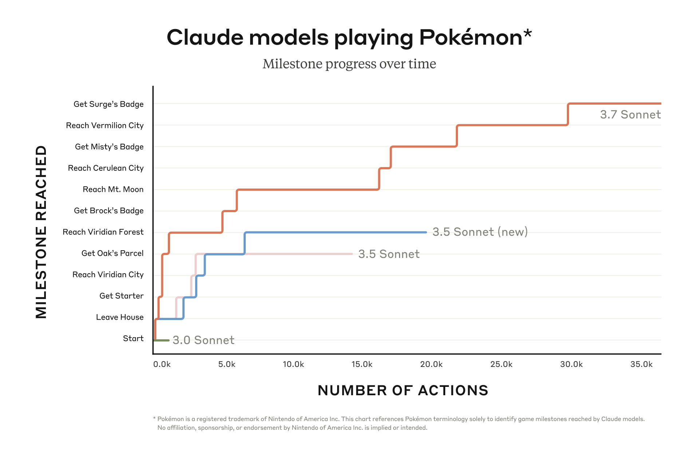

# Claude Plays Pokemon (Anthropic; can an LLM never trained on Pokemon finish Pokemon Red on its own?)

**Authors:** Anthropic (launch write-up, no byline); stream built and run by David Hershey, Anthropic Applied AI
**Published:** 2025-02-24 (Claude 3.7 Sonnet launch and "Claude's extended thinking" post; stream started the same week) · [Source](https://www.twitch.tv/claudeplayspokemon) · game finished by Claude Opus 4.7 on 2026-05-16
**Lens:** `eval-designer` · **Digested:** 2026-10-01

_Not a paper: a livestreamed agent run with no formal write-up. Anthropic's own words are the 2025-02-24 extended thinking post and model announcements, a 2025-02-25 company social post, two creator interviews and the creator's published harness changelog. Everything after March 2025 (later runs, step counts, the eventual win) comes from LessWrong analysis posts, a community Reddit tracker and a Manifold market, all of which watched the stream rather than reading logs. Every number below carries its source and date; treat community numbers as observer counts, not Anthropic data. All sources fetched 2026-10-01._

## TLDR

Anthropic gave Claude a Game Boy emulator running Pokemon Red, a screenshot after every button press with a text overlay read from game memory (location, coordinates, team, inventory, walkable tiles), three tools (press buttons, a "navigator" that walks to a clicked tile, a notes file), and a summary step that compresses context every 30 actions (tool and overlay details from a third-party write-up of the early stream, 2025-03-03; the 30-action interval from the creator, Latent.Space, 2025-03-04). The model starts a new game and plays continuously; the score is the highest story milestone reached plotted against actions taken. At launch (Anthropic, 2025-02-24) Claude 3.0 Sonnet never left the starting house, Claude 3.5 Sonnet stalled at Oak's Parcel, the October 2024 Claude 3.5 Sonnet stalled at Viridian Forest, and Claude 3.7 Sonnet earned three gym badges, the third after about 35,000 actions (Anthropic to TechCrunch, 2025-02-24). On the public stream it went worse: run 2 needed 78 hours to escape Mt. Moon and was abandoned at 35,000 actions, against a typical human finishing the whole game in about 26 hours (LessWrong, 2025-03-07, citing HowLongToBeat). Then the number froze: Sonnet 4, Opus 4, Opus 4.1 and Sonnet 4.5 made no further story progress, only reached the same wall faster (LessWrong, 2025-12-09). Gemini 2.5 Pro finished Pokemon Blue first, on 2025-05-02 after 813 hours and about 106,000 actions, with a heavier, different harness (Gemini 2.5 technical report; Ars Technica, 2025-05-05). Opus 4.5 reached Victory Road with eight badges but was still stuck there at 230,000 steps (LessWrong, 2026-01-29); Opus 4.6 cut the Cinnabar Mansion section from 112,000 steps to 3,000 but stalled at the same boulder puzzles; Opus 4.7, with better vision plus a new zoom tool and screenshot-recall tool, finished the game on 2026-05-16 (LessWrong, 2026-05-16; community Reddit tracker). The useful lesson: a single-run, milestone-against-actions instrument can show a capability frontier clearly, but it is n=1 per model, the harness changed between models, and observers repeatedly named reading the pixelated screen, not reasoning, as the main bottleneck.

## Key Takeaway

Across four Claude releases after Claude 3.7 Sonnet (Sonnet 4, Opus 4, Opus 4.1, Sonnet 4.5) the story-progress number did not move at all, while the step count to reach the same wall kept falling, so the only metric anyone watched said "no progress" for most of a year while the cheaper metric underneath said "steady progress". The eventual win was not a reasoning breakthrough: Opus 4.6 had already made the larger efficiency jump (Cinnabar Mansion in 3,000 steps against Opus 4.5's 112,000), and a modest vision improvement in Opus 4.7, letting it see the floor switches in Victory Road, is what finished the game (LessWrong, 2026-05-16). And the creator says his main change with each new model was deleting prompt material, not adding it (Latent.Space, 2025-03-04): by Opus 4.7 the hints and the "you are stuck" warnings were gone, and old prompts telling Claude how bad its vision was were removed because they "were throwing it off of its game" (harness changelog, Opus 4.7 entry). Tools were still added along the way (Surf support, zoom, screenshot recall).

## Implications

- **Plot your milestone ladder against actions, not just the top milestone reached**: Anthropic's launch chart (2025-02-24) shows each model's stair-step path through 12 milestones against action count, and the same per-milestone step tracking is how observers later saw newer models "getting faster at getting to the same story point at which they get stuck" even when the top milestone was unchanged (LessWrong, 2025-12-09). For an agent that spends money for a person, plot "first offer placed", "price agreed", "paid", "item received" against tool calls and dollars, so efficiency gains show up before completion gains.
- **Treat the harness as part of the score and version it**: The creator's own guidance is that this is "Claude alongside a simple agent harness", and he states it would be "trivial to build a better computer program to beat Pokemon with Claude in the loop" (creator, quoted on LessWrong, March 2025). Gemini finished first with a minimap, pathfinding and boulder-puzzle sub-agents; LessWrong (May 2025) concluded the two runs "can't be directly compared". Publish your harness changelog per model, as this project did, or your cross-model comparison is not one.
- **Expect perception, not planning, to be your hidden ceiling**: Claude could not tell a cuttable tree from a normal tree (third-party notes, 2025), Opus 4.5 and 4.6 could not see Victory Road's floor switches, and Opus 4.7 passed once it could (LessWrong, 2026-05-16). Google's own report says that in one portion of the game, with vision removed entirely, Gemini performed "roughly as well", suggesting most of its performance did not depend on the screen image. If your buying agent reads listings from screenshots, test the reading step on its own before you blame the decision step.
- **Give the agent ground truth it is told to trust, and a clock**: A location tag read from game memory was the piece of scaffolding that stopped models from inventing where they were, and only "stern warnings that the location is read directly from RAM and must be trusted absolutely" suppressed arguing with it (third-party same-harness notes, 2025). The creator also found that simply showing the current step number and suggesting the model reconsider after a long attempt was enough to stop it pressing A for hours (Anthropic YouTube interview). For a money agent: show account balance and order state from the system of record every turn, with elapsed time and spend so far.
- **Wrong notes are worse than no notes**: Run 1 was ended when its notes were "populated almost entirely with falsehoods" about its progress, and in run 3 Claude deleted its Mt. Moon route notes after mistakenly deciding it had already passed Mt. Moon (LessWrong comments and post, March 2025). A December 2025 analysis says one wrong note "can crater progress for days". Audit the agent's own memory for false beliefs as a separate check, not just its actions.
- **Budget for cost and time per run before you promise n**: The creator says experimentation burned "at least thousands of dollars of tokens" (Latent.Space, 2025-03-04); a third party running its own harness priced getting through Mt. Moon at about 50,000 steps and $1,500 (LessWrong research notes, 2025); a LessWrong author estimated a rigorous version needs at least 10 full playthroughs, "perhaps a full year". This is why the project reports one run per model, and why you should decide up front whether you want a demo or a measured rate.
- **Memorised walkthroughs contaminate a famous environment in both directions**: Models know Cerulean's exit is a cut tree and that a key item is on Silph Co.'s 5th floor (LessWrong, 2026-05-16), but the system prompt also told Claude not to trust its own Pokemon knowledge because wrong recall sent it wandering, for example 12 hours on the eastern wall (creator, Latent.Space). Pick an environment the model has not read about, or measure the contamination.

## How to Apply It (method)

**Scenario:** You are building an eval for an agent that buys a specific second-hand item for a person on a live resale marketplace within a budget, and you want to know whether the next model release can do it end to end without help, not just whether it scores higher on a static quiz.

**Steps:**

1. **Write the milestone ladder before the first run**: List 8 to 15 observable, ordered checkpoints a log can confirm without judgment (Anthropic used 12, from "Leave House" to "Get Surge's Badge"). For the buying task: brief parsed, search run, candidate shortlisted, seller contacted, price agreed under budget, payment sent, shipping confirmed, item received, person confirms match.
2. **Freeze a minimal harness and write it down**: Give the agent only what a person's browser and wallet would give: the marketplace interface, a notes file, a payment tool behind a hard cap. Record the system prompt, tool list, context-summary interval (this project used 30 actions, chosen over 20 and 40) and memory size limit (one changelog entry capped the notes file at 32,000 tokens). Every later change goes into a dated changelog.
3. **Feed state from the system of record every turn**: Like the memory overlay with location and coordinates, return current balance, open offers, order status and spend so far as text, with a line in the prompt that this state is authoritative.
4. **Show a step counter and elapsed spend**: Put "action N, $X spent, Y hours elapsed" in every observation, plus one sentence suggesting the agent reconsider its approach if it has been on one sub-goal for a long time.
   ```
   This is action {n}. You have spent ${spent} of ${budget} and {hours} hours have passed.
   You do not have a good sense of time. If you have been trying the same sub-goal for a
   long time, consider whether your approach or your assumptions are wrong.
   ```
5. **Run to completion or a hard stop, logging every action**: Record each tool call, the notes file after each summary, and the timestamp each milestone is reached. Set a stop rule in advance (for example 5,000 actions or the budget hit) so "stuck" is defined, not argued.
6. **Plot milestones against actions and dollars per model**: One stair-step line per model on the same axes, as in the launch chart. Report both "highest milestone" and "actions to reach each milestone the previous model reached".
7. **Separate perception from decision failures**: For every long stall, label the cause from the log: misread the page (perception), wrong belief in notes (memory), kept repeating a failed approach (loop), or chose badly with correct information (decision).
8. **Re-run on each new model, and say how many runs you have**: If budget only allows one run per model, label the result n=1 and do not compare models that ran on different harness versions.

**Expected outcome:** A dated stair-step chart showing where each model stalls and how many actions and dollars each milestone costs, a harness changelog that lets you say which gains came from the model and which from you, and a failure log that tells you whether to fix the agent's reading, memory or judgment before you let it spend a real person's money.

## What It Does Not Test, and What to Borrow

**The question.** Anthropic framed it as a capability question about generalisation: "Claude has never been trained to play any Pokemon games" (Twitch page), and at launch "glimmers of AI systems that tackle challenges with increasing competence, not just through training but with generalized reasoning" (Anthropic social post, 2025-02-25). The creator framed it as a way to learn "what the model's good and bad at by staring at it", explicitly not as the best possible Pokemon bot.

**Untested cells.** One run per model and no repeats, so no spread, worst case or pass^k; a LessWrong author notes results depend heavily on "model RNG", such as an inventory happening to be full. No adversary and almost no risk of failure: a 2026-05-16 analysis lists "ability to perform when at risk of failure" as not shown, since it is hard to lose Pokemon Red. No money, no outside user, no cross-family comparison on the same harness (one third party ran Claude 3.7, Gemini 2.5 Pro and o3 on one harness, but did not report full games). No proper human baseline: the 26-hour figure is a HowLongToBeat average for gamers, and commenters argued it is the wrong reference class.

**How it can be gamed or saturate.** The harness can be tuned until the game falls (Gemini's early run had the developer adjusting it mid-run), so a finish says as much about the scaffold as the model. The game is in the training data, so memorised walkthroughs inflate progress. Now finished, the top milestone is saturated; only steps, hours and cost to finish remain as signal.

**Judges and awareness.** No LLM judge: milestones are read from game state, which is the instrument's strength. A second "critic" model was used in early 2025 to review the notes file and break loops, which is a model-in-the-loop helper, not a scorer. Simulation awareness is not an issue in the usual sense; the model is told it is playing a game.

**Borrow these.** (1) The milestone ladder plotted against actions, which shows progress the top-line number hides. (2) A dated, public harness changelog per model, including what was removed. (3) Authoritative state injected as text every turn plus a visible step counter, the two cheapest pieces of scaffolding that stopped the worst loops.

## Best Figure



Image Candidates:
Anthropic chart "Claude models playing Pokemon: Milestone progress over time" (extended thinking post, 2025-02-24): four Claude Sonnet versions as stair-step lines over 12 milestones against action count; the launch claim in one view.
Community chart "Steps saved by Claude 4.7 over Claude 4.6" (Reddit, reproduced on LessWrong 2026-05-16): per-milestone step savings, positive and negative, across the whole game; shows the 4.7 win was not a uniform improvement.
LessWrong images of Victory Road boulder switches (2026-05-16): the visual detail Opus 4.5 and 4.6 could not see; explains the stall but carries no numbers.

Best Image:
Figure Name: Figure 1: "Claude models playing Pokemon: Milestone progress over time"
Figure Page: not applicable (web page image, file 9a30c8288e402eee24d4ef60272cb6365a36207a-1920x1269.png from the Anthropic extended thinking post)
Slide Caption: Four Claude Sonnet versions: 3.0 never leaves the house, 3.7 earns three gym badges in roughly 30,000 actions.
Description: The y-axis is a ladder of 12 milestones from "Start" to "Get Surge's Badge"; the x-axis is number of actions, 0 to about 36,000. Claude 3.0 Sonnet stays at Start. Claude 3.5 Sonnet climbs to "Get Oak's Parcel" within about 3,000 actions and stays there until its line ends near 14,000. The October 2024 Claude 3.5 Sonnet reaches "Reach Viridian Forest" near 6,500 actions and stays there until about 20,000. Claude 3.7 Sonnet reaches Viridian Forest within about 1,000 actions, Brock's badge near 5,000, Mt. Moon near 6,000, then sits at Mt. Moon until about 16,000 before reaching Cerulean, Misty's badge, Vermilion around 22,000 and Surge's badge around 30,000 (positions read from the chart; Anthropic told TechCrunch the figure was 35,000 actions). It matters because it shows both the capability gap and the cost of each step on one axis, and the long flat stretch at Mt. Moon foreshadows the stalls observers saw on stream.

## What Experts Overlook

The harness is not a fixed instrument. The sources do not say which runs produced the launch chart, and the stream ran on a harness that kept changing: a new memory system added after run 2 (LessWrong, 2025-03-07), a single 32,000-token memory file at one point and multi-file memory again in a later changelog entry, hints added then removed, spinner tiles relabelled, Surf support added, and zoom and screenshot-recall tools added for Opus 4.7 (harness changelog). The GeminiPlaysPokemon FAQ also notes that "Claude Plays Pokemon underwent similar behind-the-scenes refinements before streaming began". A 2026-05-16 LessWrong post says plainly: "We don't know for certain how earlier versions would do in this version of the harness."

**Why it matters:** The headline everyone repeats, "Claude finally beat Pokemon with Opus 4.7", is a statement about Opus 4.7 plus the Opus 4.7 harness. The year-long "no progress since 3.7" read is a statement about models on harnesses that were each a bit different. The project is honest about this because the creator published the changelog, which is exactly what makes it auditable; most agent leaderboards publish neither the diff nor the reason for it.

**Example of good use:** You report that this quarter's model completes the resale purchase in 62% fewer actions than last quarter's, and you attach the harness changelog showing nothing changed except the model, or you re-run last quarter's model on the new harness before publishing the comparison.

**Example of misapplication:** You add a price-history tool to your buying agent in the same week a new model ships, see completion jump, and tell the team "the new model can negotiate now". Next month someone swaps the model back to cut cost, keeps the tool, and completion barely drops; the decision to pay for the bigger model rested on a gain that came from the tool.

## Extracted Prompts

Anthropic has not published the full system prompt. The creator describes it as basically "you are Claude, you're playing Pokemon, you have three tools (use_emulator, navigator, string_replace), you have bad vision so don't trust it, plus a handful of hints" (harness changelog, earlier entry), and in the Opus 4.7 entry says "There is essentially no hint left in the prompt." A widely shared "system prompt" in a March 2025 blog is labelled by its author as Claude's best guess, not the real text, so it is not reproduced here. The texts below are quoted verbatim from the creator's published changelog.

**Prompt explanation:** Remaining "hints" in the late harness, phrased as examples of the model's own past visual mistakes.

```
You have mistaken the bed in your room for a stairwell, and spent a long time trying to walk onto it before exploring to find the actual stairs. Your vision is uncertain, if you are struggling to make something work you may want to reconsider your visual assumptions.
```

```
I've seen you declare that there was no exit to Viridian Forest because you expected the exit to be a gate, when in reality the exit was just a break in the trees. You should be very skeptical of your assumptions - you know a lot about Pokemon Red, but if you make an assumption that is wrong, it can lead you very far astray.
```

**Prompt explanation:** Area hints given in an earlier harness version (later removed), opening paragraph and the Mt. Moon section.

```
In previous runs of this agent, certain areas of the game have been particularly challenging. Here are some hints to help you navigate these areas more effectively:
```

```
- Once you have picked up a fossil in Mt Moon, you are very close to the exit. In the past I have seen you turn around after picking up a fossil and getting lost, instead you need to continue up past where you found the fossil, and explore that area to find the exit.
- You sometimes get confused by your vision in Mt Moon, thinking you either have found a fossil or have found the trainer guarding the fossil. Remember to only make assumptions about what you have found once you validate it with either dialog or by confirming you have a fossil in your inventory.
```

## Citations

Twenty-one sources cited across the Anthropic posts and the analyses used here; the first 12 below, full list in frontmatter:

- [1] Anthropic (2025-02-24). Claude's extended thinking. (launch description and milestone chart)
- [2] Anthropic (2025-02-24). Claude 3.7 Sonnet and Claude Code. ("outperformed all previous models in our Pokemon gameplay tests")
- [3] Anthropic (2025-05-22). Introducing Claude 4. (Opus 4 memory files, "Navigation Guide" while playing Pokemon)
- [4] Anthropic (2026-04-16). Introducing Claude Opus 4.7. (vision up to 2,576 pixels on the long edge; no mention of Pokemon)
- [5] Hershey, D. ClaudePlaysPokemon Harness Changes (published changelog).
- [6] Bradshaw, J. (2025-03-07). So how well is Claude playing Pokemon? LessWrong.
- [7] Bradshaw, J. (2025-05). Is Gemini now better than Claude at Pokemon? LessWrong.
- [8] Research Notes: Running Claude 3.7, Gemini 2.5 Pro, and o3 on Pokemon Red (2025). LessWrong.
- [9] Bradshaw, J. (2025-12-09). Insights into Claude Opus 4.5 from Pokemon. LessWrong.
- [10] Snider, J. (2026-01-29). Claude Plays Pokemon: Opus 4.5 Follow-up. LessWrong.
- [11] Bradshaw, J. (2026-05-16). A Year Late, Claude Finally Beats Pokemon. LessWrong.
- [12] Gemini Team (2025). Gemini 2.5 technical report, arXiv 2507.06261. (Gemini Plays Pokemon section)

## Related Digests

BM25 search over `memory/knowledge-sources/papers/evals/` at digest time (queries: long horizon agent coherence; game agent benchmark harness; vending bench loop meltdown; time horizon agent tasks; game arena chess poker); hits above 0.9:

- [[backlund-2025-vending-bench]] · Vending-Bench: A Benchmark for Long-Term Coherence of Autonomous Agents (stream viewers linked it in March 2025 to Claude's "meltdown" loops; same failure, a business instead of a game)
- [[kwa-2025-time-horizons]] · Measuring AI Ability to Complete Long Software Tasks (human-time yardstick; the 26-hour HowLongToBeat figure is a crude version of it)
- [[doerschuk-tiberi-2026-kaggle-game-arena]] · Game Arena: Strategic LLM Evaluation in Competitive Environments (games with a fixed harness and many matches, the opposite trade from one long run)
- [[desai-2026-swe-marathon]] · SWE-Marathon: Can Agents Autonomously Complete Ultra-Long-Horizon Software Work? (ultra-long horizon on a task the model is trained for)
- [[sharrock-2025-butter-bench]] · Butter-Bench: Evaluating LLM Controlled Robots for Practical Intelligence (spatial perception as the bottleneck, in the physical world)

## Reviewer Notes

**Overall severity:** Minor fact tweak (nine partially accurate claims found in the draft; all corrected before publication, no fabricated numbers, methods or quotes)

The review checked every number, date and quotation in the draft against the source bundle fetched 2026-10-01: Anthropic's extended thinking post and model announcements (3.7 Sonnet, Claude 4, Opus 4.7), the 2025-02-25 company social post, the creator's Latent.Space and Anthropic YouTube interviews, the creator's published harness changelog, five LessWrong posts (2025-03-07 to 2026-05-16), a third-party harness write-up (2025-03-03), the Gemini 2.5 technical report, TechCrunch, Ars Technica, a Manifold market and a community Reddit tracker. One extra search filled the gap on the finish date (Reddit tracker: champion on 2026-05-16). The exact total step count for the Opus 4.7 win was not found; Manifold comments place entry to Victory Road at about step 27,000, so the digest gives no final count. Milestone positions in the figure description were read by eye from Anthropic's chart.

**Flagged in the draft and fixed:**

- **Claim:** "The model starts a new game with no hints of substance." **Label:** Partially accurate. **Justification:** Early harness versions included area hints (Mt. Moon, Cerulean and others); they were removed only in later versions. **Fix applied:** dropped "no hints of substance".
- **Claim:** "summary step every 30 actions (creator, Latent.Space)" attached to the whole harness description. **Label:** Partially accurate. **Justification:** The overlay and tool details come from a third-party write-up of the early stream; only the 30-action interval is the creator's. **Fix applied:** split the attribution.
- **Claim:** "the binding constraint for most of the year was reading a pixelated screen." **Label:** Partially accurate (overextended). **Justification:** Observers named vision as the main bottleneck, but the Opus 4.5 period also stalled on memory and planning. **Fix applied:** "observers repeatedly named reading the screen ... as the main bottleneck".
- **Claim:** hints, stuck warnings and vision warnings "were removed because they were throwing it off of its game". **Label:** Partially accurate. **Justification:** That quote is about the vision-warning prompts only; stuck warnings were removed because "Claude doesn't need this anymore", and tools were also added. **Fix applied:** reworded with the creator's own "main change is deleting prompt stuff" and a note that tools were added.
- **Claim:** observers saw models reach "the Erika's Gym or Victory Road wall in fewer steps". **Label:** Partially accurate. **Justification:** The source says later models got faster "to the same story point at which they get stuck" without naming it. **Fix applied:** quoted the source.
- **Claim:** Gemini performed roughly as well with vision removed "because the text overlay carried the load". **Label:** Partially accurate. **Justification:** The ablation covered one portion of the game, and the report does not name the overlay as the cause. **Fix applied:** scoped to one portion and used the report's own inference.
- **Claim:** Mt. Moon priced at $1,500 "with Claude 3.7". **Label:** Partially accurate. **Justification:** The third party does not name the model for that estimate. **Fix applied:** removed the model name.
- **Claim:** "The chart is Anthropic's internal runs on the harness as it stood before streaming." **Label:** Partially accurate (unsupported). **Justification:** No source says which runs produced the launch chart. **Fix applied:** now says the sources do not say, and keeps only the documented harness changes. Also softened "multi-file memory again by Opus 4.7" to "in a later changelog entry", since the changelog's section boundaries are ambiguous.
- **Claim:** "Same harness, four Claude Sonnet versions" in the slide caption. **Label:** Partially accurate. **Justification:** Anthropic does not state the harness was identical across the four lines. **Fix applied:** removed "Same harness".
