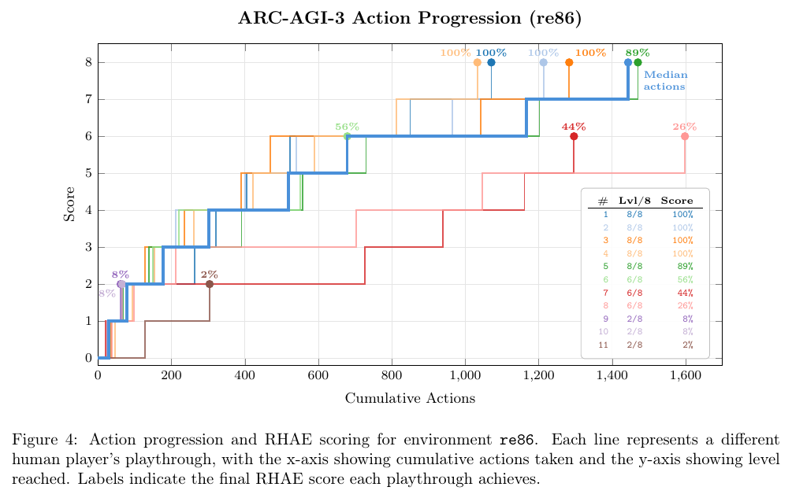

# ARC-AGI-3: A New Challenge for Frontier Agentic Intelligence

**Authors:** ARC Prize Foundation (development team named in the report: lead environment designer Hunter Henry; engineering David Wexler, Derek Smith; board François Chollet, Mike Knoop, Gregory Kamradt; plus environment developers)
**Published:** 2026-03 (arXiv 2603.24621, v2 2026-04-17) · [Source](https://arcprize.org/arc-agi/3) · [Paper](https://arxiv.org/abs/2603.24621)
**Lens:** `eval-designer` · **Digested:** 2026-10-01

> Sources. The technical report is the primary source for every design and launch claim. Post-launch numbers (GPT-6 Astra, the live results page, the Kaggle scoring rule) come from arcprize.org pages fetched on 2026-10-01 and are labelled "site, fetched 2026-10-01" wherever they appear.

## TLDR

ARC-AGI-3 drops an agent into a turn-based game it has never seen, on a 64x64 grid with 16 colours and at most seven buttons (five keys, undo, and a click on a cell), and gives it no instructions and no stated goal: it has to explore, guess what winning means, model the mechanics and plan. Each of 135 environments (25 public demo, 55 semi-private, 55 fully private) has several levels, and the score, RHAE, compares the agent's action count on each level to the upper-median human who completed it on first contact, squares the ratio (10 human actions against 100 agent actions earns 1%, not 10%), caps a level at 115%, weights later levels more heavily (level 5 of 5 is worth 5/15), caps an environment at the weighted share of levels completed, and averages across environments. The human side is the strongest part of the instrument: 486 members of the public played 414 candidate environments in a San Francisco testing centre (2,893 attempts, 427.9 hours, median 7.4 minutes), 10 people per environment, and an environment was kept only if at least 2 of the 10 solved every level on first sight; a random policy had to win a level less than 1 time in 10,000, checked with a hashed state graph and up to 1,000,000 random steps. At launch the official board, which bans harnesses and gives every model the same three-sentence prompt and no tools, read Opus 4.6 (Max) 0.50%, Gemini 3.1 Pro Preview 0.40%, GPT 5.4 (High) 0.20%, Grok-4.20 0.10%. It did not stay there: on 2026-09-03 the foundation reported GPT-6 Astra at 62.7% under its Standard notes-carrying harness and 99.9% under a Provider Adapter harness that keeps the model's reasoning state between turns, and the results page fetched 2026-10-01 lists GPT-6 at 99.95% and GPT-6.1 Sol at 96.37% (site, fetched 2026-10-01). The useful lesson is not the headline but the gap: on the same model at the same reasoning setting, how state was carried between turns moved the score by 36 to 81 points.

## Key Takeaway

The report's founding bet was that action efficiency would keep humans and AI apart, and it bans harnesses from the official board because a handcrafted one took Opus 4.6 from 0.0% to 97.1% on a variant of one environment while leaving another at 0.0%; six months later the foundation's own Astra write-up shows the bet failing and the harness question deciding the score. GPT-6 Astra at max reasoning scored 62.7% with the Standard harness and 98.6% with the Provider Adapter harness, a 36-point gap, and at low reasoning the gap was 17.5% against 98.0%, while under the Provider Adapter it used fewer actions than the human baseline on 96.0% of levels (site, fetched 2026-10-01). The foundation's own conclusion is that frontier AI shows "a more binary-like pattern": once it works out the mechanics it executes within human efficiency, so the efficiency metric ended up measuring whether the model understood the game at all, and what decided that was mostly whether it could remember what it had already worked out.

## Implications

- **Decide in writing whether the harness is part of the system under test, before the first run**: the report bans harnesses from the official board on the evidence of one environment going from 0.0% to 97.1%, then the same foundation reports two harness conditions side by side six months later (site, fetched 2026-10-01). If your agent will spend someone's money through a specific wrapper, test that wrapper and label every score with it, because the wrapper alone can be worth tens of points.
- **Normalise to a named human percentile, not "a human"**: RHAE uses the upper-median completer (the 3rd of 4 or 5), which is robust to one prodigy and one straggler. For a buying agent, pay 10 people to make the same purchase and score the agent against the upper-median price paid or steps taken, and publish which percentile you used.
- **Square the efficiency ratio if you want "twice as wasteful" to hurt**: under a linear score an agent using 2x the human actions still gets 50%; squared it gets 25%. Copy this when overspending or extra round trips are the real cost, and cap the upside (ARC uses 1.15x) so one exploit cannot carry the average.
- **Prove a random agent cannot pass before you trust any pass**: every non-tutorial level had to survive 1,000,000 random steps unbeaten and a random-policy win rate below 1 in 10,000. A buying eval needs the same floor: a bot that bids randomly, or always buys the first listing, should score near zero, or your tasks are too easy.
- **Make the public set a demo, not a training set**: ARC-AGI-3 inverts ARC-AGI-2's roughly 10:1 public-to-private ratio to 25 public against 110 private, and the private mechanics are deliberately out of distribution. The report's own evidence for why: Gemini 3 Deep Think used ARC's integer-to-colour mapping in its reasoning without being told it.
- **Keep two boards and say which one is evidence**: an official board run by the eval owner with fixed prompt and no task-specific help, and a self-reported community board the owner "will not verify". This lets builders compete on harnesses without polluting the capability claim.
- **Do not expect your hardest-to-saturate design to stay unsaturated**: the report calls ARC-AGI-3 "the only unsaturated general agentic intelligence benchmark as of March 2026"; the results page fetched 2026-10-01 shows two systems above 96%. Plan the next version, and the private hold-out to test it, at launch.

## How to Apply It (method)

**Scenario:** You are building an eval for an agent that buys second-hand goods on a person's behalf in a live secondary market (for example, a used camera body within a budget and condition spec). You want a number that says how close the agent is to a capable human buyer on a market it has not seen before, and you want the number to punish waste (overpaying, extra messages, needless offers), not just reward eventually buying something.

**Steps:**

1. **Define what counts as an action**: Count only steps that touch the market: a message to a seller, an offer, a counter-offer, a purchase, a cancellation. Do not count searches, notes or reasoning, exactly as ARC excludes "tool calls, reasoning steps, or retries within the model". Record compute and dollar cost separately on the second axis of your leaderboard.

2. **Build tasks as levels that compose**: Each task gets at least five levels that reuse earlier skills. Level 1 is a tutorial (a fixed-price listing that matches the spec). Later levels add mechanics a human would learn as they go: sellers who counter, listings that are mis-described, a deadline, a competing buyer. Do not tell the agent the win condition; make it infer it from the person's brief, as ARC does from the frames.

3. **Check novelty with a compression test**: ARC rejects two environments if one program can solve both while being at least 50% shorter than two separate solutions. For your tasks, write the scripted solution for each and drop pairs that share most of their script.

4. **Run the random floor**: Run a random agent and a naive rule-based agent (always buy the cheapest matching listing) thousands of times per level. Keep a non-tutorial level only if neither wins more than 1 time in 10,000 (ARC's threshold), or relax the threshold and say so.

5. **Baseline with 10 humans on first contact**: Recruit 10 people who have not seen the task, pay a flat fee plus a small per-task bonus (ARC paid $115 to $140 per 90-minute session plus $5 per solved environment), set a soft 20-minute and hard 30-minute limit, one attempt each. Keep a task only if at least 2 of 10 complete every level. Drop low-effort sessions and say how many you dropped.

6. **Compute the per-level score**: For each completed level, with h the upper-median human action count and a the agent's action count:

   ```
   S_level = min(1.15, (h / a) ^ 2)
   weight_level = level_number          # level 5 of 5 counts 5/15
   E_task = min( sum(weights of completed levels) / sum(all weights),
                 sum(weight * S_level) / sum(all weights) )
   Total = mean of E_task over all tasks
   ```

   If your cost is money rather than steps, replace h/a with (human price paid) / (agent price paid), keep the square and the cap.

7. **Set an action budget**: Stop the agent at 5x the human median actions per level, as ARC does to bound evaluation cost. Under the squared score a level finished right at that budget is worth roughly 4%, so little signal is lost.

8. **Split the sets and the boards**: Publish a handful of easy demo tasks, keep the rest private and deliberately different. Report official scores with one fixed system prompt and no task-specific harness, and run a separate, clearly labelled board for harness entries. Report each harness condition separately if you allow any.

**Expected outcome:** A single score between 0% and 100% where 100% means "as efficient as a strong but ordinary human buyer on markets the agent has never seen", with per-level scores that show exactly where it breaks (for example, matches humans on fixed-price listings, collapses once sellers counter). You also get a random floor and a human distribution to report next to it, which is what makes the number defensible to an operator who will let the agent spend real money.

## Best Figure



**Image Candidates:**
- Figure 4 (p. 12): Eleven real human playthroughs of one environment drawn as step lines, with the RHAE score each would earn, so you can see the scoring rule and the human spread at once.
- Figure 8 (p. 20): Optimal, best first-run and human-baseline action counts by level for ls20; the gap between optimal and first-run is the price of exploration.
- Figure 6 (p. 18): Distribution of 1,614 human level completions relative to the median baseline, showing how wide human efficiency is.

**Figure Name:** Figure 4: "Action progression and RHAE scoring for environment re86"
**Figure Page:** 12
**Slide Caption:** Same environment, eleven humans on first contact: five finished all 8 levels and earned 89% to 100%, three stalled at level 6 (26% to 56%), three quit at level 2 (2% to 8%).
**Description:** Each coloured line is one person's first playthrough of environment re86, with cumulative actions on the x-axis (0 to about 1,600) and level reached on the y-axis (the axis is labelled "Score" but counts levels, 0 to 8); the thick blue line is the median-action path. The legend gives each player's levels completed out of 8 and final RHAE score. Two things are visible that the formula alone hides. First, completing every level does not guarantee full marks: player 5 finished 8/8 but scored 89% because it took more actions than the baseline on some levels. Second, the environment cap bites hard: players who stopped at level 6 of 8 scored 26% to 56% even though some were efficient on the levels they did, because later levels carry the most weight. For an eval designer it is the clearest single picture of what "human baseline" means here: not a number, but a spread from 2% to 100% among ordinary people, from which the baseline is one chosen point.

Note: the report states the level weighting for "n = 5" levels, while its own design rules require at least six levels per environment and re86 has eight. The weighting appears to generalise as weight = level number, but the report only spells out the five-level case.

## What Experts Overlook

The definition of an action is doing as much work as the scoring formula. The report counts only "a discrete interaction with the environment" and states that "tool calls, reasoning steps, or retries within the model itself, are not counted as actions" (Section 2.3.2). So RHAE prices exploration in the world but makes thinking free: a model can spend unlimited tokens deliberating before each move and lose nothing on the y-axis. Thinking cost goes to the x-axis (dollars per run), and the official board only shows systems under $10,000 (site, fetched 2026-10-01). The Astra write-up shows what follows: higher reasoning effort cost less in total (max effort $26,098 against $48,090 at medium under the Standard harness) because Astra "solves games in fewer actions", and under the Provider Adapter it beat the human baseline on 96.0% of levels while using 51.7% fewer actions per level on average (site, fetched 2026-10-01). The human baseline, by contrast, includes everything a person spends on thinking only implicitly, through time limits of 20 and 30 minutes.

**Why it matters:** "Fewer actions than a human" sounds like "more efficient than a human", but it only means fewer touches of the environment. The comparison is fair only if touching the environment is the scarce resource. In ARC it is a deliberate choice ("risk efficiency": every action could be a death or wasted energy), and the foundation is open that it subsumes data, time, compute and risk into one scalar. It also explains the binary pattern the foundation saw: an agent that has worked out the mechanics can plan offline at no score cost and then execute almost perfectly, so the score separates understanding from not understanding rather than grading degrees of efficiency.

**Example of good use:** In a buying eval, counting only market-facing actions (offers, messages, purchases) is exactly right, because each of those is visible to sellers, can move the price against you, and can commit the person's money. An agent that researches 40 listings silently and then makes one well-priced offer should beat one that sends 15 lowball offers, and an action definition copied from ARC rewards that.

**Example of misapplication:** If you copy the definition into an eval where the person pays for the agent's compute or waits for it (a live negotiation with a 2-minute response window, or a consumer product billed per token), an agent that thinks for 10 minutes and spends $40 in API calls to save one message will top your leaderboard while being worse for the user. Either price thinking on the same axis or report time and cost next to the action score, and never call the action ratio "efficiency" without saying what it excludes.

## Extracted Prompts

**Prompt explanation:** The single system prompt used for every model on the official ARC-AGI-3 leaderboard at launch; models get no tools and no other instructions (Section 4.3.1).

```
You are playing a game. Your goal is to win. Reply with the exact action you want to take. The final action in your reply will be executed next turn. Your entire reply will be carried to the next turn.
```

No other model prompts are given in the report. The Duke, Arcgentica, Standard and Provider Adapter harness prompts are not reproduced in it.

## Citations

23 references, all in frontmatter. First 10:

- ARC Prize Foundation (2024). ARC Prize 2024 Competition. https://arcprize.org/competitions/2024
- ARC Prize Foundation (2025). ARC Prize 2025 Competition. https://arcprize.org/competitions/2025
- ARC Prize Foundation (2026). https://arcprize.org/ (founders Mike Knoop, François Chollet)
- Anderson, P. et al. (2018). On evaluation of embodied navigation agents (source of the SPL metric RHAE adapts)
- ARC Prize Foundation (2026). ARC-AGI Community Leaderboard. GitHub
- ARC Prize Foundation (2026). ARC-AGI Toolkit. GitHub
- ARC Prize Foundation (2026). Gemini 3 Deep Think Preview Verification on ARC-AGI-2. Hugging Face
- Chollet, F. (2019). On the Measure of Intelligence. arXiv:1911.01547
- Chollet, F. (2024). OpenAI o3 Breakthrough High Score on ARC-AGI-Pub
- Chollet, F., Tong, K., Reade, W., Elliott, J. (2020). Abstraction and Reasoning Challenge. Kaggle

## Eval Design Read (lens)

**1. The question.** Can an AI system acquire a new skill as efficiently as a human, when the skill is an unfamiliar interactive task with no instructions? The authors define AGI as "a system's ability to acquire any skill a human can, as efficiently as a human can" and target four components: exploration, modelling, goal-setting, planning and execution. It is a capability question, not a safety or delegation one. They chose abstract games because they can be limited to Core Knowledge priors (objectness, basic geometry and physics, agentness, no letters, numbers or cultural symbols), which keeps prior knowledge from helping.

**2. The instrument.** Environment: 135 turn-based games on a 64x64, 16-colour grid, built by an in-house studio on a custom Python engine running at least 1,000 frames per second. Horizon: one first-contact playthrough per environment, several levels each, action budget 5x the human median per level. Primary metric: RHAE, bounded 0% to 100% overall (levels can reach 115%). Baseline: humans (upper-median first-run completer, 10 testers per environment) plus a random-policy floor. Spread: the human spread is shown in detail (Figures 4, 6, 8); AI scores at launch are single numbers with no run count, no variance and no pass^k, so you cannot tell from the report how stable 0.50% against 0.40% is. Choices that made the headline possible: no instructions, no harness, one fixed prompt, and a private set built to be out of distribution from the public one.

**3. The result and the surprise.** Launch: humans 100% of environments solvable by construction; frontier models 0.10% to 0.50%. The 2025 preview competition winner, a CNN plus reinforcement learning agent (StochasticGoose, 12.58%, 18 levels), and the runner-up (Blind Squirrel, 6.71%) both relied on search that tried to cover the action space, which is the brute force the metric is built to penalise, and they still beat every frontier LLM's later launch score. The in-report surprise is the harness result: Opus 4.6 scored 0.0% without a harness and 97.1% with the Duke harness on a variant of TR87, and 0.0% with both on BP35. The post-launch surprise is the foundation's own: by 2026-09-03 action efficiency stopped being a dividing line for frontier models (site, fetched 2026-10-01).

**4. What it does not test, and what to borrow.** Untested: adversaries (the games are deterministic, closed and non-competitive), real money or any real-world stakes, language and domain knowledge (excluded on purpose), stochastic environments, other agents. The foundation itself says the environments "have deterministic, closed-ended mechanics and goals" and do not represent "the complexity and open-endedness of the real world" (site, fetched 2026-10-01). No LLM judge is involved, which is a strength: scoring is a deterministic action count. Ways it can be gamed: training on synthetic lookalike environments (the report's "domain-specific overfitting"), handcrafted harnesses, leakage of the semi-private set through the model API. What to borrow for an agent that spends a person's money: (a) the squared, capped, human-normalised per-level score with later levels weighted more; (b) the random-policy floor checked on a state graph; (c) the separation of a verified official board from a self-reported harness board, with every harness condition labelled.

## Leaderboard and status (fetched 2026-10-01)

| Date | Source | System | ARC-AGI-3 score | Notes |
|---|---|---|---|---|
| 2026-03 (launch) | Report, Table 2 (semi-private) | Anthropic Opus 4.6 (Max) | 0.50% | no harness, fixed prompt |
| 2026-03 (launch) | Report, Table 2 | Google Gemini 3.1 Pro Preview | 0.40% | |
| 2026-03 (launch) | Report, Table 2 | OpenAI GPT 5.4 (High) | 0.20% | |
| 2026-03 (launch) | Report, Table 2 | xAI Grok-4.20 (Beta 0309 Reasoning) | 0.10% | |
| 2026-09-03 | Astra blog | OpenAI GPT-6 Astra, Standard harness, max | 62.7% | $26,098 |
| 2026-09-03 | Astra blog | OpenAI GPT-6 Astra, Provider Adapter, high | 99.9% | $18,817 |
| 2026-07-24 | Results page | Anthropic Claude Opus 5 | 30.16% | harness not stated on results page |
| 2026-08-11 | Results page | xAI Grok 4.6 | 2.11% | |
| 2026-09-02 | Results page | Google Gemini 3.8 Flash | 35.00% | |
| 2026-09-02 | Results page | OpenAI GPT-6 (Astra · Sol · Luna) | 99.95% | |
| 2026-09-29 | Results page | OpenAI GPT-6.1 Sol | 96.37% | |

Discrepancies between sources worth knowing before you quote a number: the launch blog says frontier AI scored 0.51% where the report's Table 2 says 0.50%; the Astra blog describes the human baseline as "the median action count among players who completed it" where the report says upper-median best completer; the Kaggle competition caps a level at 1.0 where the report caps at 1.15, and uses its own separate private set of 110 games; the leaderboard page says it only shows systems that cost under $10,000 to run, while the Astra runs cost $17,332 to $49,791.

## Related Digests

- [[kwa-2025-time-horizons]]: Measuring AI Ability to Complete Long Software Tasks (another human-normalised metric, human hours instead of human actions)
- [[doerschuk-tiberi-2026-kaggle-game-arena]]: Game Arena: Strategic LLM Evaluation in Competitive Environments (games as evals, but with adversaries ARC-AGI-3 leaves out)
- [[bedi-2026-health-admin-bench]]: HealthAdminBench: one model scores 4.4% to 51.9% depending on harness and observation, the same harness dependence ARC-AGI-3 saw
- [[wang-2026-horizonmath-unsolved-math]]: HorizonMath: another eval designed to stay unsaturated with automatic verification
- [[epoch-2026-frontiermath-open-problems]]: FrontierMath: Open Problems, the other "built not to saturate" design
- [[petersson-2025-blueprint-bench]]: Blueprint-Bench: a random baseline most systems failed to beat, the floor ARC-AGI-3 enforces at build time

## Reviewer Notes

**Overall severity:** Minor fact tweak

Claims were checked against the technical report (paper.txt) and, for post-launch numbers, against the site supplement fetched 2026-10-01. Fixes below were applied to this file before publishing.

**Flagged claims:**

- **Claim:** "at most seven buttons (five keys, undo, and a click on a cell)"
  **Label:** Accurate after check
  **Justification:** Section 2.3.2 lists five key actions, an Undo action, and one select-a-cell action; each environment uses a subset. Kept, with "at most" carrying the subset point.

- **Claim (draft):** "Humans solve 100% of environments"
  **Label:** Partially accurate
  **Justification:** The report says every environment was fully solved by at least 2 of 10 testers, so each environment is solvable by humans; it does not say each human solves every environment. Many were solved by six or more.
  **Fix:** Reworded to "solvable by construction" and "kept only if at least 2 of the 10 solved every level".

- **Claim (draft):** "The 2025 preview competition winners beat every frontier LLM"
  **Label:** Partially accurate
  **Justification:** The preview ran on three hidden environments in July to August 2025; the LLM scores are on the 55-environment semi-private set at the March 2026 launch. Different sets, so the comparison is indicative only.
  **Fix:** Reworded to "still beat every frontier LLM's later launch score" and kept as an observation, not a controlled result.

- **Claim:** "The level weighting generalises as weight = level number"
  **Label:** Partially accurate (inference)
  **Justification:** The report defines w_l = l but states it for n = 5 and says "the five levels of an environment", while also requiring at least six levels and showing re86 with eight. The generalisation is our reading, not stated.
  **Fix:** Flagged as an inference in the Best Figure note.

- **Claim:** "Figure 4 y-axis counts levels"
  **Label:** Accurate
  **Justification:** The axis is labelled "Score" but the caption says "the y-axis showing level reached". Noted. The report also has two small internal slips not repeated here: Section 5.2 says demographics are in "Figure 4" (they are Figure 5), and the Figure 7 caption labels both outcomes "correct".

- **Claim:** Post-launch figures (62.7%, 98.6%, 99.9%, 17.5% vs 98.0%, 96.0% of levels, 51.7% fewer actions, costs, results page scores)
  **Label:** Accurate to the supplement, not to the report
  **Justification:** None of these appear in the technical report; they come from arcprize.org pages fetched 2026-10-01. Each is labelled "site, fetched 2026-10-01" in the body.
