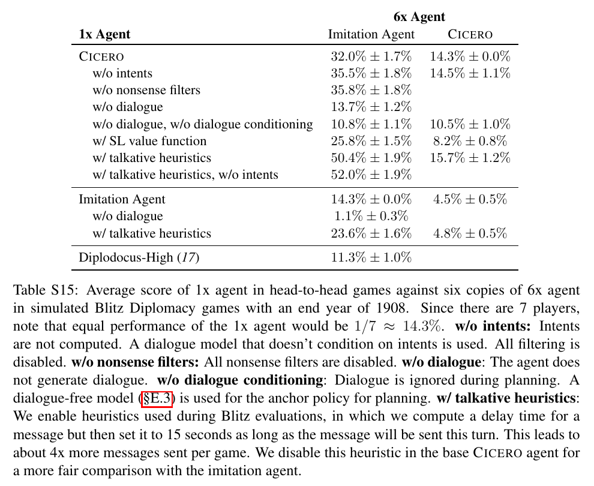

# Human-level play in the game of Diplomacy by combining language models with strategic reasoning (Cicero)

**Authors:** Meta Fundamental AI Research Diplomacy Team (FAIR): Anton Bakhtin, Noam Brown, Emily Dinan, Gabriele Farina, Colin Flaherty, Daniel Fried, Andrew Goff, Jonathan Gray, Hengyuan Hu, Athul Paul Jacob, Mojtaba Komeili, Karthik Konath, Minae Kwon, Adam Lerer, Mike Lewis, Alexander H. Miller, Sasha Mitts, Adithya Renduchintala, Stephen Roller, Dirk Rowe, Weiyan Shi, Joe Spisak, Alexander Wei, David Wu, Hugh Zhang, Markus Zijlstra (authors listed alphabetically)
**Published:** 2022-12 (Science 378, 1067-1074, issue of 9 December 2022) · [Source](https://doi.org/10.1126/science.ade9097) · [Meta write-up](https://ai.meta.com/research/cicero/) · [Code](https://github.com/facebookresearch/diplomacy_cicero)
**Lens:** `eval-designer` · **Digested:** 2026-10-01
**Text used:** full Science article plus the 75-page supplementary materials (open copy hosted by co-author Noam Brown; the Science page itself is paywalled).

## TLDR

Cicero is Meta FAIR's agent for full-press Diplomacy, a seven-player board game in which every turn opens with private, non-binding natural-language negotiation and closes with simultaneous orders. The agent couples a 2.7B-parameter dialogue model (R2C2 base, fine-tuned on 40,408 webDiplomacy games containing 12,901,662 messages) that is conditioned on "intents" (a planned set of orders for itself and the message recipient) with a planning engine (piKL, a KL-regularised equilibrium search anchored to a human-imitation policy, driven by a self-play-trained value function) and a filter stack (an ensemble of 16 nonsense classifiers, an intent-correspondence filter, a value-based filter, toxicity and heuristic filters); the nonsense ensemble alone rejected 53% of generated messages in the tournament games, and tuning-set statistics implied 2.72 generations per accepted message. The eval was 40 anonymous games in a "blitz" league on webDiplomacy.net (5-minute negotiation turns, games finishing inside 2 hours, 19 August to 13 October 2022, 72 hours of play, 5,277 messages sent, 82 distinct human opponents who were not told they were playing an AI in that game). Cicero's mean score was 25.8% of the sum-of-squares pot against 12.4% for its opponents (equal play is 1/7, 14.3%); it ranked 10th of 83 players overall, 2nd of 19 who played 5 or more games, in the top 10% of players who played more than one game, and placed first in an 8-game, 21-player tournament scored on each player's best three games. No in-game message accused it of being a bot; one post-game chat raised a suspicion about one of its accounts. The paper's most useful lesson for eval builders is in the simulated ablations (Table S15): against six imitation-learned opponents, removing intents (35.5%) or all nonsense filters (35.8%) scored higher than the full agent (32.0%), and a heuristic that made it send about 4x more messages jumped it to 50.4%, because imitation agents had learned the spurious correlation that chatty players are friendly players; against six copies of Cicero the same changes did nothing (14.3%, 14.5%, 15.7%). The authors state the implication themselves: testing against imitation agents "may not be a reliable way of evaluating the effect of changes in dialogue generation," so the human league was not a nice-to-have, it was the only instrument that could measure what the paper claims.

## Key Takeaway

Switching off the parts of Cicero that make its messages make sense made it score higher against learned opponents. Without intents it scored 35.5% and without any nonsense filters 35.8%, against 32.0% for the full agent, and simply making it send about 4x more messages pushed it to 50.4%. The imitation-trained opponents had learned from human data that players who talk to you a lot tend to be your friends, so volume of chatter beat quality of chatter. Against six copies of Cicero the spread collapses (14.3%, 14.5%, 15.7%), and against 82 humans the full agent was what produced the 25.8%. A learned opponent is an eval instrument that can be gamed by the thing it was trained from, which is why the 40 human games are the only numbers in this paper that mean what they say.

## Implications

- **Put the agent in front of real counterparties, blind, and count everything**: the headline number rests on 40 games against 82 humans who were not told, for that game, that they faced an AI (site-level disclosure, reveal and consent afterwards, SM A.4), with every message logged (5,277 sent). For an agent that buys on someone's behalf in a live secondary market, the equivalent is blind live listings against real sellers with full transcripts; the authors' stated reason for not disclosing is that humans treat known bots differently and would have targeted it, which they had seen in an earlier no-press study.
- **Fix the denominator before the run, and report rank among repeat players**: Cicero's 25.8% is more than double the 12.4% opponent mean, yet Table S13 shows 9 players above it, 6 of whom played exactly one game. The paper reports rank among players with more than one game (top 10%) and with 5 or more games (2nd of 19). An agent eval should pre-state which population it ranks against, or a lucky single-game human will look like it beat the agent.
- **Use simulated opponents for strategy ablations, never for communication quality**: Table S15 shows the strategy ablations behave sensibly against imitation agents (no dialogue 13.7%, supervised value function instead of RL 25.8%, full agent 32.0%), while the dialogue ablations invert (no intents 35.5%, no filters 35.8%, 4x messages 50.4%). Fig. S10 shows score against imitation agents tracks message count. If your test harness is a learned seller model, it will reward a buying agent that spams.
- **Treat the filter stack as part of the agent and publish its rates**: in live play the nonsense ensemble rejected 52.78% of generations (Table S5), the intent-correspondence filter 18.78%, and the value filter engaged in about 15% of situations and dropped the bottom three of eight samples. The ensemble was tuned on 1,448 expert-labelled messages (348 nonsense) and reached 90.2% recall at a 63.19% flag rate on that set, 83% detection on a 362-message evaluation set. A money-spending agent needs the same: a "did it say what the plan says" check with a reported recall (here 65% recall at the cost of filtering 24% of other messages, ROC AUC 78%).
- **Separate what to do from what to say, and make the interface a structured object**: the dialogue model generates from an intent (planned orders for both sides); the intent is what gets played at the end of the turn. On a 194-example test set, the intent annotation matched the message content 97% of the time, up from 77% for the base model (Table S2). For a buying agent, the analogue is a structured offer object the message is rendered from and the execution layer acts on, so the agent cannot say one price and pay another.
- **Score messages by how they move the counterparty, not by how they read**: the value-based filter re-runs the planner with the candidate message appended and keeps messages whose predicted effect on the recipient's policy raises Cicero's expected score; experts preferred the kept messages 62% of the time (p < 0.05, 127 scenarios). This requires a counterparty model, which is the piece most agent evals skip.
- **Guard against causal confusion in anything trained on chat logs**: Fig. S6 shows a fake message ("Thanks for agreeing to convoy your army to Bel this turn!") shifting the imitation model's prediction for England from 94% Norway to 85% Belgium, because in human data such messages only appear after real agreements. Cicero's planning layer, anchored to a value function, closed this hole. A buying agent trained on marketplace chats will be manipulable by sellers who assert deals that never happened.
- **Budget the clock as part of the instrument**: blitz turns were 5 minutes, message generation took 10 to 30 seconds on 8 V100 GPUs and 80 CPU cores, and the authors suspect the time pressure is part of why grounding mistakes did not raise suspicion. They name longer-negotiation formats as the harder, untested case.

## How to Apply It (method)

**Scenario:** You are designing an eval for an agent that negotiates and buys on behalf of a real person in a live secondary market (second-hand bikes, event tickets, used equipment) where the counterparties are human sellers who message back. You need a number you can defend, a way to test changes to the agent without burning a budget of real purchases every time, and a record of how often the agent said something it did not mean.

**Steps:**

1. **Define the scored outcome and the equal-play reference**: Cicero used the league's sum-of-squares score (share proportional to the square of supply centres held at the end of 1908) and reported 1/7, 14.3%, as the equal-play reference. For buying, define the score per interaction (for example savings against listing price with a no-purchase outcome scored explicitly) and state what a "no better than a human" score is before you run.

2. **Pick a live venue with time controls and a disclosure protocol**: Cicero entered an anonymous blitz league (5-minute turns, 2-hour games) where the site discloses AI research at the account level, the specific games were blind, and all participants were told afterwards and asked for consent to publish (SM A.4). Write the equivalent for your market: site-level disclosure, per-interaction blindness, post-hoc reveal, consent for transcripts.

3. **Build the agent as plan, then message, then filters**: the planner outputs a single intended action for the agent plus a belief distribution over the counterparty's actions; the dialogue model generates from that intent; filters reject. For a buying agent, the intent is a structured offer (price, conditions, walk-away point) that the execution layer acts on.

4. **Train the nonsense filters on manufactured mistakes, not on model outputs alone**: Cicero's 16 classifiers discriminate real human messages from counterfactuals built by entity swaps (replace "Paris" with "Picardy"), deleted context (non-sequiturs), a weak de-noising model that fills in 50% masked spans, a weak 128-token-context generator, seeded "because..." justifications, and targeted cardinal and negation corruptions (SM D.3.1). A message is rejected if any classifier exceeds its threshold; thresholds were found by random search. For buying: corrupt prices, item names, quantities, and negations in real seller chats to build negatives.

5. **Add the "says what it means" filter and calibrate it on labelled mismatches**: compute the probability of the intended action under an action-prediction model before and after appending the candidate message; reject if it drops by more than a threshold (Cicero used -0.005, calibrated on 20 mismatches among 1,013 messages from 5 dev games, 65% recall, 24% other messages filtered).

6. **Add the counterparty-effect filter only when it matters**: sample 8 candidates, re-plan with each appended, and only when the spread in expected score is at least 0.007 (or a factor of 1.1) drop the bottom three and pick randomly from the rest. Cicero calibrated the threshold so this engaged about 15% of the time.

7. **Build the annotated sets before entering the venue**: Cicero's tuning set came from 11 dev games (1,448 messages, 348 nonsense), its evaluation set was 362 messages (96 nonsense), and a further 1,457-message test set (214 nonsense) came from 10 league games played before the final agent entered. Report recall and flag rate for every filter.

8. **Run the live eval and log four things per interaction**: outcome score, messages sent, filter rejection rates per filter, and any detection event. Cicero reported 40 games, 5,277 messages, 53% rejection, 0 in-game detections and 1 post-game suspicion.

9. **Report the result three ways**: mean against counterparty mean (25.8% vs 12.4%), rank with every denominator (10th of 83; 2nd of 19 with 5+ games; top 10% of those with more than one game), and a behavioural check that the agent is doing the thing you claim (Table S14: Cicero's orders after dialogue contained more coordinated cross-player supports per game, 2.600, than its pre-dialogue orders, 2.075, and than a dialogue-blind agent, 1.575, but fewer than human pairs, 3.514).

10. **Run simulated ablations separately, and check for the volume confound**: play each variant for 40 games in each of the 7 seats (280 games per matchup) against six copies of an imitation agent and against six copies of the full agent, then plot score against message count (Fig. S10). If score tracks volume, the simulated opponent is not measuring message quality and only the live numbers count.

**Expected outcome:** A defensible live number with its denominators stated, a per-filter record of how often the agent was stopped from saying something it did not mean, a simulated harness you can use for strategy changes but have explicitly shown not to trust for communication changes, and a behavioural check (coordination counts, or for buying, offers executed as stated) that ties the score to the claimed capability.

## Best Figure



```
Image Candidates:
Fig. 4 (p. 4): The only quantitative results figure in the main article: dialogue quality ratings and perplexity for the language-model baseline, plus game-state grounding, plus intent grounding (61.90 to 84.13 to 87.30% consistent with state; 76.19 to 83.33 to 92.86% consistent with plan; 20.64 to 29.37 to 37.30% high quality), the ablation that justifies the intent mechanism.
Table S13 (p. 82): The full ranking of all 83 players in the anonymous league with games played; it is where the headline "top 10%" and "2nd of 19" claims come from, and where you can see that 6 of the 9 players above Cicero played one game.
Table S15 (p. 84): The ablation grid against six imitation agents and six Cicero copies; it shows strategy ablations behaving as expected and dialogue ablations inverting, which is the paper's eval-design lesson.

Best Image:
Figure Name: Table S15: "Average score of 1x agent in head-to-head games against six copies of 6x agent"
Figure Page: 84
Slide Caption: Against imitation-trained opponents, Cicero without intents or filters scores higher than the full agent, and 4x more messages scores highest of all; against copies of itself the differences vanish.
Description: Each row is one agent variant playing a single seat against six copies of the column agent, in simulated blitz games ending in 1908, 40 games per seat for 280 games per cell, with equal play at 14.3%. Against six imitation agents, full Cicero scores 32.0%, no-intents 35.5%, no-nonsense-filters 35.8%, no-dialogue 13.7%, no-dialogue-and-no-dialogue-conditioning 10.8%, supervised value function 25.8%, talkative heuristics 50.4%, talkative without intents 52.0%; the imitation agent itself scores 14.3%, 1.1% without dialogue and 23.6% when talkative; the no-press agent Diplodocus-High scores 11.3%. Against six Cicero copies the same variants land at 14.3%, 14.5%, 10.5%, 8.2% and 15.7%, and the imitation agent at 4.5% (4.8% talkative). The table matters because it shows that a learned opponent rewards message volume over message quality, so dialogue changes cannot be validated in self-play; the value-function and dialogue-conditioning ablations, by contrast, hold up in both columns.
```

## What Experts Overlook

The agent that played the 40 human games was running in a mode the authors call "talkative heuristics," and that mode exists because of a gap in the training data, not because of a modelling decision. The webDiplomacy dataset did not record when turns started or ended, so the message scheduler (a classifier predicting how many seconds to wait before messaging each player, or whether to message at all) could not learn the time remaining and tended to schedule messages past the deadline. The workaround at inference was a "binary" mode: ask the scheduler only whether to send, then send after a fixed 15 seconds or as soon as the planning loop finished (SM D.4.1). Table S15's caption says this leads to about 4x more messages per game, and it is disabled in the base simulated agent "for a more fair comparison with the imitation agent." Two further heuristics forced a message to every player on each turn of the first two years (25.5% of turns) and a message whenever the intent involved cooperative support or a shared target (triggered on 65.5% of later turns but under 16% of later messages). The paper also notes that the top 5% of human players send almost 2.5 times as many messages per turn as the average, and that the scheduler did not condition on Cicero's intents at all.

**Why it matters:** The volume of communication is a strategy lever in its own right, large enough that against imitation agents it dominates every content change (Fig. S10), and the live agent's cadence came from an infrastructure workaround (whether to send a message was still learned; when to send it was not). So the headline result bundles two things: the quality of what Cicero said (the intents, planning and filters that the main article is about) and how often it said it (a fixed 15-second cadence). Both are legitimate, but a reader who credits the 25.8% entirely to the controllable dialogue machinery is reading more into the number than the instrument can support, and the paper's own ablations cannot separate the two against humans because no human-league ablations were run.

**Example of good use:** For a buying agent in a live market, log message cadence as a first-class variable, fix it per experimental arm, and report it alongside the outcome. If one arm sends three follow-ups per listing and another sends one, the savings difference is not evidence about negotiation quality until the cadence is matched or at least shown. The Cicero move to copy is the explicit cadence heuristic that is documented, bounded (one message per counterparty per turn for the opening phase) and reported as a share of turns.

**Example of misapplication:** Tune the cadence against a learned seller simulator built from historical marketplace chats. The simulator will carry the same correlation Cicero's imitation opponents did, that counterparties who message a lot are the ones who close deals, and the agent will learn to flood sellers with follow-ups, scoring well in the harness and getting blocked or ignored by real people. The symptom to watch for is the one in Fig. S10: harness score that rises with message count regardless of what the messages say.

## Extracted Prompts

The dialogue model is a fine-tuned 2.7B seq2seq model, not an instruction-following LLM, so most of its conditioning is a structured context (dialogue history, orders, board state, intents, metadata; see Table S1) rather than an instruction prompt. The paper contains three pieces of text that were given to the model to steer generation.

**Prompt explanation:** Pre-written expert opening messages inserted into the dialogue history to style the first outbound message of a game (Fig. S1); two such messages were sampled at random, and in a 121-pair blind A/B test the prompted versions were preferred 73% of the time.

```
AUSTRIA -> GERMANY: Hey Germany! Just reaching out to say I'm happy to keep Tyr/Boh as DMZs if you are. I always like to see Germany doing well as Austria, so if there's ever any way I can help you out, please let me know!
```

```
AUSTRIA -> TURKEY: Hi Turkey! I think the AT is an extremely underrated alliance, especially since nobody ever expects it. Would you be down for going that route this game? I could try to get you Rumania or Sevastopol this year.
```

**Prompt explanation:** "Agreement messages" injected after a training message so that the intent-annotation model predicts the orders both players would take if they had agreed on the message content (SM D.2.3; raised intent-message correspondence from 87% to 93% on the 194-example test set).

```
A -> B: I've entered those orders.
B -> A: I've entered those orders.
```

**Prompt explanation:** Lie-score probe: the likelihood of candidate messages like this one at the start of the next turn was used to find turns where dialogue and actions disagreed; the 5% of turns with the highest lie scores were removed from the intent-model training data (SM D.2.3).

```
you lied to me last turn
```

**Prompt explanation:** Red-team prompt used to mine the dialogue model for in-domain insults so they could be added to the toxic-language block list (SM D.3.4).

```
He's such a...
```

**Context format (not a prompt, for reference):** the metadata line the dialogue model sees, from Table S1, encodes turn, power, player rating bucket, anonymity, turn length, scoring and draw visibility: `F1902M TURKEY 5 ANON 1440min SOS PUBLIC HASDRAWS:`. At inference the rating was always set to 5 (top 20% of players) so the model imitates stronger players.

## Citations

90 numbered references and notes (89 citable entries, since reference 12 is a footnote). First 10:

- Brown et al. (2020), Language models are few-shot learners, NeurIPS 33
- Campbell, Hoane, Hsu (2002), Deep Blue, Artificial Intelligence 134
- Silver et al. (2016), Mastering the game of Go with deep neural networks and tree search, Nature 529
- Brown and Sandholm (2019), Superhuman AI for multiplayer poker, Science 365
- Kraus and Lehmann (1988), Diplomat, an agent in a multi agent environment, IEEE IPCCC
- de Jonge et al. (2018), The challenge of negotiation in the game of Diplomacy, Int. Conf. on Agreement Technologies
- Paquette et al. (2019), No-press Diplomacy: Modeling multi-agent gameplay, NeurIPS 32
- Dafoe et al. (2021), Cooperative AI: Machines must learn to find common ground, Nature 593
- Moravcik et al. (2017), DeepStack: Expert-level AI in heads-up no-limit poker, Science 356
- Brown and Sandholm (2018), Superhuman AI for heads-up no-limit poker: Libratus, Science 359

The full structured list is in the frontmatter `citations:` array. The most relevant for this corpus are references 16, 17, 26 and 53 (the no-press Diplomacy lineage that supplies piKL, DiL-piKL and the RL value function) and 55 (Peskov and Cheng, a 17,000-dialogue Diplomacy lie-detection dataset).

## Related Digests

- [[ahmed-2026-bazaar-pricing]] · Can LLM Agents Price Competitively? A Dynamic Multi-Attribute Auction Benchmark for Agentic Commerce (agents negotiating against other agents; the Cicero finding that learned opponents reward volume is the caveat to read it with)
- [[pan-2026-business-arena]] · Business Arena: Benchmarking LLM Agents in a Realistic Marketplace (a hand-coded strategy beats every model; Cicero's planner is the same lesson from the other side, a search layer doing the strategic work the language model cannot)
- [[chen-2026-ceo-bench]] · CEO-Bench: Can Agents Play the Long Game? (a scripted baseline beats 16 frontier models; Cicero's Table S15 shows how a baseline population can make or unmake such a result)
- [[fan-2026-ecommerce-bench]] · E-Commerce Bench: Evaluating LLM Agents on Long-Horizon Autonomous Business Operation (adversarial counterparties in a simulated market; Cicero is the only digest in this corpus whose counterparties were 82 real people)
- [[backlund-2025-vending-bench]] · Vending-Bench: A Benchmark for Long-Term Coherence of Autonomous Agents (coherence over a long horizon; Cicero handles the same problem per message with a reject-and-regenerate filter stack rather than memory)

## Reviewer Notes

**Source used:** the full Science article and the complete supplementary materials (91-page PDF, open copy at noambrown.github.io), so every number below was checked against the primary text, not against Meta's write-up. Meta's research page was read as supplementary context only; it adds no numbers beyond the abstract.

**Overall severity:** Minor fact tweak (three claims in the draft were flagged; all three are corrected in the text above).

**Flagged claims:**

- **Claim:** "a filter stack ... that rejected 53% of generated messages in live play, so on average 2.72 messages were generated per message sent."
  **Label:** Partially accurate
  **Justification:** SM D.3.1 gives 53% as the live filtering rate of the nonsense ensemble specifically (Table S5: 52.78%), with the intent-correspondence filter reported separately at 18.78%; the 2.72 figure is "in expectation, statistics from our tuning set," not a live measurement.
  **Fix (applied):** attributed 53% to the nonsense ensemble in the tournament games and 2.72 to tuning-set statistics.

- **Claim:** "Table S13 shows 9 players above it, 7 of whom played exactly one game."
  **Label:** Inaccurate
  **Justification:** Table S13 ranks 1 to 9 played 1, 1, 1, 1, 1, 11, 1, 4 and 2 games; six players above Cicero played exactly one game, not seven.
  **Fix (applied):** changed to 6 in both the Implications bullet and the Best Figure candidate line.

- **Claim:** "the live agent's volume was set by an infrastructure workaround rather than learned."
  **Label:** Partially accurate
  **Justification:** SM D.4.1 says the scheduler ran in "binary" mode, so the learned model still decided whether to message a player; only the wait time was replaced by the fixed 15-second delay. The claim read as if cadence were entirely unlearned.
  **Fix (applied):** reworded to say whether to send was learned and when to send was not.

**Checked and accurate (selected, with sources):** 40 games, 19 Aug to 13 Oct 2022, 72 hours, 5,277 messages, 82 opponents, 25.8% vs 12.4% (main text, "Cicero in anonymous human play"); 10th of 83 and 2nd of 19 with 5+ games (Table S13 caption); top 10% of players with more than one game, and first in the 8-game, 21-player tournament scored on best three games (main text); Fig. 4 dialogue-quality figures and 126 situations annotated by two author-experts (main text, SM D.2.3); Table S2 77 to 97% on 194 examples; nonsense ensemble tuning 1,448/348, evaluation 362/96, test 1,457/214, recall 90.2% at 63.19% flag rate, 83% detection on the 362 set (SM D.3.1, main text); intent-correspondence 1,013 messages, 20 mismatches, ROC AUC 78%, threshold -0.005, 65% recall at 24% filtered, 18.78% live (SM D.3.2); value filter 8 samples, 0.007 or factor 1.1, about 15%, bottom three dropped, 62% preference at p < 0.05 on 127 scenarios (SM D.3.3, main text); Table S14 coordination counts; Table S15 all cells; Fig. S6 94% to 85%; scheduler 15-second binary mode, 25.5% and 65.5% heuristic rates, top 5% of players at about 2.5x messages (SM D.4.1); Fig. S1 prompts verbatim; 121-pair A/B at 73% (SM D.1.1); hardware 80 CPU cores and 8 V100s, 10 to 30 s generation (SM G); 125,261 games, 40,408 with dialogue, 12,901,662 messages (main text, Methods).

**Derived, not stated by the paper:** the count "6 of the 9 players above Cicero played one game" is read off Table S13 by the digester. The paper does not report Cicero's per-game score distribution or a confidence interval on the 25.8%; Fig. S9 is a cumulative histogram of all players' average scores, and the plus-or-minus values appear only in the simulated tables (S11, S12, S15).

**Writing check:** no em dashes in the digest; quotations from the paper were reproduced without them.
