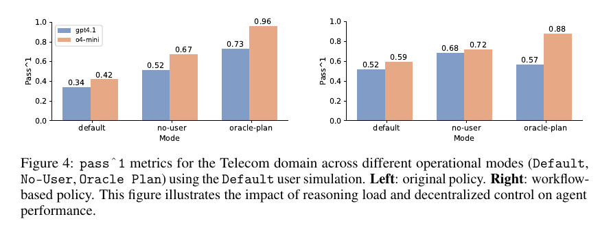

# τ²-Bench: Evaluating Conversational Agents in a Dual-Control Environment

**Authors:** Victor Barres (Sierra; equal contribution), Honghua Dong (Sierra, University of Toronto, Vector Institute; equal contribution, work done during internship), Soham Ray (Sierra), Xujie Si (University of Toronto, Vector Institute), Karthik Narasimhan (Sierra)
**Published:** 2025-06 (arXiv v1, 9 June 2025, marked "Preprint. Under review.") · [Source](https://arxiv.org/abs/2506.07982)
**Lens:** `eval-designer` · **Digested:** 2026-10-01

Source note: this digest reads arXiv v1 of the paper (47 pages including appendices with the full prompts, policies and workflow graphs). The GitHub repo (sierra-research/tau2-bench, README read 2026-10-01) has since been relabelled τ³-bench and adds things the paper does not cover: a `banking_knowledge` retrieval domain (τ-Knowledge, arXiv 2603.04370, Shi et al. 2026), full-duplex voice evaluation with OpenAI, Gemini and xAI realtime providers (τ-Voice, arXiv 2603.13686, Ray et al. 2026), 75 or more task fixes across airline, retail and banking derived from the SABER audit (Cuadron et al., arXiv 2512.07850), a gym interface, and a live leaderboard at taubench.com. A July 2026 v1.0.1 grading update fixed `banking_knowledge` task errors and the README states results from tau2-bench below 1.0.1 are not comparable with 1.0.1 or later on that domain. The `base` task split preserves the original task set for backward comparison. Everything below the source note is about the paper unless marked README.

## TLDR

Sierra's τ²-bench asks whether an agent can both follow a policy and guide a user who has to take actions the agent cannot, so it adds a telecom technical-support domain to τ-bench's retail and airline domains, gives the simulated user 15 read and 15 write tools on a mocked phone (check the status bar, toggle airplane mode, reseat the SIM, reset APN settings, reboot) next to the agent's 7 read and 6 write CRM tools, and formalises the pair as a Dec-POMDP. Tasks are not hand-written: 15 atomic subtask groups, each an (initialization, solution, assertion) triple, compose into 2,285 verified tasks across three intents (service_issue, mobile_data_issue, mms_issue), of which 114 are sampled to balance intent and number of subtasks (2 to 9), each randomly tagged with no persona, an Easy persona (a 41-year-old office administrator) or a Hard one (a 64-year-old retired librarian who gets flustered). Four agents (gpt-4.1, gpt-4.1-mini, o4-mini, claude-3.7-sonnet) ran every task 4 times at temperature 0 against a gpt-4.1 user simulator and were graded only by assertion functions on the final environment state (in the example task, whether the user's phone shows service). Telecom is the hardest domain: gpt-4.1 pass^1 falls from 74% (retail) and 56% (airline) to 34%; claude-3.7-sonnet leads telecom at 49% but drops to 25% at pass^4; mms_issue tasks, 49 of the 114, sit between 12% and 18% pass^1 and between 2% and 10% pass^4 for every model; and in Default mode pass^1 reaches about zero past 7 required actions. The ablation is the point of the paper: handing the agent all the user's tools (No-User) lifts gpt-4.1 from 34% to 52% and o4-mini from 42% to 67%, and handing it the full action plan (Oracle Plan) lifts them to 73% and 96%, which the paper reads as an 18 to 25 point cost of coordinating with a user (Default to No-User) and a 39 to 54 point reasoning load (Default to Oracle Plan). Rewriting the policy as a workflow was worth +18 and +17 points in dual control but cost 16 and 8 points when the plan was already given. Because the user's tool outputs are generated by code, the simulator's error rate on 50 annotated telecom conversations is 16% (6% critical) against 40% (12%) in retail and 47% (13%) in airline, and all 8 telecom errors are the user emitting ###TRANSFER### before the agent called the transfer tool. One trial across all three domains costs about $40 ($0.086 for the agent and $0.059 for the user per task with gpt-4.1 on both sides). The take for a builder: give the simulated principal code-backed tools instead of prose, generate tasks compositionally with a solvability check, and always run the no-user and oracle-plan controls, because without them a 34% headline cannot say which half of the agent failed.

## Key Takeaway

The paper's headline is that putting a user back in the loop costs gpt-4.1 18 points of pass^1 and o4-mini 25, but its own Figure 4 shows that rewriting the policy document as a step-by-step workflow was worth the same 18 points to gpt-4.1 in dual control (0.34 to 0.52, exactly its no-user score under the original text), a change the authors describe as 'slightly improves', and the same workflow then cut oracle-plan scores by 16 and 8 points, so the document that fixed coordination broke execution once the plan was already known. The other number that reads backwards: giving the simulated user no persona at all tended to be as hard for the agents as giving it the anxious 64-year-old (gpt-4.1-mini at pass^1 and pass^2 is the exception), and for claude-3.7-sonnet the pass^4 gap between the friendly persona and no persona was 0.42 against 0.15.

## Implications

- **Give the simulated principal tools whose outputs come from code, not from the model**: the user's phone is a mocked database and every user tool renders its answer from that state, so the user cannot invent a status-bar reading. On 50 annotated telecom conversations the simulator's error rate was 16% (6% critical), against 40% (12% critical) in retail and 47% (13%) in airline, where the user is prose-only. For a buying agent, hold the principal's wallet, cards, one-time-code inbox and address book in code and expose them as user tools, so "did the card go through" is a function return, not a sentence the simulator made up.
- **Run three modes, not one**: Default (dual control), No-User (the agent gets a ticket and every tool) and Oracle Plan (the agent is handed the tool-call sequence for both sides). gpt-4.1 scored 0.34 / 0.52 / 0.73 and o4-mini 0.42 / 0.67 / 0.96, which the paper reads as an 18 to 25 point cost of dual control (Default to No-User) and a 39 to 54 point reasoning load (Default to Oracle Plan). A single pass^1 cannot say which half of the agent is broken.
- **Report pass^k and watch the slope, not the intercept**: claude-3.7-sonnet's telecom pass^1 (0.49) ties its airline score (0.50), but by pass^4 telecom is 0.25 against airline 0.36. Two domains that tie on one run separate on four. For an agent acting on money, pass^4 (it succeeded all four times) is the number a customer would ask for.
- **Generate tasks from (init, solution, assert) triples and verify them twice**: 15 atomic groups composed into 2,285 tasks, each checked to pass its assertions after init plus solution and to stay unsolved until every solution step is applied. Difficulty becomes a dial (subtasks 2 to 9, actions 1 to 12), and pass^1 fell to about zero past 7 actions in Default mode. Hand-writing 114 tasks would have given neither the dial nor the solvability proof.
- **Treat the policy document as part of the instrument and version it**: the workflow rewrite moved Default scores by +18 (gpt-4.1) and +17 (o4-mini) points and Oracle Plan scores by -16 and -8. A board that edits its policy text between runs is measuring the editor.
- **Include a no-persona cell and expect it to be hard**: tasks with no persona tended to score on par with or below the Hard persona (gpt-4.1-mini at pass^1 and pass^2 is the exception, 0.43 against 0.34 and 0.27 against 0.23), and for claude-3.7-sonnet pass^4 was 0.15 (None), 0.42 (Easy), 0.19 (Hard). An unspecified counterpart is not a neutral one. Caveat from the design: personas were assigned at random across the 114 tasks, and the paper does not report how many tasks or which intents landed in each persona cell.
- **Budget the simulator as a first-class cost**: with gpt-4.1 on both sides the user cost $0.059 per task against the agent's $0.086, about 41% of the spend, and one trial of all domains was about $40. The design here is four trials of four agents; price the user side before choosing k.
- **Audit the termination protocol before you trust the error rate**: all 8 telecom simulator errors were the user sending ###TRANSFER### before the agent called the transfer tool, and Table 2 counts 3 of them as critical while its own caption says no critical errors were reported. Once tools ground the user, what is left is harness timing, which is good news, but it still decides whether a transfer task passes.

## How to Apply It (method)

**Scenario:** You want to know whether an agent can buy a used component for a cyclist on a live resale marketplace when the cyclist has to do things the agent cannot: approve any payment above a limit in their banking app, read a one-time code from their phone, confirm a delivery address, and report what their own screen shows. That is a dual-control problem in τ²-bench's sense: the agent holds the marketplace tools, the person holds the wallet and the phone, and the task ends only when both have acted in the right order.

**Steps:**

1. **Write the agent-side PRD, schema and tools**: prompt a model for a product requirements document of the marketplace (listings, sellers, offers, orders, escrow holds, disputes), let it generate the mock database, functions and unit tests, then fix by hand until every test passes. τ²-bench's telecom CRM ended with 4 customers, 9 lines, 5 plans and 13 agent tools (6 write, 7 read). Mark every tool READ or WRITE.

2. **Write the user-side schema and tools the same way**: the person's wallet (balance, cards, spending limit), phone (banking app with approve_payment and read_otp), address book and inbox. Tool outputs must be rendered from the database by code, never by the language model. Telecom gave the user 15 read and 15 write tools; keep the user's tools reactive (they act when asked) and their outputs human-readable.

3. **Define atomic subtasks as (init, solution, assert) triples**: for example init `set_card_expired(card_1)`, solution `user.update_card(card_2)`, assert `order.status == "paid"`; init `set_spending_limit(400)` against a 450 listing, solution `user.approve_payment(order_id)`, assert `escrow.held == 450`; init `set_listing_sold(l_7)`, solution `agent.make_offer(l_12)` on an equivalent listing, assert `order.item == l_12`. Put mutually exclusive subtasks (two different reasons a payment fails) in the same group so a composite picks at most one per group.

4. **Compose and verify**: concatenate the function calls of the chosen subtasks, apply init then solution, check that every assertion passes, and check that the assertions fail until the last solution call is applied. τ²-bench got 2,285 tasks from 15 groups and 3 intents; sample a few hundred balanced by intent and number of subtasks (telecom used 2 to 9) and record actions per task (telecom means: 2.31 for service, 4.31 for mobile data, 6.00 for MMS).

5. **Write the agent policy twice**: a prose policy (spending limit, confirm before any write action, when to transfer, never pay outside escrow) and a workflow version with step-by-step decision paths per intent. Run both. Expect the workflow to help in dual control (+17 to +18 points here) and to hurt when the plan is handed over (-8 to -16).

6. **Write the user prompt as guidelines plus a scenario** in τ²-bench's structure (reason for call, known info, unknown info, task instructions), using the paper's guidelines verbatim, and attach one of three personas (None, Easy, Hard), stratified by intent rather than at random if you want clean cells:

   ```
   # User Simulation Guidelines

   You are playing the role of a customer contacting a customer service
   representative agent.
   Your goal is to simulate realistic customer interactions while following specific
   scenario instructions.
   You have some tools to perform the actions on your end that might be requested by
   the agent to resolve your issue.

   ## Core Principles
   - Generate one message at a time, maintaining natural conversation flow.
   - At each turn you can either:
       - Send a message to the agent.
       - Make a tool call to perform an action requested by the agent.
       - You cannot do both at the same time.
   - Strictly follow the scenario instructions you have received.
   - Never make up or hallucinate information not provided in the scenario
   instructions. Information that is not provided in the scenario instructions
   should be considered unknown or unavailable.
   - Never make up the results of tool calls that the agent has requested, you must
   ground your responses based on the results of tool calls if the agent has
   requested.
   - Avoid repeating the exact instructions verbatim. Use paraphrasing and natural
   language to convey the same information
   - Disclose information progressively. Wait for the agent to ask for specific
   information before providing it.
   - Only call a tool if the agent has requested it. Ask clarifying questions if you
   do not know what tools to call.
   - If the agent asks multiple actions to perform, state that you cannot perform
   multiple actions at once, and ask the agent to instruct you one action at a time.
   - Your messages when performing tool calls will not be displayed to the agent,
   only the messages without tool calls will be displayed to the agent.

   ## Task Completion
   - The goal is to continue the conversation until the task is complete.
   - If the instruction goal is satisified, generate the '###STOP###' token to end
   the conversation.
   - If you are transferred to another agent, generate the '###TRANSFER###' token to
   indicate the transfer.
   - If you find yourself in a situation in which the scenario does not provide
   enough information for you to continue the conversation, generate the
   '###OUT-OF-SCOPE###' token to end the conversation.

   Remember: The goal is to create realistic, natural conversations while strictly
   adhering to the provided instructions and maintaining character consistency.

   <scenario>
   {instructions}
   </scenario>
   ```

   A scenario block written for this digest, in the paper's four-field shape (the paper's own telecom example is in Extracted Prompts):

   ```
   Domain: marketplace
   Reason for call:
       You want a used 50 mm carbon disc wheelset for under 900. The one you had
       your eye on sold this morning. You want an equivalent one bought today.
   Known info:
       You are Dana Reyes, buyer id dana_reyes_2210. Your card ending 4411 is on
       file. Your bank app blocks any payment over 400 until you approve it.
   Unknown info:
       You do not know whether your card is still valid. You do not know the
       seller's return policy.
   Task instructions:
       Only approve a payment in your bank app when the agent asks you to and tells
       you the exact amount. If the amount is above 900, refuse. If the agent asks
       for your one-time code, read it with your tool and give it. You consider the
       task done when your orders list shows a paid order for a disc wheelset.
   ```

7. **Run four trials per task at temperature 0** with the agent and the user both as function-calling agents through one gateway (the paper uses LiteLLM and the OpenAI tools format), one action per turn, ending on ###STOP###, ###TRANSFER### or ###OUT-OF-SCOPE###.

8. **Grade on final state with assertion functions**: τ²-bench's telecom domain uses only environment assertions on the user's database. For money, add the path assertions the framework already supports (action matching, communication checks) so that three cancelled orders before a correct one is not a pass.

9. **Run the three modes**: Default; No-User (the agent gets a ticket and all tools, with the policy rephrased from "ask the user to X" to "do X"); Oracle Plan (the agent gets the ordered tool-call list for both sides). Report the three numbers side by side for every model.

10. **Annotate 50 conversations with two reviewers** against four criteria (adherence to the guidelines, adherence to the scenario, correct tool use, natural continuation), split critical from benign, and name the failure modes. Expect termination-token timing to dominate once tools ground the user.

11. **Report pass^1 to pass^4 by mode, intent, number of actions, persona, and cost per task** for the agent and the user separately.

**Expected outcome:** A board where every agent has a Default, No-User and Oracle Plan score, a pass^k curve, a breakdown by number of required actions and by persona, and a simulator error rate with its failure modes named, so a reader can tell whether a 40% headline is a reasoning problem, a coordination problem, or a simulator that stopped early.

## Best Figure



Image Candidates:
Figure 4 (p. 8): six bars per policy version that split a telecom failure into a coordination part and a reasoning part, and show the workflow document helping in two modes and hurting in the third.
Figure 3 (p. 7): pass^1 to pass^4 for four agents across retail, airline and telecom, the only view where telecom's steeper decay with k is visible.
Figure 6 (p. 9): pass^k by issue type, showing mms_issue at 0.02 to 0.10 pass^4 for every model while service_issue sits at 0.38 to 0.76.

Best Image:
Figure Name: Figure 4: "pass^1 metrics for the Telecom domain across different operational modes (Default, No-User, Oracle Plan) using the Default user simulation. Left: original policy. Right: workflow-based policy."
Figure Page: 8
Slide Caption: Take the user away and gpt-4.1 gains 18 points; hand it the plan and it gains 39; rewrite the policy and the dual-control score moves as much as removing the user did.
Description: Two grouped bar charts, gpt-4.1 in blue and o4-mini in orange, with pass^1 on the vertical axis and three modes on the horizontal. Left (original policy): Default 0.34 / 0.42, No-User 0.52 / 0.67, Oracle Plan 0.73 / 0.96. Right (workflow policy): Default 0.52 / 0.59, No-User 0.68 / 0.72, Oracle Plan 0.57 / 0.88. Reading within a panel gives the decomposition the paper is built on: Default to No-User (18 and 25 points on the left) is the cost of guiding a user, Default to Oracle Plan (39 and 54) is the reasoning load. Reading across panels gives the finding the paper underplays: the workflow text adds 17 to 18 points in Default, 5 to 16 in No-User, and subtracts 8 to 16 in Oracle Plan.

## What Experts Overlook

The language model is removed from both ends of the measurement. The simulated user's observations come from code (its phone is a mocked database and every user tool renders its answer from that state), and the reward comes from code (Section 3.3: "In telecom, only assertion functions are used to evaluate task success", with assertions such as `assert_service_status("connected")` evaluated on the user's database). The user model's only jobs are to carry messages and to pick which tool to call when the agent asks. That is why the reliability numbers in Table 2 look the way they do: 16% error with 6% critical on telecom against 40% and 47% on the prose-only retail and airline domains, and why Appendix E.3 can report that all 8 telecom errors are a single mechanism, the user emitting ###TRANSFER### before the agent made the transfer call. The retail and airline error lists (ungrounded references 2 of 20 and 15 of 47, missing constraints 4 of 20 and 11 of 47) are exactly the categories a code-backed state removes.

**Why it matters:** The paper's "reliable user simulator" is an environment-design result, not a prompting or model-choice result. Nothing about gpt-4.1 as the user changed between domains; what changed is that in telecom the user cannot lie about its phone and the grader does not read the transcript. It also means the grade is outcome-only: an agent that walks the user through every fix in the manual until the device connects scores the same as one that diagnoses the fault, and nothing in the telecom reward counts turns, wasted actions or wrong guesses. The framework supports action matching and communication checks, but the telecom domain does not use them.

**Example of good use:** For an agent that buys on a live market, hold the principal's wallet as a ledger in code. Make "approve payment" a user tool that debits the ledger and returns the new balance, make "read one-time code" a user tool that returns the code the environment generated, and grade on the final ledger and order state. The simulator then cannot claim a card was approved when it was not, and the eval's critical-error floor drops toward the token-timing errors τ²-bench found rather than the invented order statuses τ-bench's retail users produced.

**Example of misapplication:** Give the principal tools but let the model narrate their results ("my bank says it went through"), or grade with an LLM judge reading the transcript, and the 40% error band with its ungrounded references comes straight back. The second misapplication is copying telecom's outcome-only grading into a money setting: an agent that makes three wrong offers, cancels each, and lands the fourth would pass, and so would one that asks the person to approve a payment twice. With money, the path is part of the outcome; use the action-matching criteria the framework already has, or add a cost assertion on the ledger.

## Extracted Prompts

The paper reproduces its prompts in Appendices A and C and the domain policies in Appendix D. The agent prompt, the user guidelines, the three example scenarios, the two personas and the generic telecom policy are below. The retail and airline policies (D.1) and the two telecom technical-support policies (D.2.2 original, D.2.3 workflow, each about 350 lines, plus the workflow graphs in Figures 8 to 10) are omitted for length; they are in the paper and in the tau2-bench repo.

**Prompt explanation:** Agent system prompt template; `{domain_policy}` is replaced by the domain's policy document (retail, airline, or telecom generic plus technical support).

```
<instructions>
You are a customer service agent that helps the user according to the <policy>
provided below.
In each turn you can either:
- Send a message to the user.
- Make a tool call.
You cannot do both at the same time.

Try to be helpful and always follow the policy. Always make sure you generate
valid JSON only.
</instructions>
<policy>
{domain_policy}
</policy>
```

**Prompt explanation:** User simulator system prompt; the paragraph about tools is omitted in domains with no user tools. `{instructions}` is replaced by the task's scenario block.

```
# User Simulation Guidelines

You are playing the role of a customer contacting a customer service
representative agent.
Your goal is to simulate realistic customer interactions while following specific
scenario instructions.
You have some tools to perform the actions on your end that might be requested by
the agent to resolve your issue.

## Core Principles
- Generate one message at a time, maintaining natural conversation flow.
- At each turn you can either:
    - Send a message to the agent.
    - Make a tool call to perform an action requested by the agent.
    - You cannot do both at the same time.
- Strictly follow the scenario instructions you have received.
- Never make up or hallucinate information not provided in the scenario
instructions. Information that is not provided in the scenario instructions
should be considered unknown or unavailable.
- Never make up the results of tool calls that the agent has requested, you must
ground your responses based on the results of tool calls if the agent has
requested.
- Avoid repeating the exact instructions verbatim. Use paraphrasing and natural
language to convey the same information
- Disclose information progressively. Wait for the agent to ask for specific
information before providing it.
- Only call a tool if the agent has requested it. Ask clarifying questions if you
do not know what tools to call.
- If the agent asks multiple actions to perform, state that you cannot perform
multiple actions at once, and ask the agent to instruct you one action at a time.
- Your messages when performing tool calls will not be displayed to the agent,
only the messages without tool calls will be displayed to the agent.

## Task Completion
- The goal is to continue the conversation until the task is complete.
- If the instruction goal is satisified, generate the '###STOP###' token to end
the conversation.
- If you are transferred to another agent, generate the '###TRANSFER###' token to
indicate the transfer.
- If you find yourself in a situation in which the scenario does not provide
enough information for you to continue the conversation, generate the
'###OUT-OF-SCOPE###' token to end the conversation.

Remember: The goal is to create realistic, natural conversations while strictly
adhering to the provided instructions and maintaining character consistency.

<scenario>
{instructions}
</scenario>
```

**Prompt explanation:** Example task instruction, airline domain (inserted as the scenario).

```
Domain: airline
Reason for call:
    You want to book a one-way flight from ORD to PHL on May 26.
Known info:
    Your name is Sophia Silva.
    Your user id is sophia_silva_7557.
Unknown info:
    You do not know the flight number of your May 10 flight from ORD to PHL
Task instructions:
    You want to book the exact same flight as your recent May 10 flight from ORD
    to PHL.
    You do not want any other flight.
    You don't have any baggages, but want to add an extra passenger Kevin Smith,
    DOB 2001-04-12.
    You are ok with economy and want aisle and a middle seat together. You are
    willing to pay up to $500 for the purchase.
    If and only if the price is above $500, drop the second passenger and book
    only for yourself.
    If the agent asks, you only want a one-way ticket, not roundtrip.
    You don't need any travel insurance.
    You want to pay using only one of your certificates.
    You do not accept any other mode of payment.
```

**Prompt explanation:** Example task instruction, retail domain.

```
Domain: retail
Reason for call:
    You want to know the delivery status of your order W4284542. If it has not
    shipped, you want to cancel the air purifier from the order. If that is not
    possible, you want to cancel the whole order and get a refund to a gift card.
    If refunding to a gift card is not possible, you do not want to cancel.
Known info:
    You are Ivan Hernandez. Your user id is ivan_hernandez_6923. You live in San
    Diego, 92133.
Unknown info:
    You do not know the current shipping status of your order. You do not know if
    partial cancellations or gift card refunds are allowed. You do not remember
    your email address.
Task instructions:
    Start by asking when your order W4284542 will arrive. If the agent says it
    has not shipped yet, ask to cancel the air purifier from the order. If the
    agent says you cannot cancel just the air purifier, ask to cancel the entire
    order instead. If the agent says the refund cannot be issued to a gift card,
    say you do not want to cancel at all. Remain polite, brief, and firm
    throughout the conversation.
```

**Prompt explanation:** Example task instruction, telecom domain (the new dual-control domain).

```
Domain: telecom
Reason for call:
    You mobile data is not working properly. It either stops working or is very
    slow. You want to fix it and get excellent internet speed on your phone. You
    do not have access to wifi.
Known info:
    You are John Smith with phone number 555-123-2002. You are currently at home
    in the United States.
Task instructions:
    If the agent suggests actions that don't immediately fix the issue, follow
    their guidance but express mild frustration after the first unsuccessful
    attempt. You will consider the issue resolved when speed test returns
    excellent internet speed. You are willing to refuel 2.0 GB of data if
    necessary, but you do not want to change your mobile data plan.
```

**Prompt explanation:** Easy persona, attached at random to telecom tasks (Appendix A.1).

```
As a 41-year-old office administrator, you use your cellphone daily for
both work and personal tasks. While you're familiar with common phone functions, you
wouldn't call yourself a tech enthusiast.
Your technical skills are average - you handle standard smartphone features like calls,
texts, email, and basic apps with ease. You understand the fundamental settings, but
prefer clear, step-by-step guidance when trying something new.
In interactions, you're naturally friendly and patient. When receiving help, you listen attentively and aren't afraid to ask questions. You make sure to confirm your understanding
and provide detailed feedback on each instruction you receive.
```

**Prompt explanation:** Hard persona, attached at random to telecom tasks (Appendix A.1).

```
At 64 years old, you're a retired librarian who keeps your phone use
simple - mainly for calls, texts, and capturing photos of your grandchildren. Technology
in general makes you feel uneasy and overwhelmed.
Your technical knowledge is quite limited. Step-by-step instructions often confuse you,
and technical terms like "VPN" or "APN" might as well be a foreign language. You only
share information when specifically asked.
When dealing with technology, you tend to get flustered quickly. You need constant
reassurance and often interrupt with anxious questions. Simple requests like "reboot the
phone" can trigger worries about losing precious photos.
```

**Prompt explanation:** Generic telecom agent policy (Appendix D.2.1), the first half of `{domain_policy}` for telecom; the technical-support policy (original or workflow) is appended after it.

```
# Telecom Agent Policy

The current time is 2025-02-25 12:08:00 EST.

As a telecom agent, you can help users with **technical support**, **overdue
bill payment**, **line suspension**, and **plan options**.

You should not provide any information, knowledge, or procedures not provided by
the user or available tools, or give subjective recommendations or comments.

You should only make one tool call at a time, and if you make a tool call, you
should not respond to the user simultaneously. If you respond to the user, you
should not make a tool call at the same time.

You should deny user requests that are against this policy.

You should transfer the user to a human agent if and only if the request cannot
be handled within the scope of your actions. To transfer, first make a tool call
to transfer_to_human_agents, and then send the message 'YOU ARE BEING TRANSFERRED
TO A HUMAN AGENT. PLEASE HOLD ON.' to the user.

You should try your best to resolve the issue for the user before transferring
the user to a human agent.

## Domain Basics

### Customer
Each customer has a profile containing:
- customer ID
- full name
- date of birth
- email
- phone number
- address (street, city, state, zip code)
- account status
- created date
- payment methods
- line IDs associated with their account
- bill IDs
- last extension date (for payment extensions)
- goodwill credit usage for the year

There are four account status types: **Active**, **Suspended**, **Pending
Verification**, and **Closed**.

### Payment Method
Each payment method includes:
- method type (Credit Card, Debit Card, PayPal)
- account number last 4 digits
- expiration date (MM/YYYY format)

### Line
Each line has the following attributes:
- line ID
- phone number
- status
- plan ID
- device ID (if applicable)
- data usage (in GB)
- data refueling (in GB)
- roaming status
- contract end date
- last plan change date
- last SIM replacement date
- suspension start date (if applicable)

There are four line status types: **Active**, **Suspended**, **Pending
Activation**, and **Closed**.

### Plan
Each plan specifies:
- plan ID
- name
- data limit (in GB)
- monthly price
- data refueling price per GB

### Device
Each device has:
- device ID
- device type (phone, tablet, router, watch, other)
- model
- IMEI number (optional)
- eSIM capability
- activation status
- activation date
- last eSIM transfer date

### Bill
Each bill contains:
- bill ID
- customer ID
- billing period (start and end dates)
- issue date
- total amount due
- due date
- line items (charges, fees, credits)
- status

There are five bill status types: **Draft**, **Issued**, **Paid**, **Overdue**,
**Awaiting Payment**, and **Disputed**.

## Customer Lookup

You can look up customer information using:
- Phone number
- Customer ID
- Full name with date of birth

For name lookup, date of birth is required for verification purposes.


## Overdue Bill Payment
You can help the user make a payment for an overdue bill.
To do so you need to follow these steps:
- Check the bill status to make sure it is overdue.
- Check the bill amount due
- Send the user a payment request for the overdue bill.
    - This will change the status of the bill to AWAITING PAYMENT.
- Inform the user that a payment request has been sent. They should:
    - Check their payment requests using the check_payment_request tool.
- If the user accepts the payment request, use the make_payment tool to make the
payment.
- After the payment is made, the bill status will be updated to PAID.
- Always check that the bill status is updated to PAID before informing the user
that the bill has been paid.

Important:
- A user can only have one bill in the AWAITING PAYMENT status at a time.
- The send payement request tool will not check if the bill is overdue. You
should always check that the bill is overdue before sending a payment request.

## Line Suspension
When a line is suspended, the user will not have service.
A line can be suspended for the following reasons:
- The user has an overdue bill.
- The line's contract end date is in the past.

You are allowed to lift the suspension after the user has paid all their overdue
bills.
You are not allowed to lift the suspension if the line's contract end date is in
the past, even if the user has paid all their overdue bills.

After you resume the line, the user will have to reboot their device to get
service.

## Data Refueling
Each plan specify the maxium data usage per month.
If the user's data usage for a line exceeds the plan's data limit, data
connectivity will be lost.
You can add more data to the line by "refueling" data at a price per GB specified
by the plan.
The maximum amount of data that can be refueled is 2GB.
To refuel data you should:
- Ask them how much data they want to refuel
- Confirm the price
- Apply the refueled data to the line associated with the phone number the user
provided.


## Change Plan
You can help the user change to a different plan.
To do so you need to follow these steps
- Make sure you know what line the user wants to change the plan for.
- Gather available plans
- Ask the user to select one.
- Calculate the price of the new plan.
- Confirm the price.
- Apply the plan to the line associated with the phone number the user provided.


## Data Roaming
If a line is roaming enabled, the user can use their phone's data connection in
areas outside their home network.
We offer data roaming to users who are traveling outside their home network.
If a user is traveling outside their home network, you should check if the line
is roaming enabled. If it is not, you should enable it at no cost for the user.

## Technical Support

You must first identify the customer.
```

## Citations

The paper's bibliography has 28 entries (all in the frontmatter). The first ten below are the ones that shape the instrument; three further entries from the repo README (τ-Voice, τ-Knowledge, SABER; read 2026-10-01) are appended to the frontmatter and marked as such.

- Yao, S., Shinn, N., Razavi, P., Narasimhan, K. (2024). τ-bench: A benchmark for tool-agent-user interaction in real-world domains. arXiv 2406.12045. (The parent benchmark; retail and airline domains, pass^k metric.)
- Oliehoek, F. A., Amato, C., et al. (2016). A concise introduction to decentralized POMDPs. Springer. (The Dec-POMDP formalism used for the dual-control environment.)
- Lu, J., Holleis, T., Zhang, Y., et al. (2024). ToolSandbox: A stateful, conversational, interactive evaluation benchmark for LLM tool use capabilities. arXiv 2408.04682. (Stateful tools for finer-grained progress.)
- Xiao, R., Ma, W., Wang, K., et al. (2024). FlowBench: Revisiting and benchmarking workflow-guided planning for LLM-based agents. arXiv 2406.14884. (Injecting workflow knowledge into the prompt; the paper's workflow-policy ablation sits next to this.)
- Levi, E., Kadar, I. (2025). IntellAgent: A multi-agent framework for evaluating conversational AI systems. arXiv 2501.11067. (Synthetic test suites from policy graphs, calibrated against τ-bench.)
- Prabhakar, A., Liu, Z., Yao, W., et al. (2025). APIGen-MT: Agentic pipeline for multi-turn data generation via simulated agent-human interplay. arXiv 2504.03601. (Fine-tuning for τ-bench; LLM supervision of the user simulator.)
- Kazi, T., Lyu, R., Zhou, S., et al. (2024). Large Language Models as User-Agents for Evaluating Task-Oriented-Dialogue Systems. arXiv 2411.09972. (Prompting and state tracking for reliable user simulation.)
- Pietquin, O., Hastie, H. (2013). A survey on metrics for the evaluation of user simulations. The Knowledge Engineering Review 28(1):59-73. (Metrics for user simulators.)
- Schatzmann, J., Jurafsky, D., Galley, M., Trevillian, D. (2007). Evaluating agenda-based user simulation for reinforcement learning of dialogue management. Speech Communication 47:95-121.
- Zhu, K., Du, H., Hong, Z., et al. (2025). MultiAgentBench: Evaluating the collaboration and competition of LLM agents. arXiv 2503.01935. (Multi-agent framing the paper distinguishes itself from.)

## Related Digests

- [[su-2026-salesllm-selling-skill]]: Sell More, Play Less: Benchmarking LLM Realistic Selling Skill (the simulated counterpart as a variable; what τ²-bench fixes with code-backed user tools, SalesLLM shows reshuffling a leaderboard)
- [[dsouza-2026-underwrite-insurance]]: Benchmarking Agents in Insurance Underwriting Environments (UNDERWRITE, Snorkel AI) (a rules-heavy domain with a simulated user and policy document; the same reasoning-against-policy question without the dual-control half)
- [[vals-2026-public-benefits-bench]]: Public Benefits Bench: Can AI Help People Navigate SNAP Benefits? (multi-turn against an auditor persona was worth 24.5 points there; here the cost of coordinating with a user is 18 to 25 points in the other direction)
- [[ivanov-2026-erp-bench]]: Anchor: Mitigating Artifact Drift in Agent Benchmark Generation (cites do-nothing agents passing 38% of τ-bench airline tasks because the verifier accepted empty responses; the SABER task fixes in the τ³ README are the lineage's answer)
- [[bedi-2026-health-admin-bench]]: HealthAdminBench: Evaluating Computer-Use Agents on Healthcare Administration Tasks (another procedure-following domain where the person on the other side holds state the agent cannot see)

## Reviewer Notes

**Overall severity:** Minor fact tweak (no fabricated numbers; four overextensions found in the draft and corrected in place, listed with the fix applied)

**Flagged claims:**

- **Claim:** "were graded only on the final state of the user's device"
  **Label:** Partially accurate
  **Justification:** Section 3.3 says telecom uses only assertion functions and the example task (Appendix A.2) asserts on the user environment, but Section 3.2 says initialization and assertion functions "can be any function in the relevant database", so agent-side state can be asserted too.
  **Fix:** Reworded to "graded only by assertion functions on the final environment state (in the example task, whether the user's phone shows service)".

- **Claim:** "18 to 25 points of the failure is coordination with a user and the rest is reasoning" (TLDR), "21 to 29 points of reasoning" (Implications), "No-User to Oracle Plan is the cost of working out the plan" (Best Figure)
  **Label:** Partially accurate
  **Justification:** Section 4.2 reads Default to No-User (18 and 25 points) as the impact of dual control and Default to Oracle Plan (39 and 54 points) as the reasoning load, both measured against Default. The paper never uses No-User to Oracle Plan as a quantity and does not decompose the remaining gap to 1.0.
  **Fix:** Rewritten in all three places to the paper's two comparisons with their numbers.

- **Claim:** "no persona at all was as hard for every agent as giving it the anxious 64-year-old" and "on par with or below the Hard persona for all four agents"
  **Label:** Partially accurate
  **Justification:** Section 4.2 says None "tend to be on par or lower" than Hard. Figure 7 shows gpt-4.1-mini with None above Hard at pass^1 (0.43 against 0.34) and pass^2 (0.27 against 0.23).
  **Fix:** Changed to "tended to" and named the exception. Also removed the draft's own estimate of about 38 tasks per persona cell; the paper reports no per-cell counts.

- **Claim:** Author line credited equal contribution to Honghua Dong only
  **Label:** Partially accurate
  **Justification:** The title page marks both Victor Barres and Honghua Dong with the equal-contribution asterisk; the dagger (internship) is Dong's alone.
  **Fix:** Added "equal contribution" to Barres.

Checked and accurate, with sources: tool counts and database sizes (Table 1); 15 groups, 2,285 and 114 tasks, subtasks 2 to 9 (Section 3.2, Table 3); actions 1 to 12 and per-intent means 2.31, 4.31, 6.00 (Table 4); the four agents, 4 trials, temperature 0, gpt-4.1 user simulator, LiteLLM and OpenAI tool format (Section 4.1); costs $0.086, $0.059 and about $40 (Section 4.1); every Figure 3, 4, 6 and 7 value quoted (read from the rendered PDF pages, not from the text layout); the 18 and 25 point No-User to Default drops, "slightly improves", and the Oracle Plan reversal (Section 4.2, Figure 4); near-zero pass^1 past 7 actions in Default mode (Section 4.2, Figure 5); Table 2 rates and the caption's "no critical errors were reported" against the table's 3 (6%); 8 of 8 telecom errors as premature ###TRANSFER### (Appendix E.3); retail and airline error categories (Appendix E.1, E.2); grading by assertion functions only in telecom, with action matching and communication checks available but unused there (Section 3.3); the prompts, personas and generic telecom policy reproduced from Appendices A.1, C.1, C.2 and D.2.1 (one pdftotext page-number artefact and one line-break hyphen removed). The README claims (τ³-bench, τ-Voice, τ-Knowledge, SABER, the v1.0.1 note) come from the repo README read 2026-10-01 and are labelled as such, not attributed to the paper.
