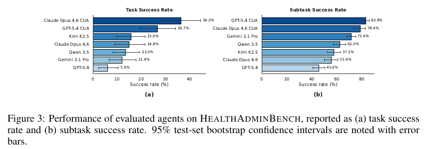

# HealthAdminBench: Evaluating Computer-Use Agents on Healthcare Administration Tasks

**Authors:** Suhana Bedi, Ryan Welch, Ethan Steinberg (equal contribution), Michael Wornow, Taeil Matthew Kim, Haroun Ahmed, Peter Sterling, Bravim Purohit, Qurat Akram, Angelic Acosta, Esther Nubla, Pritika Sharma, Michael A. Pfeffer, Sanmi Koyejo, Nigam H. Shah (Stanford University, Kinetic Systems, Stanford Health Care)
**Published:** 2026-04 · arXiv preprint · [Source](https://arxiv.org/abs/2604.09937) · code at github.com/som-shahlab/health-admin-bench · leaderboard at healthadminbench.stanford.edu
**Lens:** `eval-designer` · **Digested:** 2026-10-01

## TLDR

Stanford, Stanford Health Care and Kinetic Systems built HealthAdminBench to ask whether computer-use agents can do the administrative work that costs U.S. healthcare over $1 trillion a year, tested on three revenue-cycle workflows: prior authorizations, appeals of denied claims, and durable medical equipment (DME) orders. They shadowed hospital administrators for more than 100 hours, then built four deterministic sandboxed web apps on the REAL framework (an Epic-style EHR, two payer portals modelled on Anthem and Availity, a RightFax-style eFax) with synthetic patients, typed inputs, schema validation, and no CAPTCHAs, MFA or session timeouts. 135 expert-designed tasks (60 prior authorization, 60 appeals and denials, 15 DME) decompose into 1,698 binary subtasks: 1,177 checked by JMESPath queries over portal state and 521 (30.7%) graded by a GPT-5.4 judge against rubrics; a task counts only if every subtask passes, and many tasks have 15 or more. Seven agent configurations from five models ran single-shot with screenshot-only observations and "portal guidance" prompting: Claude Opus 4.6 in Anthropic's native computer-use loop led on task success at 36.3%, GPT-5.4 in OpenAI's loop led on subtask success at 82.8% (26.7% task), and the same two models in the authors' generic harness scored 14.8% and 5.9%. Appeals were hardest (25.0% for the best agent), DME easiest for the two native agents (73.3% and 60.0%) though two generic-harness agents scored 0.0% on it, information retrieval subtasks were near-solved (83.0% to 96.5% across all seven agents) while task resolution (38.5% to 70.7%) and clinical reasoning (22.3% to 77.0%) were not, and the authors report statistically significant differences in 33 of 42 agent pairs (their count across the task and subtask head-to-head tables). The ablation moved the numbers more than the model choice did: give the generic harness an accessibility tree instead of pixels, plus portal guidance, and Claude Opus 4.6 reaches 51.9% task success, above the native loop's headline, while the bare-task, screenshot setting drops it to 4.4%. A LoRA fine-tune of Qwen-3.5-27B on 100 training tasks (trajectories generated with step-by-step prompts) hit 40.0% on 35 held-out tasks against 17.1% for the base model and 25.7% for Claude Opus 4.6 in the same accessibility-tree configuration, though the task-level gap to Claude has a 95% CI of -2.9 to +31.4 points. Failures cluster in three habits: not going back to the EHR for information that is only needed later, avoiding file downloads and uploads, and not writing key facts to the provided scratch memory. Claude Opus 4.6 in the generic harness averaged $8.91 per hard task against $0.46 for Qwen 3.5 (native-loop costs are not reported), and Gemini 3.1 Pro's low step count (56 on hard tasks against 123 to 144 for the others) reflects giving up, not efficiency. The usable lesson for an eval builder: score every subtask and the whole task separately, treat harness and observation mode as named experimental conditions, include tasks where the right answer is to halt, and validate the LLM judge against pairs of humans (93.3% agreement here, the same as the humans' agreement with each other).

## Key Takeaway

One model, Claude Opus 4.6, scores anywhere from 4.4% to 51.9% task success in this paper depending only on what it is shown and told: pixels or an accessibility tree, a bare task or portal guidance, the vendor's computer-use loop or a generic harness. That 47.5-point spread inside one model is wider than the 30.4-point gap between the best and worst of seven agents on the headline leaderboard (36.3% to 5.9%), and the paper's highest number never appears in the headline results (Figure 3) because the accessibility-tree setting is treated as an ablation, with the authors noting that real portals do not expose such clean, stable identifiers. Read as an instrument, the harness is a bigger variable than the model here, and the headline measures a deployment constraint as much as a capability.

## Implications

- **Score every subtask and the whole task, and expect the ranking to differ between them**: GPT-5.4 CUA leads on subtask success (82.8%) and Claude Opus 4.6 CUA on task success (36.3%), and both leads are statistically significant in the head-to-head tables (Claude ahead by 9.6 points on task, CI 2.2 to 17.8; GPT ahead by 4.4 points on subtask, CI 0.3 to 8.8). For an agent buying on a person's behalf, define 10 to 15 binary checks per task (found the right listing, verified the seller, offered within budget, paid, recorded the receipt) and publish both the per-check rate and the all-or-nothing rate; the first tells you where to put a human checkpoint, the second whether you can remove it.
- **Name the harness, the observation mode and the prompt tier as conditions and run the grid**: the same model moved from 4.4% to 51.9% across the four prompt-by-observation cells, GPT-5.4 went from 5.9% in the generic harness to 26.7% in OpenAI's loop, and the native-agent ranking itself flipped between prompt tiers (GPT-5.4 CUA 19.3% against Claude CUA 10.4% with bare task descriptions; 26.7% against 36.3% with portal guidance). Report a money-spending result as model by harness by observation by guidance, never as a model score.
- **Put halt tasks in the set and score the non-action**: the DME type includes tasks where the correct behaviour is to spot an expired face-to-face evaluation, send no fax, leave the referral on the worklist and write a note; the step-by-step prompt literally says "Do NOT open the fax portal or send any fax". A buying eval needs the equivalent (the listing is a scam, the price is above the mandate, the seller cannot ship by the deadline) with "did not pay" as a scored subtask.
- **Validate the LLM judge against pairs of humans and report human-human agreement next to human-judge agreement**: 30.7% of subtasks (521) are graded by GPT-5.4; on a stratified 60-subtask sample (30 judged pass, 30 judged fail) with two blind reviewers each, humans agreed with each other 93.3% of the time (CI 83.8 to 98.2) and with the judge 93.3% (112 of 120 reviews, CI 87.4 to 97.1). The judge is as reliable as the rubric lets a human be, and 4 of 60 subtasks split the humans. Free-text subtasks in a buying eval (the message to the seller, the rationale logged for the owner) should be validated the same way before any leaderboard goes up.
- **Know what this instrument cannot see**: it is a capability question with a safety edge (the halt tasks), not a delegation test. No human completion rate is reported for the tasks themselves (humans appear only as task auditors and judge validators), every run is single-shot so there is no pass^k or worst-run figure, there are no adversarial counterparties, no real money, no outsiders, no interface drift or policy change, CAPTCHAs, MFA and session timeouts are stripped out, 30.7% of subtasks rest on a GPT-5.4 judge, and the environments are public and intended for training. A money-at-stake eval needs at least a human baseline and repeated runs on top of this design.
- **Expect the breaks at document transfer and cross-system memory, not at reading**: information retrieval subtasks are near-solved (83.0% to 96.5% across all seven agents) while document handling spans 44.3% to 94.3% and task resolution 38.5% to 70.7%; the authors' trajectory review names avoidance of file downloads and uploads, hidden long-term dependencies and forgetting to write to scratch memory as the three dominant failure modes. In a buying eval, make the receipt, the proof of payment and the hand-off between the marketplace and the owner's ledger explicit subtasks, because that is where the agent will quietly skip.
- **Report steps and dollars, and read a low step count as possible surrender**: Gemini 3.1 Pro averaged 14.9, 41.6 and 56.3 steps on easy, medium and hard tasks against 30.5 to 143.6 for the other generic-harness agents because it tends to give up when it struggles, not because it is efficient; Claude Opus 4.6 in the generic harness cost $1.28, $5.78 and $8.91 per easy, medium and hard task against $0.18 to $0.46 for Qwen 3.5. Native CUA costs are not reported at all because the vendor harnesses account for cost inconsistently. Publish cost per attempt with success, and flag early termination separately from completion.
- **Do not over-read the fine-tuning headline, and notice what it does to the benchmark**: Qwen-3.5-Kinetic-SFT reached 40.0% on 35 held-out tasks (base 17.1%, Claude Opus 4.6 25.7% in the same accessibility-tree configuration), but the task-level difference to Claude has a 95% CI of -2.9 to +31.4 points, only the subtask difference (+8.4, CI 1.2 to 15.4) is significant, and the training trajectories were produced by running an agent under the task-specific step-by-step prompt (the paper does not say which model generated them). The environments are released for training, so later leaderboard entries may have seen the task distribution; a money-spending eval should keep a sealed held-out split from day one.

## How to Apply It (method)

**Scenario:** You are building the eval for an agent that buys a specified used item on a secondary marketplace with a real person's money: find the right listing, check the seller, make or accept an offer within a mandate, pay, and leave the owner a record. Before any model touches a live market you want a deterministic replica of the three systems the workflow crosses (the marketplace, the payment or wallet app, the owner's own notes or ledger), a task set that includes cases where the right move is to stop, and a scoring scheme that tells "could read the listing" apart from "finished the purchase correctly". HealthAdminBench's recipe maps onto this directly: its EHR, payer portals and fax system are the marketplace, the wallet and the owner's inbox.

**Steps:**

1. **Shadow the workflow before writing a task**: HealthAdminBench's environments came from more than 100 hours of watching administrators move information between systems, and a stratified 40-task sample (20 prior authorization, 20 appeals) was then audited by two revenue-cycle experts with decades of combined experience, who corrected terminology, plan types, and missing routing and eligibility checks, with fixes applied across related tasks. For buying: sit with three or four people who regularly buy and sell in the market, log every system they touch and every reason they abandon a purchase, and have two of them audit a sample of your tasks for realism before any model runs.

2. **Build deterministic replicas of every system the workflow crosses**: the paper's four sandboxed web apps have typed inputs, schema validation, policy checks and realistic failure modes (missing required fields), are seeded with synthetic data, are driven by Playwright, and strip out CAPTCHAs, MFA and session timeouts. Build the marketplace (search, listing pages with photos and seller history, offer and message threads), a wallet or payment page with a balance, and an owner-facing notes page; freeze the fee schedule and shipping tables; give every interactive element a stable `data-testid` so you can run an accessibility-tree mode as well as a screenshot mode.

3. **Write tasks in two or three workflow families, with easy and hard variants and explicit halt cases**: 135 tasks across prior authorization (60), appeals and denials (60) and DME (15), where hard DME tasks require spotting invalid documentation and halting. For buying: "buy", "negotiate then buy or walk away", and "dispute or return", with halt cases (listing is a scam, price above mandate, seller cannot meet the deadline, item is the wrong size) where the scored outcome is no payment plus a logged reason.

4. **Decompose every task into binary subtasks in named families and grade the end state**: 1,698 subtasks across six families (information retrieval 419, documentation 515, form completion 292, task resolution 200, document handling 149, clinical reasoning 123); 1,177 are JMESPath queries over the final portal state, 521 are rubric judgments on free text by GPT-5.4; no partial credit; a task passes only when every subtask passes. Define a buying equivalent: retrieval (found listing, read seller rating), reasoning (the listing matches the mandate, the seller is acceptable), form completion (offer amount, shipping address), document handling (saved the receipt, attached proof of payment), resolution (paid, or explicitly declined), documentation (owner note with amount, seller, tracking). Write each check as a query over the sandbox's final state. Illustrative, in the JMESPath style the paper uses:

   ```
   subtask: payment_within_mandate
   check:   wallet.transactions[?listing_id=='L-0417'].amount | [0] <= `650.00`
   subtask: receipt_attached_to_owner_note
   check:   length(owner_notes[?listing_id=='L-0417'].attachments[?type=='receipt'][]) >= `1`
   subtask: halt_no_payment (scam listing)
   check:   length(wallet.transactions[?listing_id=='L-0912']) == `0`
   ```

5. **Validate the free-text judge before the leaderboard**: take a stratified sample (30 judged pass, 30 judged fail) of judge-graded subtasks from one agent, have two humans grade each one blind, and report human-human agreement with a CI next to human-judge agreement with a CI; HealthAdminBench got 93.3% on both. If the humans disagree with each other on more than a handful, fix the rubric, not the judge.

6. **Define three prompt tiers and use the most detailed one only to prove tasks are solvable**: task description only; task description plus portal guidance (modular hint blocks per system: action syntax, document-transfer rules, multi-system navigation, per-portal procedures); and a task-specific step-by-step guide used only for validation and for generating training trajectories, never for reported scores. The paper's portal guidance block reads, in part (accessibility-tree mode):

   ```
   DOCUMENT TRANSFER:
   - Download all required documents in EMR BEFORE navigating to any payer or fax portal.
   ...
   MULTI-PORTAL WORKFLOW:
   - Gather all information and download all documents in EMR before leaving for a payer portal.
   - Never navigate back mid-form --- progress will be lost.
   - After portal submission, use "Return to EMR" to navigate back, then add a note with the confirmation number.
   ```

   Write the buying equivalent: "read the seller's history before messaging", "never leave the checkout page mid-payment", "after paying, return to the owner notes page and record amount, seller and tracking".

7. **Give the agent a scratch memory and fix the date**: at every step the agent must emit THINKING, ACTION and a one-line KEY INFO summary of new facts (IDs, dates, amounts, codes), which the harness feeds back as "RECENT ACTIONS AND KEY OBSERVATIONS"; the user prompt injects a fixed benchmark date; the harness injects a warning when the agent repeats the same action. Copy all three, and keep the KEY INFO line, because the paper's failure analysis says agents that skip it lose facts they need later.

8. **Run the full grid, single-shot, with a step budget, for every model**: two observation modes (screenshot, accessibility tree) by two prompt tiers, plus each vendor's native computer-use loop where one exists, on the same browser session and the same graders. Record steps and API cost per task.

9. **Report the instrument, not one number**: task success and subtask success side by side with bootstrap CIs; success by workflow family and by subtask family; a head-to-head table of pairwise differences with CIs; the prompt-by-observation grid; steps and cost per task by difficulty; and a written list of recurring failure modes from reading trajectories.

10. **Keep a sealed split before anyone fine-tunes**: HealthAdminBench's 100/35 split was random and used once, and its authors release the environments for training. Hold out a slice from day one and treat results on it as the only unseen number.

**Expected outcome:** A deterministic three-system buying sandbox, a bank of tasks with halt cases, a subtask grader that reads only final state, a validated free-text judge, and a results table that separates "the agent can operate the interface" from "the agent completed the purchase correctly and left a record". You will know which subtask family breaks first (the paper's answer for healthcare admin: document transfer, cross-system hand-off and memory, not reading), how much the harness and observation mode move the score, and what each attempt costs. What it will not tell you: how the agent behaves against a live seller who lies, what happens when the marketplace UI changes under it, or how often five attempts all succeed, because HealthAdminBench runs single-shot trajectories and says so in its limitations.

## Best Figure



```
Image Candidates:
Figure 3 (p. 8): Two bar charts side by side showing that the leaderboard reorders between task success (Claude Opus 4.6 CUA 36.3% first) and subtask success (GPT-5.4 CUA 82.8% first), with bootstrap CIs; the paper's whole argument in one view.
Figure 4 (p. 10): A 2x2 grid of prompting by observation mode showing the generic harness with accessibility tree and portal guidance (Claude Opus 4.6 at 51.9%) beating the native-loop headline, and the five generic-harness agents collapsing to 1.5% to 4.4% on bare-task screenshot runs.
Table 4 (p. 9): Seven agents by six subtask families, showing information retrieval near-solved (83.0% to 96.5%) while task resolution, clinical reasoning and documentation spread from 22.3% to 84.4%.

Best Image:
Figure Name: Figure 3: "Performance of evaluated agents on HealthAdminBench, reported as (a) task success rate and (b) subtask success rate. 95% test-set bootstrap confidence intervals are noted with error bars."
Figure Page: 8
Slide Caption: Agents complete 46% to 83% of individual healthcare-admin steps but only 6% to 36% of whole tasks, and the agent in first place changes depending on which of the two you read.
Description: Panel (a) ranks seven agent configurations by end-to-end task success on 135 tasks: Claude Opus 4.6 CUA 36.3%, GPT-5.4 CUA 26.7%, Kimi K2.5 15.6%, Claude Opus 4.6 (generic harness) 14.8%, Qwen 3.5 13.3%, Gemini 3.1 Pro 11.9%, GPT-5.4 (generic harness) 5.9%. Panel (b) ranks the same runs by the fraction of 1,698 subtasks passed: GPT-5.4 CUA 82.8%, Claude Opus 4.6 CUA 78.4%, Gemini 3.1 Pro 71.4%, Qwen 3.5 62.0%, Kimi K2.5 57.5%, Claude Opus 4.6 55.4%, GPT-5.4 45.6%. The two native computer-use loops sit well above the same models in the authors' harness on both panels (GPT-5.4: 5.9% against 26.7% on task), first and second place swap between panels, and Gemini 3.1 Pro climbs from sixth on task to third on subtask. The figure carries the paper's claim that interface-level competence and workflow-level reliability are different quantities, and that the harness is a large part of the difference.
```

## What Experts Overlook

The detail is how the task metric is built: a task passes only if every one of its subtasks passes, there is no partial credit, and tasks average 12.6 subtasks (1,698 over 135) with "many" at 15 or more. That rule, stated in Section 3.5 and justified by the fact that one omission invalidates a real submission, is what produces the headline gap between 82.8% and 26.7%, and it is also why the two native computer-use agents each beat the other on one metric with a statistically significant margin (Table 6: Claude Opus 4.6 CUA ahead on task success by 9.6 points, CI 2.2 to 17.8; Table 7: GPT-5.4 CUA ahead on subtask success by 4.4 points, CI 0.3 to 8.8). Two agents, one set of runs, two significant winners. The arithmetic also shows the failures are not independent: if subtask passes were independent, 82.8% over 12.6 subtasks would give about 9% task success and 78.4% about 5%, yet the observed task rates are 26.7% and 36.3%; agents mostly either complete a task or fall apart on several linked steps at once (that calculation is this digest's, not the paper's). The authors' trajectory review (Claude Opus 4.6 traces, with similar patterns seen across models) gives the mechanism: hidden long-term dependencies, avoided file operations and forgotten facts each produce downstream errors in later steps, the paper's words, which is what correlated subtask failures look like.

**Why it matters:** Subtask success measures whether the agent can operate the interface; task success measures whether you can leave it alone. Because failures cluster, the subtask rate overstates deployability and the task rate understates per-step competence, so a benchmark that reports only one of them will mislead in a predictable direction. The all-or-nothing rule is also the reason the subtask-family table (Table 4) is the most useful thing in the paper: it names which family is the choke point (the paper calls clinical reasoning and task resolution the hardest; the weaker generic-harness agents also crater on documentation and form completion, Claude Opus 4.6 in the harness at 23.4% on form completion against 88.9% in the native loop), and that is where a human checkpoint or a harness fix pays off.

**Example of good use:** A team building an eval for an agent that buys on a person's behalf defines 12 binary checks per purchase, reports the all-or-nothing rate as the headline, publishes the per-family rate beside it, and reads the gap as "where does it fall apart". If the agent passes 95% of retrieval and reasoning checks but 60% of "receipt attached and amount recorded" checks, the deployment decision is "let it shop, do not let it close", and the harness fix is a mandatory record-keeping step, not a bigger model.

**Example of misapplication:** A vendor reports "83% success on healthcare admin tasks" from the subtask panel, a buyer deploys the agent on prior authorizations assuming five in six submissions go through, and in practice about one in four does. Worse, the buyer picks the vendor with the highest subtask number, which in this paper is the one with the lower end-to-end rate. The failure is not a bad model; it is reading a per-step rate as if steps were independent and as if it were the metric that matters for an unattended workflow.

## Extracted Prompts

Five prompts are printed in Appendix A. The GPT-5.4 judge prompt and the per-subtask rubrics are not printed; the authors say the full prompt modules for every workflow and portal are in the codebase. Line wraps below follow the PDF's monospaced boxes; bullet items broken by page width have been rejoined.

**Prompt explanation:** Base system prompt, screenshot-only setting. Defines the agent role, the coordinate-based action space, and the THINKING / ACTION / KEY INFO output format whose KEY INFO line is the agent's external memory.

```
You are an autonomous web agent that can interact with websites by performing actions.

Your task is to complete the given objective by analyzing the current page and selecting the appropriate action.

AVAILABLE ACTIONS (SCREEN COORDINATES):
- click coord(x, y) - Left click at pixel coordinates (origin top-left)
- double click coord(x, y) - Double click at pixel coordinates
- triple click coord(x, y) - Triple click at pixel coordinates
- right click coord(x, y) - Right click at pixel coordinates
- move coord(x, y) - Move mouse to pixel coordinates
- type text("text") - Type text at the current cursor focus
- type text coord("text", x, y) - Click at (x, y) then type text at that location
- key press("Enter") - Press a key or key combo (e.g., "Enter", "Ctrl+L")
- scroll(dx, dy) - Scroll by pixel offsets (positive dy = down)
- scroll(x, y, dx, dy) - Move to (x,y) then scroll by offsets
- wait(seconds) - Pause before the next action
- done() - Signal that you have completed the objective

ACTION FORMAT:
You MUST respond with an action AND key information from the current page using this format:
THINKING: <think through your past actions, key observations gathered so far, the objective, and the current page to determine the next single action to take to achieve the objective>
ACTION: action string
KEY INFO: concise but complete summary of all NEW information from this page potentially relevant to completing the task. Do NOT repeat facts already listed in KEY INFORMATION GATHERED SO FAR unless they have changed. Include specific values (IDs, dates, names, amounts, statuses, codes, credentials). Use a single line with separators like "; " or " | " to retain multiple facts.

Examples:
- ACTION: click coord(420, 318)
KEY INFO: Clicking the login button.

- ACTION: type text("user@example.com")
KEY INFO: Typed the text "user@example.com".

- ACTION: type text coord("user@example.com", 420, 318)
KEY INFO: Typed the text "user@example.com" after clicking on the input field.

- ACTION: scroll(0, 500)
KEY INFO: Scrolling to reveal more options.

- ACTION: scroll(640, 360, 0, 500)
KEY INFO: Moving to center and scrolling down.

- ACTION: done()
KEY INFO: Task completed.

IMPORTANT GUIDELINES:
1. Coordinates are in pixels relative to the screenshot
2. Use the screenshot to locate UI elements visually
3. Prefer clicking UI elements instead of typing URLs
4. Complete the objective step by step
```

**Prompt explanation:** Base system prompt, accessibility-tree setting. Same role and output format, but actions address elements by `data-testid` identifiers and the guidelines forbid inventing identifiers.

```
You are an autonomous web agent that can interact with websites by performing actions.

Your task is to complete the given objective by analyzing the current page and selecting the appropriate action.

AVAILABLE ACTIONS:
- click([id]) - Click an element with the specified identifier (USE THIS FOR NAVIGATION)
- fill([id], "text") - Type text into an input field
- select([id], "option") - Select dropdown option by visible label (for <select> elements)
- press([id], "key") - Press a key or key combination on a specific element
- scroll(down) or scroll(up) - Scroll the page
- back() - Go back to the previous page (browser back button) - USE THIS to return from external portals
- download([id]) - Click a download button/link and save the file (use for downloading documents like auth letters)
- upload([id], "filename") - Upload a previously downloaded file to a file input (use "last" for the most recent download)
- done() - Signal that you have completed the objective

ACTION FORMAT:
You MUST respond with an action AND key information from the current page using this format:
THINKING: <think through your past actions, key observations gathered so far, the objective, and the current page to determine the next single action to take to achieve the objective>
ACTION: action string
KEY INFO: concise but complete summary of all NEW information from this page potentially relevant to completing the task. Do NOT repeat facts already listed in KEY INFORMATION GATHERED SO FAR unless they have changed. Include specific values (IDs, dates, names, amounts, statuses, codes, credentials). Use a single line with separators like "; " or " | " to retain multiple facts.

Examples:
- ACTION: click([login-button])
KEY INFO: Found login form with username and password fields.

- ACTION: fill([email-input], "user@example.com")
KEY INFO: None - just filling the form.

- ACTION: download([download-auth-letter])
KEY INFO: Downloading auth letter to attach as supporting documentation.

- ACTION: upload([file-upload-input], "last")
KEY INFO: Uploading the previously downloaded auth letter.

- ACTION: done()
KEY INFO: Task completed - note added and referral cleared.

IMPORTANT GUIDELINES:
1. Always extract element identifiers from the PAGE ELEMENTS section
2. Only use identifiers that are explicitly shown in PAGE ELEMENTS (e.g., [id])
3. Do not invent or guess identifiers
4. In axtree only mode, PAGE ELEMENTS already includes the full page; scrolling rarely reveals new elements
5. If an element is not in PAGE ELEMENTS, try checking other tabs or sections
6. Complete the objective step by step
7. Call done() only when the entire objective is accomplished
```

**Prompt explanation:** Portal guidance system prompt amendment, representative example for a prior authorization task in accessibility-tree mode. This is the "Task Description + Portal Guidance" tier used for all headline results: general operating rules per system, not task solutions.

```
ACTION SYNTAX (DOM / testid mode):
- Click: click([testid]) | Fill: fill([testid], "value") | Back: back()
- Dropdowns are custom (NOT native <select>). Two steps required:
  1. click([dropdown-testid]) to open the options list.
  2. click([dropdown-testid-option-{value}]) to select the desired option.
  Do NOT use select() --- it will not work.
- Dates: fill the text field with MM/DD/YYYY.

DOCUMENT TRANSFER:
- Download all required documents in EMR BEFORE navigating to any payer or fax portal.
- To open a document: click the "View →" button on the RIGHT side of the document row. Do NOT click the document name/title.
- On the viewer page, click Download. Then click "< Back" EXACTLY ONCE to return to the referral page.
- Downloaded documents automatically appear in the "Available Documents from EMR" section inside payer portals.

MULTI-PORTAL WORKFLOW:
- Gather all information and download all documents in EMR before leaving for a payer portal.
- Navigate to the payer portal via the Coverages tab portal link.
- Never navigate back mid-form --- progress will be lost.
- After portal submission, use "Return to EMR" to navigate back, then add a note with the confirmation number.

EMR WORKLIST:
- Find the referral by scrolling the patient list or using the search field. Click the patient/referral row to open it.
- Tab navigation --- all evaluated, must visit in this order:
  1. [EVALUATED] Diagnoses tab → record all ICD-10 codes.
  2. [EVALUATED] Services tab → record all CPT/HCPCS codes.
  3. Referral tab → capture referral details.
  4. [EVALUATED] General tab → scroll to Documents section → for each required doc, click "View →" then Download.
  5. [EVALUATED] Coverages tab → capture payer credentials and portal link. SCROLL DOWN to find the "Open Portal" button.
- After returning from a payer portal: scroll to Communications → Add Note → fill subject and content (include the confirmation number) → Save → Clear from Worklist.

PAYER A:
- Eligibility check: Click "Member Eligibility" tab → fill Member ID, First Name, Last Name, DOB → submit.
- Submit prior authorization: Provider lookup → Request Type → Patient lookup → Diagnoses (add each ICD-10) → CPT codes (add each) → Clinical indication → Attach docs → Submit → capture confirmation ID → return to EMR.
- Look up / dispute a claim: Appeals tab → enter member/claim ID → Search → click claim → Dispute Claim → fill rationale → attach docs → Submit.
```

**Prompt explanation:** Task-specific system prompt amendment, example for a DME order-processing halt task. Used only for validating that tasks are completable and for generating the fine-tuning trajectories; never in reported scores.

```
MANDATORY STEP-BY-STEP GUIDE --- FOLLOW EVERY STEP IN ORDER:
These steps are not suggestions. Each step must be executed.
Steps marked [REQUIRED] or [EVALUATED] are directly scored by the evaluation system. Skipping them results in 0 points for that criterion, even if the correct outcome is achieved.
Do NOT skip any step, even if the information appears already visible.

1. On the DME Orders page (/emr/dme), click on patient Garcia, Sofia
2. The referral opens with the Orders tab (Active sub-tab by default). Review the order details and note the DME supplier (Option Care Health).
3. Click the Chart Review tab in the top navigation bar
4. In Chart Review, open the Face-to-Face Evaluation document --- observe that it is dated April 2025, more than 6 months before the order date
5. This indicates the F2F evaluation is expired per Medi-Cal policy (must be within 6 months)
6. Do NOT open the fax portal or send any fax
7. Do NOT clear the referral from the worklist
8. Click the Notes tab in the top navigation bar
9. In the Notes tab (right panel, Edit Note), enter a subject and a detailed progress note documenting: patient Sofia Garcia; enteral feeding pump order; expired F2F evaluation (April 2025); Medi-Cal requirement that F2F be within 6 months; need for updated F2F from Dr. Emily Foster; order on hold; no fax sent to Option Care Health
10. Click Sign to save the note
```

**Prompt explanation:** User prompt scaffold (accessibility tree plus screenshot mode). Injects the fixed benchmark date, step count, URL, the rolling action-and-observation history that carries the KEY INFO memory forward, and the page elements.

```
OBJECTIVE: <task description>
Treat the current benchmark date as Wednesday, February 25, 2026.

CURRENT URL: <current browser URL>
STEP: <step count>

[Screenshot of current page is attached]

RECENT ACTIONS AND KEY OBSERVATIONS (most recent last):
  ACTION: <previous action 1>
  | OBSERVATION: <key info from that step>
  ACTION: <previous action 2>
  | OBSERVATION: <key info from that step>

PAGE ELEMENTS (use identifiers shown in [brackets]):
<accessibility tree content, if included in the observation mode>

Analyze the current page and objective. What is the next single action to take?
Respond with:
THINKING: <think through your past actions, key observations gathered so far, the objective, and the current page to determine the next single action to take to achieve the objective>
ACTION: <your action>
KEY INFO: <concise but complete summary of all NEW information from this page potentially relevant to completing the task; do NOT repeat facts already listed above unless they have changed; include IDs, dates, names, amounts, statuses, codes, credentials; use a single line with separators like ";" or "|">
```

## Citations

25 references extracted (full structured list in frontmatter). First 10:

- Anthropic (2025). Computer use tool. platform.claude.com docs
- Arora, Wei, Soskin Hicks et al. (2025). HealthBench: Evaluating large language models towards improved human health. arXiv:2505.08775
- Bedi, Liu, Orr-Ewing et al. (2025). Testing and evaluation of health care applications of large language models: A systematic review. JAMA 333(4):319-328
- Bedi, Cui, Fuentes et al. (2026). Holistic evaluation of large language models for medical tasks with MedHELM. Nature Medicine
- Chen, Postelnik, Black et al. (n.d.). MedAgentBench v2: Improving Medical LLM Agent Design. World Scientific, pp. 354-371
- De Chezelles, Gasse, Drouin et al. (2025). The BrowserGym ecosystem for web agent research. arXiv:2412.05467
- Deng, Gu, Zheng et al. (2023). Mind2Web: Towards a generalist agent for the web. NeurIPS 36 Datasets and Benchmarks
- Drouin, Gasse, Caccia et al. (2024). WorkArena: How capable are web agents at solving common knowledge work tasks? arXiv:2403.07718
- Garg, VanWeelden, Caples et al. (2025). REAL: Benchmarking autonomous agents on deterministic simulations of real websites. arXiv:2504.11543
- He, Yao, Ma et al. (2024). WebVoyager: Building an end-to-end web agent with large multimodal models. arXiv:2401.13919

## Related Digests

- [[starace-2025-paperbench-replication]]: PaperBench: Evaluating AI's Ability to Replicate AI Research
- [[ivanov-2026-erp-bench]]: Anchor: Mitigating Artifact Drift in Agent Benchmark Generation
- [[wijk-2024-re-bench]]: RE-Bench: Evaluating frontier AI R&D capabilities of language model agents against human experts
- [[mazeika-2025-remote-labor-index]]: Remote Labor Index: Measuring AI Automation of Remote Work
- [[patwardhan-2025-gdpval-economic-tasks]]: GDPval: Evaluating AI Model Performance on Real-World Economically Valuable Tasks

## Reviewer Notes

**Overall severity:** Minor fact tweak

Review method: every number, table reference and named mechanism in the draft was checked against the paper text (pdftotext, layout mode, all 24 pages: Tables 2 to 10, Figures 3 to 7 as printed bar labels) and the rendered page 8. No fabricated metrics, tools or experiments were found. Seven claims were overextended; all seven were corrected in place as listed below.

**Flagged claims (fixed in place):**

- **Claim:** "the revenue-cycle paperwork that costs U.S. healthcare over $1 trillion a year: prior authorizations, appeals ... and DME orders"
  **Label:** Partially accurate
  **Justification:** The $1 trillion figure (Sahni et al., 2023, cited in the abstract and introduction) is for healthcare administration as a whole, not for the three workflows the benchmark covers.
  **Fix:** Reworded to "the administrative work that costs ... over $1 trillion a year, tested on three revenue-cycle workflows".

- **Claim:** "33 of 42 pairwise comparisons were statistically significant"
  **Label:** Partially accurate
  **Justification:** The paper's wording is "33 of 42 agent pairs" (Section 4); Tables 6 and 7 hold 21 pairs each, so the 42 spans both metrics, but the paper does not spell that out.
  **Fix:** Quoted the paper's count and labelled the two-table reading as the digest's.

- **Claim:** "the paper's highest number never reaches that leaderboard"
  **Label:** Partially accurate
  **Justification:** The digest cannot see the public leaderboard at healthadminbench.stanford.edu; what the paper shows is that the 51.9% accessibility-tree result sits in the ablation (Section 4.3, Figure 4) and not in the headline Figure 3.
  **Fix:** Changed to "never appears in the headline results (Figure 3)". The closing sentence ("the harness is a bigger variable than the model") is the digest's reading of Figures 3 and 4, now marked as such; the paper's own phrasing is "highlighting the importance of system-level orchestration".

- **Claim:** "Claude Opus 4.6 in the generic harness cost $8.91 per hard task"
  **Label:** Partially accurate
  **Justification:** Figure 6 prints $8.907 as the average cost across the 45 hard tasks; per-task cost varies (violin plot).
  **Fix:** Changed to "averaged $8.91 per hard task" and added that native-loop costs are not reported.

- **Claim:** "the training trajectories were produced by giving the model step-by-step solutions"
  **Label:** Partially accurate
  **Justification:** Section 4.4 and Appendix E say trajectories were generated "using Task-Specific Step-by-Step prompting" but never say which model produced them.
  **Fix:** Reworded to "running an agent under the task-specific step-by-step prompt (the paper does not say which model generated them)".

- **Claim:** "hidden long-term dependencies, avoided file operations and forgotten facts each take out a cluster of downstream subtasks together"
  **Label:** Partially accurate
  **Justification:** Section 4.5 says these failures lead to "systematic failures", "widespread failure in document-handling subtasks" and "downstream errors when later steps depend on information gathered earlier"; the "cluster" framing is the digest's link to its own independence arithmetic. The trajectories analysed were from Claude Opus 4.6, with "similar patterns across models".
  **Fix:** Quoted the paper's "downstream errors" wording, named the analysed model, and kept the clustering inference labelled as the digest's.

- **Claim:** "clinical reasoning [is the choke point] for all of them"
  **Label:** Partially accurate
  **Justification:** Table 4 shows clinical reasoning as the lowest family for five of seven agents, but GPT-5.4 CUA is lowest on task resolution (66.2%) and Claude Opus 4.6 in the harness is lowest on form completion (23.4%). The paper's statement is that "Clinical Reasoning and Task Resolution are the most challenging".
  **Fix:** Replaced with the paper's statement plus the two exceptions with their numbers.

**Noted but left as is:**

- Average subtasks per task (12.6) and the independence-model task rates (about 9% and 5%) in "What Experts Overlook" are the digest's arithmetic from the paper's 1,698 subtasks, 135 tasks and Figure 3 rates, and are labelled as such in the text.
- The paper is internally inconsistent about the fine-tuning prompt tier: Section 4.4 and Appendix E say "Task Description only" prompting, while the Table 8 caption says "task description + portal guidance". The digest says only "the same accessibility-tree configuration", which both versions support.
- The prior-authorization and appeals task-type split of the 33-of-42 count, and the per-difficulty step budget (the dotted red line in Figure 5), are not given numerically in the text, so the digest does not quote them.
- In the extracted prompts, the PDF's typographic double quotes were transcribed as straight quotes, and bullet lines wrapped by the PDF column width were rejoined; "---" is reproduced as printed. In the citation list, the em dash in the Makary and Daniel BMJ title was replaced with a colon to honour this corpus's no-em-dash rule.
- The JMESPath examples in method step 4 are illustrative and written by the digest in the style the paper describes; the paper prints no verifier queries.
