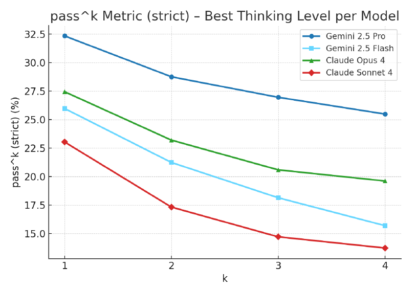

# TaxCalcBench: Evaluating Frontier Models on the Tax Calculation Task (Column Tax; can AI file your taxes?)

**Authors:** Michael R. Bock, Kara Molisee, Zachary Ozer, Sumit Shah (Column Tax)
**Published:** 2025-07 · arXiv preprint, under review · [Source](https://arxiv.org/abs/2507.16126) · code and data at [github.com/column-tax/tax-calc-bench](https://github.com/column-tax/tax-calc-bench)
**Lens:** `eval-designer` · **Digested:** 2026-10-01

## TLDR

Column Tax asked one question, "can AI file your taxes?", and answered it with 51 synthetic, federal-only Tax Year 2024 returns: each case is a JSON bundle of everything a taxpayer would have entered (W-2s, 1099s, dependents, filing status) plus the correct Form 1040 in IRS MeF XML, hand-built by the company's tax analysts and verified by its deterministic tax engine, so the baseline is 100% and no human panel is needed. Four models with 2025 knowledge cutoffs (Gemini 2.5 Pro, Gemini 2.5 Flash, Claude Opus 4, Claude Sonnet 4) were prompted to write out the return as plain text lines, 4 runs at each of 5 thinking budgets (20 model-budget cells of 204 attempts each in the detailed results table), and graded line by line against the XML on the Form 1040 lines that most affect tax owed. Best strict score: Gemini 2.5 Pro got 32.35% of returns exactly right; Claude Opus 4 27.45%, Gemini 2.5 Flash 25.98%, Claude Sonnet 4 23.04%. Allowing plus or minus $5 per line lifts those to 51.96%, 42.65%, 41.18% and 38.24%, and per-line accuracy sits at 77% to 81%, which means a failed return is often a single wrong line that cascades into the rest. The 15 to 20 point strict-to-lenient gap comes mostly from one mechanism: models computing Line 16 tax with bracket percentages when the IRS requires a lookup table below $100,000 (Opus 4 wrote $2,789, the table says $2,792). The rest are calculation and eligibility errors: Gemini 2.5 Flash at max thinking invented Form 8962 line numbers and used a $15,060 poverty level instead of $14,580; Claude Sonnet 4 netted an early-withdrawal penalty against interest income instead of putting it on Schedule 1; the Child Tax Credit and Earned Income Tax Credit "reliably fail". Thinking budget cut both ways: Gemini 2.5 Pro scored 32.35% at the paper's "lobotomized" level (no budget, or the lowest the model allows) and 30.88% at maximum, while Claude Opus 4 went from 7.84% at lobotomized to 27.45% at high. Reliability over 4 runs fell for every model (pass^k for Gemini 2.5 Pro reads about 32% at k=1 and 25% at k=4 on the chart). The repo has moved on since July 2025: by October 2026 the README's TY24 board tops out at 62.75% strict (GPT-5.4 Pro, single run), the only pre-2025-cutoff model tested (GPT-5) gained 10 points from web search but only at high thinking (31.86% to 41.67%), and a Tax Year 2025 edition with PDF inputs and state returns tops out at 66% (GPT-6 Sol with web search, $0.34 and 137 seconds per return) against 28% for the same model without search. The authors' own conclusion: deterministic tax engines stay, and LLMs need scaffolding and orchestration before they can be trusted with a return.

## Key Takeaway

Four out of five lines right is a failing grade: the four models got 77% to 81% of Form 1040 lines right and 23% to 32% of returns right, because a tax return is one chain of arithmetic and a single wrong line breaks every line after it. And the top score came at the lowest thinking setting: Gemini 2.5 Pro posted its best strict result, 32.35%, at the paper's "lobotomized" level (no budget, or the lowest the model allows) and 30.88% at maximum budget, while Claude Opus 4 needed budget to climb from 7.84% to 27.45%. The lever people reach for first, more reasoning tokens, turned out to be a vendor default to sweep rather than a capability dial, and the fix the authors land on is infrastructure (make the model use the lookup table), not a bigger budget.

## Implications

- **When a deterministic system can produce the right answer, make it the baseline and set the bar at 100%**: TaxCalcBench's comparator is Column Tax's own tax engine, so there is no human panel, no rubric and no judge model; a return is right or it is not. For an agent that spends someone's money, every quantity the marketplace's rules determine (fees, shipping, tax, the total charged, whether a listing meets the brief) can be graded the same way: build the oracle in code first, then test the model against it with zero tolerance.
- **Score on exact match, and use the lenient number only to locate mechanisms**: the authors call strict correctness "the only actual metric that matters", and the plus or minus $5 metric added 15 to 20 points. That gap was not noise; it pointed at one failure (bracket percentages instead of the IRS tax table on Line 16, Opus 4 off by $3), which is a scaffolding fix, not a model fix. Publish the strict number; keep the tolerance band as a diagnostic.
- **Report per-step and end-to-end accuracy side by side so the cascade is visible**: 77% to 81% of lines right became 23% to 32% of returns right. If your eval reports only per-action accuracy, a buying agent that gets the price, the fee and the shipping right but the tax wrong will look like a B student while the customer gets the wrong total.
- **Run every case at least 4 times and publish pass^k, not pass@1**: the paper's pass^k chart falls for every model as k goes from 1 to 4 (Gemini 2.5 Pro from about 32% to 25%, Claude Sonnet 4 from about 23% to 14%, read from the chart). The authors say inconsistency "is not acceptable for a task which needs consistently correct results with clear auditability"; the same holds for a purchase, where you get one attempt.
- **Treat thinking budget as a per-vendor setting to sweep, not a knob you assume helps**: Gemini 2.5 Pro did not improve with more budget (32.35% at lobotomized, 28.43% at low, 31.37% at medium and at high, 30.88% at max), Claude Opus 4 went from 7.84% to 27.45% and Claude Sonnet 4 from 10.29% to 23.04% once thinking was on, and the paper notes Claude's API ships with thinking disabled by default. Sweep every model across its budget range and report both the default and the best setting, because the default is what a product team will ship.
- **Write the refusal workaround into the instrument and disclose it**: the paper says the prompt tells the model it is helping test tax calculation software (the repo prompt reads "helping to test expert tax preparation software") and lets it skip the SSN, because at test time models sometimes refused to prepare what looked like a real return. An eval where an agent handles a real person's money will trip the same safeguards; record the framing you used, since it changes what you measured.
- **Expect conditional rules to fail before arithmetic does**: the models "reliably fail" the Child Tax Credit and Earned Income Tax Credit, which turn on eligibility conditions, and a Gemini 2.5 Flash run the paper presents as a prototypical example used the wrong poverty-level figure and invented form line numbers. For a buyer agent the analogs are return policies, seller eligibility, promo conditions and shipping cutoffs; seed cases that hinge on those, not just on sums.
- **Separate what the model knows from what it can look up, and date the result**: the README's later runs show GPT-5 (September 2024 cutoff, tested on 2024 tax law) gaining 10 points from web search at high thinking and nothing at low thinking, and on the TY25 edition GPT-6 Sol jumping from 28% to 66% with search enabled. Any eval over facts that change (prices, fees, tax tables) should run with and without retrieval and say which it reports, and note that the newest leaderboard rows (GPT-5.4, Claude Opus 4.6) are single runs (51 by 1) while the paper's instrument was 51 by 4.

## How to Apply It (method)

**Scenario:** You are building an eval for an agent that buys a specified used item (a titanium gravel frame in a given size and condition, say) on a secondary marketplace with a real person's money, under a budget and a few rules (ship by a date, seller rating floor, no "as-is" listings). Before anyone trusts it with a card, you want the TaxCalcBench version of the problem: strip away discovery and negotiation, hand the agent every input it needs, and ask whether it can produce the correct order record and landed cost every single time against a deterministic oracle.

**Steps:**

1. **Isolate the subtask with a computable answer**: TaxCalcBench splits tax filing into document collection, preparation and calculation, assumes the first two are done perfectly, and tests only calculation. For the buyer, split the job into finding listings, negotiating, and computing the final purchase (which listing satisfies the brief, what the landed cost is, whether it clears the budget, what goes in the order record). Test the third part first; it has one right answer.

2. **Write the oracle as code, then have experts write the cases**: Column Tax took a subset of the tests it uses on its own engine, written by its Tax Software Analyst team and verified by the deterministic engine, with fully synthetic data (no real taxpayer). Encode the marketplace rules you control (fee schedule, shipping table, sales-tax rule, budget check, eligibility filters) as a function from inputs to expected output. Have someone who buys and sells in that market write 50 or so input bundles that cover the variety the real world throws up (multiple candidate listings, a listing that fails one rule, a promo code, a seller in another tax jurisdiction, a bundle with two items), name each case descriptively (`single-listing-promo-code-over-budget`), and generate the expected output from the oracle.

3. **Define a plain-text output format with the lines you will grade, and bootstrap the model with it**: the paper does not ask for the IRS XML (the schemas do not fit in context) but for a line-by-line text form, and the prompt includes the full list of Form 1040 lines with instructions. Adapt the paper's prompt skeleton:

   ```
   You are helping to test expert purchasing software. You are given a buyer's
   brief and the candidate listings and you need to produce the completed
   purchase decision.
   Analyze the input data and prepare a complete purchase record for the brief.

   Follow these requirements:
   1. Complete the Purchase Record with all necessary calculations. You should
      have all of the necessary inputs.
   2. Work through any intermediate checks (eligibility, shipping, tax) but
      only output the Purchase Record in the format below.
   3. Do not output any other introductory text or commentary.
   4. You may skip the payment card field.
   5. Format the output as follows:

   Purchase Record
   ===============
   Line 1: Selected listing ID | [Explanation of selection, if any] | [ID]
   Line 2: Item price | [Explanation of calculations, if any] | [Amount]
   Line 3: Marketplace fee | [Explanation of calculations, if any] | [Amount]
   Line 4: Shipping | [Explanation of calculations, if any] | [Amount]
   Line 5: Sales tax | [Explanation of calculations, if any] | [Amount]
   Line 6: Total charged | [Explanation of calculations, if any] | [Amount]
   Line 7: Budget remaining | [Explanation of calculations, if any] | [Amount]
   Line 8: Rules check (all pass) | [Explanation, if any] | [Yes/No]

   The brief and listings are formatted as JSON ...
   ```

   Keep the "helping to test ... software" framing and the field skip; the paper added both because models otherwise refused what looked like a real return.

4. **Grade each line against the oracle with four metrics**: the repo's evaluator parses only the `[Amount]` column of each graded line and compares it with the expected value, then rolls up:

   ```
   is_correct          = generated == expected
   is_lenient_correct  = abs(generated - expected) <= 5
   strict return       = every graded line is_correct
   lenient return      = every graded line is_lenient_correct
   correct by line     = correct lines / graded lines
   ```

   Grade only the lines that most move the final number (the paper grades the Form 1040 lines "that most impact Tax owed and balance due/refund"), and grade `Total charged` with zero tolerance.

5. **Sweep thinking budgets and repeat every case**: 5 levels (none or minimum; 1,024; 2,048; 4,096; maximum), 4 runs per case per level. Report pass@1 and pass^k, where for n runs with c successes on a case, pass^k is the average over cases of C(c, k) / C(n, k) (tau-bench's definition, which the paper adopts by citation); with n = 4, pass^4 is simply the share of cases that succeeded all four times.

6. **Read the explanation column on every failed line and tag the mechanism**: the paper found two families, "wrong method" (percentage brackets instead of the lookup table, 15 to 20% of cases) and "calculation errors" (wrong constants, invented form lines, items booked to the wrong schedule). Tag each failed line as wrong-table, wrong-constant, wrong-rule or arithmetic, and count by model and budget.

7. **Set the ship rule before you look at the numbers**: the baseline is 100% because the oracle gets 100%. Decide that the number that matters is strict pass^4 on `Total charged` and `Rules check`, and that per-line accuracy is diagnostic only.

8. **Version the eval as the world changes**: Column Tax plans a yearly edition, with state returns, harder situations and the real XML output format; the v2 (TY25) edition already uses PDF inputs, state returns and one run per model with cost and time per return. Re-issue your cases when fees, tax rules or marketplace policy change, and move the output format toward the real order API once models can hold it.

**Expected outcome:** A 50-case bank with a code oracle, a prompt that names every graded line, and a results grid of models by thinking budget by run that reports strict, lenient, by-line and pass^k. You will know which share of purchases the agent gets exactly right every time, which lines break first, and whether the failures are a missing lookup (scaffold it), a wrong constant (retrieve it) or an arithmetic slip (recompute it in code). What this instrument will not tell you is how the agent finds listings or bargains with a seller; those need a different eval, which the paper's authors explicitly leave outside their scope.

## Best Figure



```
Image Candidates:
pass^k chart (p. 12, lower): The only view that shows reliability across repeated runs for all four models at once; every line falls from k=1 to k=4.
Correct Returns (strict) across Models and Thinking Levels, descending (p. 12, upper): All 20 model-by-budget cells as a ranked bar chart, which makes the Gemini 2.5 Pro cluster at the top and the three "lobotomized" bars at the bottom visible in one glance.
Gemini 2.5 Pro vs Gemini 2.5 Flash by Thinking Level with Trend Lines (p. 10): Shows the flat Pro trend against the rising Flash trend, the paper's thinking-budget surprise.

Best Image:
Figure Name: Unnumbered chart: "pass^k Metric (strict), Best Thinking Level per Model"
Figure Page: 12
Slide Caption: Run each of 51 tax returns four times and the share a model gets right every time drops for all four models, from about 32% to 25% for Gemini 2.5 Pro and from about 23% to 14% for Claude Sonnet 4.
Description: A line chart with k (1 to 4) on the x-axis and pass^k on the strict metric (percent of returns correct on all k of k runs) on the y-axis, one line per model at its best thinking level: Gemini 2.5 Pro (lobotomized), Claude Opus 4 (high), Gemini 2.5 Flash (ultrathink) and Claude Sonnet 4 (ultrathink). The k=1 points equal the headline pass@1 scores (32.35%, 27.45%, 25.98%, 23.04%). Read from the chart, the k=4 points are about 25.5%, 19.6%, 15.7% and 13.8%, which with 51 cases corresponds to roughly 13, 10, 8 and 7 returns that came out right on all four runs. The chart is the paper's evidence for its "models are inconsistent" claim, and it is the number an eval designer should carry: a model that gets a return right one time in three gets it right four times in a row about one time in four.
```

## What Experts Overlook

The instrument's most useful part is a column that is never graded. The output format asks for three fields per line, `[Description] | [Explanation of calculations, if any] | [Amount]`, and the evaluator reads only the amount. But the explanation column is what let the authors turn a $3 miss into a named mechanism: Opus 4's Line 16 reads "Tax on $26,000 for HOH: $16,550 × 10% + $9,450 × 12% | 2789", and the expected value is 2792, so you can see at a glance that the model used bracket percentages where the IRS instructions require the tax table for incomes under $100,000. Paired with the deliberate strict-versus-lenient metric split, the ungraded column turns a 15 to 20 point gap into a single, scaffoldable cause, and the same column exposes the Form 8962 line-number swap and the $15,060 versus $14,580 poverty-level error on the Gemini 2.5 Flash run.

**Why it matters:** The paper's conclusion is not that models are 32% good at taxes; it is that models need a forced table lookup and form scaffolding (the authors' words are "methods that could augment the models in order to force them to use the proper Tax Tables" and "additional scaffolding, infrastructure, and augmentation"). That conclusion is only available because the eval captured the model's working without grading it. Most benchmarks either grade the reasoning (with a judge, which adds noise) or discard it (and then can only report a score). TaxCalcBench does neither: it grades the number and keeps the working as free evidence, so the failure analysis costs nothing extra and the strict and lenient metrics stop being two scores and become a difference that points somewhere.

**Example of good use:** In a money-spending eval, require the agent to write its arithmetic for every monetary line (`$1,850 price + 3% fee $55.50 + shipping $28 + tax 8.25% on $1,850 = $152.63 | 2086.13`) and grade only the amount. After a run, diff the strict and lenient failures, and read the explanation column on the lenient-pass, strict-fail lines first. If 15% of totals are a few dollars off and the explanations show tax computed on price alone instead of price plus shipping, that is one rule to put in the prompt or in code, not a reason to swap models.

**Example of misapplication:** A team reads the lenient number as the headline ("models get 52% of returns within $5") and ships on it, or feeds the explanation column to an LLM judge and starts scoring "reasoning quality". The first ships returns that the IRS would reject; the paper is explicit that strict is the only metric that counts because the IRS expects exactly computed returns. The second converts free diagnostic evidence into a second noisy metric, and the team ends up arguing about judge calibration instead of fixing the lookup table.

## Extracted Prompts

**Prompt explanation:** Output format fragment printed in the paper (Section 4.1), the simplified text-only form the model must produce instead of MeF XML.

```
Form [NUMBER]: [NAME]
==================
Line 1: [Description] | [Explanation of calculations, if any] | [Amount]
Line 2: [Description] | [Explanation of calculations, if any] | [Amount]
...
```

**Prompt explanation:** The full TY24 generation prompt. The paper describes its features (test-software framing, SSN skip, full line list, input-format explanation) but does not print it; this text is from `tax_calc_bench/ty24_prompt.py` in the public repo at commit state of 2026-10-01, with `{tax_year}`, `{tool_use_hint}` and `{input_data}` as template slots. The line list is abbreviated here after Line 16; the repo prompt enumerates every Form 1040 line through Line 38 plus the signature block.

````
You are helping to test expert tax preparation software. You are given a taxpayer's data and you need to calculate their self-prepared tax return.
Analyze the input data and prepare and calculate a complete tax return including Form 1040 and all necessary schedules and forms for the {tax_year} tax year.
{tool_use_hint}

Follow these requirements:
1. Complete Form 1040 with all necessary calculations. You should have all of the necessary taxpayer inputs to be able to calculate the return.
2. Complete any required schedules (like Schedule B for interest income) but don't output them. You just need to use them to calculate the 1040.
3. Only output the 1040 and all attached forms and schedules in the format below.
4. Do not output any other introductory text or commentary.
5. You may skip the SSN field.
6. Format the output as follows:

For the 1040 Form:
```
Form [NUMBER]: [NAME]
==================
Line 1: [Description] | [Explanation of calculations, if any] | [Amount]
Line 2: [Description] | [Explanation of calculations, if any] | [Amount]
...
```

Be sure to include all of the following lines from the 1040 Form in this format. If a value does not exist,
simply leave it blank.
```
Form 1040: U.S. Individual Income Tax Return
===========================================
Filing Status: [Filing Status]
Your first name and middle initial: [First Name] [Middle Initial]
Last name: [Last Name]
Your Social Security Number: *** (skipped for privacy)
...
Line 1a: Total amount from Form(s) W-2, box 1 | [Explanation of calculations, if any] | [Amount]
Line 1b: Household employee wages not reported on Form(s) W-2 | [Explanation of calculations, if any] | [Amount]
...
Line 15: Subtract line 14 from line 11. If zero or less, enter -0-. This is your taxable income | [Explanation of calculations, if any] | [Amount]
Line 16: Tax | [Explanation of calculations, if any] | [Amount]
...
Line 37: Subtract line 33 from line 24. This is the amount you owe | [Explanation of calculations, if any] | [Amount]
Line 38: Estimated tax penalty | [Explanation of calculations, if any] | [Amount]
...
```

The taxpayer data is formatted as JSON. It should have all of the necessary inputs to be able to calculate the tax return.
The taxpayer JSON includes each data point that a user entered into your tax preparation software, organized into sections
and sometimes comes along with the label that was shown to the user. The JSON is formatted as follows:

```
{{
  "form_name": {{
    "field_name": {{
      "label": "Label shown to user",
      "value": "Value entered by user"
    }}
  }}
}}
```

Here is the taxpayer data:

{input_data}

Now please compute the tax return and output as described above. Do not output any other text or commentary:
````

## Citations

5 references extracted (full structured list in frontmatter):

- Transhuman Videos (n.d.). GPT-4 does your taxes?? "TaxGPT" from OpenAI with Greg Brockman. YouTube
- PS Market Research (n.d.). US tax preparation software market analysis
- Yu, McCluskey, Mukherjee (2020). Tax knowledge graph for a smarter and more personalized TurboTax. arXiv:2009.06103
- Yao, Shinn, Razavi, Narasimhan (2024). tau-bench: A benchmark for tool-agent-user interaction in real-world domains. arXiv:2406.12045 (source of the pass^k metric)
- Chen, Tworek, Jun, Yuan et al. (2021). Evaluating large language models trained on code. arXiv:2107.03374 (source of the pass@k metric)

## Related Digests

- [[ivanov-2026-erp-bench]]: Anchor: Mitigating Artifact Drift in Agent Benchmark Generation (ERP-Bench). Same instrument family: a solver-certified oracle, end-state grading, pass^k beside pass@k.
- [[patwardhan-2025-gdpval-economic-tasks]]: GDPval: Evaluating AI Model Performance on Real-World Economically Valuable Tasks. Expert-written tasks graded by blind pairwise expert comparison against the writer's own deliverable, where TaxCalcBench has a deterministic engine.
- [[pan-2026-business-arena]]: Business Arena: Benchmarking LLM Agents in a Realistic Marketplace. A deterministic, human-designed policy beats every model; TaxCalcBench's 100% engine baseline is the same lesson stated as a ceiling.
- [[ahmed-2026-bazaar-pricing]]: Can LLM Agents Price Competitively? (Bazaar). Another eval that sweeps thinking budget per model and finds it is the largest single lever (GPT-5.4 from none to high: 7.3x profit) yet swaps failure modes rather than removing them.

## Reviewer Notes

**Overall severity:** Minor fact tweak

Review method: every number and quoted phrase in the draft was checked against the paper text (pdftotext, layout mode, 15 pages) and the rendered page 10 and page 12 charts. Numbers sourced from the GitHub README (TY24 board as of 2026-10-01, GPT-5 web-search rows, the TY25 edition, cost and time per return) and the verbatim prompt from `ty24_prompt.py` are outside the paper and are labelled as repo-sourced wherever they appear. No fabricated metrics, tools or experiments were found. Eight claims were overextended or mislabelled; all were corrected in place as listed below.

**Flagged claims (fixed in place):**

- **Claim:** "Gemini 2.5 Pro scored 32.35% with thinking off" (TLDR, Key Takeaway, Implications)
  **Label:** Partially accurate
  **Justification:** The paper defines the lobotomized level as "either no thinking token budget or the lowest thinking budget allowed by the model" and notes that Gemini's API applies a dynamic budget by default; it never states that Gemini 2.5 Pro ran with thinking disabled.
  **Fix:** Reworded in all three places to the paper's "lobotomized" level with its definition.

- **Claim:** "most failed returns have one or two wrong lines that cascade"
  **Label:** Partially accurate
  **Justification:** Section 4.2 says "there are often single mistakes ... that cascade throughout the rest of the lines"; "one or two" was the digest's addition.
  **Fix:** Changed to "often a single wrong line".

- **Claim:** "4,080 attempted returns"
  **Label:** Partially accurate
  **Justification:** Derived by the digest (20 table rows × 51 cases × 4 runs); the paper never states a total.
  **Fix:** Restated as "20 model-budget cells of 204 attempts each in the detailed results table".

- **Claim:** "Gemini 2.5 Flash's worst run used the wrong poverty-level figure"
  **Label:** Inaccurate
  **Justification:** Section 4.3 introduces the single-w2-healthcare-marketplace-1095a run as "one prototypical example", not as the worst run.
  **Fix:** Reworded to "a Gemini 2.5 Flash run the paper presents as a prototypical example".

- **Claim:** "on the TY25 edition the same model jumping from 28% to 66%"
  **Label:** Inaccurate
  **Justification:** The sentence was about GPT-5; the 28% to 66% pair on the README's TY25 board belongs to GPT-6 Sol without and with web search.
  **Fix:** Named GPT-6 Sol.

- **Claim:** "the prompt tells the model it is 'helping to test expert tax preparation software'"
  **Label:** Partially accurate
  **Justification:** That wording is from the repo's `ty24_prompt.py`; the paper describes the feature as "Instructions that the model is helping test tax calculation software".
  **Fix:** Attributed each wording to its source.

- **Claim:** "Gemini 2.5 Pro was flat or slightly worse with more budget (32.35% at none, 28.43% at low, 30.88% at max)"
  **Label:** Partially accurate
  **Justification:** The detailed table is not monotonic: medium and high are both 31.37%, above low (28.43%) and ultrathink (30.88%).
  **Fix:** Listed all five values and changed the verb to "did not improve".

- **Claim:** "The paper's conclusion ... is 'models need a forced table lookup and form scaffolding'"
  **Label:** Partially accurate
  **Justification:** A paraphrase presented in quotation marks. The paper's wording is "methods that could augment the models in order to force them to use the proper Tax Tables" and "additional scaffolding, infrastructure, and augmentation".
  **Fix:** Quotation marks removed; the paper's own phrases added.

**Noted but left as is:** The pass^k values at k = 2, 3 and 4 (about 28.8, 27.0, 25.5 for Gemini 2.5 Pro; 23.2, 20.6, 19.6 for Claude Opus 4; 21.3, 18.1, 15.7 for Gemini 2.5 Flash; 17.3, 14.7, 13.8 for Claude Sonnet 4) and the derived "roughly 13, 10, 8 and 7 returns right on all four runs" are read from the rendered chart on page 12; the paper prints no pass^k table. The k = 1 points match the printed strict scores exactly, which supports the reading. The README's TY25 rows are one run per model-budget-tool combination and several newer TY24 rows are 51×1, so none of those numbers are comparable to the paper's 51×4 instrument; the digest says so where it cites them.
