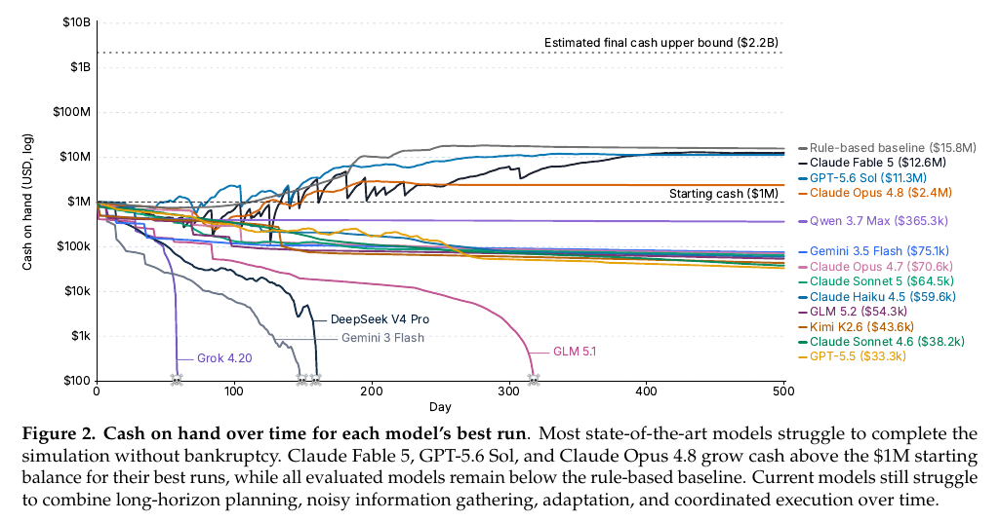

# CEO-Bench: Can Agents Play the Long Game?

**Authors:** Haozhe Chen, Karthik Narasimhan, Zhuang Liu (Princeton University, Z-Lab)
**Published:** 2026-06 (arXiv v2 2026-07-22) · [Source](https://arxiv.org/abs/2606.18543) · [Project page and live leaderboard](https://ceobench.com/)
**Lens:** `eval-designer` · **Digested:** 2026-10-01

> **Leaderboard note.** The paper's tables are from June 2026. The live leaderboard at ceobench.com has moved since: a July 8, 2026 simulator change (how a quota shortfall hits customer satisfaction) made the task slightly harder, every plot was rerun, and new models were added. As of this digest the best published run is **Kimi K3 at $22.15M, completing 2 of 3 runs**, which is above the $15.8M rule-based baseline. So the paper's headline that "all evaluated models remain below the rule-based baseline" no longer holds on the live board. The site says the paper itself has not yet been updated. Numbers below are the paper's unless marked "site".

## TLDR

Three Princeton researchers built a 500-day simulation in which a language-model agent runs a fictional subscription-software startup (NovaMind) from $1M cash and zero customers, scored on cash on hand at the end, with cash below zero ending the run as bankruptcy. The agent acts one simulated week at a time, with unlimited turns per week, through a Python package of 34 tools and a 19-table SQL database; 26 customer groups with hidden willingness-to-pay and quality thresholds, an adaptive competitor, a PMI-style macro cycle, reputation spillovers and delayed billing make the world partially observable and non-stationary. Sixteen models were each run 3 times on random seed 42 at maximum reasoning effort inside a minimal terminal harness that wipes the action history every simulated week and keeps only the system prompt and an agent-editable memory file. Only 3 models finished their best run above the $1M start: Claude Fable 5 ($12.63M, 1 of 3 runs bankrupt), GPT-5.6 Sol ($11.31M, 2 of 3 bankrupt) and Claude Opus 4.8 ($2.40M, 1 of 3 bankrupt); four models (GLM 5.1, DeepSeek V4 Pro, Gemini 3 Flash, Grok 4.20) went bankrupt in all 3 runs. A rule-based script with no language-model calls, picked by a 24-configuration grid search, ended at $15.76M, above every model, and the authors' loose estimate of the attainable ceiling is about $2.2B. Behavioural probes separate the top two Claude models from the weak tail: they put roughly 27 to 40% of ad dollars on the true best channel versus a 20% random-guess level (weak models 0 to 12%), their mandatory 4-week cash forecasts erred by about 11 to 17% versus 93 to 564%, their memos used "if" about 5 to 14 times a week versus 1 to 3, and Fable 5 put 88% of development dollars into group-targeted work (Opus 4.8 51%, Qwen 3.7 Max 25%, GLM 5.1 19%, Grok 4.20 11%). Ablations: weakening or removing the competitor makes the task much easier; cutting the horizon to 50 days still leaves every tested model below starting cash; swapping the minimal harness for Claude Code or Codex cut turns per simulated day roughly tenfold (0.11 to 0.15 versus 1.41 to 3.71) and worsened results. The useful takeaway for anyone building a money-at-stake agent eval: a fixed heuristic beating every frontier model means the binding constraint is sustained coherence across many coupled decisions, not tool competence, and the instrument that exposes this is a cheap scripted baseline plus an estimated ceiling bracketing the model scores.

## Key Takeaway

A hand-written script that never calls a language model, fixes its prices on day one and sells to a single customer segment finished with $15.76M, more than every one of the 16 frontier models in the paper, because a 500-day money game punishes incoherence far more than it rewards cleverness. The models that lost did not lack skill at any single step: they changed too many levers at once, treated booked billings as if they were cash, and cut the quality their renewals depended on (site analysis of the two GPT-5.5 runs that reached $6.58M and $6.69M mid-run and then went bankrupt). The second surprise is that two of the three "winning" best runs ended with zero customers (GPT-5.6 Sol wound its base to zero by day 420, Opus 4.8 by around day 295), so the terminal-cash metric paid out for an orderly liquidation as much as for building a business.

## Implications

- **Put a dumb baseline on the leaderboard before any model**: The paper's headline exists only because the authors grid-searched 24 fixed-rule configurations and reported the best ($15.76M, Appendix B). Without it, $12.6M looks like a win. For an agent that buys on a person's behalf, write the equivalent fixed buyer (bid at a set fraction of the trailing median, never exceed budget, no reaction to seller chat) and report every model relative to it, not to $0.
- **Score on one hard, auditable terminal state and make ruin absorbing**: Cash on hand at day 500, with cash below zero ending the run. No judge, no rubric. The direct analogue for a secondary-market buyer is realised cost against a reference price with a hard stop at budget breach; everything else (satisfaction, process) is a secondary diagnostic.
- **Report the ruin rate and every run, never just the best**: Table 3 prints bankruptcies out of 3, mean survival days with standard deviation, and best-run cash side by side; Figure 3 plots all three runs. GPT-5.6 Sol's $11.3M best run sits next to 2 of 3 bankruptcies and 294 ± 146 mean survival days. A person handing over money cares about the worst run; publish the selection rule for "best" and the fraction of runs that finish without ruin.
- **Three runs on a single seed is thin, and the ranking has already reordered**: Three runs, all on seed 42, means the spread measures agent variance inside one world draw, not robustness to different worlds. The live board has since added Kimi K3 at $22.15M, above the baseline. Treat any ranking from this instrument as provisional and budget for more runs and more seeds in your own.
- **Keep the money loop mechanistic; do not let an LLM judge decide outcomes**: Customers subscribe via a price-quality participation rule (Mussa and Rosen 1978), not an LLM, and the authors say this is deliberate to avoid Vending-Bench's failure mode where an LLM-simulated supplier rewards verbal promises. The one place an LLM-like judgement enters is the reaction score to the agent's own social posts (Appendix A.5). For a live-market agent the lesson is to use real fills or historical order books as the arbiter, never a simulated counterparty that can be talked into a discount.
- **Instrument behaviour, not only the score**: Three cheap probes did most of the explanatory work: share of ad spend on the true best channel versus a 20% random guess, a mandatory weekly 4-week cash forecast scored against realised cash, and a count of "if" in the agent's memos. Borrow the forecast: make the agent submit its own expected spend and outcome each period and score the error as a leading indicator of ruin.
- **The harness is part of the instrument and must be reported**: The same models under Claude Code or Codex took about a tenth as many turns per simulated day and finished worse (Section 4.3); in early runs the open-source harnesses OpenCode and Pi did not manage context reliably enough for 500-day episodes. Fix one harness, publish it, and list harness as a variable in every result.
- **Adversarial pressure, not horizon, is the difficulty knob that matters**: Removing the competitor made the task far easier (Figure 14a), while cutting the horizon from 500 to 50 days did not lift a single model above starting cash (Figure 14b). For a market agent, the "competitor" is other bidders; include adaptive ones from day one or you are testing a different, easier question.

## How to Apply It (method)

**Scenario:** You are building an eval in which an agent spends a real person's money on their behalf in a live secondary market (say, buying a specific used bike frame or a concert ticket within a budget over several weeks). You want to know whether the agent can hold a coherent plan across many small decisions with delayed, noisy feedback, and you want numbers an enterprise operator will trust. CEO-Bench's design maps onto this almost one for one.

**Steps:**

1. **Write the question as a steering question, then pick one canonical instance**: CEO-Bench's question is "can agents sustain adaptive progress toward a distant goal under uncertainty?" and its instance is "run a subscription startup for 500 days". Yours might be "can an agent buy well on someone's behalf over a month?" with the instance "acquire item X under budget B within 30 days". The paper's four sub-skills (long horizon, noisy information gathering, adaptation, coordination of many levers) are your checklist for what the instance must contain.

2. **Define one run, the horizon, the start state and the absorbing failure**: One run = one full 30-day episode from budget B and zero holdings. Ruin = budget breached or item bought above a hard ceiling; the run ends immediately. CEO-Bench uses $1M start, 500 days, cash below zero ends the run. State these three things in one sentence on the leaderboard.

3. **Make the primary metric a single terminal number with no judge**: Cash on hand at the end, nothing else. For you: realised cost relative to a reference price (or budget left if the item was acquired, zero if not). Secondary metrics (satisfaction, process quality) are diagnostics, not the score.

4. **Expose the world through a programmable interface, not a chat**: The agent gets a Python package (`novamind_api`) with 34 tools, a 19-table SQL database, and a `next_week()` call that advances time. The agent writes and runs scripts rather than issuing one tool call at a time, so it can build its own forecasting and monitoring code (Figure 8). Give your agent a small API: `list_listings()`, `message_seller()`, `bid()`, `advance_day()`, plus a queryable log table.

5. **Hide the state a real operator cannot see, and delay the feedback**: CEO-Bench hides true satisfaction, willingness to pay, churn propensity, competitor schedules and macro parameters; the agent sees dashboards, tables, social posts and delayed period-average macro data. R&D completes on a stochastic delay, revenue arrives on billing cycles. Your analogue: seller reservation prices are hidden, counter-offers arrive after a delay, other bidders act between the agent's turns.

6. **Keep the world mechanistic and seed it**: Outcomes come from explicit rules (participation curve, Poisson leads, log diminishing returns on spend), with independent random number generators per component so the same seed gives the same world regardless of the agent's actions elsewhere. If you use a live market you cannot seed it; use replayed historical sessions as the seeded condition and live runs as the unseeded one, and report both.

7. **Use a minimal harness with a weekly context reset and an agent-owned memory file**: Each simulated week, the harness clears the action history and keeps only the system prompt and a memory file the agent edits. Everything the agent "remembers" across 70 weeks is what it wrote down. Do the same per day for your buyer; the memos (Figure 7) and the forecasting code (Figure 8) become your richest qualitative evidence.

8. **Require a forecast of its own outcome every period**: CEO-Bench asks for a 4-week cash forecast each week and scores it against realised cash (Figure 12b). Suggested wording, mine not the paper's:

   ```
   Before you advance the simulation, write to forecast.json a single number:
   your expected budget remaining 7 days from now. This forecast is scored
   against the realised value and is part of your evaluation.
   ```

9. **Build the rule-based baseline and grid-search it**: The paper's script fixes prices, quotas and tiers, targets one segment, spends fixed dollars on development and ads, sets ops spend to max(100, 0.05 x subscribers) per day, moves capacity at most one tier a week toward 80% utilisation, and stops discretionary spend below a cash floor. Twenty-four configurations (2 price books x 2 target rules x 3 spend packages x 2 cash floors) were run on the same seed; the best one is the baseline. Write a 5-parameter fixed buyer and sweep it.

10. **Estimate the ceiling**: The authors sum best-case revenue across all 26 groups, subtract every modelled cost, then multiply by a friction factor of 0.49 to get about $2.2B (Appendix D, Table 5). They call it a headroom calibration, not a proof. For you: the price a perfectly informed buyer would have paid in the replayed session.

11. **Run n runs per model, publish the selection rule, report spread and ruin**: Three runs per model, seed 42, maximum reasoning effort. Best run = highest ending cash among non-bankrupt runs, else longest survival. Table 3 columns: bankruptcies/3, best-run cash, max survival, mean survival ± std, turns per week, API cost. Copy the table.

12. **Add three behavioural probes and three ablations**: Probes: share of spend on the true best option versus random, forecast error, frequency of conditional planning in memos. Ablations: adversary strength (competitor u in {0.1, 0.2, 0.3}, stationary only, none), horizon (500 vs 50 days), harness (minimal vs Claude Code vs Codex).

**Expected outcome:** A leaderboard where every model's number sits between a scripted buyer and an estimated best-possible price, with a ruin rate next to it, a forecast-error column that predicts which runs are about to fail, and a trajectory viewer where an operator can read the agent's own memos. You will be able to say "the agent beat the dumb buyer in 2 of 3 runs and breached budget in 1" rather than "the agent scored 73".

## Best Figure



```
Image Candidates:
Figure 2 (p. 2): Log-scale cash-over-time for every model's best run with the $1M start, the $15.8M rule-based baseline and the $2.2B estimated ceiling drawn as reference lines, so the whole result is readable in one glance.
Table 3 (p. 9): The results table with bankruptcies out of 3, best-run cash, mean survival ± std, turns per week and API cost per model, plus the baseline and ceiling rows.
Figure 14 (p. 15): Two-panel ablation showing that removing the competitor lifts the Sonnet 4.6 trajectory far above the default configuration while a 50-day horizon leaves every model below starting cash.

Best Image:
Figure Name: Figure 2: "Cash on hand over time for each model's best run"
Figure Page: 2
Slide Caption: Sixteen frontier models' best 500-day runs on a log cash axis: only three finish above the $1M start, none reaches the $15.8M rule-based script, and the estimated $2.2B ceiling sits two orders of magnitude higher.
Description: Figure 2 plots cash on hand (log scale, $100 to $10B) against simulated day (0 to 500) for the best run of each of 16 models, with three dashed reference lines: starting cash ($1M), the rule-based baseline ($15.8M) and the estimated final-cash upper bound ($2.2B). Skull markers show where runs went bankrupt (Grok 4.20 before day 60; DeepSeek V4 Pro and Gemini 3 Flash around day 150 to 160; GLM 5.1 around day 320). Claude Fable 5 ($12.6M), GPT-5.6 Sol ($11.3M) and Claude Opus 4.8 ($2.4M) climb above the start line and then flatten, which is the visual signature of the harvest-and-coast endgame described in Section 3.3. Nine models' best runs survive to day 500 but finish below the start, between $33K and $365K. The figure makes the paper's two claims at once: the task is far from saturated, and a fixed heuristic sits above every model.
```

## What Experts Overlook

All three runs of every model use the same random seed (42), and the simulator is built so that each component (market research reveals, R&D payoffs, lead draws, competitor shocks) has its own independent random number generator. The authors state this under "Consistent simulation under stochasticity" (Section 2.2): under the same seed, calling the market research tool always reveals the same sequence of new groups regardless of what the agent does elsewhere. The consequence is easy to miss. The spread you see in Table 3 (Opus 4.8 mean survival 378 ± 172 days; GPT-5.6 Sol 294 ± 146) is variance in the agent's own sampling inside one fixed world, not variance across worlds. The same design is what makes the 24-configuration grid search for the rule-based baseline a fair comparison, and what lets Section 3.4 score "share of ad spend on the true best channel" at all: the best channel per group is a fixed table.

**Why it matters:** The benchmark is cleaner than it looks for cross-model comparison (every model faced an identical world and identical research reveals) and weaker than it looks for generalisation (nobody has shown that Fable 5's $12.6M strategy survives a different seed). It also tells you where the leaderboard's fragility comes from: a July 2026 change to one mechanic (quota shortfall and satisfaction) meant every plot was rerun, and the site now shows Kimi K3 above the baseline that no model could beat in the paper. One world, one mechanic tweak, new winner.

**Example of good use:** For a buyer-agent eval, keep the seeded design for the comparison condition: replay the same recorded market session (same listings, same seller replies, same rival bids at the same timestamps) to every model, three runs each, so differences between models are differences in the agent. Then add a second, unseeded condition on a fresh live session and report both columns. The seeded column ranks models; the unseeded column tells the person whose money it is whether the ranking holds in a world that did not sit still.

**Example of misapplication:** Reading "1 of 3 bankrupt" as a 33% ruin probability in the wild. It is the ruin rate of one model in one world draw under one harness. If an operator sizes the budget they hand to the agent from that number, they have priced agent variance and ignored world variance entirely. The same mistake in CEO-Bench terms would be shipping a strategy tuned on seed 42 and being surprised when a different competitor schedule bankrupts it.

## Extracted Prompts

No applicable prompts found in this paper.

_The paper describes the harness (system prompt plus an agent-editable memory file, context cleared each simulated week, a weekly request for a 4-week cash forecast) but does not reproduce any prompt text. The memos in Figures 7 and 13 and the code in Figure 8 are agent outputs, not prompts._

## Citations

51 references extracted (full structured list in frontmatter). The ones that matter for an eval designer:

- Backlund and Petersson (2025a, arXiv 2502.15840): Vending-Bench, the closest predecessor; CEO-Bench's mechanistic-rules principle is an explicit response to its LLM-simulated supplier.
- Backlund and Petersson (2025b): Vending-Bench 2; Appendix C compares the Claude Fable 5 curves (about $5.7K from $500 over five 365-day runs versus $12.6M from $1M here).
- Penrose AI (2025): AccountingBench, the other cited long-horizon business eval (monthly close on real software-company data).
- He et al. (2026a, arXiv 2604.01212): YC-Bench, long-term planning and consistent execution.
- Patwardhan et al. (2025, arXiv 2510.04374): GDPval, cited as economically valuable but one-shot.
- Luo et al. (2025, arXiv 2509.21766): UltraHorizon, ultra long-horizon agent scenarios.
- Xu et al. (2025): TheAgentCompany, consequential real-world tasks.
- Yao et al. (2025): tau-bench, the short-horizon tool-agent-user baseline the paper contrasts itself with.
- Mussa and Rosen (1978): the participation rule that decides whether a simulated customer subscribes.
- Oliver (1980) and Kahneman and Tversky (1979): expectancy-disconfirmation satisfaction and loss-aversion weighting in the customer model.

## Related Digests

- [[fan-2026-ecommerce-bench]]: E-Commerce Bench: Evaluating LLM Agents on Long-Horizon Autonomous Business Operation (BM25 top hit, 0.98: the same "run a business for a long horizon, score on money" instrument in a different vertical)
- [[backlund-2025-vending-bench]]: Vending-Bench: A Benchmark for Long-Term Coherence of Autonomous Agents (cited: CEO-Bench's mechanistic-rules principle is a direct response to its LLM-simulated supplier, and Appendix C compares the Claude Fable 5 curves)
- [[patwardhan-2025-gdpval-economic-tasks]]: GDPval: Evaluating AI Model Performance on Real-World Economically Valuable Tasks (cited as the one-shot-deliverable contrast to a persistent process)
- [[han-2026-enterprise-arena-cfo]]: Can LLM Agents Be CFOs? Benchmarking Long-Horizon Resource Allocation in an Uncertain Enterprise Environment (same question, cash allocation under uncertainty, from the CFO seat rather than the CEO seat)
- [[pan-2026-business-arena]]: Business Arena: Benchmarking LLM Agents in a Realistic Marketplace (same family of simulated-marketplace evals; useful for comparing baseline and ceiling conventions)

## Reviewer Notes

**Overall severity:** Minor fact tweak

**Flagged claims:**

- **Claim:** "they put roughly 27 to 40% of ad dollars on the true best channel versus a 20% random-guess level (weak models 0 to 12%)" and "their memos used 'if' about 5 to 14 times a week versus 1 to 3"
  **Label:** Partially accurate
  **Justification:** The paper's text (Section 3.4) states only that Opus 4.8 and Fable 5 sit above the 20% random-guess level and the three weak models below it, and that the top two use "if" more often. The specific percentages and counts are read off the bar labels of Figure 12 in the text layer and the per-model assignment within each group could be swapped; the four-week forecast errors (11 to 17% versus 93 to 564%) are read the same way.
  **Fix:** Treat the ranges as figure readings, not quoted values. The qualitative ordering is the paper's; the exact per-model numbers are approximate.

- **Claim:** "The one place an LLM-like judgement enters is the reaction score to the agent's own social posts (Appendix A.5)."
  **Label:** Partially accurate
  **Justification:** Appendix A.5 says agent-authored posts are "judged per discovered group" with a reaction score in [-1, 1], and Section 2.2 says "almost all" outcomes are mechanistic, but the paper never states what performs the judging.
  **Fix:** Read "LLM-like" as an inference from "judged"; the paper does not name the judge.

- **Claim:** "GPT-5.6 Sol wound its base to zero by day 420, Opus 4.8 by around day 295" and "the two GPT-5.5 runs that reached $6.58M and $6.69M mid-run"
  **Label:** Partially accurate
  **Justification:** The paper says GPT-5.6 Sol reaches zero customers by day 420 and Opus 4.8 drops to zero "mid-simulation"; the day-295 figure, the Opus 4.8 peak near 271,000 customers, the $6.69M figure for the second GPT-5.5 run and the "MRR treated as cash" diagnosis come from the ceobench.com project page, which has been re-run after the July 2026 simulator change. The paper itself gives $6.58M for GPT-5.5's mid-run peak.
  **Fix:** Keep, but read the site-sourced numbers as post-update values that may differ slightly from the paper's tables (e.g. the site lists Fable 5's best run at $12.67M versus $12.63M in the paper).

- **Claim:** "swapping the minimal harness for Claude Code or Codex cut turns per simulated day roughly tenfold (0.11 to 0.15 versus 1.41 to 3.71)"
  **Label:** Partially accurate
  **Justification:** Section 4.3 states only that agents take "significantly fewer turns per simulated day" under Claude Code and Codex with inferior performance. The four bar values are read from Figure 15's text layer; the pairing (0.11 = Fable 5 + Claude Code, 1.41 = Fable 5 + minimal harness, 0.15 = GPT-5.6 Sol + Codex, 3.71 = GPT-5.6 Sol + minimal harness) is inferred from the per-week turn counts in Table 3 (9.86/7 = 1.41, 25.96/7 = 3.71).
  **Fix:** None required; the pairing is consistent with Table 3, but cite it as a figure reading.

- **Claim:** "(Princeton University, Z-Lab)"
  **Label:** Partially accurate
  **Justification:** The paper and site list only "Princeton University"; the Z-Lab attribution comes from the orchestrator's entry name, not the source.
  **Fix:** Keep as provenance note only.

All other claims (start state, 500 days, 34 tools, 19 tables, 26 groups, 16 models, 3 runs on seed 42, Table 3 figures, $15.76M baseline from 24 configurations, $2.2B ceiling with friction factor 0.49, 88/51/25/19/11% targeted-development split, weekly context reset harness, competitor ablation settings, 50-day ablation, Vending-Bench 2 comparison, limitations) were checked against the paper text and are accurate.
