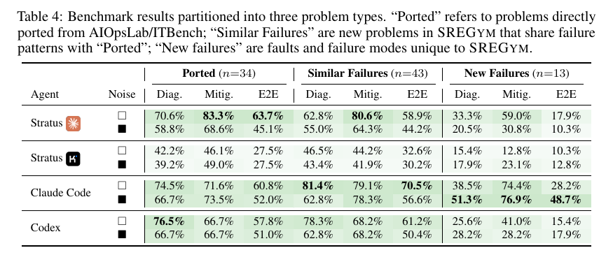

# SREGym: A Live Benchmark for AI SRE Agents with High-Fidelity Failure Scenarios

**Authors:** Jackson Clark, Yiming Su, Saad Mohammad Rafid Pial, Yifang Tian, Lily Gniedziejko, Hans-Arno Jacobsen, Yinfang Chen, Tianyin Xu (University of Illinois Urbana-Champaign; Tian and Jacobsen at the University of Toronto; Clark and Su marked equal contribution)
**Published:** 2026-05 (arXiv 2605.07161; this digest reads v3, dated 30 July 2026) · [Source](https://arxiv.org/abs/2605.07161) · [Code](https://github.com/SREGym/SREGym)
**Lens:** `eval-designer` · **Digested:** 2026-10-01

> **Source note.** Primary source is the arXiv paper, 26 pages including appendices A to I. Stratus, one of the three evaluated agents, is the authors' own SRE agent (Chen, Pan, Clark, Su and Xu, NeurIPS 2025), so the specialist-versus-coding-agent comparison is the authors evaluating their own system alongside two commercial products. No leaderboard numbers beyond the paper were consulted.

## TLDR

SREGym is a live Kubernetes benchmark in which an agent must first name the root cause of an injected production failure and then actually fix it, built to answer whether agentic site reliability engineering (SRE) is ready for production. The instrument: 90 curated problems composed from 47 fault primitives applied to 139 deployable services across 5 supported applications (the catalog names DeathStarBench's Social Network and Hotel Reservation, Train Ticket at 40 microservices, the OpenTelemetry Astronomy Shop, and two in-house apps, a satellite orbit simulator and a flight booking service), 3,623 viable fault-target pairs of which the 90 exercise 2.5%; faults at the hardware, OS kernel, Kubernetes operator and application layers (eBPF syscall failures, dm-dust disk sector errors, misconfigurations, buggy operators) rather than chaos-tool symptoms; framework-scheduled ambient noise (two transient disturbances every five minutes, each lasting two minutes); and three compound failure modes (metastable, concurrent, correlated). Agents reach the cluster through MCP servers for Prometheus, Loki, Jaeger and kubectl, make two submissions (a natural-language diagnosis, then a done-mitigating signal), and are scored by a 9-question, 3-dimension LLM checklist judge (Claude Sonnet-4.6, pass threshold 7/9, Cohen's kappa 0.90 against a domain expert on a stratified sample of 100 diagnoses) plus a problem-specific programmatic mitigation oracle that probes live client and cluster state. Four agent-model pairs were run (Stratus with Sonnet-4.6 and with Kimi K2.5, Claude Code with Sonnet-4.6, Codex with GPT-5.4), 3 runs per problem, with and without noise, 1,800-second timeout, timed-out runs counted at the cap in the time means. Diagnosis success ran 38.1% to 72.6% and mitigation 40.4% to 78.5%; Claude Code had the best end-to-end rate (60.7% clean, 53.7% with noise) while using 1.81x the tokens of Stratus on the same model, and Stratus with Sonnet-4.6 had the best mitigation rate (78.5%), which the authors credit to its undo-and-retry loop. Noise cut diagnosis for every pair (2 to 11 points); mitigation moved under 2 points for three pairs but fell 17 points for Stratus with Sonnet-4.6. The 34 problems ported from AIOpsLab and ITBench are close to saturated (Stratus-Sonnet mitigation 83.3%), while the 13 problems whose faults and failure modes are new to SREGym cut end-to-end success from 63.7% to 17.9% (Stratus-Sonnet), 60.8% to 28.2% (Claude Code) and 57.8% to 15.4% (Codex); on the latent sector error problem no run scored above 0.22 and fault characterization scored 0 in every run, and no agent identified both interacting components of a metastable failure. Agents whose diagnosis was wrong still mitigated 22% to 62% of the time. The useful takeaway for an eval builder: score the diagnosis and the fix on the same run and publish the conditional, because a fix-only leaderboard credits agents for restarts they cannot explain.

## Key Takeaway

Agents whose diagnosis was wrong still mitigated the failure 22% to 62% of the time, and the paper's own numbers show how: Stratus with Sonnet-4.6, without noise, averaged 3.82 mitigation attempts and 66.2 reads when its diagnosis was wrong against 1.88 attempts and 17.3 reads when it was right, and the two coding agents' most common write action was kubectl rollout, which restarts a deployment, at 29% to 40% of their writes. The authors name the two routes: pattern-match a known symptom to a fix that works without understanding it, or keep forming hypotheses until the failure stops persisting. A benchmark that scored only the fix would have paid out on all of it; SREGym's end-to-end number, which requires a correct diagnosis and a successful mitigation on the same run, sits 10 to 24 points below the mitigation number for every one of the eight agent-model-noise cells in Table 3.

## Implications

- **Score the fix and the explanation on the same run, then publish the conditional**: SREGym reports P(mitigated | diagnosed) at 0.68 to 0.89 and P(mitigated | not diagnosed) at 0.22 to 0.62, and the authors' trace analysis shows the second number is pattern-matched fixes and retries, not understanding. For an agent spending a person's money, report P(target hit | market read correct) and P(target hit | market read wrong) separately; the second is your measure of luck.
- **Expect your ported or familiar problems to be nearly saturated, and say which slice the headline comes from**: on the 34 problems ported from AIOpsLab and ITBench, Stratus-Sonnet mitigates 83.3% and the three Sonnet or GPT-5.4 configurations clear 57% end-to-end (Stratus with Kimi K2.5 is at 27.5%); on the 13 problems unique to SREGym, end-to-end falls to 10.3% to 28.2% without noise. The gap the paper highlights lives in those 13 problems. Build the eval so the hard slice is visible in the table, not averaged into the total.
- **Inject faults, not symptoms, and hide the injection plane**: the paper rejects chaos-engineering tools because the only valid "mitigation" of a chaos-injected symptom is stopping the tool, and reports that MicroRemed sources all its faults from Chaos Mesh, Cloud-OpsBench uses Chaosblade, and 6 of ITBench's 36 SRE scenarios wrap a Chaos Mesh schedule. It also cites the Stratus paper's finding that 8 of 18 ITBench mitigation problems (44%) are solved by a generic pod-restart loop because the injector loses the restarted pod and the alert clears. SREGym puts its injectors behind a proxy the agent cannot see and scores mitigation from live state, not from alert suppression. For a money agent: the agent must never be able to reach the simulator's controls, and the score must come from the counterparty's records.
- **Schedule distractors separately from the fault and measure what they do to diagnosis versus action**: noise (two transient events every five minutes, each two minutes long) cut diagnosis for all four pairs by 2 to 11 points but left mitigation within 2 points for three of them, because agents self-correct during mitigation. Trajectories show every agent treating the first plausible anomaly as the root cause; in several runs the agent found evidence of the real fault and discarded it as irrelevant to the noise it was chasing. Price blips, dead listings and plausible-but-irrelevant offers are the market equivalent.
- **Validate the LLM judge against a human label set and publish the full agreement table, not one kappa**: the default judge (Sonnet-4.6) reached kappa 0.90 with a domain expert on 100 stratified diagnoses, but the two alternate judges agreed with each other at 0.94 while agreeing with the human at only 0.70 (GPT-5.4) and 0.76 (Kimi K2.5). The authors read the convergence as proof that the checklist, not the model, drives the verdict; the same table also says two models can agree on a wrong answer. Note too that Sonnet-4.6 judges two agents that run on Sonnet-4.6, and the paper does not test for same-family preference.
- **Set the pass threshold so no dimension can be skipped, and report dimensions separately**: 9 yes/no questions in 3 equally weighted dimensions with a 7/9 threshold means a diagnosis with a perfect localization and scope but zero characterization fails, and the per-dimension readout is what exposed the hardware case (characterization scored 0 in every run) and the Codex metastable run that was "correct on localization but wrong on scope".
- **Put a cost column next to the score and count timeouts at the cap**: Stratus averaged 0.53M tokens per run, Claude Code 1.59M (3.0x) and Codex 1.93M (3.6x), and the paper's Figure 6 shows the extra tokens did not buy end-to-end success (Stratus-Sonnet sits within 6 points of Claude Code on the clean condition at 55% of the tokens). Time-to-diagnose and time-to-mitigate count timed-out runs at the 1,800-second cap so failures are in the mean rather than dropped.
- **Keep the agent interface to the tools plus one submit() call so specialists and generalists run on identical problems**: the headline that a general coding agent beats the purpose-built SRE agent on end-to-end (60.7% against 54.8%) while the specialist wins on mitigation (78.5% against 75.6%) only exists because the benchmark did not require a ReAct loop or fixed function signatures, which AIOpsLab does. For a money eval, expose the market through MCP tools and require nothing of the agent but a final submission.
- **Treat 3 runs per problem as descriptive**: no confidence intervals, no pass^k, and the 13-problem new-failure slice is 39 runs per cell. In that slice Claude Code's end-to-end rate was higher with noise (48.7%) than without (28.2%), a 20-point swing on about 8 runs (11 against 19 of 39, my arithmetic from 13 problems x 3 runs) that the paper does not discuss. Decide in advance how many runs it takes to call a difference.

## How to Apply It (method)

**Scenario:** You are building an eval in which an agent is given a real budget and a mandate to buy and resell items on a live secondary market on a person's behalf, and you want to know not just whether it makes money but whether it understands why it did or did not. SREGym's construction maps onto this directly: a live environment, injected "faults" (market events with a known cause), scheduled distractors, a two-part submission (explain, then act), a checklist judge for the explanation, and a state-based oracle for the outcome.

**Steps:**

1. **Define each problem as a four-tuple**: environment E (the live market plus the agent's account), interface I (the tools the agent may call), faults and noises F (the injected events, some marked as distractors), and oracles O = (diagnosis oracle, outcome oracle). SREGym's rule: the agent sees E only through I, and a subset of F is designated noise "that an agent must distinguish from the root cause(s)".

2. **Build fault primitives that have an underlying cause, then compose them over targets**: SREGym has 47 primitives (kill a process, stress hardware, fail a syscall via eBPF, corrupt a disk sector, drop an environment variable, misconfigure a port, ship a buggy operator, increase client load) that apply to 139 targets, giving 3,623 viable pairs. For a market: a counterparty that stops paying, a listing whose photos are stale, a fee change, a shipping-rule change, a price anchor that moves. Reject anything that is only a symptom with no cause the agent could find and fix.

3. **Run a separate noise scheduler**: SREGym injects two randomly chosen transient disturbances every five minutes, each lasting two minutes, from a loop that runs independently of the target fault, so the agent sees distractor and target evidence at the same time. Inject dead listings, brief price spikes and irrelevant messages on their own clock.

4. **Compose at least three compound modes**: a metastable problem (a trigger plus a hidden constraint: SREGym pairs a 50 ms gRPC timeout with 30 retries, 3,000 requests per second and a transient CPU stress to start a retry storm that persists after the stress ends), a concurrent problem (two independent faults, one user-visible and one not, to test prioritisation), and a correlated problem (several components failing from one shared cause). The runtime must own timing; the paper notes Ansible-based benchmarks could not express this.

5. **Expose the environment as tools plus one submit() call**: SREGym offers MCP servers for metrics (Prometheus), logs (Loki), traces (Jaeger), cluster control (kubectl) and submission, and requires nothing else of the agent's architecture. The agent makes two submissions: a natural-language root cause, which triggers the diagnosis oracle, and a done signal, which triggers the outcome oracle.

6. **Write the diagnosis checklist with 3 dimensions of 3 yes/no questions, weight them equally, and set the threshold at 7/9**: the judge is given the ground-truth description g, the agent's diagnosis d and the checklist, returns a yes/no, evidence and a High/Medium/Low confidence per question, and the per-dimension score is the fraction of yes answers. A money-agent version of SREGym's Table 6:

   ```
   Dimension 1, Event localization (w = 1/3)
     Q1  Does the explanation name the same market event, counterparty, listing
         or account the ground truth identifies as the cause?
     Q2  Does it distinguish the cause from downstream effects (a price drop
         caused by the event, not the event itself)?
     Q3  Does it avoid naming an unaffected listing, counterparty or rule as the cause?
   Dimension 2, Event characterization (w = 1/3)
     Q1  Does it identify the same mechanism the ground truth describes
         (fee change, payment default, stale inventory, rule change)?
     Q2  Does it include the concrete mutated detail (the new fee, the defaulted
         amount, the changed shipping rule)?
     Q3  Does it avoid attributing the outcome to an unrelated mechanism?
   Dimension 3, Scope precision (w = 1/3)
     Q1  Does it avoid blaming positions or counterparties the ground truth
         says were not involved?
     Q2  Does it include every position the ground truth lists as affected?
     Q3  Does it describe the impact consistently with what the ground truth states?
   Pass if the equally weighted mean of the three dimension scores is >= 7/9.
   ```

7. **Validate the judge before trusting it**: draw a stratified sample of 100 agent explanations, have a domain expert label each pass/fail, score them with the default judge and two alternates, and publish the six-row pairwise table (agreement and Cohen's kappa) as SREGym does in Table 2. Report per-dimension scores in results so a reader can see which dimension failed.

8. **Write a problem-specific outcome oracle that reads state the agent did not write**: SREGym's mitigation oracle checks client-side observability (user request success rate) and system-side state (application processes, cluster health) and, for metastable problems, keeps probing to tell a transient recovery from a relapse. For the market: settlement from the marketplace export and bank statement, position limits from the broker, disputes from the counterparty's record.

9. **Hide the injection plane**: SREGym places its injectors behind a proxy the agent has no visibility into, because in AIOpsLab and ITBench the injectors run as identifiable pods in the same cluster the agent inspects. The agent must not be able to find or disable the market simulator.

10. **Run every agent-model pair 3 or more times per problem, with and without noise, under a fixed timeout, and count timeouts at the cap in time means**. Log tool calls by category (SREGym: read-only kubectl 60% to 72% of calls, about 19 to 28 reads before the first write) and tokens per run.

11. **Report four tables**: overall (diagnosis, mitigation, end-to-end, time-to-diagnose, time-to-mitigate, tokens), by problem family (ported, similar, new), the conditional P(outcome | explanation) and P(outcome | wrong explanation), and tool-usage by category. Add a tokens-versus-success scatter like Figure 6.

**Expected outcome:** A problem set whose hard slice is visible, a judge whose agreement with a human you can quote, an outcome score the agent cannot reach, and a conditional table that tells you how much of the money the agent made it can explain.

## Best Figure



```
Image Candidates:
Table 4 (p. 8): Splits the 90 problems into ported (n=34), similar (n=43) and new-to-SREGym (n=13) and shows every agent's end-to-end rate collapsing on the new slice; this is the paper's claim in one grid.
Table 3 (p. 7): The overall leaderboard with diagnosis, mitigation, end-to-end, time-to-diagnose, time-to-mitigate and tokens for all eight agent-model-noise cells.
Table 5 (p. 8): Conditional mitigation probability given diagnosis outcome, the single table that separates fixing from understanding.

Best Image:
Figure Name: Table 4: "Benchmark results partitioned into three problem types"
Figure Page: 8
Slide Caption: On problems ported from older SRE benchmarks the best agents mitigate over 80% of failures; on the 13 failure types SREGym adds, end-to-end success drops to between 10% and 28%.
Description: A 4-agent by 3-family grid with diagnosis, mitigation and end-to-end success for each cell, split by noise condition. Ported problems (n=34, from AIOpsLab and ITBench) are close to solved for the strong models: Stratus with Sonnet-4.6 mitigates 83.3% and Codex diagnoses 76.5% without noise, with end-to-end rates of 57.8% to 63.7% for the three Sonnet or GPT-5.4 configurations. The Similar Failures column (n=43, same fault families on different applications) tracks the ported column within a few points, with Claude Code at 70.5% end-to-end. The New Failures column (n=13, faults and failure modes unique to SREGym, which the text describes as low-level stack faults and compound failures) is where the benchmark earns its claim: end-to-end falls to 17.9% (Stratus-Sonnet), 28.2% (Claude Code), 15.4% (Codex) and 10.3% (Stratus-Kimi) without noise, and mitigation for Stratus-Kimi drops to 12.8%. Two things to notice when reading it. First, mitigation holds up better than diagnosis on the new slice (Claude Code 74.4% mitigated against 38.5% diagnosed), which is the same restart-without-understanding pattern Table 5 quantifies. Second, Claude Code's new-failure end-to-end rate is higher with noise (48.7%) than without (28.2%), on a slice of 39 runs per cell, which the paper does not comment on and which is a reminder that the column carrying the headline is also the smallest.
```

## What Experts Overlook

With three equally weighted dimensions of three questions each, the dimension structure does not change who passes. A 7/9 threshold on an equal-weight mean is arithmetically the same as "at most two no answers out of nine", whatever dimension they fall in: a diagnosis with one dimension at zero scores at most 6/9 and fails, two no answers in one dimension gives 7/9 and passes, one no in each of two dimensions also gives 7/9 and passes. The paper's own framing, that the threshold "forbids a submission to pass while missing an entire dimension", is a consequence of that arithmetic, not a separate rule. What the dimensions actually buy is the readout. Section 3.2 and Appendix D.2 report that on the latent sector error problem the fault characterization dimension "received a score of 0 in every run", and Section 3.2 describes a Codex metastable run that was "correct on localization but wrong on scope". Neither of those sentences can be written from an aggregate score; both are what let the authors say what the agents could not see (hardware under the application, the interaction between a trigger and a constraint) rather than just that they failed.

**Why it matters:** The checklist judge has two jobs that are easy to conflate: deciding pass/fail, and explaining failure. The threshold does the first; the dimension split does the second. Table 2's validation (kappa 0.90 with a human) is about the first job only. Nobody in the paper validates whether the per-dimension attributions match what a human would say went wrong, and the authors' Appendix H is explicit that the oracle is "a best-available approximation". So the diagnostic sentences in the results, which are the paper's most quotable findings, rest on the judge's per-question answers, which were never separately checked.

**Example of good use:** A builder scoring a money agent's post-trade explanation uses three dimensions (what event moved the market, what the agent did about it, what it cost or risked) with three questions each and a 7/9 pass, and reports the dimension scores alongside the pass rate. After 90 problems the table shows that agents almost always get "what I did" right, usually get "what it cost" right, and almost never get "what moved the market" right. That is a finding about the agents, and it is the one that would tell an operator whether the agent can be trusted when the market does something it has not seen. The pass rate alone would have shown a middling number and nothing else.

**Example of misapplication:** The builder copies the three dimensions but sets the threshold at 2/3, reasoning that two of three dimensions is a reasonable bar. Now an agent that names the right counterparty and the right affected positions but has no idea what the counterparty did passes with a dimension at zero, and the leaderboard reports it as having explained the trade. A second failure runs the other way: the builder keeps 7/9 but gives unequal weights to make "what moved the market" count more, and loses the property that a whole dimension cannot be skipped without noticing, because the arithmetic that produced that property only held for equal weights.

## Extracted Prompts

The paper does not print the wrapper text of any prompt sent to a model. It does print the full content of the one LLM-facing instrument, the diagnosis checklist (Appendix A, Table 6), which the oracle assembles into a prompt together with the ground-truth root cause g and the agent's diagnosis d. Each question is answered Yes/No with supporting evidence and a High/Medium/Low confidence; weights and threshold live in a YAML file (default w = 1/3 per dimension, threshold 7/9).

**Prompt explanation:** Diagnosis oracle checklist. Nine Yes/No questions in three equally weighted dimensions, each with an evaluator hint, given to the LLM judge (Claude Sonnet-4.6 in the paper's evaluation) alongside the ground truth and the agent's submitted diagnosis.

```
Dimension: Fault Localization (w = 1/3)
D1-Q1  Does the diagnosis name the same service, deployment, pod, node, or infrastructure component that the ground-truth identifies as the fault origin?
       Evaluator hint: Compare against the target component and target resource type in the fault specification (spec).
D1-Q2  Does the diagnosis correctly distinguish the fault origin from any secondary or cascading failure points mentioned in the ground-truth?
       Evaluator hint: Check that the diagnosis points to the root-cause component, not a downstream victim.
D1-Q3  Does the diagnosis avoid misidentifying a healthy component as the fault origin?
       Evaluator hint: Verify the diagnosed component matches the fault spec's target component.

Dimension: Fault Characterization (w = 1/3)
D2-Q1  Does the diagnosis identify the same injected mechanism described in the ground-truth (e.g., wrong network port, missing environment variables, wrong container image, wrong selector, and memory limit)?
       Evaluator hint: Match against the fault mechanism and injector method in the structured spec.
D2-Q2  Does the diagnosis include concrete mutated details from the injection logic (e.g., environment variable, configuration value, network port, selector, container image tag, and resource limit)?
       Evaluator hint: Compare concrete claims against parameters and the target mutation implied by the injector method.
D2-Q3  Does the diagnosis avoid attributing the fault to an incorrect or unrelated fault type?
       Evaluator hint: Check that the diagnosis does not conflict with the problem class, injector method, or injected parameter values.

Dimension: Scope Precision (w = 1/3)
D3-Q1  Does the diagnosis avoid blaming components that are not identified in the ground-truth as contributing to the fault?
       Evaluator hint: Check for over-attribution: the diagnosis should not blame uninvolved components.
D3-Q2  Does the diagnosis include all components listed in the ground-truth as contributing to or affected by the fault?
       Evaluator hint: Check for under-attribution: all ground-truth components should be pointed out.
D3-Q3  Does the diagnosis correctly describe the impact or symptom consistent with what the ground-truth states?
       Evaluator hint: Compare stated impact against mechanism, parameters, and target component in the fault spec.
```

**Prompt explanation:** Example ground-truth root-cause string handed to the judge as g, from the problem implementation in Figure 3 (the only ground-truth text printed in the paper; the bracketed ellipsis is in the original).

```
The user-service has a misconfigured network port [...]
```

## Citations

94 reference entries. First 10 below (the paper's reference list opens with tool and documentation pages); full structured list in the frontmatter `citations:` array.

- Chaos Mesh. Chaos mesh: A powerful chaos engineering platform for kubernetes. chaos-mesh.org.
- Anthropic. Claude Code by Anthropic. code.claude.com.
- Kubernetes. ConfigMaps. kubernetes.io documentation.
- Kubernetes. Deployment. kubernetes.io documentation.
- OpenAI. Codex: Cloud coding agent. chatgpt.com/codex.
- Helm. Helm, the package manager for Kubernetes. helm.sh.
- Jaeger. Jaeger: open source, distributed tracing platform. jaegertracing.io.
- Grafana Labs. Loki, a horizontally-scalable, highly-available, multi-tenant log aggregation system inspired by Prometheus. GitHub.
- Kubernetes. Pods. kubernetes.io documentation.
- Prometheus. Open source metrics and monitoring for your systems and services. prometheus.io.

Citations most relevant to this corpus: AIOpsLab (Chen et al., MLSys 2025) and ITBench (Jha et al., ICML 2025), the two live SRE benchmarks SREGym ports 34 problems from and argues against; Stratus (Chen et al., NeurIPS 2025), the authors' own agent and the source of the 8-of-18 pod-restart finding; Cloud-OpsBench (Wang et al. 2026) and MicroRemed (Zhang et al. 2025), the chaos-tool benchmarks criticised in Appendix B; CheckEval (Lee et al., EMNLP 2025) and Judging LLM-as-a-Judge (Zheng et al., NeurIPS 2023), the basis of the checklist judge; Establishing Best Practices for Building Rigorous Agentic Benchmarks (Zhu et al. 2025) and Anthropic's Demystifying Evals for AI Agents (2026), cited for programmatic verification; How We Broke Top AI Agent Benchmarks (Wang et al., Berkeley RDI 2026), cited for reward hacking; Terminal-Bench (Merrill et al. 2026) as the complementary environment-setup benchmark; Metastable Failures in Distributed Systems (Bronson et al., HotOS 2021) and Metastable Failures in the Wild (Huang et al., OSDI 2022) for the failure mode that no agent fully diagnosed.

## Related Digests

- [[desai-2026-swe-marathon]]: SWE-Marathon: Can Agents Autonomously Complete Ultra-Long-Horizon Software Work? (same two coding agents, same finding that tokens do not buy success, and a structural rather than prompt-level approach to reward hacking)
- [[ivanov-2026-erp-bench]]: Anchor: Mitigating Artifact Drift in Agent Benchmark Generation (a composable generator over a live system versus hand-authored scenarios; SREGym's 3,623 pairs against 90 curated problems is the same tension)
- [[zhang-2024-cybench-ctf]]: Cybench: A Framework for Evaluating Cybersecurity Capabilities and Risks of Language Models (decomposing a task into graded stages to show progress the end-to-end number hides; SREGym's diagnosis-versus-mitigation split and Table 5 do the same)
- [[jiang-2025-medagentbench-ehr-agents]]: MedAgentBench: A Realistic Virtual EHR Environment to Benchmark Medical LLM Agents (a live environment where the agent's actions are verified from resulting state rather than from its own report)
- [[harvey-2026-legal-agent-benchmark]]: Harvey's Legal Agent Benchmark (LAB) (an LLM judge whose verdicts moved with judge count and JSON ordering; SREGym's six-row kappa table is the validation that benchmark lacked)

## Reviewer Notes

**Overall severity:** Minor fact tweak

Every statistic in the digest was checked against the paper text (Tables 1 to 12, Figures 1 to 8, Sections 1 to 5, Appendices A to I). No invented metrics, tools or experiments. Eight claims were overextended in the first draft and have been corrected in place:

- **Claim:** "across 5 cloud-native applications (DeathStarBench Social Network and Hotel Reservation, Train Ticket ..., the OpenTelemetry Astronomy Shop, and two in-house apps)"
  **Label:** Partially accurate
  **Justification:** Section 2.4 says 5 supported applications; Section 2.2's catalog names six things if the two DeathStarBench apps are counted separately, and the paper does not say which five are meant.
  **Fix:** Rephrased to "5 supported applications (the catalog names ...)" without implying the list sums to five.

- **Claim:** "the 13 failure types new to SREGym"
  **Label:** Partially accurate
  **Justification:** Table 4's n=13 counts problems, described as "faults and failure modes unique to SREGym", not 13 distinct types.
  **Fix:** Changed to "13 problems whose faults and failure modes are new to SREGym".

- **Claim:** "Stratus with Sonnet-4.6 averaged 3.82 mitigation attempts and 66.2 reads when its diagnosis was wrong"
  **Label:** Partially accurate
  **Justification:** Table 12 gives those values for the no-noise condition only; with noise the figures are 1.61 attempts and 21.6 reads.
  **Fix:** Added "without noise" (body, frontmatter key_takeaway, INDEX row).

- **Claim:** "the second number is restarts and retries, not understanding"
  **Label:** Partially accurate
  **Justification:** Section 3.3 names two patterns, pattern-matching a symptom to a mitigation and re-forming hypotheses; "restarts" is the digest's inference from Table 11's rollout share, not the paper's description of the conditional.
  **Fix:** Changed to "pattern-matched fixes and retries".

- **Claim:** "every agent clears 57% end-to-end" on ported problems
  **Label:** Inaccurate
  **Justification:** Table 4 gives Stratus with Kimi K2.5 27.5% end-to-end on ported problems without noise.
  **Fix:** Restricted to the three Sonnet or GPT-5.4 configurations and added the Kimi figure.

- **Claim:** "Only 13 of 90 problems carry the paper's claim that agents are not production-ready"
  **Label:** Partially accurate
  **Justification:** The authors also point to overall diagnosis (38.1% to 72.6%) and mitigation (40.4% to 78.5%) ranges as evidence of difficulty; the 13-problem slice is where the largest gap is, not the sole basis of the claim.
  **Fix:** Rephrased to "The gap the paper highlights lives in those 13 problems."

- **Claim:** "The New Failures column (n=13: hardware faults, kernel faults, operator misoperations, metastable and compound failures)"
  **Label:** Partially accurate
  **Justification:** The paper never enumerates the 13 problems; the list was assembled from the introduction's feature list.
  **Fix:** Replaced with the caption's wording plus Section 3.2's description ("low-level stacks and/or compound failures").

- **Claim:** "a 20-point swing on about 8 runs"
  **Label:** Partially accurate
  **Justification:** The 8-run figure is derived (13 problems x 3 runs = 39 runs per cell; 28.2% and 48.7% of 39 are 11 and 19), not stated by the paper.
  **Fix:** Labelled as the digest's arithmetic.

**Residual caveats the reader should keep in mind (not errors):** the "10 to 24 points" gap between mitigation and end-to-end, the "55% of the tokens" figure and the "within 6 points" comparison are computed from Table 3, not quoted; Section 3.2 says the latent-sector-error result covers "three runs of Stratus and Claude Code" while Appendix D.2 says three runs each of Stratus, Claude Code and Codex without noise, and the digest follows the appendix; the DOI in the frontmatter is the standard arXiv DOI form and is not printed in the paper; the publication month (2026-05) is inferred from the arXiv identifier 2605.xxxxx, and the text read is v3 dated 30 July 2026; the related-digest descriptions of other papers come from those digests, not from this paper.
