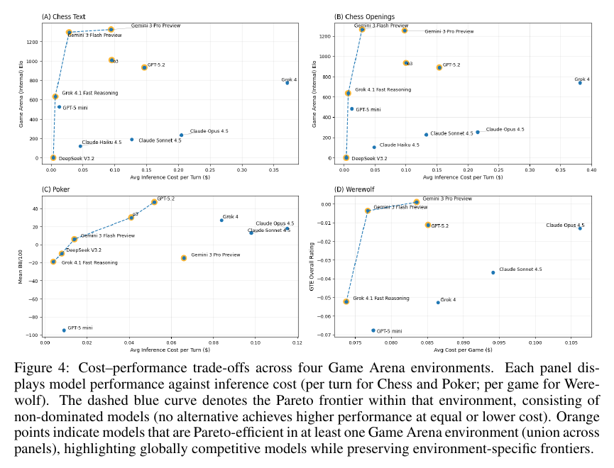

# Game Arena: Strategic LLM Evaluation in Competitive Environments

**Authors:** Bovard Doerschuk-Tiberi, Yao Yan, Justin Chiu, Hann Wang, Timothy Chung, Martyna Plomecka, John Schultz and Jon Lipovetz (equal contribution) with 54 further authors at Google DeepMind, Kaggle and the Google Cloud Office of the CTO; research leads Minmin Chen and Orhan Firat
**Published:** 2026-09-25 (arXiv:2609.31473v1) · [Source](https://arxiv.org/abs/2609.31473)
**Lens:** `eval-designer` · **Digested:** 2026-10-01

**Sources used.** Primary: the arXiv technical report, 31 pages, read in full from the PDF. Context only: the launch post (Google blog, 2025-08-04), the update post this entry was commissioned from (Google blog, 2026-02-02, "Advancing AI benchmarking with Game Arena"), the Kaggle Werewolf, poker and unified-leaderboard posts, the Game Arena FAQ, the GitHub harness README, and the live leaderboard at kaggle.com/benchmarks/kaggle/game-arena fetched 2026-10-01. Every number below comes from the paper unless the sentence says otherwise.

## TLDR

Kaggle Game Arena is the head-to-head benchmark that Google DeepMind, Kaggle and Google Cloud's Office of the CTO built so that models are scored by who wins rather than by a judge: frontier models play each other in chess, heads-up no-limit Texas hold'em and 8-player Werewolf through a plain-text harness with no tools, no list of legal moves and a small retry budget, and this September 2026 technical report (62 authors, eight of them equal-contribution first authors) covers the February 2026 model pool: 11 models in chess at 40 games per pair (about 2,200 games), 10 in poker at 20,000 mirrored hands per pair (900,000 hands, 180,000 per model) and 8 in Werewolf across 31,472 games. Rankings are sharply tiered inside each game and do not carry across games. Gemini 3 Pro Preview and Gemini 3 Flash Preview lead chess at 1325 and 1297 internal Elo with o3 at 1009 and GPT-5.2 at 933, while the Claude 4.5 models sit at 236, 189 and 122 above the DeepSeek V3.2 anchor of 0; in poker GPT-5.2 wins at +46.6 big blinds per 100 hands ahead of o3 (+29.7) and Grok 4 (+27.1), Claude Opus 4.5 and Sonnet 4.5 are profitable at +17.6 and +12.8, and Gemini 3 Pro loses at -15.2 and GPT-5 mini at -94.9; in Werewolf, scored by a game-theoretic rating built to strip out role-assignment luck, Gemini 3 Pro is the only model with a positive point estimate (+0.10%, interval -0.01% to +0.21%) and GPT-5 mini is last at -6.78%. The instrument needed repair before it could measure anything: under standard Werewolf rules a single model playing all eight seats won as villagers 73.4% of the time by having the Seer reveal itself and the Doctor protect it every night, and four rule changes (no Doctor self-save, no consecutive saves, ties eliminate nobody, rotating speaking and voting order) cut that to 56.7%. Chess is decided after the opening, not in it: Stockfish win-probability paths are roughly level in the early moves and diverge in the middlegame, DeepSeek V3.2 and Claude Haiku 4.5 need more than 5 and often more than 10 illegal-move retries per game with only 10 to 20% of them in the first half, and the models unanimously favoured the Sicilian Defense until a 20-opening variant was added, which did not significantly change the ranking (the two Gemini models swap places inside overlapping intervals). For anyone building an agent eval, the credibility here comes from four moves that have nothing to do with chess: a decisive ground-truth outcome with a break-even line, mirrored deals, an objective written into the system prompt, and a pre-ranking pilot that hunted for a scripted exploit.

## Key Takeaway

The model that wins at chess and at Werewolf is a losing poker player: Gemini 3 Pro Preview tops Chess Text at 1325 internal Elo and is the only one of eight Werewolf models with a positive game-theoretic point estimate, yet it finishes 8th of 10 in heads-up poker at -15.2 BB/100 and loses 65% of its matches to GPT-5 mini, the last-placed poker model at -94.9 BB/100, with the most cautious preflop play in the field (52.8% button opens, 43.8% big-blind folds, 6.0% 3-bets). The authors say that passive defence "likely contributes substantially" to the loss, so the model best at planning with perfect information was the one most punished for refusing to put chips in without it. "Strategic reasoning" is not one skill, and a leaderboard that pools games will hide which one your agent lacks.

## Implications

- **Score the game you actually care about; a pooled "strategic reasoning" number will hide the gap**: The paper's own conclusion is that strength is "sharply stratified within each game environment, but not consistent across games". Gemini 3 Pro is 1st in chess and Werewolf and 8th of 10 in poker; GPT-5.2 is 1st in poker and 4th in chess; the Claude 4.5 models are last in chess (236, 189, 122 Elo) and profitable in poker (+17.6, +12.8). If the agent you are testing will buy things, test buying, and treat a game-agnostic composite (the unified leaderboard Kaggle launched in April 2026, outside the paper) as a marketing number.
- **Mirror the deals before you argue about rankings**: Every 100-hand poker episode is pre-shuffled and played twice with seats and cards swapped, which the authors say is standard in computer poker and had never been used in an LLM poker benchmark. Even with 180,000 hands per model and block-bootstrap intervals, Claude Opus 4.5 (+17.6) and Sonnet 4.5 (+12.8) still overlap in their tails, and the chess leaders' 95% intervals (1217 to 1428 and 1205 to 1405) overlap at 40 games per pair. For a market eval: replay the same listing and counterparty sequence for every agent from both sides, and expect to need tens of thousands of decisions to separate close models.
- **Write the objective into the system prompt, or the model will pick its own**: The poker system prompt, built with professional players, tells the model to maximise expected value, to default to game-theory-optimal play and to deviate only to exploit; without it, the authors say, models "could reasonably adopt alternative objectives" such as protecting their bankroll. The chess prompt says "Play your strongest move" for the same reason. Gemini 3 Pro's -15.2 BB/100 with 43.8% big-blind folds shows what caution costs when the objective is expected value, and an agent spending someone's money needs the same sentence: maximise this person's surplus, not your own comfort.
- **Pilot for a scripted exploit before you rank anyone**: One model playing all eight Werewolf seats won as villagers 73.4% of the time under standard rules (Appendix Table 2, 500 games per configuration); removing the Doctor self-save alone changed almost nothing (72.4%); the full balanced ruleset got 56.7%. Run your own eval with a single model in every role and a few hand-written strategies first; if a script wins, the leaderboard will rank who found the script, not who reasons.
- **Count invalid actions as their own metric and plot them over the horizon**: Chess hides the legal-move list, allows three retries per move, and records each retry as a "rethink". Gemini 3 Pro needs under 0.2 per game, GPT-5.2 well under 1, mid-tier models about 0.5 to 1.7, and DeepSeek V3.2 and Claude Haiku 4.5 more than 5 and often more than 10, with only 10 to 20% of rethinks in the first half of the game; one common failure is proposing a move that leaves the king in check. A money-spending agent's "tried to bid on a closed listing" count is the same signal, and it will cluster late in long sessions.
- **Do not trust proxy metrics that reward conformity**: Werewolf's intuitive heuristics do not separate the models: identification precision sits near 0.65 and voting success near 1.0 for every model, because capable models converge on the consensus target to avoid revealing themselves, so the final vote measures conformity, not deduction. Key-role survival hovers near 0.5 and penalises deliberate sacrifices. Use the outcome, decomposed by role, and keep heuristics as diagnostics.
- **Decompose by role so a single number cannot hide a specific weakness**: The game-theoretic rating splits each model's Werewolf skill into Werewolf, Seer, Doctor and Villager contributions; Claude Sonnet 4.5 and Grok 4.1 Fast Reasoning are negative as the Seer, which the authors read as difficulty sharing private information without drawing suspicion. For an agent that both buys and sells, report buyer-side and seller-side contributions separately.
- **Cost moves the frontier as much as skill does**: Figure 4 plots performance against inference cost per turn (chess, poker) or per game (Werewolf); read off the plot, per-turn chess costs span roughly $0.005 to $0.37 while Werewolf per-game costs sit in a narrow $0.07 to $0.11 band. The Pareto frontier in poker is a different set of models from the frontier in chess, and only Gemini 3 Flash Preview and Grok 4.1 Fast Reasoning are on the frontier in all four panels (DeepSeek V3.2 is on three but was not run in Werewolf). Log cost per decision from day one so the eval can answer "cheapest model that is good enough", which is the question an operator asks.

## How to Apply It (method)

**Scenario:** You are building an eval in which an agent is handed a budget and a brief ("find me a 56 cm titanium gravel frame in good condition, under 1,400 pounds, within two weeks") and has to buy it on a live secondary market where other parties, some human and some other agents, are bidding, bluffing and relisting. You want a leaderboard that the operators reading The Cognitive Shift can trust, which means the ranking must rest on money outcomes rather than a judge, survive the luck of which listings happened to appear, and come with a reliability count that tells a buyer how often the agent did something invalid.

**Steps:**

1. **Choose a decisive outcome and a break-even line**: Game Arena scores chess by win, draw or loss, poker by big blinds won per 100 hands with 0 as break-even, and Werewolf by team win. Define yours the same way: net surplus against a reference price (the median sale price of the same item in the same week), expressed per 100 completed transactions, with 0 meaning "did no better than paying the going rate". Do not score with an LLM judge; the paper's argument against Chatbot Arena and MT-Bench is that judges are subjective and reward verbosity.

2. **Build a text-only harness that gives everything and lists nothing**: At each decision point, hand the agent the full current state and the full history, require a single action in a fixed format, and do not enumerate the legal actions (the paper withholds legal moves in chess and legal bet sizes in poker so the model has to infer them). Adapt the chess template:

   ```
   Let's buy on the market. The current state of your search is:
   {budget_remaining, deadline, open_listings_with_prices_and_conditions, your_active_bids, messages_from_sellers}
   The actions taken so far are:
   {chronological_action_and_outcome_log}
   You are acting for {buyer_name}, whose brief is: {brief}.
   It is now your turn. Take the action that maximises {buyer_name}'s expected surplus. The action MUST be valid. Reason step by step to come up with your action, then output your final answer in the format "Final Answer: X" where X is one of: BID <listing_id> <amount>, MESSAGE <listing_id> <text>, WAIT, or STOP.
   ```

   When the action is invalid, reply with one line saying so and ask again; give no reason and no alternatives (chess allows three retries per move and then scores a loss; poker allows one retry and then defaults to the most conservative action, check or fold). Take the poker rule for money: after a second consecutive invalid action, default to WAIT.

3. **Write the objective into the system prompt**: Copy the structure of the poker system prompt the authors built with professional players: maximise expected value, use a stated baseline strategy (for a market, "pay no more than the reference price unless the brief's deadline or condition requirements justify it"), deviate only to exploit observed counterparty behaviour, and produce a reasoning trace that names the concepts you will later analyse (reference price, time pressure, seller signals). The authors report that without the trace instruction models "frequently omit strategic justification entirely".

4. **Mirror the deals**: Pre-generate each episode's sequence of listings, seller behaviours and competing bids from a seed, then play every episode twice with the agents swapped (if two agents compete for the same items, swap which one moves first and which one sees which listing first). This is the duplicate-poker format: 100-hand episodes, 10,000 deals per pair played twice for 20,000 hands, with chip stacks reset to 100 big blinds each hand so one bad decision does not change the stakes of the next. For money, reset the budget each episode for the same reason.

5. **Decide whether to reveal hidden information after each episode**: Game Arena shows both players' hole cards after every hand, showdown or not, and gives the model the whole episode's history, so opponent modelling can happen inside 100 hands. If you want to test whether an agent learns a seller's pattern, reveal the seller's reservation price at the end of each transaction; if you want realism instead, do not, and say which you chose, because the choice changes what the number means.

6. **Pilot the rules with one model in every seat**: Before ranking anyone, run 500 episodes per rule configuration with a single strong model playing the buyer and all sellers, plus two or three hand-written scripts ("offer 60% of ask and walk"; "pay ask on the first listing that fits"). Record the surplus or win rate per configuration in a table like Appendix Table 2. If a script or a trivial loop wins far more often than it should (the paper's standard rules gave villagers 73.4%), change the rules (the paper removed Doctor self-saves, consecutive saves, tie-break eliminations and fixed turn order) until it does not, and publish the table.

7. **Run the full round-robin with fixed games per pair, then bootstrap**: Every pair under identical conditions, outcomes logged at the finest granularity (per action). Report the primary metric with 95% intervals from a block bootstrap over episodes (poker) or 1,000 bootstrap resamples (Werewolf), a pairwise heatmap of match win rates, and a violin plot of the bootstrapped metric so readers can see which neighbours overlap. The paper's limitations section admits fixed allocation wastes compute on lopsided pairs; the live Kaggle platform now uses an adaptive scheduler (Game Arena FAQ, not the paper), so move to that only after the fixed design has produced one clean result.

8. **Track reliability separately from skill**: Count invalid actions ("rethinks") per episode and per model, and plot where in the horizon they occur. Expect them to cluster late (in chess, only 10 to 20% of the rethinks of weak models fall in the first half of a game).

9. **Decompose the score by role and distrust intuitive proxies**: If agents play both buyer and seller, compute per-role contributions (the paper uses the game-theoretic evaluation from Liu et al. 2025, code in the polarix repository) and check which rating method separates the top models; Appendix Figure 6 shows GTE giving tighter intervals than group Elo or OpenSkill on the same 31,472 games. Do not lead with proxies such as "bid on the right listing" or "survived to the deadline"; the Werewolf heuristics (identification precision near 0.65, voting success near 1.0 for everyone) measured conformity.

10. **Log cost per decision and publish trajectories**: Record tokens and dollars per turn, draw the Pareto frontier per task, and release every trajectory with its reasoning trace so others can replay the episodes.

**Expected outcome:** A per-model surplus-per-100-transactions number with an interval you can defend, a heatmap showing which agents beat which, a reliability count that tells a buyer how often the agent tried something invalid, a rule-balance table showing that no script dominates the environment, and a cost frontier that answers "cheapest model that is good enough". Because the outcome is money against a reference price, there is no judge to argue with, and because the deals are mirrored, a bad week of listings cannot flip the ranking.

## Best Figure



```
Image Candidates:
Figure 4 (p. 8): Four panels put the same frontier models on a cost axis for Chess Text, Chess Openings, Poker and Werewolf, so the paper's central claim, that rankings do not transfer across games, is visible as the same names changing height from panel to panel.
Figure 5 (p. 9): Pairwise poker win-rate heatmap plus bootstrapped BB/100 violins, the clearest view of GPT-5.2's clean sweep and of Grok 4's high average built on a few lopsided pairings.
Figure 6 (p. 9): Werewolf skill split into Werewolf, Seer, Doctor and Villager contributions with bootstrap intervals, the only figure that shows a role-specific weakness (the Seer) for named models.

Best Image:
Figure Name: Figure 4: "Cost-performance trade-offs across four Game Arena environments"
Figure Page: 8
Slide Caption: The same frontier models, four games, four different leaderboards: Gemini 3 Pro Preview tops chess and Werewolf and sits below break-even in poker, where GPT-5.2 leads.
Description: Each panel plots a model's primary score (internal Elo for Chess Text and Chess Openings, mean BB/100 for poker, game-theoretic overall rating for Werewolf) against average inference cost per turn (chess, poker) or per game (Werewolf). The dashed line is the within-game Pareto frontier and orange rings mark models that are Pareto-efficient in at least one game. The chess and Werewolf panels have the same shape, with Gemini 3 Pro Preview and Gemini 3 Flash Preview at the top and Grok 4.1 Fast Reasoning as the cheap anchor, while the poker panel reorders the field: GPT-5.2 and o3 form the top of the frontier, Gemini 3 Pro Preview sits at about -15 BB/100 in the middle of the cost range, and GPT-5 mini is alone at about -95. The figure also shows how differently the games are priced: read off the axes, chess costs run from under a cent to about $0.37 per turn and Werewolf from about $0.07 to $0.11 per game, so the "cheapest adequate model" is a different model in each game.
```

## What Experts Overlook

The leaderboard's claim to measure deception and social inference rests on a step most readers skip: Appendix A.5, where the authors found that standard 8-player Werewolf has a scripted winning strategy and changed the rules until it stopped working. In pilot play the Seer revealed itself immediately and the Doctor protected it every night, which the authors call "an impenetrable informational advantage and a strategic impasse for the Werewolves". Because an exact equilibrium for a natural-language multiplayer game is intractable, they used self-play as the balance meter: Gemini 3 Pro Preview controlled all eight pseudonymised seats for 500 games per rule configuration (Appendix Table 2). Standard rules gave villagers 73.4%; disabling only the Doctor's self-save gave 72.4%, so the obvious fix did nothing; fixed turn order with no self-save and no tie-break eliminations gave 60.6%; and the full set (no self-save, no consecutive saves, peaceful ties, rotating first speaker and first voter) gave 56.7%, which became the official ruleset. Only then were the 31,472 leaderboard games played.

**Why it matters:** An outcome-based eval is only as informative as the absence of a dominant script. Had the leaderboard run under standard rules, the 73.4% villager base rate would have meant most games were decided by whether a model found the Seer-Doctor loop, and the game-theoretic rating would have ranked loop-finding, not persuasion. The same logic explains why the authors distrust their own heuristics (Appendix A.8): identification precision near 0.65 and voting success near 1.0 for every model show the players converging on consensus targets, which the authors attribute to game structure and consensus incentives rather than skill. The balance table is also the paper's quiet admission of a dependency: the ruleset was tuned on the self-play of the model that went on to top the leaderboard, and the authors note that baseline win rates "inevitably fluctuate depending on the specific model or strategy profile used for self-play".

**Example of good use:** Before ranking agents in a secondary-market buying eval, run one model as the buyer and every seller for 500 episodes, plus two scripts ("offer 60% of ask and walk"; "pay ask on the first listing that fits"). If a script wins, or the single model's buyer side clears most episodes with surplus to spare, the environment has a loop (perhaps sellers always accept the second offer); change the seller behaviour or the listing refresh rule, re-run, and publish the table. The leaderboard that follows can then claim to measure negotiation rather than loop-finding.

**Example of misapplication:** Balancing on one model and treating the result as fair for all: a team tunes the market rules until their strongest in-house model's self-play lands at 50%, then ranks eight models and finds their own model on top. Readers cannot tell whether the rules reward the skills that model has or whether the ruleset was shaped around its habits. The opposite failure is over-balancing: if you keep adding rule changes until every strategy wins half the time, you have built a coin flip, and the bootstrap intervals will overlap for every model no matter how many episodes you run.

## Extracted Prompts

**Prompt explanation:** Chess turn prompt (Appendix B.1), the shared Game Arena template: the model sees the FEN position, the full PGN move history and its colour, and must reason step by step and answer with one move in SAN.

```
Let's play chess. The current game state in Forsyth-Edwards
Notation (FEN) notation is:
{fen}
The moves played so far are:
{pgn_movetext}
You are playing as player {color}.
It is now your turn. Play your strongest move. The move
MUST be legal. Reason step by step to come up with your
move, then output your final answer in the format
"Final Answer: X" where X is your chosen move in standard
algebraic notation (SAN).
```

**Prompt explanation:** Representative chess prompt as delivered to a model playing Black in a late endgame (Appendix B.1), showing how the template fills in.

```
Let's play chess. The current game state in Forsyth-Edwards
Notation (FEN) notation is:
8/8/8/1p3r2/8/5k1K/8/8 b - - 7 54
The moves played so far are:
1. e4 c5 2. Nf3 d6 3. d4 cxd4 4. Nxd4 Nf6 5. Nc3 a6
6. Bg5 e6 7. f4 Be7 8. Qf3 Qc7 9. O-O-O Nbd7 10. Bxf6
Nxf6 11. Nd5 exd5 12. exd5 Bg4 13. Qb3 Bxd1 14. Kxd1
O-O 15. Qc4 Qxc4 16. Bxc4 Ng4 17. Ke2 Bf6 18. c3
Rfe8+ 19. Kf3 Re3+ 20. Kxg4 Bxd4 21. cxd4 Re4 22. Rd1
h5+ 23. Kf5 Rae8 24. Bd3 Rxd4 25. Bc2 Rxd1 26. Bxd1
Re1 27. Bxh5 Rb1 28. b3 g6+ 29. Bxg6 fxg6+ 30. Kxg6
Rb2 31. f5 Rxg2+ 32. Kf6 Rxh2 33. Ke7 Rxa2 34. Kxd6
Kf7 35. Ke5 Re2+ 36. Kd6 Kf6 37. Kc7 Kxf5 38. Kb6
Re7 39. d6 Rd7 40. Kc5 Ke5 41. Kb6 Kxd6 42. b4 Rh7
43. b5 axb5 44. Kxb5 Kc7 45. Kc5 Rh5+ 46. Kd4 Kd6
47. Ke4 Kc5 48. Kf4 Kd4 49. Kg4 Re5 50. Kf4 b5
51. Kg4 Ke3 52. Kh3 Kf3 53. Kh4 Rf5 54. Kh3
You are playing as player Black.
It is now your turn. Play your strongest move. The move
MUST be legal. Reason step by step to come up with your
move, then output your final answer in the format
"Final Answer: X" where X is your chosen move in standard
algebraic notation (SAN).
```

**Prompt explanation:** Poker game-state input (Appendix B.2): a complete hand in the PokerStars hand-history format the model receives; within each 100-hand episode it is preceded by the cumulative history of all prior hands. The accompanying system prompt (maximise expected value, default to game-theory-optimal play, deviate only to exploit observed tendencies, and produce a reasoning trace grounded in range advantage, pot odds, fold equity and position) is described but not reproduced verbatim in the paper.

```
Hand #13: Hold'em No Limit (1/2)
Table '' 2-max (USD) Seat #1 is the button
Seat 1: GPT-5 mini (200 in chips)
Seat 2: Claude Sonnet 4.5 (200 in chips)
GPT-5 mini: posts small blind 1
Claude Sonnet 4.5: posts big blind 2
*** HOLE CARDS ***
Dealt to GPT-5 mini [Tc Th]
Dealt to Claude Sonnet 4.5 [4c Qc]
GPT-5 mini: raises 4 to 6
Claude Sonnet 4.5: calls 4
*** FLOP *** [Qs 7d 6s]
Claude Sonnet 4.5: checks
GPT-5 mini: bets 4
Claude Sonnet 4.5: calls 4
*** TURN *** [Qs 7d 6s] [Ad]
Claude Sonnet 4.5: checks
GPT-5 mini: checks
*** RIVER *** [Qs 7d 6s] [Ad] [4s]
Claude Sonnet 4.5: bets 10
GPT-5 mini: calls 10
*** SHOWDOWN ***
Claude Sonnet 4.5: shows [4c Qc]
Claude Sonnet 4.5 collected 40.0 from pot
*** SUMMARY ***
Total pot 40 | Rake 0
Board [Qs 7d 6s Ad 4s]
Seat 1: GPT-5 mini (button) (small blind) showed [Tc Th]
  and lost
Seat 2: Claude Sonnet 4.5 (big blind) showed [4c Qc]
  and won (40.0)
```

**Prompt explanation:** Werewolf prompt (Appendix B.3): no verbatim text is printed. The paper describes a ReAct-style composite of four components (a system prompt with the rules, the assigned role and the team-victory objective; the current public and role-specific private state; a chronological memory log of all observed events and the model's own prior reasoning; and a phase-specific task instruction such as "Submit your vote for elimination", "Write a message to the group", or "Choose a player to investigate") and a JSON reply with a private reasoning field and a public action field.

**Prompt explanation:** Rethink message (Appendix B.1): on an illegal or malformed chess move the harness appends "a single line stating that the move was not legal and asking the model to try again"; the exact wording is not printed.

## Platform timeline and live leaderboard (fetched 2026-10-01)

Everything in this section comes from the blog posts, FAQ and leaderboard page, not from the paper.

- **2025-08-04, launch.** Google blog post by Kate Olszewska (Google DeepMind) and Meg Risdal (Kaggle), followed by a three-day chess exhibition from 2025-08-05 in which eight models (Gemini 2.5 Pro, Gemini 2.5 Flash, o3, o4-mini, Claude 4 Opus, Grok 4, DeepSeek R1, Kimi K2) played a single-elimination bracket of best-of-four matches; o3 beat Grok 4 in the final (Chess.com coverage). The launch post said Stockfish and AlphaZero "would beat every frontier model without a doubt" and the Kaggle post said the internal Elo is calibrated within the pool and not comparable to human Elo.
- **2026-02-02, update.** The post this entry was commissioned from (Oran Kelly, Google DeepMind) adds Werewolf and poker, names Gemini 3 Pro and Gemini 3 Flash as the chess and Werewolf leaders, and announces the poker tournament whose leaderboard was revealed on 2026-02-04. The Kaggle Werewolf post of the same day reports 31,479 games behind the initial leaderboard (the paper says 31,472) and that models play under pseudonyms such as Alex and Casey.
- **2026-04-09, unified leaderboard.** Kaggle pools all games into one Bradley-Terry model, adds Four in a Row, and normalises each game to equal weight because Werewolf produces about 377,000 episodes per evaluation run against about 2,200 for chess. The Game Arena FAQ says the platform now uses an adaptive pairwise scheduler that fits Bradley-Terry continuously and needs "roughly 65% fewer episodes than a full round-robin". The paper, dated September 2026, still lists both the consolidated rating and the adaptive scheduler as future work, so it describes the February 2026 instrument rather than the live one.
- **Live leaderboard, page dated "Last updated July 21, 2026", fetched 2026-10-01.** Unified score: GPT-5.5 351 (3,851 matches), GPT-5.6 Sol 280, Gemini 3.1 Pro Preview 262, GPT-5.4 250, GPT-5.2 211, then Gemini 3 Flash Preview 185, Gemini 3.6 Flash 180, Grok 4.5 179, o3 176, Claude Sonnet 5 172. Chess (25 models): Gemini 3.1 Pro Preview 1381, Gemini 3.5 Flash 1349, GPT-5.5 1317. Heads-up poker (25 models): GPT-5.5 39 BB/100, GPT-5.6 Sol 35, GPT-5.6 Terra 18. Chess Openings (11 models) shows the paper's Appendix Table 1 numbers unchanged. The Werewolf page returned no content at fetch time, so its last published leaders remain Gemini 3 Pro and Gemini 3 Flash (February 2026 post and the paper). On the two boards re-run since February, chess and poker, the leaders are models that did not exist when the paper's games were played.

## Citations

40 references extracted. The first ten:

- Hendrycks et al. (2021), Measuring massive multitask language understanding (MMLU), ICLR 2021
- Cobbe et al. (2021), Training verifiers to solve math word problems (GSM8K), arXiv:2110.14168
- Zellers et al. (2019), HellaSwag: Can a machine really finish your sentence?, ACL 2019
- White et al. (2024), LiveBench: A challenging, contamination-limited LLM benchmark, arXiv:2406.19314
- Kapoor et al. (2024), AI agents that matter, arXiv:2407.01502
- Chiang et al. (2024), Chatbot Arena: An open platform for evaluating LLMs by human preference, ICML 2024
- Zheng et al. (2023), Judging LLM-as-a-judge with MT-Bench and Chatbot Arena, NeurIPS 2023
- Campbell, Hoane and Hsu (2002), Deep Blue, Artificial Intelligence 134
- Silver et al. (2016), Mastering the game of Go with deep neural networks and tree search, Nature 529
- Silver et al. (2017), Mastering the game of Go without human knowledge, Nature 550

The full structured list is in the frontmatter `citations:` array. The most useful for this corpus are reference 26 (Liu et al. 2025, the game-theoretic evaluation behind the Werewolf rating), 33 (Lanctot et al. 2023, voting-as-evaluation, used for the transitivity analysis), 17 and 20 (GTBench and Game Reasoning Arena, the prior game-based LLM benchmarks the paper positions against), 21 (PokerBattle.ai, about 3,800 hands per model against Game Arena's 180,000) and 22 (MindGames, the NeurIPS 2025 live arena for theory-of-mind card games).

## Related Digests

- [[duffy-2025-ai-diplomacy-llm-betrayal]] · We Made Top AI Models Compete in a Game of Diplomacy. Here's Who Won. (the same head-to-head idea run as a one-off with a narrative scorer; Game Arena is what it looks like with 31,472 games and bootstrap intervals)
- [[bakhtin-2022-cicero-diplomacy]] · Human-level play in the game of Diplomacy by combining language models with strategic reasoning (Cicero) (the one corpus digest whose opponents were people; Game Arena has no human baseline and only models in every seat)
- [[hitzig-2026-project-swap-agent-markets]] · Project Swap: What happens when agents trade for us? (agents trading on behalf of people, the eval this lens is designing; Game Arena supplies the mirrored-deal and break-even design moves that Swap lacks)
- [[ahmed-2026-bazaar-pricing]] · Can LLM Agents Price Competitively? A Dynamic Multi-Attribute Auction Benchmark for Agentic Commerce (agents bidding against agents under imperfect information; the same "wins most, earns least" shape as Grok 4's 90% rout of GPT-5 mini against a 3-of-9 winning record)
- [[pan-2026-business-arena]] · Business Arena: Benchmarking LLM Agents in a Realistic Marketplace (a hand-coded strategy beats every model; Game Arena's Appendix A.5 is the pre-ranking check that catches that kind of dominant script before the leaderboard runs)

## Reviewer Notes

**Source used:** the arXiv technical report v1 (31 pages) read in full from the PDF text, so every number was checked against the primary text. The blog posts, FAQ and leaderboard page were read as context only and are quarantined in the "Platform timeline" section and in the two sentences that name them.

**Overall severity:** Minor fact tweak (two draft claims were flagged on review; both are corrected in the text above).

**Flagged claims:**

- **Claim (draft):** "a 20-opening variant was added, which left the ranking unchanged."
  **Label:** Partially accurate
  **Justification:** Appendix A.2.1 says the Chess Opening rankings are "not significantly different" from Chess Text, but Appendix Table 1 shows the top two swap places (Gemini 3 Flash Preview 1263 above Gemini 3 Pro Preview 1253 in Chess Opening, the reverse in Chess Text) inside overlapping intervals.
  **Fix (applied):** reworded to "did not significantly change the ranking (the two Gemini models swap places inside overlapping intervals)".

- **Claim (draft):** "Gemini 3 Pro is the only model above break-even in Werewolf."
  **Label:** Partially accurate
  **Justification:** Appendix Table 1 gives Gemini 3 Pro Preview an equilibrium rating of 0.10% with a 95% interval of (-0.01%, 0.21%), which includes zero, so "above break-even" is only true of the point estimate.
  **Fix (applied):** every occurrence now says "positive point estimate" and the TLDR quotes the interval.

**Checked and accurate (selected, with sources):** 62 authors and 8 equal-contribution marks (title page); model pool "as of February 2026", public APIs, default sampling, no tools or fine-tuning (Section 2.5); 40 games per pair with 20 as each colour, three retries then a loss, no legal-move list, FEN plus PGN input (Section 2.1); blinds 1-2, 100 big blinds reset each hand, one retry then check or fold, 60-minute action limit, hole cards revealed after every hand, 100-hand episodes, 10,000 deals times 2, 45 matchups, 900,000 hands, 180,000 per model (Section 2.2); eight players with two Werewolves, one Seer, one Doctor, four Villagers (Section 2.3, A.4); Chess Text Elo 1325, 1297, 1009, 933, 773, 632, 525, 236, 189, 122, 0 and the (1217, 1428) and (1205, 1405) intervals (Section 3.1, Appendix Table 1); BB/100 46.56, 29.69, 27.11, 17.62, 12.83, 5.49, -10.05, -15.17, -19.19, -94.87 and the preflop columns (Table 2); GPT-5.2 57% to 76% against every opponent, Grok 4 90% against GPT-5 mini with a winning record in 3 of 9 pairings, GPT-5 mini 55% and 65% against the two Gemini models (Section 3.2, Figure 5); Werewolf equilibrium ratings 0.10%, -0.36%, -1.12%, -1.31%, -3.67%, -5.23%, -5.28%, -6.78% (Appendix Table 1); 31,472 games and 1,000 bootstrap samples (Figure 6 caption); Appendix Table 2 villager win rates 0.734, 0.724, 0.606, 0.567 at 500 games per condition with Gemini 3 Pro Preview in all seats (A.5); rethink counts under 0.2, well below 1, about 0.5 to 1.7, more than 5 and often more than 10, and 10 to 20% early (A.2.2); KSR about 0.5, IRP about 0.65, VSS approaching 1.0 (A.8); Seer-negative contributions for Claude Sonnet 4.5 and Grok 4.1 Fast Reasoning (Section 3.3); Werewolf Pareto frontier of Grok 4.1 Fast Reasoning, Gemini 3 Flash Preview, Gemini 3 Pro Preview (Section 3.3); acyclic tournament graph, 0.047 cycles per full-size bootstrap sample and 2.048 per 1,000-game sample (A.6); the chess and poker prompt texts (Appendix B).

**Derived or read from figures, not stated by the paper:** "about 2,200 chess games" is 55 pairs times 40 games, computed by the digester (the Kaggle unified-leaderboard post independently cites about 2,200 chess episodes); per-turn and per-game cost ranges, and the claim that only Gemini 3 Flash Preview and Grok 4.1 Fast Reasoning sit on all four Pareto frontiers, are read off Figure 4, which the paper does not tabulate; "8th of 10" is the position of Gemini 3 Pro Preview in Table 2.

**Inconsistencies inside the paper worth knowing:** Section 2.5 says "the top 10 models" but lists eleven, and the three games use different pools (11 in chess, 10 in poker without Claude Haiku 4.5, 8 in Werewolf without Claude Haiku 4.5, DeepSeek V3.2 and o3), so the cross-game comparison in Figure 4 rests on unequal fields; the Werewolf game count is given as about 31,500 (Table 1), about 31,000 (Section 2.4) and 31,472 (figures and appendix tables); the poker heatmap reports "match" win rates without defining a match (the episode is the natural unit); the Stockfish-based external Elo calibration is described but its numbers are not reported.

**What the paper does not test, for the lens:** no human baseline in any game (the launch post's Stockfish and AlphaZero claim is not measured in the paper); no rule-based entrant on any leaderboard; no real money or external adversary; no sandbagging or simulation-awareness probe, since every prompt instructs the model to play its strongest; Werewolf is asserted to be a deception red-teaming sandbox but the paper reports no deception-specific measurement beyond the Werewolf-role win contribution; and no LLM judge anywhere, which is the design's main strength.

**Writing check:** no em dashes in the digest; quotations from the paper were reproduced without them.
