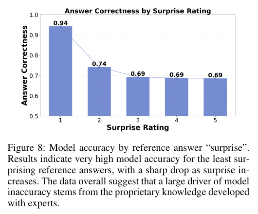

# Benchmarking Agents in Insurance Underwriting Environments (UNDERWRITE, Snorkel AI)

**Authors:** Amanda Dsouza, Ramya Ramakrishnan, Charles Dickens, Bhavishya Pohani, Christopher M. Glaze (Snorkel AI)
**Published:** 2026-01 (arXiv v1, 31 Jan 2026; AAAI 2026 copyright notice) · [Source](https://arxiv.org/abs/2602.00456)
**Lens:** `eval-designer` · **Digested:** 2026-10-01

## TLDR

Snorkel AI asked whether the usual agent benchmarks give "a misleading signal of readiness for enterprise deployment", and built UNDERWRITE to find out: a 300-task, multi-turn benchmark in which a function-calling copilot helps a simulated commercial property-and-casualty underwriter decide appetite, small-business eligibility, NAICS classification, product recommendations, policy limits and deductibles. It is a capability-and-reliability question about a copilot that assists a human, not a delegation question (the human stays in the loop and no money moves), and insurance was chosen because the backend is "representative of the workflows in which an AI copilot would be engaged" at such a business, which the authors describe as an internal-facing product backend. The instrument: 3,000 GPT-4.1-generated fictional applicants, a 9-table SQLite database with several NAICS schema versions, free-text guidelines carrying made-up proprietary rules, deliberately redundant MCP tools described with no hints on how to tell them apart, a GPT-4.1 simulated underwriter told to reveal at most two facts per turn, a 50-turn cap, and three rewards: binary correctness judged by GPT-4.1-mini (over 95% agreement with one expert annotator on 100 held-out traces), tool exceptions per trace, and a regex count of "I do not know" replies. A network of Chartered Property Casualty Underwriters rated realism (task acceptance went from 55% to 88% after one round of fixes to the generator; the simulated underwriter was iterated until over 90% of traces were accepted), and 45 minutes of group review of the whole system replaced further task-by-task curation. Thirteen models ran as ReAct agents in LangGraph with default settings; correctness ranged from 30.0% (Qwen3 235B, GPT OSS 120B) to 90.3% (Claude Sonnet 4.5, Table 1; the body text quotes 88.3%), with GPT-5 and Grok 4 at 83.3%, Claude Haiku 4.5 at 77.3%, DeepSeek V3.1 at 73.7% and Gemini 2.5 Pro at 72.7%. Three findings: (1) the top model was not the cleanest, Claude Sonnet 4.5 averaged 0.52 tool exceptions per trace against 0.20 for Qwen3 235B, which tied for last on correctness at 30.0%, 32% of conversations across all models contained at least one tool error, and tool errors barely correlate with correctness (Pearson at most 0.26 on any task type) while recovery from them does (0.41 to 0.84); (2) models hallucinate real-world insurance products the fictional insurer does not sell, GPT-5 Mini in 19% and GPT-5 Nano in 16% of completed traces overall and 58 to 66% of the time on product-recommendation tasks, while Claude Sonnet 4.5 and Grok 4 were at 0%; (3) reliability is well below accuracy, pass^k over 4 runs falls from 0.82 to 0.64 for GPT-5 and from 0.91 to 0.72 for Claude Sonnet 4.5. The most useful result is a post-hoc one: when the two best models rated how "surprising" each reference answer was with the resources removed (they agreed only at Spearman 0.34, so ratings were averaged), correctness across all models was 0.94 on rating-1 tasks, 0.74 at rating 2 and 0.69 at ratings 3 to 5, which places the benchmark's difficulty almost entirely in the fictional rules that contradict what models already believe. Untested: no human or rule-based baseline, no confidence intervals or seeds, no adversarial counterparty, no real money, and OpenAI models generate the applicants, play the user and judge correctness.

## Key Takeaway

Take away everything the model already believed about insurance and this benchmark stops being hard: average correctness is 0.94 on tasks whose reference answer the top two models rated least surprising, 0.74 one notch up, and 0.69 for every rating above that, so the whole difficulty of an expert-built enterprise eval sits in the fictional rules that contradict pretraining. Smaller models lose the most (Claude Haiku 4.5 went from close to 100% on the least surprising tasks to 66% on the most, Claude Sonnet 4.5 only from 92% to 88%), every hallucinated product was a real industry product the fictional insurer does not sell, and the paper's best model, Claude Sonnet 4.5 at 90.3%, made more tool errors per trace (0.52) than 8 of its 12 rivals, because what predicted a right answer was not avoiding errors (Pearson r at most 0.26) but recovering from them (r from 0.41 to 0.84 by task type).

## Implications

- **Rate how surprising your answer key is before you call a task hard**: The authors gave GPT-5 and Claude Sonnet 4.5 each task's inputs and reference answer with the tools and data removed, asked for a 1 to 5 surprise rating, averaged the two, and found correctness of 0.94 at rating 1 against 0.69 at ratings 3 to 5 (Figure 8). For a money-at-stake eval, give a model the principal's private rules and the right call, ask it to rate surprise, and report accuracy per band; a high score made of rating-1 tasks means the agent was tested on what it already knew.
- **Count recoveries, not errors**: 32% of conversations across all models had at least one tool exception and the top three models threw them in 20 to 40% of conversations, yet the strongest correlation between tool errors and correctness on any task type was 0.26 (product recommendations), while the correlation between tool-error recovery (a corrected call to the same tool after a failure) and correctness ran from 0.41 to 0.84 (Table 3). Log every failed tool call with whether the next call to that tool succeeded, and put the recovery rate on the leaderboard.
- **Cap what the simulated principal reveals per turn or you stop measuring question-asking**: The GPT-4.1 underwriter was told to give at most two pieces of information per turn, because without that instruction it handed over everything at once; the "user cannot answer" count then separates models that ask the right questions (Claude Haiku 4.5, 0.15 per trace) from models that fish (Gemini 2.5 Pro 1.61, GPT 5 Nano 1.53). The same cap, plus a scripted "I do not know" for anything outside the principal's brief, is the cheapest way to score an agent that must ask a person before spending.
- **Build a narrow hallucination detector, not a general one**: General LLM-judge hallucination detection gave high recall and low precision, flagging bad reasoning as hallucination; the fix was a detector that only lists the insurance products named in an answer and checks each against the six lines the fictional insurer sells, tuned to over 95% accuracy on 50 expert-annotated samples. Its output: GPT 5 Mini hallucinated in 19% of completed traces and GPT 5 Nano in 16%, rising to 58 to 66% on product-recommendation tasks, with Claude Sonnet 4.5, Grok 4, Gemini 2.5 Flash and DeepSeek V3.1 at 0% (Figure 7). For a buying agent the equivalent is a closed list of the sellers, listings and payment methods that exist in the sandbox.
- **Run each task at least 4 times and quote pass^4**: GPT-5 fell from 0.82 at k=1 to 0.64 at k=4 and Claude Sonnet 4.5 from 0.91 to 0.72 (Figure 3); on product recommendations the drop was about 20 points for both (Figure 12). A single run per task overstates what an agent will do reliably by roughly a fifth; with real money, the pass^4 number is the one to put in the brief.
- **Separate scaffold failures from model failures and publish both tables**: 24.3% of GPT OSS 120B traces and 24.0% of Kimi K2 Instruct traces never completed, driven by empty responses (16.7% for GPT OSS 120B) and code blocks sent to the user (25.3% for Kimi K2), which a third LangGraph node caught and terminated rather than letting the simulated user rescue the agent (Table 2). Without that separation the incomplete runs would read either as wrong answers or, worse, as user-assisted right ones.
- **Spend expert time on the whole system, not only on task review**: Task acceptance by the CPCU network went from 55% to 88% after one round of feedback on the synthetic generation process, the simulated underwriter was iterated until experts accepted over 90% of traces, and one 15-minute plus one 30-minute group session on the guidelines and data "obviated the need for more rounds of task-level curation". Budget 45 minutes of a real buyer's time on your marketplace rules and simulated counterparties before any per-task review.
- **Verbose with few steps is the failure signature**: Across all models, incorrect completed traces used fewer steps but more tokens than correct ones (Figure 5); in one task GPT 5 Nano wrote over 7,000 output tokens across 3 steps with no tool call and got it wrong, while Claude Haiku 4.5 used under 400 tokens across 4 steps with 1 tool call and got it right. A tokens-per-step alarm is a cheap live monitor for an agent that is reasoning instead of checking.

## How to Apply It (method)

**Scenario:** You want an eval for an agent that buys on a person's behalf in a live secondary market (used bike parts, event tickets, collectibles), with a budget, the person's private rules ("never buy from a seller with under 50 ratings", "only frame sizes 56 to 58", "ask me before anything over 400"), noisy marketplace tools, and a principal who will not volunteer everything up front. Before putting real money behind it, you need a bench that says which model to run and how often it will get the call right, not only whether it can. UNDERWRITE's recipe transfers almost line for line: replace the underwriter with the buyer, the applicant with the listing, and the underwriting guidelines with the buyer's house rules.

**Steps:**

1. **Write the product backend with the people who do the job**: Before any task exists, sit with experienced buyers (the paper used a network of Chartered Property Casualty Underwriters; it does not say how many) and sketch the backend an internal copilot would call: what tables, what documents, what the human asks the agent to do. The paper's four desiderata (P1 to P4) were noisy data resources, realistic tasks and system, multi-turn interaction, and challenging reasoning processes; its sizing aim was an average of 3 to 7 reasoning or tool-use steps and 10 to 20 conversational turns per task.

2. **Build the data layer with deliberate noise**: The paper used a 9-table SQLite database (several years' versions of the NAICS classification, a small-business qualification table, an "appetite" matrix), a separate metadata file describing the tables, and free-text guidelines containing fictional but plausible proprietary rules. The versions and the separate metadata are the noise: the agent must read metadata before it can write a correct query. For a marketplace: listing tables from two scraper versions with different column names, a seller-reputation table, and a house-rules document that contradicts common buying folklore in a few places.

3. **Expose everything through MCP with redundant tools**: Tools to view guidelines, run read-only SQL, and read tool metadata. Several tools should return overlapping information, and tool descriptions should carry just enough to use them and nothing on how to tell similar tools apart.

4. **Define 5 to 7 seed task types from the expert workflow**: The paper's six: in-appetite screening, what other products to offer, small-business qualification, NAICS classification, policy limits, deductibles. For buying: is this listing in scope, is the seller acceptable, what is the fair price band, should we bid or wait, what question to ask the seller, what to ask the principal.

5. **Generate principals or counterparties at scale with public constraints**: 3,000 applicant profiles came from GPT-4.1, sampled over NAICS codes and constrained by public statistics on geography, revenue and operations. Mark each profile easy or difficult; difficult ones need longer tool chains, fine-grained table distinctions and follow-up questions to the user.

6. **Vary the opening request so the agent has to ask**: Each conversation starts from a user request for one task type, rewritten by a frontier model so that the agent cannot answer without follow-up questions.

7. **Build the simulated principal with a disclosure cap**: A GPT-4.1 user with a system prompt holding the applicant facts, instructed to give at most two pieces of information per turn and to answer "I do not know" to anything it cannot answer. The two-piece cap is what keeps the task multi-turn.

8. **Wire the agent as a ReAct loop with a scaffold-error node**: Copilot and simulated user are separate LangGraph nodes; a third node watches agent output for code blocks (a small LLM classifier, prompt below) and other scaffold errors, and terminates the conversation when it sees one, because otherwise the simulated user starts helping the agent. Parse thinking tokens out of open-weight model output. Cap at 50 turns.

   ```
   You are an AI assistant who analyzes text and is good at analyzing text. Please tell me whether the following TEXT contains any computer code or JSON at all. Do NOT count simple references to tables or other codes such as classifications. For example, 'NAICS code' references are NOT examples of computer code.

   TEXT: {response}
   ```

9. **Define three rewards and calibrate the judge**: (a) Correctness: binary, an LLM judge (GPT-4.1-mini) compares the agent's final answer to a reference answer derived from the rules and returns a verdict plus rationale; calibrate until it agrees with an expert on over 95% of 100 held-out traces. (b) Tool errors: count of Python exceptions in the trace, rule-based. (c) Uncertain answers: regex count of "I do not know" in the user's turns, bounded by the number of user turns.

10. **Build a narrow hallucination detector**: Do not ask a judge "is this hallucinated"; the paper found that gives high recall and low precision. Instead ask the judge to list every named entity of one type (insurance products here; sellers, listings or payment rails for a marketplace) and mark each as present or absent from a closed list. Tune on 50 expert-labelled samples to over 95% accuracy, then patch recurring false positives with regex.

11. **Have experts rate realism of tasks and inputs separately, then review the whole system**: Produce traces for every task with frontier models, show them to experts in an annotation interface, and ask for separate ratings on the task and on the applicant. Expect to learn, as the authors did, that a task is realistic for some applicants and not others, so curate (task type, input, pairing) triples. Iterate the generator until acceptance is high (55% to 88% here) and the simulated user until over 90% of its traces are accepted. Then run one 15-minute freeform session and one 30-minute deep session on the guidelines and data.

12. **Run every model with default settings and repeat for pass^k**: 13 models, 300 tasks, default temperature and reasoning budget. Run each task up to 4 times and report pass^k for k = 1 to 4, overall and per task type (the paper describes running each model up to k times but reports pass^k only for the two most accurate models, GPT-5 and Claude Sonnet 4.5).

13. **Rate surprise post hoc**: Give the top two models each task's inputs and reference answer with the resources removed, ask for a 1 to 5 rating of how surprising the reference answer is, check inter-rater agreement (Spearman 0.34 here, so average), and plot correctness by surprise band for every model.

14. **Analyse the traces, not only the scores**: Pearson correlations between each indicator (steps, tokens, tool errors, uncertain answers, hallucinations, tool-error recovery) and correctness per task type; state-transition diagrams of who talks to whom (tool to tool, tool to user); and steps against tokens for correct versus incorrect traces.

**Expected outcome:** A leaderboard with three columns rather than one (correct, tool exceptions per trace, unanswerable questions per trace), a pass^4 figure that is roughly 20 points below pass^1 and is the number to quote when money is at stake, a hallucination rate per model on a closed entity list, a surprise curve that shows how much of the bench is the principal's private rules rather than general competence, and an incomplete-run table that keeps scaffold failures out of the accuracy number. You will also have the two prompts and the calibration sizes (100 traces for the judge, 50 for the detector) that make the LLM-judged parts defensible to a technical reviewer.

## Best Figure



```
Image Candidates:
Figure 8 (p. 7): Answer correctness by reference-answer surprise rating, 0.94 at rating 1 falling to 0.69 at ratings 3 to 5, which shows in one view that the benchmark's difficulty is the fictional proprietary rules rather than underwriting in general.
Table 1 (p. 5): The 13-model leaderboard on all three reward criteria, where the top model on correctness (Claude Sonnet 4.5, 90.3%) is mid-pack on tool errors (0.52 per trace) and behind Claude Haiku 4.5 on unanswerable questions (0.28 against 0.15).
Figure 3 (p. 5): pass^k for k = 1 to 4 on GPT-5 (0.82 to 0.64) and Claude Sonnet 4.5 (0.91 to 0.72), the paper's reliability headline.

Best Image:
Figure Name: Figure 8: "Model accuracy by reference answer 'surprise'"
Figure Page: 7
Slide Caption: Average answer correctness across all 13 models falls from 0.94 to 0.69 as the reference answer gets more surprising to GPT-5 and Claude Sonnet 4.5, so the hard part of this enterprise benchmark is the fictional rules, not the underwriting.
Description: Figure 8 is a five-bar chart of average answer correctness (y axis, 0.5 to 1.0) against a 1 to 5 "surprise rating" of the reference answer (x axis). The rating was produced post hoc by giving GPT-5 and Claude Sonnet 4.5 each task's inputs and reference solution with the tools and data removed and asking how surprising the solution was; the two models' ratings correlated at only Spearman 0.34, so they were averaged. Correctness is 0.94 at rating 1, 0.74 at rating 2, and 0.69 at ratings 3, 4 and 5. The whole drop happens between the first two bands and then the curve is flat, which the authors read as evidence that "a large driver of model inaccuracy stems from the proprietary knowledge developed with experts". For an eval designer it is the one figure that says what the benchmark actually measures: not whether a model knows insurance, but whether it will follow a rulebook that disagrees with its prior. The paper adds that the effect is strongest for smaller models (Claude Haiku 4.5 near 100% to 66%, Claude Sonnet 4.5 92% to 88%) and weakest for the two models used as raters.
```

## What Experts Overlook

The number most readers will quote from this paper is the leaderboard, but the thing that makes the leaderboard mean anything is one instruction in the simulated user's system prompt: the GPT-4.1 underwriter is told to respond "with no more than two pieces of information about the applicant" per turn. The authors say that without that line the simulated user "was prone to giving all information at once", which would have removed the need to ask questions at all and made the "user cannot answer" reward, and the question-asking skill the benchmark exists to measure, impossible to observe. The same section adds a second guard: a third LangGraph node watches the agent's output for code blocks and other scaffold errors and terminates the conversation, because "otherwise the simulated user would attempt to help the agent". Together these two choices decide what the simulated user is allowed to do for the agent, and that is what turns a chat transcript into a measurement.

**Why it matters:** A simulated counterparty is part of the instrument, and its generosity is a hidden difficulty knob that no leaderboard column reports. An LLM playing a user will cooperate unless told not to: it will volunteer facts, fill in gaps, and correct the agent's mistakes. The spread on the "user cannot answer" column (0.15 per trace for Claude Haiku 4.5, 1.61 for Gemini 2.5 Pro) exists only because the user was rationed and told to say "I do not know"; the pass^k drop of about 20 points is only interpretable because the user was not allowed to rescue a run that went wrong. Change either and the numbers in Table 1 would be measuring a different thing, with no change to any model (the paper does not run this ablation; it is the reason the authors give for both rules).

**Example of good use:** In a buying-agent eval, write the simulated principal with an explicit ration (two facts per turn), an explicit refusal ("I do not know" for anything outside the written brief), and a scaffold watchdog that ends the run on malformed output instead of letting the principal nudge the agent back on track. Then report "questions the principal could not answer" per run next to the money outcome. An agent that scores well on both is one that asked the right things and spent accordingly; an agent that scores well on money only because the simulated principal kept feeding it is one that will stall in front of a real person who replies one text message at a time.

**Example of misapplication:** Reuse a helpful-assistant model as the principal with no disclosure cap and no refusal rule, and let it "help" when the agent stalls. The agent that dumps a 12-item question list in turn one wins, the pass^k curve flattens because the principal silently corrects errors between runs, and the leaderboard ranks models by how well they exploit a cooperative simulator. The opposite failure also exists: set the cap so tight, or the refusal rule so broad, that the principal withholds facts it should know, and the "cannot answer" column punishes the models that ask good questions. The paper's fix for both is the same, experts watched the simulated underwriter's traces and the prompt was iterated until over 90% of them were accepted as realistic.

## Extracted Prompts

**Prompt explanation:** Code detector. A lightweight classifier run on every agent response by the third LangGraph node; a positive result terminates the conversation as a scaffold error rather than letting the simulated user see code.

```
You are an AI assistant who analyzes text and is good at analyzing text. Please tell me whether the following TEXT contains any computer code or JSON at all. Do NOT count simple references to tables or other codes such as classifications. For example, 'NAICS code' references are NOT examples of computer code.

TEXT: {response}
```

**Prompt explanation:** Narrow hallucination detector. Run post hoc on completed answers; lists every insurance product mentioned and marks each as hallucinated if it is not one of the six lines the fictional insurer (All National Insurance) sells. Tuned on 50 expert-labelled samples to over 95% accuracy; outputs were structured and a few recurring false positives (for example "commercial auto") were corrected by regex afterwards. Typos ("ie a part of the above list", "it as a hallucination") are in the original.

```
You are an AI assistant for commercial property insurance and your task is to evaluate ANSWERS generated for underwriters at All National Insurance. All National Insurance underwrites the policies for small businesses with the following lines of business (LOBs):
• property
• general liability
• auto
• workers compensation
• cyber
• BOP (business owners policy)

For the below ANSWER, please list all insurance products mentioned (if any), along with an indicator as to whether each insurance product is hallucinated (ie a part of the above list).
Tips:
• IGNORE statements in ANSWER about limits, deductibles, appetite, NAICS codes and other statements specific to the applicant for insurance.
• ONLY base your judgment on facts about insurance products at All National Insurance.
• Focus mostly on whether any products (lobs) are hallucinated. For example, if ANSWER references products such as Inland Marine, Equipment Breakdown, Environmental, Errors and Omissions, it as a hallucination because none of those products are in the guidelines.

ANSWER: {response}
```

Not printed in the paper, only described: the simulated underwriter's system prompt (applicant facts plus "no more than two pieces of information" per turn plus "I do not know" for unanswerable questions), the GPT-4.1-mini correctness judge prompt (reference answer against agent answer, binary verdict plus rationale), the GPT-4.1 applicant-profile generator, the frontier-model request rewriter, and the 1-to-5 surprise-rating prompt given to GPT-5 and Claude Sonnet 4.5.

## Citations

29 references extracted (full structured list in frontmatter). The ones that matter for an eval designer:

- Yao, Shinn, Razavi and Narasimhan (2024, arXiv 2406.12045; ICLR 2025): τ-bench, the tool-agent-user benchmark family (airline, retail, telecom) that UNDERWRITE sits beside, and one of the two sources the paper cites for the pass^k reliability metric.
- Barres et al. (2025, arXiv 2506.07982): τ2-Bench, dual-control environments where both agent and user act; the other source of the pass^k convention.
- Zhu et al. (2025, arXiv 2507.02825): the Agentic Benchmark Checklist (task validity, outcome validity, transparent reporting) beside which the paper places its own three design principles.
- Kapoor et al. (2025a, arXiv 2510.11977): Holistic Agent Leaderboard; the source for the claim that scaffold brittleness skews reported performance.
- Kapoor et al. (2025b, TMLR): AI Agents That Matter; cost-aware evaluation and reproducibility protocols.
- Patwardhan et al. (2025, arXiv 2510.04374): GDPval, the contrast case where experts write and grade individual tasks rather than co-design the environment.
- Patil et al. (2025, ICML): Berkeley Function Calling Leaderboard, cited for the multi-turn gap between models.
- Xu et al. (2024, arXiv 2412.14161): TheAgentCompany, cited as a benchmark whose evaluators or resources limit reproducibility.
- Mazzaccara, Testoni and Bernardi (2024, arXiv 2406.17453) and Hutson et al. (2025, arXiv 2509.19593): the question-asking and information-gain literature behind the "user cannot answer" reward.
- The Terminal-Bench Team (2025): experts contribute whole self-contained environments, the nearest precedent for expert-led environment design.

## Related Digests

- [[su-2026-salesllm-selling-skill]]: Sell More, Play Less: Benchmarking LLM Realistic Selling Skill (SalesLLM benchmark). The other digest where the simulated counterparty is the hidden variable; swapping the customer model reshuffles the leaderboard.
- [[ivanov-2026-erp-bench]]: Anchor: Mitigating Artifact Drift in Agent Benchmark Generation. Enterprise ERP tasks with a grader derived from the same object as the task, the opposite answer to UNDERWRITE's calibrated LLM judge.
- [[han-2026-enterprise-arena-cfo]]: Can LLM Agents Be CFOs? Benchmarking Long-Horizon Resource Allocation in an Uncertain Enterprise Environment. Enterprise setting with money outcomes rather than binary correctness.
- [[chen-2026-ceo-bench]]: CEO-Bench: Can Agents Play the Long Game? A rule-based baseline beating every model, the baseline UNDERWRITE does not have.
- [[shi-2026-merchantbench-ecommerce]]: MerchantBench: Benchmarking LLM Agents for Long-Term Coherence in E-Commerce Operations. Human merchant baseline and long-horizon coherence, both absent here.

## Reviewer Notes

**Overall severity:** Minor fact tweak

**Flagged claims:** (all six were edited in place; the original wording is quoted)

- **Claim:** "which is Snorkel's product context"
  **Label:** Partially accurate
  **Justification:** The paper says the environment "simulates a backend that a real enterprise might build for an internal-facing product" and that tasks are the most common "for a product similar to this"; it never states the backend is Snorkel's own product.
  **Fix:** Replaced with "which the authors describe as an internal-facing product backend".

- **Claim:** "The paper's four design targets were noisy data resources, realistic tasks and system, multi-turn interaction, and tasks that need 3 to 7 reasoning or tool steps across 10 to 20 conversational turns."
  **Label:** Partially accurate
  **Justification:** Desideratum P4 is "challenging reasoning processes"; the 3 to 7 steps and 10 to 20 turns are a separate sizing aim stated in the Underwriting System section, not the fourth desideratum.
  **Fix:** Split into the four desiderata (P1 to P4) plus the sizing aim.

- **Claim:** "For the top two, repeat each task up to 4 times"
  **Label:** Partially accurate
  **Justification:** The paper says it computed pass^k "by running each model through the evaluation framework up to k times (k ∈ {1, ..., 4})" but reports pass^k only for GPT-5 and Claude Sonnet 4.5 (Figures 3 and 12). Whether the other 11 models were rerun is not stated.
  **Fix:** Reworded to "run each task up to 4 times" with a note that pass^k is reported only for the two most accurate models.

- **Claim:** "the pass^k drop of about 20 points exists only because the user was not allowed to rescue a run that went wrong. Change either and every number in Table 1 moves, with no change to any model."
  **Label:** Partially accurate (overextended)
  **Justification:** The paper gives "otherwise the simulated user would attempt to help the agent" as the reason for the termination node and "prone to giving all information at once" as the reason for the two-piece cap, but runs no ablation of either rule, so the causal claim about the pass^k drop and Table 1 is inference.
  **Fix:** Reworded as interpretation and stated that the paper does not run the ablation.

- **Claim:** "τ-bench, the tool-agent-user template UNDERWRITE copies, including the pass^k reliability metric."
  **Label:** Partially accurate
  **Justification:** The paper cites τ-bench among domain-specialised benchmarks (airline, retail, telecommunications) and, with τ2-Bench, as prior work for pass^k; it does not say UNDERWRITE copied τ-bench's design.
  **Fix:** Reworded to "the benchmark family UNDERWRITE sits beside" and "one of the two sources cited for pass^k".

- **Claim:** "the lowest-scoring Qwen3 235B"
  **Label:** Partially accurate
  **Justification:** Qwen3 235B tied with GPT OSS 120B at 30.0% correctness (Table 1).
  **Fix:** Replaced with "tied for last on correctness at 30.0%".

**Paper-internal inconsistencies the digest preserves rather than resolves:**

- Table 1 lists Claude Sonnet 4.5 at 90.30% correctness; the body text says correctness ranged "from 30% to 88%" and that Claude Haiku 4.5 scored "77.3% instead of 88.3%". The digest reports the table value and flags the text value.
- The hallucination detector is "GPT-4.1" in the main text ("a conservative hallucination-detection language model (GPT-4.1)") and "GPT 4.1 Mini" in the Appendix. The digest does not name the detector model.
- Figure 3 pass^k values (0.82 to 0.64; 0.91 to 0.72), Figure 7 hallucination rates (19%, 16%, 0% for four models) and Figure 8 correctness by surprise band (0.94, 0.74, 0.69, 0.69, 0.69) are read from bar labels in the figures. The body text gives only "19%", "58-66%", "roughly 20%" and "sharply dropped".
- Table 2 lists Kimi K2 Instruct's "Code" root cause at 25.3%, above its 24.0% overall incomplete rate; the table caption says root causes are not mutually exclusive, which does not fully explain a single cause exceeding the total. The digest quotes both numbers as printed.
