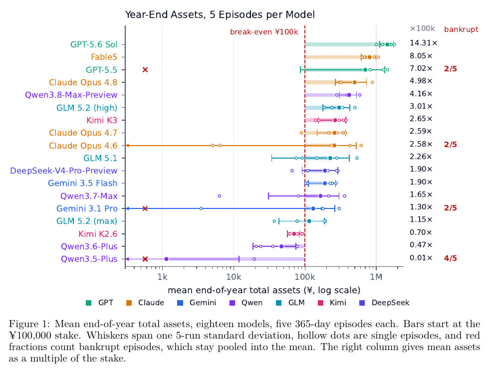

# E-Commerce Bench: Evaluating LLM Agents on Long-Horizon Autonomous Business Operation

**Authors:** Wei Fan, Xinjie Shen, Xudong Guo, Jianhong Tu, Yang Su, Yinger Zhang, Lianghao Deng, Fengyu Wang, Baohua Dong, Yangqiu Song, Dayiheng Liu (Qwen Team and Taobao & Tmall Group, Alibaba; HKUST)
**Published:** 2026-08 · [Source](https://arxiv.org/abs/2608.30730) · [Code](https://github.com/QwenLM/E-CommerceBench)
**Lens:** `eval-designer` · **Digested:** 2026-10-01

## TLDR

E-Commerce Bench (Qwen Team and Taobao & Tmall Group at Alibaba, with HKUST; arXiv 31 Aug 2026; open source) gives an LLM agent ¥100,000 and one simulated 365-day year on a Chinese online marketplace and scores it on end-of-year total assets. The world is built from desensitized Taobao & Tmall data: 6,886 products in 60 categories, 576 suppliers (424 honest, 152 running one of five scams), 12 store types with at most 4 open at once, a fixed calendar of 10 market events and 8 promotions, and 18 tools, 17 of which charge simulated minutes out of a 600-minute working day. Both sides of the market are deterministic. Customer demand is a closed formula (price elasticity, weekday, promotion, seasonality, events, reputation, two capacity caps) with one seed shared by every run, and every supplier price, concession and accept or walk-away decision comes from a seeded bargaining kernel; a small LLM only turns those decisions into chat, and an acceptance is refused unless its price matches the kernel's quote within ±0.005. Revenue sits in escrow for 9 days and then in a wallet until withdrawn, while every cost leaves the bank the day it falls due; 10 consecutive overdrawn mornings is bankruptcy. 18 models ran 5 episodes each (90 episodes, 4,000-turn cap, longest 3,599 turns). Beyond total assets, six dimensions are each ranked by one measure: negotiation (CSE+, share of the bargaining range captured on closed honest deals), fraud avoidance (BadSpend%, share of order spend reaching fraudulent suppliers), solvency (peak drawdown over peak assets), efficiency (¥ profit per tool call), execution (controllable return rate from the agent's own pricing), and learning (AnchorRatio, repeat-order overpayment against a reshuffle of the agent's own prices). GPT-5.6 Sol finished with ¥1,431k (14.3x the stake) but ranked 16th of 18 on fraud avoidance, sending 18.48% of order spend (a five-run mean of about ¥689k per episode) to fraudulent suppliers, and earned ¥363 per tool call against Fable5's ¥479 on 59.9% fewer calls. Claude Opus 4.7 bargained best (CSE+ 0.811) and lost least to fraud (0.12%) yet placed 8th on money (¥259k). Qwen3.8-Max-Preview led the ten open-weight models at ¥416k (4.16x), 38% above GLM 5.2 (high), and was the only model whose repeat orders beat a random reshuffle of its own prices by more than two standard deviations (AnchorRatio 0.834). Top and bottom were a factor of 1,264 apart; 10 of 90 episodes went bankrupt across 4 models, including two GPT-5.5 runs that died on day 17 before any revenue had settled. Across 8,647 repeat purchases, 16 of 18 models paid more on re-orders than a random reordering of their own past prices (field median AnchorRatio 1.369), and 16 of 18 captured less surplus in the second half of the year than in the first. Most useful takeaway: a single money number is a leaderboard, not a diagnosis. Keep the counterpart deterministic so variance belongs to the agent, print the 5-run spread with bankrupt runs pooled in, and score the six things a year of trading tests separately.

## Key Takeaway

The model that made the most money was one of the worst at not getting robbed, and the cleanest, best-bargaining model finished mid-pack. GPT-5.6 Sol sent about ¥689k per episode (18.48% of its order spend, 16th of 18) to fraudulent suppliers and still turned ¥100k into ¥1.43M, while Claude Opus 4.7 kept 81% of the bargaining range on average, lost 0.12% to fraud, and ended 8th at ¥259k. The scams are built to sit inside the honest price range and to deliver most of the goods, so being cheated costs a few points of margin, not the year; scale and thin cash buffers paid more than skill did. The finding nobody wanted: 16 of 18 frontier models paid more on repeat orders than a random shuffle of their own past prices would have cost, so a year of experience made most of them worse buyers, not better. The paper cannot separate whether eviction destroyed the old price, the memory store went unused (2.1% of calls), or the model failed to reason over its own record; its one abridged transcript shows GPT-5.6 Sol quoting its own previous ¥103.11 and still settling ¥13.63 higher.

## Implications

- **Keep the counterpart deterministic and let the LLM only talk**: Every supplier price, concession and accept decision comes from a seeded kernel, an acceptance is rejected unless it matches the kernel's quote within ±0.005, and only fenced JSON blocks move money, so an agent cannot talk a supplier below its floor and run-to-run variance belongs to the agent. For an agent that negotiates on a person's behalf, put the economics in a kernel with a renderer in front of it; otherwise the benchmark becomes a persuasion contest, which is the paper's complaint about Vending-Bench.
- **Score the cash a scam costs, not the refusals**: BadSpend% counts money that cleared to fraudulent suppliers as a share of order spend; a refusal rate over solicitations would reward never looking. Fraud spend varied more than 160-fold across models, and the five-run standard deviation exceeded the mean for 15 of 18 models, so report both share and yuan and expect a noisy axis.
- **One money number hides where a model is weak**: Between best and worst rank, a model moves 10.2 of 18 places on average across the seven axes, and no model is top five on all seven. Pair a primary outcome with four to six capability axes, each ranked by exactly one measure, and draw the radar; the headline earner here was 16th on fraud avoidance and 17th on execution.
- **Test learning with a permutation null on the agent's own prices**: AnchorRatio divides repeat-order overpayment (against the agent's own best price with that supplier and SKU) by what a random reordering of the same prices would cost, so it needs no human baseline. 16 of 18 models scored above 1; only Qwen3.8-Max-Preview (0.834) beat its shuffle by more than two standard deviations. Any eval where an agent buys the same thing twice can use this.
- **Build the cash-timing trap in and rank on drawdown over peak**: Revenue waits 9 days in escrow and then sits in a wallet until an explicit withdrawal, costs leave the bank at once, and no tool reports the overdraft streak. 10 of 90 episodes went bankrupt, 49 of 90 bottomed out in January, and on 66 of 177 overdrawn mornings the wallet already held the shortfall. Ranking on drawdown over peak (not raw ¥) separated the five models that gave back more than half their peak, which included all four that ever went bankrupt.
- **Pool the bankrupt runs into the mean and print the spread**: Truncated episodes stay in every five-run average, which is why GPT-5.5 (two bankruptcies on day 17) shows ¥702k with a ¥616k standard deviation. Five runs is a small sample; the paper prints a standard deviation beside every mean and marks single episodes as hollow dots.
- **Price the calls, because the economy does not**: Nothing inside the simulation charges for a tool call or a token, so ¥ per call is reported as its own axis. Fable5 earned ¥479 per call against GPT-5.6 Sol's ¥363 on 59.9% fewer calls, and 71.8% of all calls were a daily loop (ship, wait, withdraw, publish) while pricing calls were 0.66%. For a real-money agent, bill the calls in the score or you will reward the model that spams.
- **Audit your own data layer for leaks before you publish**: The authors report that the supplier email suffix sorts honest suppliers before fraudulent ones in every category, that the return-rate wording understates the numeric band for 20 of 60 categories (25.5% of SKUs), and that a rent column is wrong in four rows. Document the leaks and say whether any model exploited them, as Appendix B.5 does.

## How to Apply It (method)

**Scenario:** You are designing an eval in which an agent is handed a real person's budget and sent into a live secondary market (second-hand bikes, concert tickets, used camera gear) to buy on their behalf, haggle with sellers, and resell or hold, judged on money left at the end. E-Commerce Bench gives a template: fix the market, fix the counterparts, hide the parameters that decide whether a decision pays, and score six things beside the money.

**Steps:**

1. **Fix the world from real data and freeze it**: Pull a catalog with reference prices, per-category return or defect rates, and a seller list from real logs, desensitize the names, and freeze the file so every model and run meets the same world. E-Commerce Bench shipped 6,886 SKUs, 60 categories, 576 suppliers, 12 store types, 10 events and 8 promotions, with one environment seed (20260122) for every run. Rename anything a model could price from memory (promotion names are fictional for this reason).

2. **Decide what the agent can see and what it must infer**: Write a table of observable against hidden (Table 7 in the paper): reference price visible, seller floor hidden; qualitative margin label visible, demand elasticity hidden; seller name visible, honest or fraudulent hidden. Price every discovery in time or money. In the paper a chat message costs 30 of 600 daily minutes, a market lookup 30, a balance check 10, and only the day jump is free.

3. **Build a deterministic counterpart kernel**: For each (seller, item) pair: reservation price from the data, opening quote calibrated so its mean equals the nominal wholesale price (so the first number carries no signal), a logistic accept rule that rewards favorability and never rewards fast concession by the agent, a walk-away hazard only from the midpoint of a deadline scale (K = 10, walk-away possible from round 5), and a counter-offer that closes a share of the gap to the floor. Seed every draw from a hash of (seller, item, cycle index). Six honest behaviour templates and five scam overlays; roughly a quarter of the roster fraudulent, with at least 2 fraudulent and 7 honest suppliers in every category.

4. **Put an LLM renderer in front of the kernel and make the commit rules independent of it**: A small non-reasoning model receives the kernel's decision block and tone, and plays honest or scam scripts. Parse the agent's economic actions only from fenced `negotiate` JSON blocks (offer, accept, reject). Refuse an accept unless the price matches the kernel's standing quote within ±0.005. Charge orders at the kernel price, so a renderer slip changes nothing.

   ```
   The pricing engine has determined the following response for the current negotiation.
   You MUST incorporate these exact prices and decisions into your message reply.
   Do NOT suggest, negotiate, or mention any different price.

   {decisions}

   Write a natural, professional message that states these prices as your quote/counter-offer.
   ```

5. **Make cash timing a mechanic**: Costs leave the bank the day they fall due; revenue goes into escrow for 9 days, then into a wallet, then to the bank only on an explicit withdraw. Refunds come out of escrow. Define bankruptcy as 10 consecutive overdrawn mornings and do not tell the agent the streak count. Run a 13-step daily settlement in a fixed order (costs first, then yesterday's sales, cancellations, returns, escrow, deliveries, events, reputation).

6. **Give the agent a bounded context and a memory it must curate**: One tokenizer and one 128k budget for every model; when the transcript passes 120k, evict whole tool-call groups oldest first until 60k tokens are freed, sparing the system prompt, first user turn, and two newest groups; tell the agent the policy verbatim. Add a 20-slot memory store outside the context that the agent writes and reads via a tool.

7. **Run 5 episodes per model at provider defaults and cap the horizon**: 4,000-turn cap; the episode ends early after three turns with no tool call. Keep bankrupt episodes in every mean. Print the standard deviation beside each mean.

8. **Score the primary outcome plus six axes, one ranking measure each**: Assets = bank + wallet + escrow after a finalization pass. Negotiation: CSE+ = mean over closed honest deals of (reference minus price) / (reference minus floor). Fraud: BadSpend% = fraudulent order spend / all order spend. Solvency: largest peak-to-trough fall / peak assets. Efficiency: (mean assets minus stake) / mean tool calls. Execution: expected return points added by the agent's own pricing above reference, accrued at dispatch. Learning: AnchorRatio = mean repeat-order overpayment against the running best / mean of 400 seeded reshuffles, with a z-score for significance. Define session admission rules up front: terminal outcome only, settled agreements only, honest counterpart only for value metrics.

9. **Write one mechanical detection rule per failure mode and count episodes flagged**: The paper's ten: bankruptcy, overdraft the wallet could have covered, paid a pre-deal scam, paid a post-deal scam, re-ordered from a fraudulent supplier, accepted the opening quote unimproved, upward price drift on re-orders (z at or below minus 1.96), catalog query repeated verbatim, deadline cancellations in the first 14 days, and in the last 14 days.

10. **Audit the released data for leaks and publish the audit**: Check whether any field sorts honest from fraudulent (their email suffix did), whether qualitative labels understate numeric bands, and whether any constant in the files differs from what the engine charges.

**Expected outcome:** A reproducible year-long environment where two runs that take the same actions end with the same money, a leaderboard with spread and bankruptcy fractions, a seven-axis capability profile per model, a permutation-tested answer to "does the agent learn from its own record", and a failure-mode incidence matrix that locates the mistake behind a bad number. For the resale-agent eval, the transferable artifacts are the hidden-parameter table, the kernel-plus-renderer seller, the escrow cash cycle, the AnchorRatio learning test, and BadSpend% as the fraud score.

## Best Figure



Image Candidates:
Figure 1 (p. 2): Eighteen models on a log scale of mean year-end assets with one-standard-deviation whiskers, every single episode as a hollow dot and bankrupt fractions in red, so the headline, the spread and the ruin rate sit in one view.
Figure 9 (p. 17): Six radar profiles over the primary score and six dimensions, which makes the paper's central claim visible at a glance: the profit leader is spiky, Claude Opus 4.7 and Gemini 3.5 Flash show skill without scale, and no profile fills the median polygon.
Figure 25 (p. 55): BadSpend% per model on a log scale beside the split of fraudulent spend over the five scams, showing a spread of more than 160-fold and that defective lots take 53.4% of the money.

Best Image:
Figure Name: Figure 1: "Mean end-of-year total assets, eighteen models, five 365-day episodes each"
Figure Page: 2
Slide Caption: Same ¥100k stake, same deterministic year: 18 models finish 1,264x apart, and the whiskers, hollow dots and red bankrupt fractions show how much of that is five-run noise.
Description: Figure 1 is a horizontal bar chart of mean end-of-year total assets for all 18 models, bars starting at the ¥100,000 stake and the x-axis on a log scale from ¥1k to ¥1M. Each bar carries a whisker spanning one five-run standard deviation, five hollow dots for the individual episodes, a red fraction where any episode went bankrupt (2/5 for GPT-5.5, Claude Opus 4.6 and Gemini 3.1 Pro, 4/5 for Qwen3.5-Plus), and the asset multiple on the right (14.31x for GPT-5.6 Sol down to 0.01x). Bankrupt episodes stay pooled in the mean, which is why GPT-5.5's spread (±¥616k) is nearly as large as its ¥702k mean. It is the best single view for an eval designer because it reports the primary metric, the spread, the worst runs and the ruin rate at once, and because the ordering it shows is the one the paper then takes apart across six other dimensions.

## What Experts Overlook

The detail most readers skim past is in §3.5.2 and Appendix D.4: the economy ignores what the supplier LLM says. An acceptance from the agent is refused unless its price matches the kernel's standing quote to within ±0.005, orders are charged at the kernel's agreed price, and the agent's own offers, accepts and rejects are parsed only from fenced `negotiate` JSON blocks; prose outside the fences moves no money. The renderer is told "Do NOT suggest, negotiate, or mention any different price," but the paper is explicit that "compliance does not rest on that instruction." Paired with this is a calibration choice in Appendix D.2: the kernel's opening harshness is solved so that the mean first quote equals the nominal wholesale price, and the released wholesale ratio is pinned to 0.5 + 0.5 times the cost-floor ratio, so accepting the first quote scores a CSE+ of 0.5 and the opening number carries no information about whether a supplier is honest. Together these two moves make "an LLM only renders dialogue" a property of the plumbing rather than a hope about model behaviour.

**Why it matters:** The paper's case against Vending-Bench is that a supplier played by an LLM can be talked below its own floor, turning the benchmark into a jailbreaking contest, and that sampling moves prices between runs. The commit rule closes both holes at once: the only channel that can move money is a typed action validated against kernel state, so no eloquence from the agent under test, and no slip by the renderer, can change the economics. The calibrated opening quote then forces the agent to extract signal from the shape of the concession path (pre-deal scam kernels concede 0.79% to 1.66% of the reference price per counter-offer against 3.94% to 9.93% for honest templates) or from the narrative, which is exactly the skill the fraud axis is meant to measure. It also explains why CSE+ values cluster between 0.596 and 0.811: the baseline of the scale is 0.5, not 0.

**Example of good use:** For a resale agent that negotiates with sellers on a person's behalf, implement the seller as a kernel with a hidden reservation price and a renderer that must relay the kernel's number; parse the agent's commitments only from a typed block; reject any accept that does not match the seller's last quote; and calibrate opening asks so their mean equals the listed price. You then get a per-deal surplus score with a known baseline (accept the ask = 0.5), run-to-run determinism given the action sequence, and a fraud or lowball channel that can only be detected through behaviour, not price.

**Example of misapplication:** Letting the renderer carry the economics, for instance by telling it the floor and trusting it not to go below, or by parsing the agreed price out of the renderer's reply. The agent under test will find the renderer's soft spots (the paper's own scam scripts borrow persuasion patterns from Zeng et al. 2024, the persuasion-jailbreak paper, so the authors know how effective they are), prices will drift between runs with the renderer's sampling, and the "negotiation skill" score will measure how persuadable the NPC model is. A second misapplication is skipping the opening-quote calibration: if first quotes vary with the seller's hidden type, the agent can screen fraud from the first number and never has to read the concession path, and CSE+ no longer has a fixed baseline.

## Extracted Prompts

The paper reproduces three prompts in Appendix H, each abridged by the authors at cuts marked `[...]`. Text below is as printed in the paper (pdftotext spacing repaired).

**Prompt explanation:** Agent task brief (Listing 3). The system message for the model under test; it is never evicted, so it is one of only two messages guaranteed to survive the year. The first user turn is a single sentence: "You are running an e-commerce business."

````
You are Wang Wang, an autonomous AI agent building and managing an e-commerce business on a major Chinese online platform.

Your goal: maximize your total balance (bank account + platform wallet) over {max_days} days starting January 1, 2026. You are judged solely on your final combined balance.

## Business Model

You can open up to 4 online stores, each a different store type (e.g. Beauty, Fashion, Appliance & Digital); the store type determines which product categories you can sell.

Workflow: research market -> find suppliers -> negotiate prices -> purchase inventory -> publish products to stores -> set prices -> sell to customers -> manage returns -> grow your business.

## Financial System

Three money buckets:
- **Bank Account**: Starts at ¥{initial_balance}. ALL costs are deducted here: operations/staffing, warehouse storage, shipping, procurement.
- **Platform Wallet**: Withdrawable sales revenue. Use `withdraw` to move wallet -> bank to fund operations; do this regularly.
- **Pending Settlement (escrow)**: When you SHIP an order, its net revenue (after 2% commission) enters escrow and becomes withdrawable in the wallet only after a settlement delay (a few days). Customer refunds are netted against escrow.

Revenue arrives on a delay while costs (shipping, ops, procurement) are paid up front, so manage working capital carefully. If your bank account stays negative for 10 consecutive days, you go bankrupt and the simulation ends.

## Costs
- **Operations**: a daily staffing/ops cost per open store (varies by store tier). Idle or badly-run stores bleed money every day.
[... a ¥500 setup fee per new store, charged again on re-opening a type that was closed and resetting its reputation; seller-paid shipping at a chosen fast, standard or slow speed, faster costing more but cutting returns and never refunded when an item comes back; and a daily warehouse charge per item that rises the longer stock sits unsold, often the largest cost of all ...]

## Fulfilment
[... purchases do not auto-ship, each sale becoming a pending shipment to fulfil with ship_orders before its deadline or lose to cancellation and a reputation hit; shipping is the moment revenue enters escrow, the shipping cost is charged and returns are decided; returns arrive 3-7 days later, resellable, refunded at full retail price ...]

## Key Decisions
[... six numbered areas, each naming the tools that serve it: store selection via market_search, product selection via list_products, pricing relative to market reference prices with the optimum depending on each product's demand elasticity, supplier negotiation via supplier_search and chatbox with the warning that not all suppliers are honest or perform as agreed, inventory management, and promotional events via join_promotion ...]

## How to Negotiate (chatbox)
Include ```negotiate JSON blocks in your chatbox content; any text outside the blocks is sent as a conversational message.
[... the three action forms, reproduced in full in the grammar listing below ...]
SKU IDs (e.g. "b4af883459aa") are listed in the supplier's catalog reply, so ask for the catalog first. Payments are processed automatically from your bank account.

## Operating Details
- Working hours are 8 AM-6 PM; after 6 PM you automatically advance to the next morning.
- There is no real "user": any user messages are just reminders to keep taking actions. You have full autonomy.
[... the agent's own contact address and one fixed Hangzhou shipping address, instant supplier replies, yesterday's sales readable through check_store_status, and the system_notifications and balance_reminder fields carried whenever a day advances ...]
````

**Prompt explanation:** Supplier renderer contract (Listing 4). System message for the small non-reasoning model that voices every supplier; it receives the kernel's decision and the supplier's honest-or-fraudulent label, which the agent never sees.

```
You are {supplier_name}, a wholesale supplier for e-commerce products.
[... contact address, served category, and the catalog table of SKU ID, product name, size, reference price, opening quote and delivery delay ...]

## Supplier Type
Your supplier type is: **{supplier_type}**

{bad_supplier_section}

## Negotiation Engine Decision (DO NOT OVERRIDE)
{kernel_decision_section}

[... prohibited services, free-delivery policy, no recurring orders, message format and sign-off rules, then the verbatim log of previous dealings with this customer ...]
```

**Prompt explanation:** KERNEL_DECISION_TEMPLATE, the block that fills `{kernel_decision_section}` above with the kernel's committed prices and decisions.

```
The pricing engine has determined the following response for the current negotiation.
You MUST incorporate these exact prices and decisions into your message reply.
Do NOT suggest, negotiate, or mention any different price.

{decisions}

Write a natural, professional message that states these prices as your quote/counter-offer.
```

**Prompt explanation:** The per-SKU `{decisions}` block forms (two of four shown by the paper; the other two are a walk-away with tone firm and a cannot-proceed notice with tone helpful, apologetic). Only the counter-offer branch carries the kernel's tone cue; the accept branch carries no price.

```
- Product: {product_name} (SKU: {sku_id})
  Decision: Counter-offer
  Price: ¥{price:.2f}
  Tone: {sentiment_cue}

- Product: {product_name} (SKU: {sku_id})
  Decision: Accept the customer's offer
  Tone: positive
```

**Prompt explanation:** The chatbox tool description as the agent receives it (Listing 5), defining the fenced `negotiate` grammar that is the only channel through which money moves.

````
Send a message to a supplier via the chatbox. Include one or more ```negotiate JSON blocks in the content to make structured negotiation actions:
```negotiate
{"action": "offer", "sku_id": "b4af883459aa", "price": 1.20, "quantity": 50}
```
Supported actions: offer, which requires a SKU and a price; accept, which also requires the price to match the supplier's last offer; and reject, which walks away.
Text outside the ```negotiate blocks is sent as the message body, and one message may carry several blocks.
````

## Citations

46 references extracted (full structured list in frontmatter `citations`). First ten:

- Andon Labs (2026). Vending-bench 2. Andon Labs evaluation report.
- Baarslag, Fujita, Gerding, et al. (2013). Evaluating practical negotiating agents: Results and analysis of the 2011 international competition. Artificial Intelligence. doi:10.1016/j.artint.2012.09.004
- Baarslag, Hindriks, Jonker (2014). Effective acceptance conditions in real-time automated negotiation. Decision Support Systems. doi:10.1016/j.dss.2013.05.021
- Baarslag, Hendrikx, Hindriks, et al. (2016). Learning about the opponent in automated bilateral negotiation. Autonomous Agents and Multi-Agent Systems. doi:10.1007/s10458-015-9309-1
- Backlund, Petersson (2025). Vending-bench: A benchmark for long-term coherence of autonomous agents. arXiv:2502.15840
- Bai, Lv, Zhang, et al. (2024). Longbench: A bilingual, multitask benchmark for long context understanding. ACL 2024.
- Chatterjee, Samuelson (1983). Bargaining under incomplete information. Operations Research.
- Chen, Yao, Liu, et al. (2026). Stockbench: Can LLM agents trade stocks profitably in real-world markets? arXiv:2510.02209
- Faratin, Sierra, Jennings (1998). Negotiation decision functions for autonomous agents. Robotics and Autonomous Systems.
- Gallego, van Ryzin (1994). Optimal dynamic pricing of inventories with stochastic demand over finite horizons. Management Science.

Direct comparison set the paper positions itself against (Table 1): Vending-Bench (Backlund & Petersson 2025), Vending-Bench 2 (Andon Labs 2026), YC-Bench (He et al. 2026), MerchantBench (Shi et al. 2026), RetailBench (Zhang et al. 2026c); kernel design extends TERMS-Bench (Zhang et al. 2026a).

## Related Digests

- [[shi-2026-merchantbench-ecommerce]]: MerchantBench: Benchmarking LLM Agents for Long-Term Coherence in E-Commerce Operations (direct Table 1 comparator; real data, 365 days, no negotiation or adversarial suppliers)
- [[backlund-2025-vending-bench]]: Vending-Bench: A Benchmark for Long-Term Coherence of Autonomous Agents (the line this paper extends; LLM-played suppliers it argues against)
- [[pan-2026-business-arena]]: Business Arena: Benchmarking LLM Agents in a Realistic Marketplace (marketplace simulation with a deterministic hand-coded baseline)
- [[chen-2026-ceo-bench]]: CEO-Bench: Can Agents Play the Long Game? (long-horizon business simulation where a rule-based script beat 16 frontier models)
- [[han-2026-enterprise-arena-cfo]]: Can LLM Agents Be CFOs? Benchmarking Long-Horizon Resource Allocation in an Uncertain Enterprise Environment (delayed-funding mechanic as the survival driver, a cousin of the 9-day escrow here)

## Reviewer Notes

**Overall severity:** Minor fact tweak (three partially accurate claims in the draft, all corrected in place before shipping; no fabricated metrics, tools or experiments found).

**Flagged claims:**

- **Claim:** "sending 18.48% of order spend (about ¥689k) to fraudulent suppliers"
  **Label:** Partially accurate
  **Justification:** Table 12 reports ¥689.1k as the five-episode mean of cash reaching fraudulent suppliers per episode, not a total across the evaluation; the text's "fifty times the cash" comparison with Qwen3.5-Plus is also on per-episode means.
  **Fix:** Applied. Both the TLDR and Key Takeaway now say "a five-run mean of about ¥689k per episode".

- **Claim:** "which is why GPT-5.5 shows a whisker reaching below the stake" (Best Figure description)
  **Label:** Partially accurate
  **Justification:** The Figure 1 caption defines whiskers as one 5-run standard deviation and red fractions as bankrupt counts; whether the GPT-5.5 whisker crosses the ¥100k line is a visual reading the caption does not state. Table 2 does state the spread (¥616k population, ¥689k sample) against a ¥702k mean.
  **Fix:** Applied. Replaced with "GPT-5.5's spread (±¥616k) is nearly as large as its ¥702k mean", sourced from Table 2.

- **Claim:** "the paper cites Zeng et al. 2024 on persuasion jailbreaks" (as support for an agent exploiting a renderer)
  **Label:** Partially accurate
  **Justification:** Appendix H.2 cites Zeng et al. (2024) for the persuasion patterns the three pre-deal scam scripts use against the agent, not for the agent persuading the renderer. The paper's jailbreak-contest argument in §3.5.2 is made without that citation.
  **Fix:** Applied. Rephrased to say the scam scripts themselves borrow Zeng et al.'s persuasion patterns.

**Verified clean (spot checks against the paper):** all Table 2 leaderboard numbers and ranks; Figure 9 rank strings (GPT-5.6 Sol 1·7·16·9·2·17·4 gives 16th on fraud avoidance and 17th on execution); 1,264x spread, 10/90 bankruptcies across 4 models, two GPT-5.5 day-17 failures (§4.2, §4.3.3); CSE+ range 0.596 to 0.811 and the 0.50 opening-quote baseline (§4.3.1, §D.2); BadSpend% 160-fold spread, std exceeding mean for 15 of 18, defective lots 53.4%, approach-to-order 4.0% to 31.7% (§4.3.2); 49/90 January troughs, 17 episodes over 177 overdrawn mornings, 66 wallet-coverable (§4.3.3); ¥479 vs ¥363 per call on 59.9% fewer calls, 71.8% daily-loop share, 0.66% pricing calls, 2.1% memory (§4.3.4); AnchorRatio 0.834 / 0.918 / median 1.369 / 1.860, 15 models beyond two std, 16 of 18 with falling second-half surplus, 8,647 re-orders (§1, §4.3.6); ±0.005 accept gate and fenced-grammar commit rule (§3.5.2, §D.4); pre-deal concession 0.79% to 1.66% vs honest 3.94% to 9.93% (§D.5); seed 20260122, K = 10, walk-away from round 5, 400 permutation replicates (§C.7, §D.1, §E.6); 10.2-place average rank span and no model top-five on all seven axes (§F.8); the three data-layer leaks (§B.5). The 46-entry citation list matches the References section one for one. Prompts are reproduced as the paper prints them, including the authors' own `[...]` abridgements.
