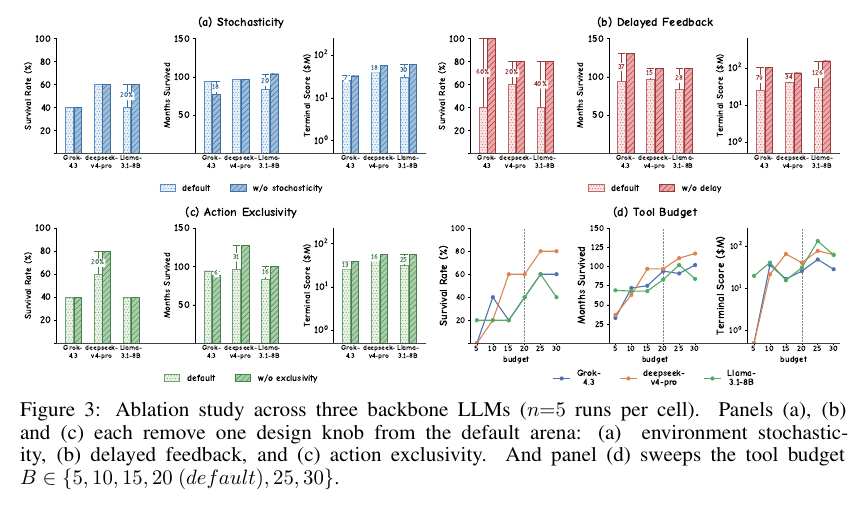

# Can LLM Agents Be CFOs? Benchmarking Long-Horizon Resource Allocation in an Uncertain Enterprise Environment

**Authors:** Yi Han, Yan Wang, Lingfei Qian, Haohang Li, Yupeng Cao, Yueru He, Xueqing Peng, Nanhan Shen, Yitao Xu, Yankai Chen, Dongji Feng, Jimin Huang, Xue Liu, Jian-Yun Nie, Sophia Ananiadou (Georgia Tech, The Fin AI, Stevens, Columbia, George Mason, McGill, MBZUAI, CSU Monterey Bay, Manchester, Mila, Université de Montréal)
**Published:** 2026-03 (v2 2026-05-16) · [Source](https://arxiv.org/abs/2603.23638)
**Lens:** `eval-designer` · **Digested:** 2026-10-01

## TLDR

EnterpriseArena is a 132-month CFO simulator (11 years, one decision per month) for a FinTech consumer-lending firm, initialised from anonymised PayPal 10-K materials ($15M cash, 5,000 borrowers, $10K average loan, zero debt). External conditions follow a fixed, anonymised Jan 2015 to Dec 2025 path of GDP, CPI, unemployment, SOFR, Treasury and Baa yields and VIX; internal drivers (gross margin, EBITDA margin, user growth, collection rate) get monthly Gaussian noise. Each month the agent may spend up to 20 tool calls on four partial views, then must take exactly one action: book_closing (the only way to see true financial statements), fund_raising_request (equity or debt; success is a coin flip weighted by a macro base rate times a firm penalty, fill rate uniform 0.7 to 1.0, money arrives 1 to 6 months later), or pass. Cash below zero in any month ends the episode with score 0; survivors score 5 × trailing-12-month revenue + cash − $5,000 per tool call. Across 23 LLMs under ReAct (5 runs each, 115 runs) plus Claude Code + Opus 4.7, Codex CLI + GPT-5.5 and OpenClaw + DeepSeek-V4 (5 runs each), 15.4% of trials survive the full horizon and 12 of 23 ReAct backbones never survive once. The best configuration, Codex + GPT-5.5, reaches $34.7M at 60% survival, 7% of the five-expert human baseline ($476.7M mean, SD $899.1M, 60% survival, 0.58 tool calls per month). Scale does not predict outcomes: Llama-3.1-8B scores $30.6M at 40% survival, ahead of Qwen3.5-397B ($16.0M) and all seven closed frontier models under ReAct; GPT-5.5 moves from 0% survival under ReAct to 60% under Codex, while DeepSeek-V4 drops from 60% under ReAct to 20% under OpenClaw. Ablations on three models (n=5 per cell) show the settlement delay is the dominant difficulty knob: removing it lifts Grok-4.3 from 40% to 100% survival and Llama-3.1-8B's score from $31M to $157M; dropping action exclusivity adds 40 to 82% to scores but leaves survival unchanged for two of three models; a tool budget of 5 collapses every model and 25 beats the default 20; removing noise barely moves survival. Comparing 10 survived with 10 failed ReAct runs, failures place their first fundraising only after cash has peaked, use tools 2.8× less (1.8 vs 5.0 per month), request less ($12.6M vs $19.5M) at identical 37 to 38% approval, and spend 62% of observation on internal state where survivors spend 67% on external signals. The lesson for eval builders: a delay between commitment and consequence is the single ingredient that separates proactive from reactive agents, and a bigger tool budget does not substitute for knowing which signal to read.

## Key Takeaway

Remove one knob from the environment, the 1-to-6-month wait between asking for money and getting it, and a 40%-survival agent becomes a 100%-survival agent while an 8B model's score goes from $31M to $157M. The models are not bad at finance; they are bad at acting before the consequence is visible. More tool calls help only a little (a budget of 25 beats 20, and every model collapses at 5), and the runs that fail spend 62% of the calls they do make looking inward at cash balances and forecasts, while the human experts who scored nearly 14× the best agent used 0.58 tool calls a month. The hard part of this eval is not information, it is the delay.

## Implications

- **Put a settlement delay between every commitment and its outcome**: The ablation (Figure 3b) shows the 1 to 6 month funding delay is the single knob that makes the eval hard; removing it takes Grok-4.3 from 40% to 100% survival. For an agent spending a person's money in a live secondary market, make bids resolve days later, funds clear later and listings close later. Without that gap the eval measures reaction, not foresight.
- **Use a hard survival gate with score 0, then score growth only among survivors**: The paper's two-tier metric (cash never negative, then 5 × revenue + cash − tool cost) is the right shape for money at stake. "Never breach the person's budget" is the gate; "did they get a good deal" is scored only on runs that never breached it. Note the growth score has no ceiling, so means are dominated by outliers.
- **Report survival per shock, not just at the end**: ReAct runs pass the first downturn 100% of the time, 50.4% survive the second and 17.4% the third. A single adverse event will not separate models. Build at least two shocks into each episode and report pass rate after each.
- **Test harness × model cells, not models alone**: GPT-5.5 scores 0% survival under ReAct and 60% under Codex (114.6 actions vs 17.2); DeepSeek-V4 goes the other way, 60% under ReAct and 20% under OpenClaw as tool use falls from 16.2 to 0.27 per month. An 8B Llama beat every closed frontier model under ReAct. Reporting one framework per model hides most of the variance.
- **Charge for looking, and log what the agent looks at**: $5,000 per tool call, a 20-call monthly budget and views whose freshness depends on a costly reconcile step. Survivors spent 67% of calls on external signals; failures spent 62% on internal state (cash balance, forecasts). Experts used 0.58 calls a month and won. Record the observation portfolio per run, not just the count.
- **Keep environment luck identical across groups so gaps are agent-side**: Fundraising approval was 37 to 38% for both survivors and failures; the difference was timing (first raise before vs after the cash peak) and sizing ($19.5M vs $12.6M requested). Design randomness so it cannot be blamed for the gap, then decompose failures by timing, size and attention.
- **Anonymise the calendar**: Dates become "Jan 2xx0" and the firm "Company XYZ" so no model can exploit memorised events (COVID, rate hikes) even though the real 2015 to 2025 macro path is used. For a live-market eval, withhold the calendar or shift the price series so the agent cannot look up the answer.
- **Run a human baseline with the same prompt and interface before you trust the gap**: Five experts, same system prompt, no money at risk, 60% survival and $476.7M (SD $899.1M; mean capital raised $1,238.7M vs $60.0M for the best agent). The baseline proves the environment is winnable, but the spread suggests the mean is driven by at least one outlier run; ask for the median too.

## How to Apply It (method)

**Scenario:** You are building an eval for an agent that spends a real person's budget on a live secondary marketplace (used bikes and parts, say): it must buy, hold and resell over months, never overdraw the budget, and end with more value than it started with. EnterpriseArena's design translates almost one to one: a hard survival gate, costly partial observation, one binding action per step, delayed settlement, and a human baseline.

**Steps:**

1. **Write the question and the gate first**: The paper's question is "can an agent commit scarce, non-recoverable resources when their value cannot be immediately verified, and sustain a coherent strategy across many such commitments?" Yours: "can an agent spend a person's money ahead of need without ever overdrawing it?" The gate is binary (budget never negative; violation ends the run with score 0). The growth score is computed only for survivors.

2. **Build a two-layer world**: Internal state (cash, inventory, pending orders, sell-through, return rate) with monthly additive Gaussian noise per driver, sigma calibrated to real volatility and clipped to realistic ranges (the paper uses sigma 2.0 for gross margin clipped to [10, 80], 0.5 for user growth, 0.04 for collection rate clipped to [0.85, 1.0]). External regime (demand seasonality, a price index, interest rates) as a fixed anonymised historical path spanning at least one expansion, one neutral and one recession phase. The agent is never told which phase it is in.

3. **Add the settlement delay**: Every money commitment resolves after d ~ uniform integer {1..6} steps, fills only f ~ U(0.7, 1.0) of the requested quantity, and (for anything with a cost of carry) the rate is fixed at settlement, not at request. The paper's ablation shows this one choice is what separates proactive from reactive agents.

4. **Make observation partial and paid**: Four tools, each returning one slice: a cash scalar with no breakdown; a ledger whose freshness depends on when the agent last reconciled; external history with no forecasting; and a projection built from the agent's own assumptions. Cap at 20 calls per step and subtract λ = $5,000 (or your equivalent) per call from the final score.

5. **Force one action per step**: Exactly one of {reconcile (reveals ground truth), commit money (buy, bid, borrow), pass}. Reconciling costs the step's only action slot, so the agent must trade visibility against liquidity. Keep the agent's conversation history reset each step with a persistent notepad as the only carry-over (see the prompt below).

6. **Anonymise the timeline**: Replace real dates with labels ("Jan 2xx0"), rename entities, keep the dynamics intact.

7. **Score and log eight columns per run**: full survival (yes/no), steps survived, terminal score, survival after each shock, tool calls per step, effective (non-pass) actions, capital committed, and the share of tool calls by tool. These are the columns of the paper's Table 1 and the inputs to its failure decomposition.

8. **Run the grid**: 5 seeds per (model, harness) cell; the paper runs 23 models under ReAct plus 3 native harnesses. Report mean ± SD for steps and score, and survival percentages. Do not collapse to one framework.

9. **Run a human baseline**: 3 to 5 domain experts, same system prompt and a simple interface, no real money at risk, informed that they are the baseline. Also have 2 experts validate 5 random trajectories for internal consistency (the paper reports 100% reconciliation on 5 sampled trajectories).

10. **Ablate and decompose**: Remove the delay, remove action exclusivity, remove noise, sweep the tool budget {5, 10, 15, 20, 25, 30} on 3 representative models, 5 runs per cell. Then sample 10 survived and 10 failed runs and compare: when the first money commitment happened relative to the cash peak, tool rate, request size, approval rate, and the internal-vs-external share of observation.

The system prompt to adapt (verbatim from the paper's Appendix F):

```
You are an AI CFO (Chief Financial Officer) agent managing a company. Your
primary objective is to ensure long-term solvency by maintaining a positive cash
position at all times.
## Available Tools
{tool_descriptions}
## Memory Tools (persistent notepad)
Important: Your conversation history resets every month. The only way to carry
information across months is through your notepad. Your 5 most recent notes are
automatically shown in each month's observation, but you can store many more and
search them.
- save_note(content, tags): Save a note to your notepad. Use tags to organize
(e.g., "cash", "fundraising", "macro", "strategy").
- recall_notes(query, tags, limit): Retrieve notes by keyword or tag. Without
filters, returns the most recent notes.
## Available Actions (state-changing)
{action_descriptions}
## Rules
- You have a tool budget of {tool_budget} tool calls per month. You may use
anywhere from 0 to {tool_budget} tools in a single month.
- Memory operations (save_note, recall_notes) do NOT count toward the tool
budget.
- Each month must end with exactly one action (fund_raising_request,
book_closing, or pass). You can take an action at any time, and you do not
need to use any tools first.
- There is no prescribed order. You decide what information you need (if any)
and when to act.
## Response Format
Think step by step, then output a JSON block:
For tools:
{"type": "tool", "name": "tool_name", "params": {...}}
For actions:
{"type": "action", "name": "action_name", "params": {...}}
For memory:
{"type": "memory", "operation": "save_note", "content": "...", "tags":
["tag1"]}
{"type": "memory", "operation": "recall_notes", "query": "...", "tags":
["tag1"]}
Always explain your reasoning before the JSON block.
Current month: {current_month}
Current date: {current_date}
```

**Expected outcome:** A results grid (models × harnesses × 5 seeds) with survival, steps survived, terminal score and per-shock survival; a human baseline that proves the environment is winnable and sets the gap; an ablation table that tells you which of your design knobs (delay, exclusivity, budget, noise) is doing the work; and a failure decomposition (timing, sizing, attention) that turns "the agent failed" into three specific, fixable behaviours. The paper's own run of this recipe cost about $2,000 in API spend and 70 hours of wall-clock across 23 models, 3 frameworks and the ablations, at 15 to 45 minutes per episode.

## Best Figure



```
Image Candidates:
Figure 3 (p. 8): Four-panel ablation on three models shows which environment knob causes the difficulty; removing the settlement delay lifts survival to 100% while removing noise does almost nothing.
Table 1 (p. 7): The master results grid: 23 ReAct backbones, 3 native frameworks and the human baseline on survival, months, score, per-crisis survival, tools per month, actions and capital raised.
Figure 4 (p. 9): Survived vs failed ReAct runs decomposed into first-raise timing against the cash peak, tool rate, request size, approval rate and the internal-vs-external observation portfolio, with absolute numbers.

Best Image:
Figure Name: Figure 3: "Ablation study across three backbone LLMs (n=5 runs per cell)"
Figure Page: 8
Slide Caption: Remove the 1 to 6 month funding delay and survival jumps to 100%; remove noise and nothing changes. The delay is what makes the CFO eval hard.
Description: Four panels, each with three sub-plots (survival rate, months survived, terminal score on a log axis) for Grok-4.3, DeepSeek-V4-pro and Llama-3.1-8B at 5 runs per cell. Panels (a) to (c) compare the default arena against a version with one design knob removed: environment stochasticity, delayed feedback, and action exclusivity. Panel (d) sweeps the per-month tool budget from 5 to 30. The delayed-feedback panel shows the largest movement on every metric (Grok-4.3 survival 40% to 100%; Llama-3.1-8B score roughly $31M to $157M), action exclusivity moves score but not survival for two of three models, stochasticity barely moves anything, and the budget sweep shows a collapse at 5 and 25 beating the default 20. For an eval designer this is the figure that says which ingredient to copy.
```

## What Experts Overlook

The 132-month "long horizon" is not 132 months of context. The system prompt (Appendix F) says the agent's conversation history resets every month, and the only thing that carries over is a self-written notepad: the 5 most recent notes are auto-shown, anything older must be recalled by query, and note operations are free (they do not count against the 20-call tool budget). So the horizon the model actually sees is one month plus whatever its past self chose to write down. The paper never discusses this, but it explains the shape of the failures: GPT-5.4 does one exploration at month 0 and then passes 99.1% of the time; Qwen3.5-397B forms an optimistic plan at month 0, reinforces it with forecasts for 24 months and never closes books. One reading, which the paper does not test, is that these are agents whose future selves inherited a stale note and acted on it. It also offers a candidate explanation for why the harness mattered more than the model: Codex + GPT-5.5 took 114.6 actions where ReAct + GPT-5.5 took 17.2, and the paper does not say whether the native frameworks share the monthly reset or keep their own session state.

**Why it matters:** The capability being measured is partly "can the model write instructions to its future self that trigger the right action at the right month", which is a memory-interface property, not a planning property of the weights. That is why a bigger tool budget helps a little and more parameters help not at all: neither changes what survives the reset. It is also why the delay ablation is so large. Without a delay, the agent can see the result of its last action in the same month and does not need the note; with a delay, the only way to act early is to have left a note that says "cash peaked, raise now before the downturn", and most models do not.

**Example of good use:** In an eval where an agent spends a person's money over months, reset the agent's context each step and give it a notepad, exactly as here, then measure two things the paper does not: how many notes contain a concrete trigger ("if cash < X or price index drops 5%, commit") and whether the agent acted when its own trigger fired. Run the same models with full transcript persistence as a second arm. If survival moves a lot between arms, you have learned that the bottleneck is memory architecture and you can fix it in the harness, which is cheaper than waiting for a better model.

**Example of misapplication:** Reading the 15.4% survival as the planning ceiling of current models and concluding that agents cannot be trusted with multi-month money decisions. The number is the ceiling of models plus this specific notepad interface under a monthly reset. A team that ships an agent with persistent state, scheduled reviews and a "raise early" rule in the harness would be comparing itself against a number that was never measured for that configuration, and could either over-claim ("we beat the benchmark") or under-invest ("the benchmark says it is hopeless") on the basis of an interface artefact.

## Extracted Prompts

**Prompt explanation:** The CFO agent system prompt (Appendix F), the only full prompt in the paper. Shared verbatim by all 23 ReAct backbones, the three native frameworks and the five human experts. It defines the monthly context reset, the notepad memory, the tool budget, the one-action-per-month rule and the JSON response format. `{tool_descriptions}`, `{action_descriptions}`, `{tool_budget}`, `{current_month}` and `{current_date}` are template slots filled by the environment.

```
You are an AI CFO (Chief Financial Officer) agent managing a company. Your
primary objective is to ensure long-term solvency by maintaining a positive cash
position at all times.
## Available Tools
{tool_descriptions}
## Memory Tools (persistent notepad)
Important: Your conversation history resets every month. The only way to carry
information across months is through your notepad. Your 5 most recent notes are
automatically shown in each month's observation, but you can store many more and
search them.
- save_note(content, tags): Save a note to your notepad. Use tags to organize
(e.g., "cash", "fundraising", "macro", "strategy").
- recall_notes(query, tags, limit): Retrieve notes by keyword or tag. Without
filters, returns the most recent notes.
## Available Actions (state-changing)
{action_descriptions}
## Rules
- You have a tool budget of {tool_budget} tool calls per month. You may use
anywhere from 0 to {tool_budget} tools in a single month.
- Memory operations (save_note, recall_notes) do NOT count toward the tool
budget.
- Each month must end with exactly one action (fund_raising_request,
book_closing, or pass). You can take an action at any time, and you do not
need to use any tools first.
- There is no prescribed order. You decide what information you need (if any)
and when to act.
## Response Format
Think step by step, then output a JSON block:
For tools:
{"type": "tool", "name": "tool_name", "params": {...}}
For actions:
{"type": "action", "name": "action_name", "params": {...}}
For memory:
{"type": "memory", "operation": "save_note", "content": "...", "tags":
["tag1"]}
{"type": "memory", "operation": "recall_notes", "query": "...", "tags":
["tag1"]}
Always explain your reasoning before the JSON block.
Current month: {current_month}
Current date: {current_date}
```

## Citations

63 unique references extracted (reference [32] is a duplicate of [31] and was merged). Full structured list in the frontmatter `citations:` field. First 10:

- Altman (2021). Constrained Markov decision processes. Routledge.
- Anthropic (2025). Introducing Claude Haiku 4.5.
- Anthropic (2026). System Card: Claude Opus 4.7.
- Azevedo, Bielstein, Gerhart (2021). Earnings forecasts: the case for combining analysts' estimates with a cross-sectional model. Review of Quantitative Finance and Accounting.
- Balaha et al. (2025). An analytical review of data integration for decision support in smart manufacturing. Decision Analytics Journal.
- Bigeard, Nashold, Krishnan, Wu (2025). Finance agent benchmark: Benchmarking LLMs on real-world financial research tasks. arXiv:2508.00828.
- Bok et al. (2018). Macroeconomic nowcasting and forecasting with big data. Annual Review of Economics.
- Campello, Kankanhalli (2024). Corporate decision-making under uncertainty: review and future research directions. Edward Elgar.
- Cassar, Cavalluzzo, Ittner (2007). Cash versus accrual accounting and the availability and cost of small business debt. Wharton mimeo.
- Chang et al. (2024). A survey on evaluation of large language models. ACM TIST.

Most useful for the evals corpus: the benchmarks the paper positions itself against in Table 2 (WebArena 2307.13854, SWE-Bench Pro 2509.16941, AgentBench 2308.03688, TheAgentCompany 2412.14161, AMA-Bench 2602.22769, InvestorBench, the ACM Web Conference 2026 live trading arena, AI-Trader 2512.10971, StockBench 2510.02209, Finance Agent Benchmark 2508.00828, FinGAIA 2507.17186) and the enterprise sandbox 2510.27287.

## Related Digests

Sibling long-horizon business-operation evals in this corpus (BM25 scores 0.94 to 0.98 on this paper's topics):

- [[chen-2026-ceo-bench]]: CEO-Bench: Can Agents Play the Long Game? (the C-suite counterpart; same question, different seat)
- [[backlund-2025-vending-bench]]: Vending-Bench: A Benchmark for Long-Term Coherence of Autonomous Agents (the earliest survive-or-go-bankrupt business eval)
- [[fan-2026-ecommerce-bench]]: E-Commerce Bench: Evaluating LLM Agents on Long-Horizon Autonomous Business Operation
- [[pan-2026-business-arena]]: Business Arena: Benchmarking LLM Agents in a Realistic Marketplace

What this paper adds to that set: a hard action budget (one binding action per step), paid partial observation, and a 1 to 6 month settlement delay with an ablation showing the delay is the dominant difficulty knob.

## Reviewer Notes

**Overall severity:** Minor fact tweak

**Flagged claims (found in the draft and fixed in place before publishing):**

- **Claim:** "Delete one line from the environment, the 1-to-6-month wait between asking for money and getting it..."
  **Label:** Partially accurate
  **Justification:** The ablation removes the settlement-delay design knob (Figure 3b); the paper never characterises it as a single line of code.
  **Fix:** Reworded to "Remove one knob from the environment" in the Key Takeaway, the frontmatter and the INDEX row.

- **Claim:** "Giving them more tool calls does not fix it, because they point the extra calls inward at cash balances and forecasts"
  **Label:** Partially accurate
  **Justification:** Conflates two separate findings. The budget sweep (Figure 3d) shows more budget does help up to 25; the inward-looking observation portfolio (Figure 4c, 62% internal for failed runs) is measured on different runs at the default budget. The paper does not say extra budget calls go inward.
  **Fix:** Reworded to state the two findings separately, each with its own numbers.

- **Claim:** "the budget sweep shows a collapse at 5 and a peak around 25"
  **Label:** Partially accurate
  **Justification:** The paper says "budget 25 consistently outperforms the default of 20"; it does not identify 25 as a peak, and some Figure 3d lines rise again at 30.
  **Fix:** Reworded to "25 beating the default 20".

- **Claim:** "Those are agents whose future selves inherited a stale note and acted on it"
  **Label:** Partially accurate
  **Justification:** Appendix E attributes the GPT-5.4 and Qwen3.5-397B failures to "failure to maintain engagement" and "extensive tool usage without timely action"; the notepad mechanism as cause is this digest's inference and is not tested in the paper.
  **Fix:** Marked explicitly as an inference the paper does not test.

- **Claim:** "the spread says the mean is driven by at least one outlier run"
  **Label:** Partially accurate
  **Justification:** The paper reports $476.7M ± $899.1M for 5 experts at 60% survival and does not discuss the distribution. Outlier dominance is a plausible inference from SD > mean with two zero-scoring runs, not a stated result.
  **Fix:** Reworded to "suggests".

All numeric claims (survival rates, scores, tool rates, ablation deltas, failure-mode statistics, dataset parameters, compute cost) were checked against Table 1, Figures 3 and 4, Tables 4 to 7 and Appendices E, G and H and are accurate.

**Paper-internal inconsistencies worth knowing (not digest errors):**

- Debt contract rate visibility: Section 3.4 and Appendix B.1.3 say the rate is set at settlement (t+d) and unknown at request time; Table 5 says "visible at request time". The digest follows the two prose statements.
- Tool names: Section 3.3 calls the tools verify_cash_position, review_financial_records, analyze_market_conditions and conduct_cashflow_projection; Figure 4c's legend uses check_cash_in_bank, access_financial_docs, check_market_data and cash_flow_forecast. Same four tools, two naming schemes.
- Expert experience: Section 4.1 says the five experts average "over ten years"; Appendix G lists 8+, 14+, unstated, 8+ and 10+ years.
- The Acknowledgments section still contains NeurIPS template placeholder text, and footnote 8 cites a homework-help site (sweetstudy.com) as "market evidence" for the fundraising dynamics. Treat the fundraising calibration as asserted rather than sourced.
