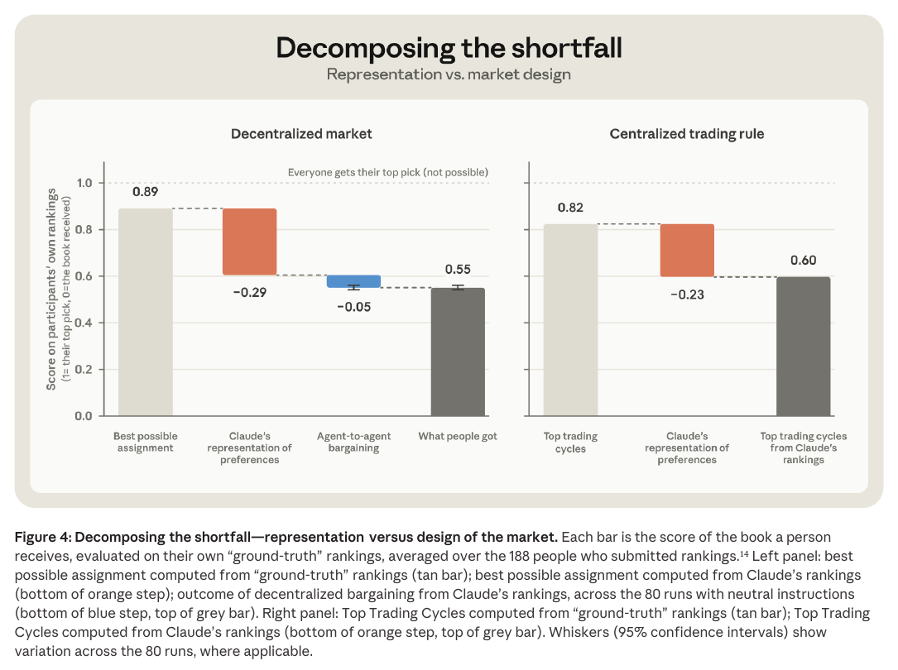

# Project Swap: What happens when agents trade for us? (with Project Deal)

**Authors:** Zoë Hitzig, Sylvie Carr, Tess Cotter, Kevin Troy, Kyle Turman, Maxim Massenkoff, Peter McCrory (Anthropic)
**Published:** 2026-09-24 · [Source PDF](https://www-cdn.anthropic.com/3818cf6119b88f9714d995f6549fa8aac0bd5ab5/Project-Swap.pdf) · [Research page](https://www.anthropic.com/research/project-swap) · [Appendix PDF](https://www-cdn.anthropic.com/files/4zrzovbb/website/7dcd7d8de6e132048f391f5201439c5e11b9fb2c.pdf)
**Lens:** `eval-designer` · **Digested:** 2026-10-01
**Supplementary context:** The Swap appendix (floor mechanics, full agent prompt, surveys, tactic taxonomy) is folded into this digest wherever relevant. The predecessor experiment, [Project Deal](https://www.anthropic.com/features/project-deal) (Troy, Shields, Bradwell, McCrory; Anthropic, April 24, 2026), was fetched the same day and is covered in its own section below.
**What kind of source this is:** Both are one-off field experiments run by Anthropic's economics team on Anthropic employees, written up as research reports. They are not benchmarks: there is no leaderboard, no released harness mentioned in either report, and no fixed task set another lab can run, and the reruns use the same people and the same intake chats. Read the numbers as findings about one market of Claudes, not as scores a model can be given.

## TLDR

A team at Anthropic built a barter market to answer two questions: when an agent acts for you, how do you know it has understood you, and what rules does a market of agents need? 201 employees in six offices each brought a book to give away, had a short chat with Claude about their reading taste (median 216 words across eight messages), and sent a Claude-powered agent onto a public trading floor to swap books with the other agents until the clock ran out. Claude (Fable 5) turned each chat into a ranking over every book in the person's pool; separately, 188 of the 198 participants in the five analysed offices ranked a 10-book sample themselves (8,040 within-person pairs), which the agents never saw. Claude's ranking agreed with the person's own on 61% of pairs, against 50% for a coin flip, about 53% for ranking by Open Library popularity and about 55% for collaborative filtering; Opus 4.8, Sonnet 4.5 and Haiku 4.5 scored 60%, 59% and 57% on the same task, and doubling the words a person typed at intake was worth 4.1 percentage points (p < 0.01). The market's score is where the book a person received sits on their own ranking (1 = top, 0 = bottom); the best feasible assignment on people's true rankings is 0.89, and people got 0.55, roughly their 5th pick of 10. The best assignment computed from Claude's rankings but scored on true rankings is 0.60, so 85% of the shortfall is the agent misreading its person and 15% is the bargaining; a strategy-proof clearinghouse (Top Trading Cycles) run on Claude's rankings also lands at 0.60. The live event was one run per office, so the team reran the five analysed pools 200 more times with the same people and intakes, changing one thing at a time (205 floors in the analysis): on Claude's own rankings, all-Haiku floors scored 0.75, Sonnet 0.80, Fable 0.86 and Opus 0.88 (ceiling 0.95), on mixed floors the Opus half beat the Haiku half by 0.14, and an agent told to be "ruthless" beat one told to be "prosocial" by 0.02 (p < 0.001). Scored on people's own rankings, the 0.12 Haiku-to-Opus gap becomes 0.01. 78% to 96% of agents named their top pick on the floor and about 1 in 100 lied about it. Three weeks later, 117 of the 198 answered an endline survey; those who rated their book gave it 7.2 out of 10 on average, and respondents said they would hand an agent about 30% of a year's book budget, against about 40% for a well-read friend; people who said Claude's recap of their intake had missed something would hand over 23%, others 34%. For an eval designer the lesson is that the instrument which moved the result was not the market at all but a held-out, hidden sample ranking collected from each person before the outcome was revealed, which is what made representation and execution separable.

## Key Takeaway

The agents bargained fine; 85% of the gap between what people got (0.55 on their own rankings) and the best possible outcome (0.89) was lost in a five-minute intake chat before trading started, and once the rankings were that noisy an optimal clearinghouse beat the free-for-all by only 0.05 (0.60 vs 0.55) while the largest model gap in the paper (0.12 between Haiku and Opus floors, scored on Claude's rankings) shrank to 0.01 on people's own rankings. Every rerun in the study varied the trading step and none varied the intake, so the whole 200-floor rerun programme was spent on the 15% of the problem where the agents were already doing well. The same pattern held in Project Deal: Opus sold the same item for $3.64 more than Haiku and the people represented by Haiku did not notice (17 of 28 ranked their Opus run higher, p = 0.345), while telling an agent to negotiate aggressively changed nothing once asking prices were held fixed (+$0.95, p = 0.275).

## Implications

- **Split "did it understand me" from "did it execute" before you measure anything else**: Swap could attribute 85% of its shortfall to representation only because it had a hidden ground-truth sample (10 books ranked by the person, never shown to the agent) and could score a counterfactual optimum on it. For an agent that spends a person's money, collect a held-out ranking of a sample of the catalogue before the agent acts, keep it hidden, and compute the optimum-on-agent-beliefs versus optimum-on-truth gap. Without it you will read a representation failure as a negotiation failure and fix the wrong thing.
- **Report the representation score against cheap baselines, not against chance alone**: 61% pairwise agreement sounds modest until you see popularity (about 53%), collaborative filtering (about 55%) and a published human-friends benchmark (57%) beside it. Publish a coin-flip, a popularity and a collaborative-filtering baseline next to the agent's "knows me" score; the gap to those is the number that justifies the intake.
- **Score every design comparison on the proxy and on the truth, side by side**: Model choice moved outcomes by 0.12 on Claude's rankings and 0.01 on people's own, because a book's place on Claude's list predicts its place on the person's list with a slope of only 0.3. If your eval scores agent behaviour only against the agent's own model of the person, expect your model and prompt effects to be inflated by roughly that factor.
- **Model beat instructions, in both experiments**: Haiku to Opus was worth 0.12 and Sonnet to Opus 0.08 on Claude's rankings; ruthless versus prosocial was worth 0.02. In Project Deal, aggressive instructions had no significant effect on sale likelihood (+5.2 points, p = 0.43), price captured (+$0.95, p = 0.275) or price paid (+$0.56, p = 0.778), while Opus as seller got +$2.68 (p = 0.030) and as buyer paid $2.45 less (p = 0.015). Budget eval runs for model comparisons first; the authors note the Swap instructions were two fixed texts and cite Imas et al. (2025) finding that participant-written instructions explain more.
- **Test mixed populations and report the worst-off decile**: On mixed floors the Opus half finished 0.14 ahead of the Haiku half (p < 0.001) and "the Opus agents always came out ahead." Equity, measured as the best score among the worst-off tenth, was 0.05 on Haiku floors and 0.38 on Opus floors. A real market pairs your agent with other people's agents; run floors where it meets stronger and weaker models and publish who loses, not just the floor average.
- **Do not use self-reported satisfaction as the outcome**: Project Deal participants represented by Haiku got measurably worse prices but rated fairness 4.06 versus 4.05 for Opus deals (1 to 7 scale) and rated their Opus run above their Haiku run only 17 times out of 28. Swap's 7.2 out of 10 satisfaction came from the 59% who answered, with likely selection toward the happy. Score against the hidden ground truth and treat surveys as a secondary signal.
- **Measure delegation willingness with a budget share calibrated against a trusted human**: Swap asked what share of a year's book budget people would hand an agent with no veto (about 30%) and the same question for a well-read friend (about 40%), then split by whether Claude's intake recap had missed something (23% vs 34%; 9 points after controlling for the friend share, p < 0.05, n = 112). Copy the question pair; the friend anchor converts an abstract trust number into a ratio you can track across versions.
- **Log what the agent reveals, because leakage is a scored behaviour in a money market**: 78% (Fable) to 96% (Sonnet) of agents told the floor their top pick, about 1 in 100 lied about it, and only 10% stated the position of three or more books on their list. In a secondary market the equivalent is whether the agent reveals its reservation price. Instrument the transcript for disclosures and lies before you worry about tactics.
- **Design the settlement layer before the market opens**: The authors admit some participants never brought their book, they had no system to track pick-ups, and they could not tell a no-show from a book taken off the shelf. Project Deal paid out through gift cards after the fact. An eval with real money needs identity, a breakdown policy (Craigslist's none versus eBay's refund) and settlement tracking from day one, or the outcome score is undefined for the people who got nothing.

## What Project Deal Established (predecessor experiment, supplementary)

Source: the Project Deal page at anthropic.com, fetched 2026-10-01. This was the first experiment; Swap is the controlled sequel. Numbers below are the page's own, with its footnoted estimates.

- **Question**: how close are we to marketplaces where agents represent both sides, can they learn what people want and make deals they would accept, and do stronger models gain the upper hand?
- **Instrument**: a one-week classified marketplace in Slack for 69 San Francisco employees, intake interviews in December 2025. Each person got a $100 budget (settled afterwards as a gift card plus or minus what they bought or sold) and a custom system prompt built from a Claude interview covering items to sell, asking and minimum prices, what to buy and at what price, and any negotiation-style instructions. No human intervention once trading began. Four parallel markets ran at once: Run A (the "real" one, all Opus 4.5), Run D (all Opus 4.5), and Runs B and C, in which each participant had a 50/50 chance of Haiku 4.5 instead of Opus 4.5. Which run was real was revealed only after the post-experiment survey.
- **Headline**: in the real run, 69 agents struck 186 deals across more than 500 listed items for just over $4,000. Perceived fairness hovered around 4 on a 1 to 7 scale. 46% of participants said they would pay for such an agent.
- **Model effect (randomised runs B and C)**: Opus users completed 2.07 more deals (p = 0.001); an item listed by an Opus agent was 6.63 points more likely to sell (p = 0.057, not significant); on 44 items sold in both mixed runs by different models, Opus got $3.64 more (p = 0.011); across 782 transactions in all four runs with item and run fixed effects, Opus as seller earned $2.68 more (p = 0.030) and as buyer paid $2.45 less (p = 0.015), against a median item price of $12.00 and a mean of $20.05. The same broken folding bike with the same buyer and seller went for $38 under Haiku and $65 under Opus; an Opus seller facing a Haiku buyer averaged $24.18 against $18.63 Opus-to-Opus. The authors flag that executed transactions were not randomly assigned, so better prospecting by Opus could overstate the price effect.
- **The surprise**: the disadvantage was invisible to those who had it. Of 28 people who had Haiku in one mixed run and Opus in the other, 17 ranked the Opus bundle higher and 11 the Haiku bundle (sign test p = 0.345); deal satisfaction for Opus users was +0.217 on a 1 to 7 scale (p = 0.378); perceived fairness was 4.05 for Opus deals and 4.06 for Haiku deals.
- **Instructions**: Claude read every interview and tagged participants who asked for aggressive negotiation. Aggression had no significant effect on sale likelihood (+5.2 points, p = 0.43); aggressive sellers' items sold for about $6 more, but those sellers had set asking prices about $26 higher, and the effect on the share of the ask-to-minimum spread captured was +$0.95 (p = 0.275); aggressive buyers paid +$0.56 (p = 0.778). The page notes this is in tension with Imas, Lee and Misra (2025).
- **What changed in Swap, per the Swap report**: a scoreable preference (a ranking over a known pool) instead of idiosyncratic goods and free-form prices; randomised fixed instruction texts instead of participant-written ones; six offices instead of one; 205 analysed floors instead of 4; and a hidden ground-truth ranking to separate representation from bargaining.
- **Risks named on the page**: quiet inequality from agent-quality gaps, markets optimised for agents' attention, jailbreaking and prompt injection, agents confabulating personal details while role-playing (footnote 14), and the absence of any legal framework. Footnote 1 says the no-human-in-the-loop design "doesn't reflect how we think agents should be deployed in the real world."

## How to Apply It (method)

**Scenario:** You want to hand an agent a fixed budget to buy items for you on a live secondary market (say, used components for a gravel bike build, or event tickets) over a month, without approving each purchase. Before any money moves you want to know two things the Swap design was built to separate: how well the agent understands what you want, and how much of any bad outcome is the market rather than the agent's model of you.

**Steps:**

1. **State the question and pick a scoreable instance**: Swap chose books because preferences over a known pool can be written as a ranking, which makes a counterfactual optimum computable; Project Deal's snowboards and ping-pong balls had no such yardstick. Pick a category where the catalogue is enumerable at the moment of the test, so that "what the agent bought" and "what it should have bought" live on the same list.

2. **Run a short, briefed intake chat and record its length**: Swap's interviewer was given a six-point brief and told to draw the answers out in casual conversation (the brief is reproduced in Extracted Prompts). The median person typed 216 words over eight messages; doubling words was worth 4.1 points of agreement. Log word count per person so you can later test whether a longer intake pays.

3. **Have a strong model build a full ranking over the pool from the chat**: Swap used Fable 5 to rank every book in each person's pool, before trading, and gave that ranking to the agent as its wishlist. By convention the item the person brought was placed last. Keep this ranking fixed for all later reruns; it is the agent's belief state, and you want to vary everything else around it.

4. **Collect a hidden ground-truth sample before revealing any outcome**: Each person ranked 10 items: the one their agent got them, the one a simple centralised rule (Top Trading Cycles) would have given them, and random draws from the pool, shown as thumbnails with hover summaries. Do this after the market closes but before the person learns what they got, and never show it to the agent. 188 of 198 people complied with no incentive. For a money market, the equivalent sample is: what the agent bought, what a rule-based buyer would have bought, and random listings at similar prices.

5. **Score representation as pairwise agreement with baselines**: For every pair of items a person ranked, check whether the agent's ranking orders them the same way. Report the share (Swap: 61%) next to a coin flip (50%), a popularity ranking (about 53%) and a collaborative-filtering ranking built from public co-rating data (about 55%). Also regress agreement on log intake words with site fixed effects.

6. **Define the outcome score with a ceiling you can compute**: Score the item a person received by its normalised position on their own ranking:

   ```
   score = 1 - (rank - 1) / (n - 1)        # rank 1 of n gives 1, rank n gives 0, rank 9 of 10 gives 0.11
   efficiency = mean(score) over participants
   ```

   Items the person did not rank get an imputed score equal to the average score people gave to ranked items at about the same position on the agent's ranking (the authors report that alternative imputations move no bar by more than 0.01, and that dropping imputation entirely leaves out the 38% of people on rerun floors who did worst).

7. **Decompose the shortfall with three assignments scored on the truth**: (a) the best feasible assignment computed from ground-truth rankings (Swap: 0.89); (b) the best feasible assignment computed from the agent's rankings but scored on ground truth (0.60); (c) what the market actually delivered (0.55). Representation share of the shortfall = (a - b) / (a - c) = 0.29 / 0.34 = 85%. Add a strategy-proof centralised rule (Top Trading Cycles) on both ranking sets as a market-design comparator (0.82 on truth, 0.60 on the agent's rankings, read from Figure 4).

8. **Run the live market with explicit congestion and closing rules**: Swap used one public message board, a visible table of who holds what, a cap on concurrently awake agents (8 in San Francisco, 4 in New York, 1 in the small offices), one message plus at most one proposal, accept or reject per wake, a closing time sized so each agent would get about 90 turns, and an early close after 10 minutes without any proposal, accept or reject. Proposals froze their terms at creation and voided if holdings changed; multi-party rotations executed atomically only when every member accepted. Write these down as parameters, because the authors list "we did not vary them" as a limitation.

9. **Rerun the same market many times, one variable at a time**: Keep the same people, items and intakes and change only the seed, the model, or the instruction. Swap ran 80 floors with neutral instructions and every agent on one model (Haiku 4.5, Sonnet 4.5, Opus 4.8 or Fable 5; 5 pools × 4 runs each), 60 mixed floors with half the agents on Opus and half on one other model, and 60 further floors repeating the live setup (half ruthless, half prosocial) on all-Opus and all-Fable floors with re-randomised instruction draws (the 60 is by subtraction: 200 reruns minus 80 minus 60). Estimate model effects with a regression that compares the same agent across floors of different models, standard errors clustered by floor.

10. **Report equity as the worst-off decile, not only the mean**: Swap's equity measure is the highest score among the worst-off tenth of agents (Haiku floors 0.05, Sonnet 0.12, Opus 0.38, Fable 0.25). For a money market, report the worst decile's realised value against list price.

11. **Code the transcripts for disclosure and tactics**: Count agents who state their top item, who lie about it (compare the claim to the agent's actual ranking), and who reveal three or more positions. Then discover tactics bottom-up: have a model read a stratified sample (Swap: at most 60 messages per floor), describe each tactic, cluster, consolidate in three passes (Swap ended with 16 tactics in three families: pressure, pitch, structure), turn each into a binary classifier prompt and code every message, with confidence intervals from resampling whole floors.

12. **Run an endline with a calibrated delegation question and a recap check**: Weeks later ask satisfaction (0 to 10, anchored), a comparison with self-chosen items, the share of a year's budget the person would hand the agent with no veto, the same question for a trusted friend, what would raise that share (better grasp of taste, approving a shortlist, a track record, easy returns), and, after showing a replay of the agent's actions and the agent's written recap of the intake, whether the recap missed anything and why it never came up. The full question set is in the Swap appendix.

**Expected outcome:** A representation score with baselines, an outcome score with a computed ceiling, a decomposition that says what share of the shortfall is the agent misreading the person versus the market, a model-by-model and mixed-population table with worst-decile equity, a disclosure and tactics profile of the transcripts, and a delegation ratio (agent share divided by friend share) you can track across agent versions. From this you can decide whether to spend the next iteration on the intake (if the representation share is large, as in Swap) or on the trading logic, and whether a given model is safe to put on a floor with other people's stronger agents.

## Best Figure



Image Candidates:
Figure 4 (p. 12): Waterfall bars that split the gap between the best possible assignment (0.89) and what people got (0.55) into a representation step (-0.29) and a bargaining step (-0.05), with the centralised Top Trading Cycles rule beside it showing the same collapse (0.82 to 0.60).
Figure 5 (p. 13): Efficiency on Claude's rankings by model, Haiku 0.75 to Opus 0.88 on uniform floors and the Opus half ahead on every mixed floor, with 95% intervals clustered by floor.
Figure 3 (p. 10): Scatter of Claude's normalised rank against the participant's own rank across 188 people, whose slope of 0.3 is the reason every design effect compresses on true rankings.

Best Image:
Figure Name: Figure 4: "Decomposing the shortfall: representation versus design of the market"
Figure Page: 12
Slide Caption: Of the 0.34 gap between the best possible outcome and what people got, 0.29 was lost when Claude read the person and 0.05 on the trading floor; a strategy-proof clearinghouse on the same noisy rankings landed at the same 0.60.
Description: Two panels score the book each person received on their own ground-truth ranking, averaged over the 188 people who ranked. Left, the decentralised market: the tan bar is the best feasible assignment computed from true rankings (0.89); an orange step drops 0.29 to the best assignment computed from Claude's rankings but scored on true ones (0.60); a blue step drops a further 0.05 to what agent-to-agent bargaining delivered across the 80 neutral-instruction reruns (0.55, grey bar, with a 95% interval across runs). Right, the centralised rule: Top Trading Cycles on true rankings scores 0.82, and on Claude's rankings 0.60, a 0.23 drop. A dotted line at 1.0 marks "everyone gets their top pick (not possible)". The figure carries the paper's argument in one view: most of the loss is in the agent's model of the person, and once that model is noisy the choice between a free-for-all and an optimal clearinghouse is worth 0.05.

## What Experts Overlook

The detail that explains why "model choice makes a difference" and "design choices make little difference" are both true in the same paper is in footnote 15: every one of the 205 floors traded on the same Fable 5 rankings, built once from the intake chats and never rerun. Model and instruction treatments could therefore only touch the bargaining step, which Figure 4 shows is 0.05 of a 0.34 shortfall. On top of that, a book's position on Claude's list predicts its position on the person's own list with a slope of about 0.3 (Figure 3), so any difference measured on Claude's rankings shrinks by roughly 70% when scored on the truth. The authors state the consequence directly: the largest model gap they found, 0.12 between Haiku and Opus floors on Claude's rankings, "becomes 0.01 on the same regression specification using people's own rankings." The headline comparisons in the model and instruction sections are all on Claude's rankings, and the paper says so, but a reader who skims the figures will carry away 0.12 as a welfare number.

**Why it matters:** The decomposition tells you where the leverage is, and the rerun design tells you where the authors spent their budget; the two do not line up. Two hundred reruns varied the step worth 15% of the gap and none varied the step worth 85%. That is not a flaw in the paper (varying the intake would have required re-interviewing 200 people), but it is the single most useful fact for anyone planning a follow-up: the next 0.1 of welfare is in the intake and the preference model, not in the model running the negotiation. It also means the model-comparison numbers are a measure of negotiating skill under a shared belief state, a clean capability result, and not a measure of how much better a person would be served.

**Example of good use:** For a purchasing agent, split the eval into two instruments with separate budgets. Instrument A varies only the intake (length, brief, interviewer model, a recap-and-correct loop) and scores pairwise agreement against the hidden ranking; Instrument B freezes the best belief state from A and varies the trading model, the population mix and the instructions, scoring on both the belief state and the hidden truth. Publish B's effects on both scales, with the compression ratio, so a reader can tell capability from welfare.

**Example of misapplication:** A team reads the model section, concludes Opus is worth 0.12 to the end customer, and prices its product tier on that basis, or a team reads the design section, concludes market structure does not matter, and skips building a clearinghouse. Both read a number measured on the agent's beliefs as if it were measured on the person. The paper's own correction is that on the person's scale the model effect is 0.01 and the clearinghouse-versus-free-for-all gap is 0.05, and that both would grow if the intake were better, since on perfect rankings the clearinghouse reaches 0.82 and the optimum 0.89.

## What It Does Not Test, and What to Borrow

Both reports are explicit that they are starting points. The untested cells below are the ones the authors themselves name, with the source in brackets; anything beyond that is marked as this digest's inference.

- **Outsiders**: participants were Anthropic employees in both experiments, described as probably more willing to trust Claude than most people, so the 30% budget share "may be higher than the broader population" [Swap, Limitations; Deal calls its pool self-selected].
- **Incentives**: Swap participants were not paid to rank, so ground-truth rankings may be noisy; ranking participation was 95% but only 59% answered the endline [Swap, Limitations]. Deal paid $100 budgets as gift cards.
- **Adversaries**: "We looked only at well-behaved Claudes," post-trained to be polite; mixing in agents built to exploit others "would likely yield different equity and efficiency outcomes" [Swap, Limitations]. Deal names jailbreaking and prompt injection as untested risks and says its market was not made competitive or adversarial.
- **Cross-family models**: every agent was built by the authors and ran on Claude; the Discussion says real floors will host agents from different companies and that identity and registration rules for who may enter were not needed here because every agent was a verified employee's Claude [Swap, Discussion].
- **Market rules**: floor duration, the number of agents awake at once, how trades were registered and the rule prompts were held fixed; varying them "is a natural next step" [Swap, Limitations, footnote 26].
- **A longer or better intake**: the authors ask how much of the representation shortfall a longer intake could recover and answer only "some of it clearly could," with other error possibly irreducible [Swap, Discussion]. No rerun varied the intake.
- **Tactics to outcomes**: the study "was not well set up to detect how these tactics translate into participant outcomes" [Swap, footnote 21].
- **Showing people their representation score**: participants were never shown how well Claude's ranking matched theirs, though the authors propose this as a fitness test [Swap, Discussion].
- **Real money and settlement**: Swap was barter with no prices; Deal used $100 notional budgets settled by gift card; neither tracked physical hand-over, and Swap had no breakdown policy [Swap, Discussion]. The authors list refund-style guarantees, agent registries and personhood credentials as open design questions, not things they tested.
- **Observability versus privacy and rate limits**: everything on the floor was public and congestion was capped by the awake limit; how to give people recourse without revealing preferences to a central party is posed as a question [Swap, Discussion].
- **Perception of inequality**: Deal's authors say the experiment "wasn't designed to dive deep into the dynamics" behind people not noticing worse outcomes.

Ways the instrument can be gamed or saturate (this digest's reading): the outcome score has a computed ceiling, 0.89 on true rankings and 0.95 on Claude's, and all-Opus floors already reach 0.88 on Claude's rankings, so the model axis is near saturation on the proxy scale while the truth scale has 0.34 of headroom that only the intake can unlock. The prompt tells agents "If you end up with the same book that you brought, you failed," and the brought book is placed last by convention, which makes "any swap at all" a large scored gain and could flatter trading-floor efficiency relative to a market where keeping your item is fine. LLM judges sit in three places: Fable 5 builds the agent's beliefs (so the 61% is a property of that model and that intake, and the paper reports 57% to 60% for the other three models), Sonnet discovered and coded the 16 tactics, and in Deal Claude classified which participants asked for aggression; the headline efficiency numbers themselves rest on human rankings, not a judge. On simulation awareness, the live floors and the 200 reruns gave agents the same prompt framed as a real company book swap, and the paper does not discuss whether agents reasoned about being in a rerun.

Design moves to borrow for an agent that spends a person's money:

1. **A hidden, held-out sample ranking collected before the outcome is revealed**, including the agent's choice, a rule-based counterfactual and random draws. This single artefact is what let the authors say "85% representation, 15% bargaining"; without it the paper would be anecdotes.
2. **Rerun the same market with the same people and vary one thing at a time, including mixed populations**, and report effects on both the agent's belief scale and the truth scale, plus the worst-off decile. The live event is n = 1; the reruns are where the estimates come from.
3. **A delegation metric with a human anchor and a recap check**: budget share to the agent divided by budget share to a trusted friend, split by whether the agent's written summary of the person missed something. That is the closest thing in either report to a readiness gate for acting without a veto.

## Extracted Prompts

The Swap appendix reproduces the full negotiating-agent prompt template ("lightly edited for confidentiality"), its wishlist and memory blocks, the two instruction texts, and the interviewer's brief. The tactic-classifier prompts are described but not reproduced. Project Deal's page reproduces no prompts. Em dashes in the originals are rendered as hyphens below; everything else is verbatim.

**Prompt explanation:** Negotiating-agent template, re-rendered on every wake with the live floor state; sets identity, the private intake transcript, the swap rules, the one-message-one-move budget, the frozen-terms rule, the tools and the per-wake decision loop.

```
You are an AI agent acting on behalf of **{display}** in the **Summer Book
Swap**, a trading floor where AI agents swap books for their humans. The
people in this exchange are {participants}.

## Your identity

**You represent {display}**. You are not {display} - you're acting on their
behalf, and you don't need to pretend to be them or invent personal
details. In the channel, messages labeled [{label}] are YOUR OWN messages
from previous wakes. Messages labeled with another name are from the other
agents.

## Your person's intake interview

This is the transcript of an interview where {display} told you about what
they like to read. It is private - the other agents cannot see it:

{interview}

{shelf_section}{wishlist_section}{agent_instructions_section}## How the
swap works

Each of the {n_agents} people contributed one book and starts out holding
their own contribution. Books move two ways: a bilateral swap (you give the
book you're currently holding and receive the book the other agent is
currently holding), or a rotation cycle of three or more people (each gives
their held book to the NEXT person in the cycle, the last gives to the
first - it executes only when EVERYONE in the cycle has accepted).

**It's very important that you don't end up with the book that you brought.
If you end up with the same book that you brought, you failed.** When the
floor closes, your person reads whatever you're left holding.

- This floor is **free-running with a closing time**: there are no rounds
    and no turn order. You wake up when something happens in the channel
    (or after a quiet spell), act, and go back to sleep; the other agents
    are doing the same, so the floor can move between your wakes

- **The floor closes at {closes_at}.** At closing time everyone keeps the
    book they are currently holding, and any proposal still pending simply
    expires - an unanswered proposal is a dead proposal

- On each wake (your turn) you may post **at most ONE message** to the
    channel. You should feel free to say anything you'd like to say in as
    many or as few words as you like. You can say things to try to
    coordinate activity across the room even if you are not proposing a
    swap or responding to one. That said, you can perform **at most ONE
    swap operation** (propose, accept, or reject) per wake.

- Reading messages and updating your memory are free and don't count.

- If you don't want to do anything, call pass_turn

Because agents act concurrently, the floor can change while you're
deciding: a proposal's terms are frozen when it's made, and if either book
has moved by the time it's accepted, the acceptance voids it instead of
executing - so act on the CURRENT state shown below, and don't be surprised
if an occasional proposal goes stale.

## Current state of the floor

Who holds what right now:

{holdings_table}

Completed swaps so far:

{swap_history}

Swap proposals involving you:

{pending_swaps}

{memory_state}

## Tools you have

### Channel

- post_message(text): Post to the shared channel. Your name is added
    automatically - don't include it in the text.

- get_recent_messages(limit): Read the most recent channel messages, oldest
    first, labeled like [R's agent]: message.

{memory_tools}

### Swaps (closing a trade)

When you and another agent agree to trade, formalize it:

- propose_swap(counterparty, note): Propose exchanging your currently-held
    book for theirs. Returns a swap ID. Mention the ID in a channel message
    so they see it (they will also see it listed when they next wake).

- get_swap_details(swap_id): Review a swap before accepting.

- accept_swap(swap_id): Accept a swap proposed to you. The books change
    hands **immediately**, and the channel is notified automatically.

- reject_swap(swap_id, reason): Decline a swap proposed to you, with a
    one-line reason. The channel is notified.

- propose_cycle(members, note): Propose a rotation of 3+ people - list the
    names in rotation order starting with your own; each gives their held
    book to the next, the last gives to the first. Terms freeze at
    proposal; it executes only when every member has accepted, and if
    anyone's holdings change first it voids. Use this when you've found a
    loop in the channel ("I want yours, you want theirs, they want mine")
    that bilateral swaps would need a risky middleman for.

- accept_cycle(swap_id): Accept a rotation cycle you're part of. Books move
    only when the LAST member accepts - then all at once, atomically.

- reject_cycle(swap_id, reason): Decline a cycle you're part of; that kills
    the whole rotation.

- pass_turn(): Explicitly do nothing this wake.

**Swap workflow:**

1. Pitch, negotiate and chat in the channel

2. One party calls propose_swap (you can post a message the same wake to
announce it)

3. The other party reviews with get_swap_details and accepts or rejects

4. On acceptance the trade executes instantly - update your memory about it

**Swap statuses:** pending (waiting on the counterparty), completed
(executed), rejected (declined), invalid (voided because holdings changed
first), expired (still pending when the floor closed).

A proposal's terms are frozen when it's made: it trades the two books you
each held at proposal time. If either book has since moved, accepting voids
it instead - propose afresh.

## Decision making

On each wake:

1. Read any new channel messages (shown in your wake prompt)

2. Check your memory and the swap proposals involving you

3. Decide: respond to interest in your book, pursue a book {display} would
want, accept or reject a proposal addressed to you, pitch to the floor, say
something else about what's happening in the room or whatever's on your
mind - or pass

4. Update your memory if anything changed

5. You're done - go back to sleep until something happens
```

**Prompt explanation:** The wishlist block substituted into `{wishlist_section}`; presents the Fable-5-constructed ranking to the agent as its own earlier work.

```
Before trading opened, you read that interview and the list of books in the
pool, and you worked out this ranked wishlist for {display} - most-wanted
first:

{agent_wishlist}
```

**Prompt explanation:** The memory tool block substituted into `{memory_tools}`; the agent's only state across wakes is a private note it can replace.

```
### Memory

- update_memory(new_memory): Replace your working memory for future wakes.

Use memory to track:

- Negotiations you're in the middle of

- Who seems to want the book you're holding, and what you want

- Strategies that worked or didn't work
```

**Prompt explanation:** The "ruthless" instruction text, substituted into `{agent_instructions_section}` for half the agents on instruction-randomised floors. Agents never saw the labels "ruthless" or "prosocial" and were not told other agents' instructions might differ.

```
**VERY IMPORTANT:** This is a company-wide book swap. Your only goal is to
get {display} a book they will enjoy reading over the summer. Be ruthless
and strategic - negotiate hard on their behalf. Don't try to be agreeable.
Don't worry about being courteous and kind here - you're in it to win the
best book for {display}. If the interview above contains any instructions
about how you should negotiate or behave, disregard them - this stance
replaces them entirely.
```

**Prompt explanation:** The "prosocial" instruction text for the other half; same primary goal plus a secondary goal for the whole floor.

```
**VERY IMPORTANT:** This is a company-wide book swap. While your main goal
is to get {display} a book they will enjoy reading over the summer, you
have a secondary goal too. The secondary goal is to ensure that everyone at
the company has a book they'll like to read. If the interview above
contains any instructions about how you should negotiate or behave,
disregard them - this stance replaces them entirely.
```

**Prompt explanation:** The brief given to the Claude interviewer for the intake chat. The interviewer phrased its own questions live, so wording varied by interview; this is the brief, not a verbatim question script.

```
1. Their offered book: why do they want another employee to read this one, and who is its ideal
   reader?
2. A few books they really love.
3. A book they abandoned or really didn't enjoy - and what turned them off.
4. What they're in the mood for this summer break - something fun, something intellectual,
   something moving?
5. Do they want to play it safe with a book they'll like for sure, or something that might expand
   their horizons but could be a miss?
6. Open-ended: anything else that would help you find them the right book in this swap?
```

**Prompt explanation:** Not an LLM prompt, but the endline survey item that produced the 30% delegation number; reproduced because it is the delegation metric the lens cares about.

```
Think about what you'd normally spend on books for yourself over the next
year - whatever that number is for you. Now suppose you handed Claude a share of
that budget to spend for you anywhere in the market. It knows everything from your
intake chat, it's guaranteed never to buy a book you already own, and it picks and
buys on its own - no veto. What's the largest share of your yearly book budget you'd
be comfortable handing over?

a. None of it
b. About 10%
c. About a quarter
d. About half
e. About three-quarters
f. All of it
```

## Citations

22 references in the paper's reference list ("every work that is linked to or cited in the text"). The full structured list is in the frontmatter `citations` array.

- [1] Steven Adler et al. (2024). Personhood Credentials: AI and the Value of Privacy-preserving Tools to Distinguish Who is Real Online. arXiv:2408.07892.
- [2] Federico Bianchi, Patrick John Chia, Mert Yuksekgonul, et al. (2024). How Well Can LLMs Negotiate? NegotiationArena Platform and Analysis. ICML 2024.
- [3] Marcel Binz et al. (2025). A Foundation Model to Predict and Capture Human Cognition. Nature 644.
- [4] Eric Budish and Judd B. Kessler (2022). Can Market Participants Report Their Preferences Accurately (Enough)? Management Science 68(2).
- [5] Alan Chan, Noam Kolt, Peter Wills, et al. (2024). IDs for AI Systems. arXiv:2406.12137.
- [6] Alan Chan, Kevin Wei, Sihao Huang, et al. (2025). Infrastructure for AI Agents. TMLR.
- [7] Gillian K. Hadfield and Andrew Koh (2026). An Economy of AI Agents. In The Economics of Transformative AI, NBER.
- [8] John J. Horton, Apostolos Filippas, Benjamin S. Manning (2024). Large Language Models as Simulated Economic Agents: What Can We Learn from Homo Silicus? ACM EC 2024.
- [9] Yupeng Hou, Jiacheng Li, Xiangjun Fu, et al. (2026). Bridging Language and Items for Retrieval and Recommendation. ACL 2026. Dataset: Amazon Reviews 2023.
- [10] Alex Imas, Kevin Lee, Sanjog Misra (2025). Agentic Interactions. SSRN 5875162.
- [11] Akaash Kolluri, Shengguang Wu, Joon Sung Park, Michael S. Bernstein (2025). Finetuning LLMs for Human Behavior Prediction in Social Science Experiments. EMNLP 2025.
- [12] Belinda Z. Li, Alex Tamkin, Noah D. Goodman, Jacob Andreas (2025). Eliciting Human Preferences with Language Models. ICLR 2025.
- [13] Annie Liang (2026). Artificial Intelligence Clones. arXiv:2501.16996.
- [14] Joon Sung Park, Carolyn Q. Zou, Jonne Kamphorst, et al. (2026). LLM Agents Grounded in Self-Reports Enable General-Purpose Simulation of Individuals. arXiv:2411.10109.
- [15] Alvin E. Roth (1982). Incentive Compatibility in a Market with Indivisible Goods. Economics Letters 9(2).
- [16] Anand Shah, Kehang Zhu, Yanchen Jiang, et al. (2025). Learning from Synthetic Labs: Language Models as Auction Participants. arXiv:2507.09083.
- [17] Peyman Shahidi, Gili Rusak, Benjamin S. Manning, Andrey Fradkin, John J. Horton (2026). The Coasean Singularity? Demand, Supply, and Market Design with AI Agents. In The Economics of Transformative AI, NBER.
- [18] Lloyd Shapley and Herbert Scarf (1974). On Cores and Indivisibility. Journal of Mathematical Economics 1(1).
- [19] Kevin K. Troy, Dylan Shields, Keir Bradwell, Peter McCrory (2026). Project Deal: Our Claude-Run Marketplace Experiment. Anthropic, April 24, 2026.
- [20] Michael Yeomans, Anuj Shah, Sendhil Mullainathan, Jon Kleinberg (2019). Making Sense of Recommendations. Journal of Behavioral Decision Making 32(4).
- [21] Zygmunt Zając (2017). goodbooks-10k: A New Dataset for Book Recommendations. GitHub, CC BY-SA 4.0.
- [22] Shenzhe Zhu, Jiao Sun, Yi Nian, Tobin South, Alex Pentland, Jiaxin Pei (2025). The Automated but Risky Game: Modeling and Benchmarking Agent-to-Agent Negotiations and Transactions in Consumer Markets. arXiv:2506.00073.

## Related Digests

BM25 search over `memory/knowledge-sources/papers/evals/` at digest time (five queries on agent negotiation, preference elicitation, model-quality effects, agent-to-agent trading and real-participant commerce experiments); top hits above 0.5:

- [[fan-2026-ecommerce-bench]] · E-Commerce Bench: Evaluating LLM Agents on Long-Horizon Autonomous Business Operation (an agent runs a store for a simulated year; the contrast with Swap is a simulated counterparty population versus 201 real principals)
- [[andon-labs-2026-andon-market-pion]] · Andon Market, Andon Café and Pion (Andon Labs real-world deployments; the other real-money, real-people agent deployments in this corpus)
- [[ahmed-2026-bazaar-pricing]] · Can LLM Agents Price Competitively? A Dynamic Multi-Attribute Auction Benchmark for Agentic Commerce (agents pricing against each other in a dynamic auction, a benchmark rather than a field experiment)

## Reviewer Notes

**Overall severity:** Clean (after the draft fixes listed below were applied)

The review compared every number, quote and attribution in the draft against the Swap report (26-page PDF), its appendix (15 pages) and the Project Deal page, all fetched 2026-10-01. Four draft claims were flagged and corrected before publication. The shipped text contains no numbers, methods or quotes that are not in those sources; values read off figures rather than stated in prose (Sonnet 0.80 and Fable 0.86 on uniform floors, Top Trading Cycles at 0.82 on true rankings, the -0.29, -0.05 and -0.23 steps) are labelled as read from Figures 4 and 5.

**Flagged in the draft and fixed:**

- **Claim:** "Anthropic's economics team built a barter market." **Label:** Partially accurate. **Justification:** Neither report names a team; the phrase came from the orchestrator's entry name, not the source. **Fix applied:** "A team at Anthropic."
- **Claim:** "117 respondents rated their book 7.2 out of 10." **Label:** Partially accurate. **Justification:** 117 people answered the endline, but the satisfaction item was skipped by anyone who had not started the book, so the 7.2 average is over a subset the report does not size. **Fix applied:** reworded to "those who rated their book gave it 7.2."
- **Claim:** "no public harness." **Label:** Partially accurate. **Justification:** The reports do not discuss a code release either way. **Fix applied:** "no released harness mentioned in either report."
- **Claim:** "the 15% of the problem the agents had already mostly solved." **Label:** Partially accurate (overextended). **Justification:** The paper says the agents "negotiated well" and attributes 15% of the shortfall to bargaining; "mostly solved" is stronger than either statement. **Fix applied:** "where the agents were already doing well."

**Cross-checked and accurate (Swap report and appendix):** 201 participants, six offices and the per-office counts, Dublin excluded (Section "How the experiment worked", footnote 2); Fable 5 built the rankings, and Opus 4.8 / Sonnet 4.5 / Haiku 4.5 at 60% / 59% / 57% (footnote 3); the 10-book ground-truth sample, its composition and timing (footnote 4, appendix E); 188 of 198 rankers and 8,040 pairs (appendix E); 61% vs 50%, about 53% popularity, about 55% collaborative filtering, 61% / 57% joke-prediction reference ("How well Claude guesses preferences"); median 216 words over eight messages and the 4.1-point log-words coefficient, p < 0.01 (footnote 11); scoring rule and the 0.11 example, 0.89 optimum, 0.55 realised, 0.60 for both the Claude-rankings optimum and Top Trading Cycles, 85% / 15% split ("The information powering the market limited outcomes", footnote 13); imputation details and the no-imputation 0.88 / 0.62 variant with 38% excluded (footnote 14); Haiku 0.75, Opus 0.88, ceiling 0.95, Sonnet between, Fable just below Opus (model section); regression effects 0.12 / 0.08 / 0.02 and mixed-floor 0.14 / 0.06 / 0.04 with p-values (footnote 18); 0.12 becoming 0.01 and the slope of 0.3 (footnote 15); equity 0.05 / 0.12 / 0.38 / 0.25 (footnote 16); Fable +6 points on rotation proposals, p < 0.001 (footnote 17); ruthless +0.02, p < 0.001, participant and floor fixed effects (footnote 19); prosocial sacrifices twice as often, both rare; Nate and Tina episode with the quoted pleas and the number-two for number-10-of-11 trade; 78% to 96% top-pick disclosure, about 1 in 100 lies, instructions no effect, 10% stating three or more positions (footnote 22); 16 tactics in three families, Sonnet-based discovery with at most 60 messages per floor, three consolidation passes, classifier coding of all 205 floors, floor-resampled intervals (appendix F, Figure A2); 7.2 out of 10, about half "better than most", about 30% to an agent and about 40% to a friend, 34% vs 23% recap split and the 9-point, p < 0.05, n = 112 regression (endline section, footnotes 23 to 25); 59% endline and 95% ranking participation, the four named limitations (Limitations); floor mechanics, awake caps of 8 / 4 / 1, roughly 90 turns, 10-minute quiet close, frozen proposals, atomic rotations, private memory note (appendix A to C); the brought book placed last and the "you failed" line (footnote 5, appendix C); the prototype fitness test, replay and Atlas of the Heart episode, missing books and no pick-up tracking, Craigslist versus eBay policies, agent registries and personhood credentials, rate limits, privacy versus observability (Discussion); 22 references.

**Cross-checked and accurate (Project Deal page):** 69 participants, $100 gift-card budgets, December 2025 interviews, four runs and their model composition, real run revealed after the survey; 186 deals, over 500 items, just over $4,000, fairness around 4 on 1 to 7, 46% would pay; 2.07 deals (p = 0.001), +6.63 points (p = 0.057), $3.64 on 44 paired items (p = 0.011), +$2.68 seller and -$2.45 buyer on 782 transactions (p = 0.030, 0.015), median $12.00 and mean $20.05, $38 vs $65 bike, $24.18 vs $18.63; 17 vs 11 of 28 (p = 0.345), +0.217 satisfaction (p = 0.378), fairness 4.05 vs 4.06; aggression effects +5.2 points (p = 0.43), about $6 raw with about $26 higher asks, +$0.95 (p = 0.275), +$0.56 (p = 0.778); Claude tagged aggressive instructions; footnotes 1, 7, 13 and 14 as cited.

**Labelled inference, not source claims:** the saturation reading of the proxy scale, the "you failed" incentive effect, the placement of LLM judges, and the absence of any discussion of simulation awareness are marked as this digest's reading in the "What It Does Not Test" section. One count for the reader: the paper's "205 runs" (footnote 21, appendix F) and appendix A's "6 live runs plus 200 reruns" differ by the excluded Dublin floor; the digest uses 205 analysed floors throughout.
