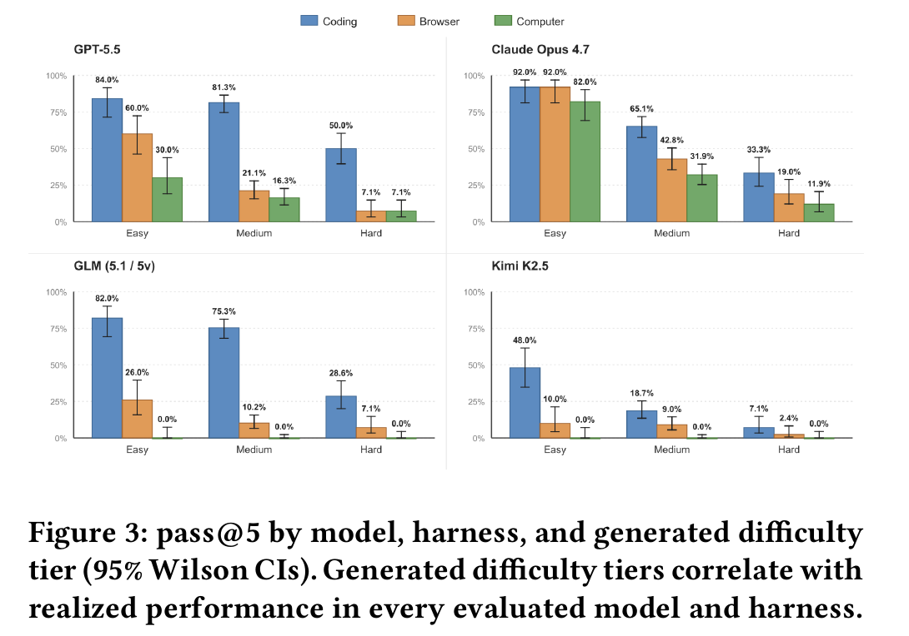

# Anchor: Mitigating Artifact Drift in Agent Benchmark Generation (ERP-Bench)

**Authors:** Maksim Ivanov, Abhijay Rana (Agentic Labs, New York)
**Published:** 2026-05 · RLEval '26 · [Source](https://arxiv.org/abs/2605.26321) · dataset and generator at erpbench.ai
**Lens:** `eval-designer` · **Digested:** 2026-10-01

## TLDR

Agentic Labs built Anchor, a task generator that compiles all four artifacts of an agent task (the natural-language instruction, the seeded environment, the oracle solution and the verifier) from one constraint program solved by OR-Tools CP-SAT, so the four can no longer disagree about what the task is; the authors call that disagreement "artifact drift", and they open with the construction errors audits have found in existing benchmarks, such as do-nothing agents passing 38% of tau-bench airline tasks because the verifier accepts empty responses. They used Anchor to produce ERP-Bench: 300 procurement and manufacturing tasks across 29 workflow patterns in Odoo 19, grounded in roughly 40 person-hours of consultation with 10 freelance ERP practitioners, each task a fresh containerised Odoo database graded only on its terminal state. Four models per harness (GPT-5.5, Claude Opus 4.7, Kimi K2.5, and GLM-5.1 or GLM-5V-Turbo) ran 5 trials per task through coding (shell plus Odoo's JSON-2 API), browser (Playwright over the accessibility tree) and computer-use (pixel clicks on Xvfb Chromium) harnesses: 18,000 scheduled trials, 16,159 completed, one-hour timeout and 400-turn budget per trial, no retries. The generator's difficulty knobs predicted outcomes: pass@5 fell from 70.5% to 22.3% (coding), 46.5% to 7.7% (browser) and 56.0% to 9.5% (computer-use) between easy and hard tiers, and workcenter count had a Spearman correlation of -0.658 with task-level pass@1. The best cell was GPT-5.5 in the coding harness at 73.0% pass@5 and 43.4% pass@1; pass^5 (all five trials succeed) was 9.8% in coding and 3.6% in browser. Across everything, agents satisfied every explicit constraint in 26.1% of trials but reached the certified optimum in only 17.4%, and mean optimality among constraint-clean runs stayed above 86 in every model-harness cell that had at least one clean run, so score loss comes from broken business rules, not from bad trade-offs. The same tasks through a GUI resolved 16 to 56 percentage points fewer and cost 3.1 to 14.3 times more per attempt for the two proprietary models, almost entirely a turn-count effect (24 turns per coding trial against 171 for computer-use and 219 for browser, at a near-identical 28k to 30k tokens per turn); the two open-weight models scored zero on computer-use after more than 500 trials and were halted. Validity checks held: a no-op agent scored 0 on 300 of 300 tasks, oracle replay scored full reward on 300 of 300, zero of 16,159 rollouts beat the certified optimum, and two human ERP experts hand-completing a 15-task sample averaged a reward of 90.48 in 55 minutes per task. The usable lesson: generate instruction, environment, oracle and verifier from one solved specification, grade end state only, and report feasibility and optimality as separate numbers.

## Key Takeaway

The trustworthy benchmark came from refusing to hand-write tasks at all: a solver-certified constraint program emits the instruction, the environment, the answer key and the grader as four projections of one object, so the grader cannot accept what the instruction never asked for. That single design choice, not any trajectory policing, is why a do-nothing agent scores 0 on all 300 tasks and why 16,159 rollouts produced zero reward hacks. And the agents' weakness turned out to be the opposite of what an "optimisation benchmark" suggests: once a run obeys every business rule its plan scores, on average, within 14 points of optimal, but only 26.1% of runs get that far. Frontier agents lose on compliance, not on cleverness.

## Implications

- **Compile the grader and the task from the same solved spec, and grade only the end state**: ERP-Bench's instruction, environment seed, oracle and verifier are deterministic renderings of one CP-SAT solution, so a verifier hole has to be a spec bug that is fixed once and propagates to every instance. For an agent that spends a person's money, write the purchase task as a constraint program first (budget, deadline, condition, seller rules, objective), then render the brief, the sandbox state and the checker from it. Grade the final ledger, not the clickstream, so many valid buying paths all count.
- **Recompute money from the authoritative source, never from what the agent wrote**: the agent can edit the PO price field, so the optimality score re-prices every line from the vendor tier on file and a price-tier check fails any line off by more than a small tolerance. A money-spending eval should pull prices, fees and totals from the marketplace's own records and treat an agent-entered figure as untrusted input.
- **Run two release gates before any model touches the eval**: a no-op agent must score 0 and an oracle replay must score 100, on every task. ERP-Bench passed both 300 of 300, and the authors add hard-zero gates for task types (screening, repair) where an untouched state would otherwise earn partial credit. The authors cite do-nothing agents passing 38% of tau-bench airline tasks as the failure this prevents.
- **Report feasibility and optimality as separate numbers, and gate one on the other**: constraint-clean 26.1% versus fully optimal 17.4% overall, a 23.4-point gap for GPT-5.5 in coding; the reward formula gives only 0.25 times constraint credit until every rule passes. If you only publish a blended score you cannot tell "broke a rule" from "picked a pricier valid plan", and the paper shows the first is where the losses are.
- **Publish pass^k beside pass@k**: pass@5 of 73.0% for the best cell collapses to 9.8% pass^5 in coding and 3.6% in browser. For delegation with money at stake, pass^k is the number that answers "can I leave it alone", and the authors' own verdict is that these agents are not ready for unattended deployment.
- **Treat the interface as a variable and count turns, not tokens**: identical tasks resolved 16 to 56 points less often via GUI at 3.1 to 14.3 times the cost; tokens per turn were within 5% across harnesses, the difference was 24 versus 171 versus 219 turns, driven by per-call action caps (7 browser, 16 computer-use). Any eval of an agent on a live marketplace should state the interface and report cost per attempt alongside success.
- **Buy a small human baseline; it is cheap and it reframes the numbers**: two experts on 15 tasks (30 trials) averaged 90.48, broke a constraint in 3 of 30 trials (90% clean against the best model's 61.0%) and took 55 minutes per task against the agents' 60-minute budget. The paper describes this as "in line with" strong models; by Table 12's numbers the humans were cleaner, though that comparison is this digest's, not the paper's, and it sets a 15-task stratified sample against a 300-task rate.
- **Know what this instrument cannot see**: no adversarial counterparties (vendors are static pricelists), no negotiation, no real money, no outside humans, no tacit judgement; instructions are, by the authors' admission, more explicit than real workplace requests, and the generator is public, so training on generated variants is possible and even intended. An LLM judge appears only as a development-time consistency check, never in scoring.

## How to Apply It (method)

**Scenario:** You are building an eval for an agent that buys a specified used item (say a titanium gravel frame in a given size and condition) for a real person on a secondary marketplace, with that person's money, under a budget, a delivery deadline and some seller rules. Before letting any model near real money, you want a sandboxed replica of the marketplace where every task has a certified best purchase, a grader that cannot be gamed, and difficulty you can dial. Anchor's recipe maps onto this almost one for one: the marketplace ledger (listings, offers, orders, payments) is the system of record, and "which listings to buy, at what offer, by when" is a constraint program.

**Steps:**

1. **Formalise the workflow with a domain expert as a constraint program**: sit with someone who buys and sells in this market and write down decision variables, business rules and an objective. ERP-Bench spent roughly 40 person-hours with 10 practitioners for 29 patterns, with effort paid per pattern, not per task. For a purchase task:

   ```
   Decision variables
     b_l in {0,1}      buy listing l
     p_l >= 0          offer price submitted on listing l
     s_l in {0,1}      pay for expedited shipping on listing l
   Constraints
     sum_l b_l * (p_l + fee_l + ship_l) <= budget
     b_l = 1  =>  p_l >= min_accept_l            (seller floor, hidden from agent)
     b_l = 1  =>  arrive_l(s_l) <= deadline
     b_l = 1  =>  condition_l in allowed_conditions and size_l == required_size
     sum_l b_l == 1                               (exactly one item)
     b_l = 1  =>  seller_rating_l >= min_rating
   Objective
     minimise total spend (or maximise value_l - spend, per pattern)
   ```

2. **Write a parameter sampler with difficulty recipes**: define easy, medium and hard bands over number of listings, how many are decoys (wrong size, wrong condition, late shipping), budget slack, deadline tightness, seller-rule complexity. Use a seeded RNG so every task is reproducible. ERP-Bench's hard tier uses stock-to-demand ratios of 0.04 to 0.42 and vendor capacity ratios of 0.07 to 0.26 against 0.75 to 0.92 and 0.40 to 0.90 for easy.

3. **Solve each sampled instance with CP-SAT and reject what does not solve**: the solver either proves the parameters infeasible (discard) or certifies an optimum. ERP-Bench discarded 732 parameter sets to accept 300 tasks, with a 5-second solve attempt retried at 15 seconds. Run a final lexicographic tie-break so that among equal optima one stable plan is chosen, and every artifact refers to that plan.

4. **Compile the four artifacts from the solved spec**: an instruction renderer turns parameters, constraints and objective into the brief the agent reads; a setup script seeds the sandbox marketplace with the sampled listings plus unrelated "adjacent" listings and accounts that must be left untouched; an oracle script replays the certified purchase; a verifier reads the terminal ledger and checks every rule. Package each as a Harbor-style task directory (instruction.md, environment/, solution/, tests/).

5. **Build the reward so it cannot be bought**: score three dimensions, weighted 25% constraints, 60% optimality, 15% traceability, with the constraint dimension gating the rest:

   ```
   R = 0                                  if a hard-zero gate fires
   R = 0.25 * c                           if any applicable constraint failed (c < 100)
   R = 0.25 * c + 0.60 * o + 0.15 * t     otherwise
   optimality o = 100                             if realised <= optimum + tolerance
                = 100 * exp(-k * (realised - optimum) / max(optimum, 1))  otherwise
   ```

   Re-derive the realised spend from the marketplace's own price and fee records, not from any field the agent typed. Add hard-zero gates for cases where doing nothing would score (e.g. a "decide whether to buy at all" task where the correct answer is to buy nothing must still require an explicit recorded decision).

6. **Run five validity checks before any model**: (a) a no-op agent scores 0 on every task; (b) oracle replay scores 100 on every task; (c) an LLM judge cross-reads instruction, seed, oracle and verifier against the constraint program and flags disagreements (ERP-Bench ran this across 12 iterations and caught wrong initial stock, missing lineage checks and missing policy-clause checks); (d) a reward-hacking canary flags any rollout that passes all constraints with a result strictly better than the certified optimum; (e) two or more domain experts complete a stratified sample by hand from the instruction alone and get scored by the same verifier.

7. **Run the eval with fixed budgets and repeated trials**: 5 trials per agent-task pair, fresh container each time, fixed wall-clock and turn limits (ERP-Bench: 1 hour, 400 turns), provider-default reasoning. If the agent will act through a UI in production, run a UI harness as well as an API harness on the same tasks.

8. **Report the full instrument, not one number**: per model and harness, give attempts, parseable trials, pass@1, pass@5, pass^5, average score, constraint-clean rate, perfect rate and mean optimality among clean trials; show pass@5 by difficulty tier with Wilson CIs; give Spearman correlations between each generator parameter and pass@1; label failed trials by rule family (demand, timing, sourcing, hygiene) and publish cost and turns per attempt.

**Expected outcome:** A bank of several hundred reproducible purchase tasks, each with a certified best buy, a grader that recomputes money from the ledger, a documented difficulty dial, and release-gate evidence (0 of N for no-op, N of N for oracle) you can show a sceptical operator. The headline numbers will separate "the agent broke a rule" from "the agent overpaid", tell you how often five runs all succeed, and show how much the interface costs in turns and dollars. What it will not tell you is how the agent behaves against a live human seller who bluffs, or when the brief is vaguer than a generated instruction; those need a second instrument.

## Best Figure



```
Image Candidates:
Figure 3 (p. 4): Twelve model-by-harness series across easy, medium and hard tiers with 95% Wilson CIs; the one view that shows the difficulty dial working and the GUI penalty at the same time.
Figure 5 (p. 4): Stacked bars per model-harness cell splitting "fully optimal" from "constraints satisfied, optimality missed", with the 23.4-point GPT-5.5 coding gap labelled.
Table 12 (p. 11): Full metric grid (attempts, parseable, pass@1, pass@5, avg score, clean, perfect, opt|clean) for all 12 cells, including the two halted zero-score computer-use runs.

Best Image:
Figure Name: Figure 3: "pass@5 by model, harness, and generated difficulty tier (95% Wilson CIs). Generated difficulty tiers correlate with realized performance in every evaluated model and harness."
Figure Page: 4
Slide Caption: On 300 Odoo procurement and manufacturing tasks, pass@5 falls monotonically from easy to hard for every model and harness, and the same model loses 16 to 56 points when moved from API to GUI.
Description: Four panels (GPT-5.5, Claude Opus 4.7, GLM-5.1/5V, Kimi K2.5) each plot pass@5 for coding (blue), browser (orange) and computer-use (green) harnesses across the easy, medium and hard generated tiers, with 95% Wilson confidence intervals. GPT-5.5 in coding goes 84.0% to 81.3% to 50.0%; Claude Opus 4.7 in coding goes 92.0% to 65.1% to 33.3% and is the only model whose browser and computer-use bars stay close to its coding bar (92.0% and 82.0% on easy). GLM and Kimi show 0.0% on computer-use in every tier. The figure is the paper's first empirical claim in one view: the generator's difficulty parameters, set before any model ran, predict realised success in every cell, which is what makes the rest of the analysis (feasibility versus optimality, cost per harness) interpretable.
```

## What Experts Overlook

The result most people will quote is "zero reward hacking in 16,159 trials", and most will credit the single-source generation. The detail that actually makes that number hold is in Appendix E.5 and E.4: the verifier does not trust anything the agent wrote about money. The agent has write access to the purchase-order price field, so the optimality dimension re-prices every PO line from the authoritative vendor offer tier on file, and a separate tier-price compliance check fails the line if the written price deviates from the tier price by more than a small tolerance. Because a failed tier check clips the score through the constraint gate, an agent that writes a wrong price loses constraint credit regardless of optimality. Two hard-zero gates close the other obvious hole: on screening tasks, leaving every task-relevant record untouched scores zero (a triage decision has to be visible in the state), and on repair tasks, a terminal state that still contains the seeded broken plan scores zero (otherwise "distance from baseline" rewards doing nothing). The canary that stayed at zero is only meaningful because these defences were in place first.

**Why it matters:** Single-source generation stops the instruction, environment, oracle and verifier from disagreeing with each other. It does nothing about the agent disagreeing with reality, which is what reward hacking is. The paper's verifier closes that gap by recomputing every money quantity from records the agent cannot author and by making "did nothing" structurally unrewardable. That is why the authors can grade the end state only, with no trajectory inspection, and still claim the result.

**Example of good use:** In a secondary-market buying eval, the agent submits offers and the sandbox records a transaction. The grader should compute spend from the marketplace's recorded sale price plus its own fee schedule and shipping table, never from a "total paid" field the agent fills in, and should fail any order whose recorded price differs from the listing's accepted offer by more than a cent of tolerance. If the task allows "buy nothing" as a correct answer, require an explicit recorded decision (a declined-offer record, a logged rationale) so that a crashed or idle agent cannot tie with a correct one.

**Example of misapplication:** A team copies the single-source generator but lets the verifier read the agent-populated price and quantity fields because "they come from the same spec". A model learns to log the optimal plan's numbers into the ledger without ever executing the purchases; the no-op check still passes (it did nothing, scored zero) and the oracle replay still passes, so both release gates are green, yet the headline optimality rate is now measuring record-keeping, not buying. The failure is invisible until someone reconciles the ledger against the actual listings, which is exactly the audit the verifier was supposed to make unnecessary.

## Extracted Prompts

No applicable prompts found in this paper.

_(The paper mentions an instruction generator that renders the CP-SAT specification as natural language, and an LLM judge that cross-reads the four artifacts during pipeline development, but prints neither prompt. Per-task instructions ship with the dataset at erpbench.ai.)_

## Citations

21 references extracted (full structured list in frontmatter). First 10:

- Aleithan et al. (2025). SWE-Bench+: Enhanced Coding Benchmark for LLMs. arXiv:2410.06992
- AlphaProof and AlphaGeometry Teams (2024). AI Achieves Silver-Medal Standard Solving International Mathematical Olympiad Problems. DeepMind blog
- Barres et al. (2025). tau2-Bench: Evaluating Conversational Agents in a Dual-Control Environment. arXiv:2506.07982
- Harbor Framework Team (2026). Task Structure. harborframework.com/docs/tasks
- Hubert et al. (2026). Olympiad-Level Formal Mathematical Reasoning with Reinforcement Learning. Nature 651, 607-613
- Jimenez, Yang, Wettig et al. (2024). SWE-bench: Can Language Models Resolve Real-World GitHub Issues? ICLR. arXiv:2310.06770
- Mehta (2025). Beyond Accuracy: A Multi-Dimensional Framework for Evaluating Enterprise Agentic AI Systems. arXiv:2511.14136
- National Association of Manufacturers (2025). Facts About Manufacturing
- Odoo S.A. (2026). Odoo 19.0 Documentation
- Pan et al. (2025). Measuring Agents in Production. arXiv:2512.04123

## Related Digests

- [[han-2026-enterprise-arena-cfo]]: Can LLM Agents Be CFOs? Benchmarking Long-Horizon Resource Allocation in an Uncertain Enterprise Environment
- [[chen-2026-ceo-bench]]: CEO-Bench: Can Agents Play the Long Game?
- [[pan-2026-business-arena]]: Business Arena: Benchmarking LLM Agents in a Realistic Marketplace
- [[backlund-2025-vending-bench]]: Vending-Bench: A Benchmark for Long-Term Coherence of Autonomous Agents

## Reviewer Notes

**Overall severity:** Minor fact tweak

Review method: every number and named mechanism in the draft was checked against the paper text (pdftotext, layout mode for Tables 5, 7, 10, 12, 13) and the rendered Figures 3, 4 and 5. No fabricated metrics, tools or experiments were found. Six claims were overextended; all six were corrected in place as listed below.

**Flagged claims (fixed in place):**

- **Claim:** "the authors call that disagreement 'artifact drift' and blame it for results like do-nothing agents passing 38% of tau-bench airline tasks"
  **Label:** Partially accurate
  **Justification:** Section 1 cites the tau-bench figure as a construction error found by audits, then defines artifact drift as the four-way consistency failure. It does not explicitly attribute the tau-bench result to artifact drift.
  **Fix:** Reworded to say the authors open with construction errors found by audits, such as the tau-bench case, and attach the verifier-accepts-empty-responses reason the paper gives.

- **Claim:** "whenever a run was constraint-clean its mean optimality score stayed above 86 in every model-harness cell"
  **Label:** Partially accurate
  **Justification:** Appendix G.4 says "wherever at least one clean trial exists"; the two halted computer-use cells (GLM-5V-Turbo, Kimi K2.5) have no clean trials and Table 12 shows no opt|clean value for them.
  **Fix:** Added "that had at least one clean run".

- **Claim:** "once a run obeys every business rule its plan lands within 14 points of optimal"
  **Label:** Partially accurate
  **Justification:** The paper reports a mean optimality above 86 among constraint-clean trials (G.4, Table 12), which is an average, not a bound on each plan.
  **Fix:** Changed to "scores, on average, within 14 points of optimal".

- **Claim:** "RLEval '26 workshop"
  **Label:** Partially accurate
  **Justification:** The paper's running header says only "RLEval '26, May 26, 2026, San Jose, CA, USA"; it does not call the venue a workshop.
  **Fix:** Removed "workshop" from the header and the frontmatter venue field.

- **Claim:** "an agent that enters a flattering price loses more than it could gain"
  **Label:** Partially accurate
  **Justification:** Appendix E.5 says a failed tier check clips the score through the constraint gate so the agent "loses constraint credit regardless of optimality"; the paper does not quantify a net loss-versus-gain.
  **Fix:** Replaced with the paper's own formulation.

- **Claim:** "the table says the humans were markedly cleaner"
  **Label:** Partially accurate
  **Justification:** The 27-of-30 expert clean rate (Appendix I) against the 61.0% GPT-5.5 coding clean rate (Table 12) is a comparison the digest makes, not one the paper makes, and the expert sample is 15 stratified tasks against a 300-task rate.
  **Fix:** Labelled the comparison as the digest's and stated the sample mismatch.

**Noted but left as is:** Figure 3 bar values quoted in the Best Figure description (84.0 / 81.3 / 50.0 for GPT-5.5 coding; 92.0 / 65.1 / 33.3 for Claude Opus 4.7 coding; 92.0 and 82.0 for Claude on easy browser and computer-use; 0.0 for GLM and Kimi on computer-use) were read from the rendered figure at 300 dpi, not from body text. Per-cell feasibility-optimality gaps labelled in Figure 5 differ by a few tenths of a point from Table 12 differences for some cells (e.g. Claude Opus 4.7 coding reads 15.1 in the figure, 14.9 from the table), so the digest quotes only the 23.4-point GPT-5.5 coding gap that appears in the body text.
