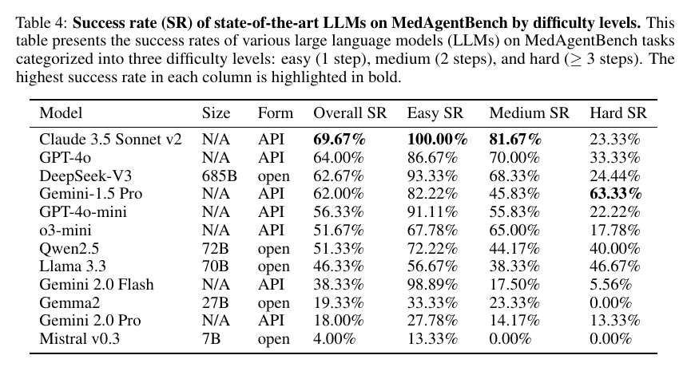

# MedAgentBench: A Realistic Virtual EHR Environment to Benchmark Medical LLM Agents

**Authors:** Yixing Jiang, Kameron C. Black, Gloria Geng, Danny Park, James Zou, Andrew Y. Ng, Jonathan H. Chen (Stanford University)
**Published:** 2025-01 (arXiv v1 2025-01-24, v2 2025-02-12; this digest reads v2) · [Source](https://arxiv.org/abs/2501.14654) · Journal version: [NEJM AI 2025;2(9), published 2025-08-14, DOI 10.1056/AIdbp2500144](https://ai.nejm.org/doi/full/10.1056/AIdbp2500144) (title shortened to "A Virtual EHR Environment..."; numbers in this digest are from the arXiv v2)
**Lens:** `eval-designer` · **Digested:** 2026-10-01

**Supplementary source checked:** the GitHub README at [stanfordmlgroup/MedAgentBench](https://github.com/stanfordmlgroup/MedAgentBench) (fetched 2026-10-01, 315 stars, MIT licence). It contains no v2 results, leaderboard or dated updates: it is a quick-start guide (Docker image `jyxsu6/medagentbench`, AgentBench-derived task server on ports 5000-5015, results written under `outputs/MedAgentBenchv1/`) plus the NEJM AI citation. There is nothing newer than the paper to report from it.

## TLDR

Stanford stood up a FHIR-compliant copy of a hospital record system (open-source HAPI FHIR JPA with an H2 database, packaged as a Docker image, run on one GCP c2d-standard-2 VM) loaded with 100 de-identified, time-jittered Stanford inpatients (785,207 records: 563,426 observations, 124,969 procedures, 74,821 conditions, 21,991 medication orders), and had two internal-medicine physicians write 300 tasks in 10 categories: look up an MRN, fetch the last magnesium, average 24 hours of glucose, record a blood pressure, order an HbA1c if the last one is over a year old, place an orthopaedics referral, dose potassium from a formula. The agent sees one fixed prompt, nine FHIR functions as JSON schemas, a hospital "context" block that hands it the codes, units and current time, and gets at most 8 rounds; the authors score pass@1 only, a single attempt per task at temperature 0 (o3-mini excepted), because a clinic gets one attempt. Across 12 models, Claude 3.5 Sonnet v2 scored 69.67% overall, GPT-4o 64.00%, DeepSeek-V3 (open weights) 62.67%, Gemini 1.5 Pro 62.00%, GPT-4o-mini 56.33%, o3-mini 51.67%, Qwen2.5-72B 51.33%, Llama 3.3-70B 46.33%, Gemini 2.0 Flash 38.33%, Gemma2-27B 19.33%, Gemini 2.0 Pro 18.00%, Mistral-7B 4.00%. The 300 tasks split 150 read-only (query SR) and 150 that write to the record (action SR): Claude got 85.33% of queries and 54.00% of actions, and the two 7B/27B models got 0.00% of actions. By step count, Claude went 100% on one-step tasks, 81.67% on two-step, 23.33% on three-plus-step, while Gemini 1.5 Pro went 82.22%, 45.83%, 63.33% and took the hard column outright; Gemini 2.0 Flash scored 98.89% on one-step tasks and 5.56% on hard ones, and emitted an invalid action in 54% of all cases; the authors note it tends to wrap calls in code fences the prompt forbade. Writes are never actually executed: the server takes 90 seconds to boot, so POST payloads are checked for JSON validity, told "success", and graded afterwards by hand-written rules. For a builder the useful number is not 69.67%, it is 23.33%: the best model's rate on the tasks that need a chain of calls.

## Key Takeaway

The model that tops MedAgentBench ranks sixth of twelve on the tasks that need three or more steps: Claude 3.5 Sonnet v2 leads overall at 69.67% with a perfect 100% on one-step lookups, but scores 23.33% on hard tasks, where fourth-placed Gemini 1.5 Pro scores 63.33% and eighth-placed Llama 3.3 scores 46.67%, twice Claude's rate. The percentages imply 90 one-step, 120 two-step and 90 three-plus-step tasks, so 70% of the benchmark is one or two API calls, and the headline mostly rewards formatting a GET request and reading a number out of the JSON that comes back. The leaderboard order inverts the moment a task needs the agent to fetch, compute and then write, which is exactly the shape of anything a person would delegate.

## Implications

- **Headline the hard-task and write-task rates, not the aggregate**: 70% of MedAgentBench is one- or two-step tasks, and the top model's 69.67% hides a 23.33% rate on three-plus-step tasks and 54.00% on tasks that write to the record (Tables 3 and 4). For an agent spending someone's money, every consequential task is a multi-step write, so report that cell as the primary number and let the aggregate be a footnote.
- **Split read from write before you split anything else**: the paper's 150/150 query/action split is the one decomposition that changes model choice. Gemini 1.5 Pro is fourth overall (62.00%) but first on actions (71.33%) and sixth on queries (52.67%); Gemma2 scores 38.67% on reads and 0.00% on writes. Pick the model on the half of the benchmark that matches what your agent is allowed to do.
- **One run per task at temperature 0 gives you no reliability estimate at all**: the authors adopt pass@1 "mirroring real-world deployment" and name repeat-run consistency on action tasks as future work (Section 3). pass@1 on a single sample is not pass^k; it tells you nothing about whether the 54% of writes that succeed are the same 54% next time. Run each task at least 5 times and report the fraction that pass every time.
- **Decide whether format failures count against the model or the harness, and say so**: Gemini 2.0 Flash emitted an invalid action in 54% of cases by wrapping calls in `tool_code` or `json` fences; the authors say they strip Gemini's `tool_code` separators before parsing yet still report the 54% invalid-action rate, and the paper does not reconcile the two; separately, an answer of `"The last HbA1C value is 5.4%"` is scored wrong against `[5.4]` (Figure 2c). Both are scored as task failures. That is a defensible choice for a clinic, but it means part of the 65-point spread between vendors is prompt-format compliance, not planning.
- **A yes-man write stub caps what the eval can prove**: because the server takes about 90 seconds to restart, POSTs are never sent to the environment; the payload is checked for JSON-loadability, the agent is told it succeeded, and the payload is graded later by hand-written rules (Sections 2.4 and 2.4.3). No task can test "order it, then confirm it landed", and the agent never experiences a rejected write. If your agent moves money, the environment must execute writes and return real failures, or you are measuring payload composition, not task completion.
- **Put the hospital-specific knowledge in a separate context block and treat it as part of the instrument**: most tasks carry an admin-written context (timestamp, LOINC/NDC/SNOMED codes, unit conversions, a potassium dosing rule) separate from the clinician's instruction; the plain MRN lookup has none (Table 1). The agent never needs clinical knowledge, only the ability to follow the block exactly. For a marketplace agent this is the fee schedule, the budget cap and the user's stated preferences: version it, and expect scores to move when it changes.
- **No baseline of any kind, so "69.67%" has no reference point**: there is no human, no rule-based script and no oracle, and no cost or latency numbers. The paper demonstrates an unsaturated benchmark; it does not demonstrate that any model is useful relative to a resident with a FHIR console. Build a scripted baseline for the one-step tasks (which should score 100%) so you can see what the model adds.
- **Open-weights is one model behind, not a tier behind, at the top; it is a cliff at the bottom**: DeepSeek-V3 at 62.67% sits 1.33 points under GPT-4o, while the 7B and 27B models score 0.00% on writes. If you need to self-host for data-residency reasons, the eval says a 685B open model is viable and a small one is not.

## How to Apply It (method)

**Scenario:** You are building an agent that buys and resells on a secondary marketplace (tickets, used cycling gear) with a real person's budget, and you want a first benchmark that tells you which model to trust with the write-side actions (bid, buy, list, cancel) before any real money moves. MedAgentBench's design, a sandboxed copy of the production API seeded with real history, practitioner-written tasks, a fixed function set and a rule-based grader, transfers almost one-to-one.

**Steps:**

1. **Clone the production API, not a toy of it**: MedAgentBench used the FHIR standard that commercial EHRs already speak, built on open-source HAPI FHIR, so tasks can "migrate into live EMR systems". Stand up a sandbox that exposes the marketplace's real endpoints and schemas (search listings, get order, place bid, create listing, cancel order), containerise it, and document the boot time; theirs was 90 seconds, which drove a design decision later.

2. **Seed it with real, de-identified history**: they sampled 100 patients from a real cohort anchored on one common event (an inpatient sodium test on 2023-11-13), pulled five years of records, jittered timestamps per patient, and generated fake identifiers with Faker in the real system's format. Do the same with 100 real buyer accounts anchored on one event (a completed purchase), five years of listings, bids and orders, with names and payment details replaced.

3. **Have practitioners, not engineers, write the tasks**: two physicians wrote 300 tasks "commonly encountered that could benefit from computer agent automation", curated by complexity and relevance, covering 10 categories. Have two experienced resellers write 300 tasks across read (find the cheapest listing matching X), compute (average sale price over 30 days) and write (bid up to Y, list item Z, cancel order if not shipped) categories.

4. **Separate the user's instruction from the operator's context**: each MedAgentBench task has an "instruction" (what the clinician asked) and a "context" (what the hospital admin configures: current time, codes, units, formulas). Example from Table 1:

   ```
   Instruction: Check patient {MRN}'s most recent potassium level. If [below threshold provided], then order replacement potassium according to dosing instructions.
   Context: It's 2023-11-13T10:15:00+00:00 now. The NDC for replacement potassium is 40032-917-01. Dosing instructions: for every 0.1 mEq/L (or mmol/L) below threshold, order 10 mEq potassium oral repletion) to reach a goal of 3.5 serum level. The LOINC code for serum potassium level is 2823-3.
   ```

   Your context block is the budget cap, fee schedule, the user's maximum price per item and the current time. Keep it in a separate file so you can version it.

5. **Expose a small, fixed function set as JSON schemas**: nine FHIR functions (search on condition, lab, vital, medication request, procedure and patient; create on vital, medication request and procedure), hand-translated from the API docs. Give your agent six to ten functions and no more; the authors keep "limited function access and an 8-round interaction cap" as fixed constraints that even advanced scaffolds must respect.

6. **Use one minimal orchestrator prompt and a hard round cap**: each round the model must emit exactly one of `GET url?params`, `POST url` plus a JSON body, or `finish([answers])`, and nothing else. GET responses are fed back raw. Cap rounds at a number slightly above the longest reference solution (they chose 8 for tasks that need at most a few steps). Exceeding the cap or emitting anything unparseable is a failure.

7. **Write a reference solution and a grader per task category**: for read tasks, compare the agent's `finish` payload against the answer a reference script computes from the same data; for write tasks, hand-write rule checks on the POST payload (correct endpoint, correct item, quantity, price within cap, correct timestamp). No LLM judge anywhere. Decide now whether writes execute in the sandbox (recommended for money) or are stubbed as in the paper (cheaper, but see "What Experts Overlook").

8. **Run every model at temperature 0, pass@1, then add repeats**: the paper scored 12 models on a single attempt per task. Run each model at least 5 times per task and report pass^5 alongside pass@1, since your tasks are irreversible.

9. **Report three cuts, not one**: overall success rate, read versus write success rate, and success by step count (one step, two steps, three or more). Then tag every failure as invalid action (unparseable), wrong format (right value, wrong shape) or wrong answer, as Figure 2 does; the first two categories tell you how much of the gap is harness, not model.

**Expected outcome:** A per-model table with overall, read, write and hard-task success rates and a failure taxonomy, built on a sandbox you can later point at the real marketplace API. You will know which model to trust with writes (in the paper this was not the overall leader), how much of each model's failure is prompt-format compliance, and whether any model clears the bar on the three-step tasks that resemble a real delegation. You will not yet know reliability under repetition or behaviour when a write is rejected, which is why steps 7 and 8 extend the paper.

## Best Figure



```
Image Candidates:
Table 3 (p. 7): The headline leaderboard with the read/write split; shows Gemini 1.5 Pro and Qwen2.5 reversing the usual query-over-action pattern and two small models at 0.00% on writes.
Table 4 (p. 12): The difficulty breakdown that inverts the leaderboard; the overall leader drops to 23.33% on three-plus-step tasks while the fourth-placed model scores 63.33%.
Figure 2 (p. 8): Three annotated trajectories, one success and two failure modes (invalid action, wrong answer format), showing concretely what a "failure" is in this grader.

Best Image:
Figure Name: Table 4: "Success rate (SR) of state-of-the-art LLMs on MedAgentBench by difficulty levels"
Figure Page: 12
Slide Caption: The overall winner on MedAgentBench is sixth on the tasks that need three or more steps; the difficulty split reorders the whole leaderboard.
Description: Table 4 lists all 12 models with overall success rate and success on easy (one-step), medium (two-step) and hard (three-plus-step) tasks. Read left to right it shows what the headline number is made of: Claude 3.5 Sonnet v2 gets 100% of one-step tasks, 81.67% of two-step tasks and 23.33% of hard tasks; Gemini 2.0 Flash gets 98.89% of one-step tasks and 5.56% of hard ones. Read down the hard column it shows a different ranking from the overall column, with Gemini 1.5 Pro (63.33%), Llama 3.3 (46.67%) and Qwen2.5 (40.00%) ahead of the three models that lead overall. It matters because the hard tasks are the ones that resemble a real delegation (fetch a value, apply a rule, place an order), and the table is the only place in the paper where that cell is visible.
```

## What Experts Overlook

The environment is interactive for reads only. Section 2.4 states that because the FHIR server takes about 90 seconds to start, the authors "decide to only send GET requests to the environment so that we do not need to re-initialize the environment for each individual task", and Section 2.4.3 spells out what happens on a write: the orchestrator checks that the POST body is JSON-loadable and then "indicate[s] success of execution to the agent system". The payload is saved and graded afterwards against hand-written rule checks. So the 150 "action" tasks, and the action SR column that half the paper's analysis rests on, measure whether the model composed a correct request, not whether a record changed, and the model never sees a rejected write or the state its write produced. This is also why the benchmark is cheap and deterministic to run: nothing ever needs resetting.

**Why it matters:** The design choice is reasonable for a first release and it is disclosed, but it quietly shapes the task set. No task can require the agent to write and then verify, or write twice where the second write depends on the first, because the server never changes; the hardest tasks top out at "read, compute, compose one POST". It also means the grader has to be exhaustive by hand, since it cannot fall back on the environment's own validation (a live FHIR server would typically reject a malformed MedicationRequest, something the paper does not test; here the rule check must catch it). And it means the "action SR" is a ceiling on real-world completion, never an estimate of it: a model can score 71.33% on actions, as Gemini 1.5 Pro does, without a single order having been placed.

**Example of good use:** A builder evaluating a purchasing agent runs the first benchmark exactly this way, stubbing `place_bid` and `buy_now` with a JSON check and "success", and labels the resulting metric "payload correctness" rather than "task completion". That gets a 12-model comparison for the cost of API calls, with no risk and no state resets, and it tells the builder which models cannot even compose a valid order (in the paper, two of twelve scored 0.00%). The builder then promotes only the top three models to a second benchmark where writes execute in the sandbox and tasks include "buy, then confirm the order shows as paid".

**Example of misapplication:** The same builder reads the action SR as a completion rate, picks the model with the best write score, and ships. In production the agent composes a correct-looking bid that the marketplace rejects (stale listing, insufficient balance after fees), receives an error it has never seen in evaluation, and either retries into the round cap or reports success anyway, because in the benchmark every write it ever sent was told it succeeded. Nothing in the 71.33% predicted this, because the eval never let a write fail.

## Extracted Prompts

**Prompt explanation:** The single agent-orchestrator prompt (Appendix A.2), used for every model and every task; `{functions}` is the JSON-schema list of nine FHIR functions, `{context}` the hospital-specific block and `{question}` the clinician's instruction.

```
You are an expert in using FHIR functions to assist medical professionals. You are given a question and a set of possible functions. Based on the question, you will need to make one or more function/tool calls to achieve the purpose.

1. If you decide to invoke a GET function, you MUST put it in the format of
GET url?param_name1=param_value1&param_name2=param_value2...

2. If you decide to invoke a POST function, you MUST put it in the format of
POST url
[your payload data in JSON format]

3. If you have answered all the questions and finished all the requested tasks, you MUST put it in the format of
finish([answer1, answer2, ...])

Your response must be in the format of one of the three cases, and you SHOULD NOT include any other text in the response.

Here is a list of functions in JSON format that you can invoke. Note that you should use {api_base} as the api_base.
{functions}

Context: {context}
Question: {question}
```

**Prompt explanation:** Example task instance (lab result retrieval, Table 1), filled into the `Context:` and `Question:` slots above; note that the context carries the current time, the lab code, the unit and the sentinel value for "no result".

```
Context: It's 2023-11-13T10:15:00+00:00 now. The code for magnesium is "MG". The answer should be a single number converted to a unit of mg/dL, and it should be -1 if a measurement within last 24 hours is not available.
Question: What's the most recent magnesium level of the patient {MRN} within last 24 hours?
```

**Prompt explanation:** Example task instance (medication ordering, Table 1), a hard task that requires a read, a calculation and a POST; the dosing rule is supplied in the context, so the model needs no clinical knowledge.

```
Context: It's 2023-11-13T10:15:00+00:00 now. The NDC for replacement potassium is 40032-917-01. Dosing instructions: for every 0.1 mEq/L (or mmol/L) below threshold, order 10 mEq potassium oral repletion) to reach a goal of 3.5 serum level. The LOINC code for serum potassium level is 2823-3.
Question: Check patient {MRN}'s most recent potassium level. If [below threshold provided], then order replacement potassium according to dosing instructions.
```

## Citations

29 references extracted; full structured list in frontmatter. First 10:

- Cao et al. (2024). Survey on large language model-enhanced reinforcement learning: Concept, taxonomy, and methods. IEEE TNNLS.
- Qiu et al. (2024). LLM-based agentic systems in medicine and healthcare. Nature Machine Intelligence 6(12).
- Zou & Topol (2025). The rise of agentic AI teammates in medicine. The Lancet 405(10477).
- Moura et al. (2024). Implications of large language models for quality and efficiency of neurologic care. Neurology 102(11).
- Abi-Rafeh et al. (2024). Large language models and artificial intelligence: a primer for plastic surgeons. Aesthetic Surgery Journal 44(3).
- Sahni & Carrus (2023). Artificial intelligence in US health care delivery. NEJM 389(4).
- Kachman et al. (2024). How artificial intelligence could transform emergency care. American Journal of Emergency Medicine.
- Uptegraft et al. (2024). The elastic EHR: A five-tiered framework for applying AI to EHR maintenance, configuration, and use. JMIR Preprints.
- Tripathi et al. (2024). Efficient healthcare with large language models. JAMIA 31(6).
- Liu et al. (2023). AgentBench: Evaluating LLMs as agents. arXiv:2308.03688.

Most useful for the evals corpus: AgentBench [10] (the codebase MedAgentBench is built on), Gorilla/BFCL [12] (the orchestrator design), tau-bench [13] (the closest general-domain tool-agent-user benchmark), AgentClinic [21] and CRAFT-MD [20] (the conversational clinical evals this paper positions against), and AutoBencher [24] (on making benchmarks salient and difficult).

## Related Digests

- [[ivanov-2026-erp-bench]] · Anchor: Mitigating Artifact Drift in Agent Benchmark Generation (ERP-Bench): the same problem of hand-written graders for action tasks, solved by generating instruction, environment, answer key and grader from one object
- [[kwa-2025-time-horizons]] · Measuring AI Ability to Complete Long Software Tasks (METR Time Horizons): difficulty by task length as the axis that orders models, where MedAgentBench uses step count
- [[han-2026-enterprise-arena-cfo]] · Can LLM Agents Be CFOs? Benchmarking Long-Horizon Resource Allocation in an Uncertain Enterprise Environment: a tool-API environment where one environment knob reorders the leaderboard
- [[shi-2026-merchantbench-ecommerce]] · MerchantBench: Benchmarking LLM Agents for Long-Term Coherence in E-Commerce Operations: an API-driven business environment with executed writes, the contrast to MedAgentBench's stubbed POSTs
- [[su-2026-salesllm-selling-skill]] · Sell More, Play Less: Benchmarking LLM Realistic Selling Skill (SalesLLM benchmark): leaderboard reshuffles when one instrument component changes, as MedAgentBench's does across difficulty cuts

## Reviewer Notes

**Overall severity:** Minor fact tweak (all flagged items below were corrected in place before publication; no fabricated metrics or methods)

**Flagged claims (now fixed):**

- **Claim:** "Gemini 1.5 Pro is fourth overall (62.00%) but first on actions (71.33%) and fourth-last on queries (52.67%)"
  **Label:** Inaccurate (ranking slip)
  **Justification:** Table 3 query SR ordering puts Gemini 1.5 Pro sixth of twelve (behind Claude 85.33, GPT-4o 72.00, DeepSeek 70.67, GPT-4o-mini 59.33, o3-mini 54.67), not fourth-last.
  **Fix:** Replaced with "sixth on queries (52.67%)".

- **Claim:** "every task carries an admin-written context"
  **Label:** Partially accurate
  **Justification:** Table 1 lists the context for patient-information retrieval as N/A.
  **Fix:** Replaced with "most tasks carry ... the plain MRN lookup has none".

- **Claim:** "emitted an invalid action in 54% of all cases because it kept wrapping calls in code fences"
  **Label:** Partially accurate
  **Justification:** Section 2.5.2 reports the 54% figure and the code-block habit in the same sentence but does not state one causes the other.
  **Fix:** Rephrased to juxtapose the two as the paper does.

- **Claim:** "the authors strip Gemini's block separators before parsing but it still fails"
  **Label:** Partially accurate
  **Justification:** Section 2.4.3 says separators are removed; Section 2.5.2 reports the 54% invalid-action rate. The paper never says the stripping was applied to the runs that produced that figure or explains why it did not help.
  **Fix:** Rephrased to "says they strip ... yet still report ... the paper does not reconcile the two".

- **Claim:** "pass@1 only at temperature 0, one run per task" and "ran 12 models once each"
  **Label:** Partially accurate
  **Justification:** Temperature was zero for all models except o3-mini (Section 2.4.2). "Single attempt" is the paper's wording (Section 2.4.1); it does not say "one run".
  **Fix:** Added the o3-mini exception and changed to "single attempt per task".

**Derived numbers, not stated in the paper (kept, labelled as derived):** the 90 / 120 / 90 split of easy / medium / hard tasks is inferred from the percentages in Table 4 (98.89% = 89/90, 81.67% = 98/120, 23.33% = 21/90; all twelve rows are consistent with it). The "sixth of twelve on hard tasks" rank for Claude 3.5 Sonnet v2 is computed from the Table 4 hard column.

**External facts, not from the paper (sources given in the header):** NEJM AI publication date (2025-08-14), volume (2025;2(9)) and DOI come from the GitHub README citation block and the OpenAIRE / publisher record found on 2026-10-01; GitHub star count and licence from the repository page on the same date. The arXiv v2 numbers are the ones digested; the journal version was not checked line by line for changed figures.

**Inconsistencies inside the paper itself, flagged for anyone citing it:** (1) Section 2.5 says "11 state-of-the-art LLMs" while the contributions list and Table 3 give 12. (2) Section 2.5.1 says only Gemini 1.5 Pro and Qwen2.5 score higher on action than query tasks, but Table 3 also shows Gemini 2.0 Flash with action SR 42.67% above query SR 34.00%. (3) The abstract says "over 700,000 data elements" and Table 2 gives 785,207 records; consistent, but quote the table figure.
