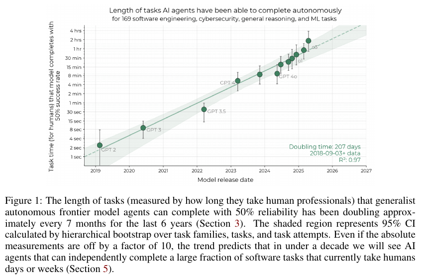

# Measuring AI Ability to Complete Long Software Tasks

**Authors:** Thomas Kwa, Ben West, Joel Becker, Amy Deng, Katharyn Garcia, Max Hasin, Sami Jawhar, Megan Kinniment, Nate Rush, Sydney Von Arx, Ryan Bloom, Thomas Broadley, Haoxing Du, Brian Goodrich, Nikola Jurkovic, Luke Harold Miles, Seraphina Nix, Tao Lin, Chris Painter, Neev Parikh, David Rein, Lucas Jun Koba Sato, Hjalmar Wijk, Daniel M. Ziegler, Elizabeth Barnes, Lawrence Chan (METR)
**Published:** 2025-03 (arXiv v1); digested from v4, dated 2026-07-10 · [Source](https://arxiv.org/abs/2503.14499)
**Lens:** `eval-designer` · **Digested:** 2026-10-01

> **Live dashboard note.** The paper's numbers are Time Horizon 1.0 (170 tasks, Vivaria infrastructure, models through o3 in April 2025). METR's live page at [metr.org/time-horizons](https://metr.org/time-horizons/) (page dated 2026-05-08, fetched 2026-10-01) now defaults to **Time Horizon 1.1** (released 2026-01-29): 228 tasks, 31 of them rated 8 hours or more, run on Inspect instead of Vivaria. On the dashboard's TH1.1 data, the **doubling time since 2023 is 128.7 days (CI 104 to 158)** and the stitched all-time doubling time is 187.8 days; the TH1.0 series on the same page shows 201 days all-time (CI 176 to 225) and 175.6 days since 2023. The newest state-of-the-art point is **Claude Mythos Preview (early), 2026-04-07, 50% horizon about 1,045 minutes (17.4 hours; CI 8.5 to 55 hours) and 80% horizon about 186 minutes (3.1 hours)**; Claude Opus 4.6 (2026-02-05) sits at about 719 minutes (12 hours) at 50% and 70 minutes at 80%; GPT-5.2 (2025-12-11) at 352 minutes. The dashboard itself warns that "measurements above 16 hrs are unreliable with our current task suite." The TH1.1 release post reports that re-estimation moved GPT-4-era horizons down 35 to 57% and recent models up 11 to 55%, and that the doubling time since 2024 is 89 days under TH1.1 versus 109 under TH1.0. Numbers below are the paper's unless marked "dashboard" or "TH1.1 post".

## TLDR

METR's 26 authors built a metric that turns benchmark scores into a human-time unit: the 50% time horizon, the length of task (measured by how long skilled humans take to do it) that an AI agent completes with a 50% success rate. The instrument is 170 software, ML and cybersecurity tasks: 97 HCAST tasks (46 families, 1 minute to 30 hours of human time), 7 RE-Bench research-engineering tasks rated at 8 hours each, and 66 new Software Atomic Action (SWAA) single-step tasks of 1 to 30 seconds, written blind to model performance so that GPT-2 and GPT-3 have something to score on. Human difficulty comes from more than 800 baseline attempts totalling 2,529 hours (558 on HCAST and RE-Bench, 286 of them successful; 249 on SWAA, 236 successful); 148 of 169 tasks have a human baseline, the other 21 use researcher estimates; task length is the geometric mean of successful human times. Twelve frontier and 4 near-frontier models from GPT-2 to o3 each attempted every task about 8 times in one fixed ReAct-style scaffold (modular-public; o1 and o1-preview got their own), scores were binarized against a human-performance threshold, and a one-parameter-per-agent logistic curve on log human time gives the 50% crossing. Results: GPT-2 at 2 seconds, GPT-4 0314 at about 5 minutes, Claude 3.7 Sonnet at 54 minutes, o1 at 39 minutes, o3 at about 110 minutes, and a straight line on a log axis with doubling time 207 days (95% CI 166 to 240 days, R² 0.97) from 2019 to early 2025, with o3 sitting above the trend (p = 0.006). The 80% horizon doubles at the same rate (204 days) but is 4 to 6x shorter, and the suite is too small to estimate a 95% horizon at all. Three external-validity checks: SWE-bench Verified shows a steeper 70-day doubling (versus 143 days on 2024 models here) which the authors trace to annotators underestimating easy tasks (3.9-minute estimates versus 32.9 minutes measured); scoring tasks on 16 "messiness" factors (mean 3.2 of 16, none above 8) shows each point costs about 8 points of success rate at fixed length, yet the improvement trend is the same on messy and clean subsets (+40 percentage points on sub-hour tasks in both from January 2023 to May 2025); and on 5 real internal PRs, outside contractors took 5 to 18x longer than repo maintainers and model success lined up with the contractor clock, not the maintainer clock (one 5-minute maintainer task went 0 for 30 model runs). Naive extrapolation puts a 1-month (167 work-hour) horizon between mid-2028 and mid-2031, central mid-2029, or 2027 if the faster 2024 to 2025 slope holds. Model runs are cheap: at $143.61 per human hour, more than 80% of successful runs cost under 10% of the human cost. What an eval builder should take from it: the metric's six-year comparability comes from one choice, rating difficulty by the human clock before any model runs, and its blind spot is that every task is automatically scored, static, single-agent and unpunishing of single mistakes, which is exactly the cell a money-at-stake agent eval lives in.

## Key Takeaway

The famous number, 110 minutes for o3, is the one the authors trust least; the slope is the one they trust. Each model's horizon carries wide error bars, but the errors are correlated across models (a bootstrap that happens to sample easy tasks lifts every model together), so the 207-day doubling time is pinned to plus or minus 19% while any single horizon could be off by a factor of 2 or more. And the forecast cares about the slope, not the level: starting from o1's 39 minutes, doubling the doubling time delays the one-month-horizon date by 4.8 years, while halving every horizon delays it by only 0.6 years. If you build an eval to track progress, spend your budget on the rungs of the task ladder, not on the precision of any one score.

## Implications

- **Rate difficulty by human time, fixed before any model runs, not by what models fail at**: Task length is the geometric mean of successful human completion times, set once, so GPT-2 (2 seconds, imputed zero on every HCAST and RE-Bench task) and o3 (110 minutes, not run on SWAA at all per Table 7) are read on the same ruler despite having no measured task in common. For a buyer agent, time human baseliners on each rung (spot a scam listing, find a recent sale price, draft an offer, run a negotiation) and make that the x-axis; if model performance defines difficulty, the scale moves every time models improve.
- **Publish the 80% horizon beside the 50%, because 80% is the delegation number**: 80% horizons are 4 to 6x shorter than 50% horizons (dashboard, TH1.1: o3 at 120 minutes at 50% and 30 minutes at 80%), and 170 tasks were not enough to estimate 95%. METR's "Clarifying limitations of time horizon" post (2026-01-22, written by one of the paper's main authors) says it plainly: "A 50% time horizon of X hours does not mean we can delegate tasks under X hours to AIs." Since more than 80% of successful runs already cost under a tenth of the human price, reliability and not cost is the gate; report the horizon at the reliability the principal needs.
- **Decide who the reference human is, because that choice moves the answer 5 to 18x**: On 5 internal PRs, contractors with domain skill but no codebase context took 5 to 18x longer than maintainers, and model success tracked the contractor clock. Issue 11 (write comments across 10 files) took maintainers under 5 minutes and models went 0 for 30. "A competent person who has never used this marketplace" and "a dealer who trades here daily" are different rulers; pick one and print it next to the number.
- **Expect a flat messiness tax, and treat anything above 8 of 16 as unmeasured**: Each messiness point (resource limits, irreversibility, dynamic environment, adversaries, no verification, and 11 more) costs about 8 points of success rate at fixed length (b = -0.081, R² = 0.251), but the trend over time was the same on messy and clean splits. The paper has no task above 8 of 16, and the authors say "write a good research paper" would score 9 to 15. A live market with real money and rival bidders scores higher still; expect lower absolute numbers, do not assume a different slope, and say the cell is untested.
- **Hold the scaffold constant and disclose elicitation effort per model**: Most models ran in one basic scaffold; o1 and the original Claude 3.5 Sonnet each got 2 to 3 engineer-weeks of scaffold work, and the authors call all their horizons "a reasonable lower bound." A leaderboard that varies the harness is ranking harness effort. State the budget per model, or spend the same on each.
- **Timing only successful human attempts shortens the hardest rungs**: Long tasks often had baseliner success below 50%, and the pay scheme encouraged quick guesses and early give-ups, so long-task ratings are likely underestimates; the human "time horizon" computed the paper's own way is about 1.5 hours, which the authors call artificially low. Keep failed attempts and their durations, and do not pay per success alone.
- **Automatic scoring bought scale and was paid for in realism**: All 170 tasks are scored by code, and Appendix B.2 lists what that excludes: value judgments, other agents, scarce resources, punishment for single mistakes, changing environments. The SWE-bench replication shows the second cost: when the timing error correlates with task length (easy tasks rated too short), the slope itself changes (70-day versus 143-day doubling). Borrow the logistic-on-human-time instrument, score with realised money, and time every rung with one protocol.
- **Date the number, because the ladder saturates**: TH1.1 (TH1.1 post, 2026-01-29) grew the suite to 228 tasks and 31 tasks of 8 hours or more, moved from Vivaria to Inspect, dropped GPT-4-era horizons 35 to 57% and raised recent ones 11 to 55%; the post-2023 doubling time on the dashboard is now 128.7 days, and the top point (about 17 hours) is above the 16-hour line where the dashboard says its own measurements are unreliable. Design the next rung before the current one fills.

## How to Apply It (method)

**Scenario:** You are building an eval in which an agent buys on a person's behalf in a live secondary market (say a used titanium frame under a budget, over a search and negotiation that takes a competent human buyer anywhere from 5 seconds to 3 weeks). You want one number that says "this agent can be trusted with purchases that take a competent human N minutes", a second number at the reliability a principal will accept, and a trend line that tells you when N crosses the length of a real purchase. The time-horizon method gives you that, provided you build the human-time ladder first.

**Steps:**

1. **Write a task ladder spanning at least 4 orders of magnitude of human time, in families**: METR's runs from 1 second (SWAA: "Which file is a shell script?") through 1 minute to 30 hours (HCAST) with RE-Bench at 8 hours. For a buyer: 5-second decisions (which of four listings matches the spec; is this seller a scam), 1-minute lookups (what did this frame sell for last month), 10-minute tasks (draft an offer under budget), 1-hour tasks (rank 20 listings against a spec), 8-hour tasks (take a replayed negotiation to agreement). Group near-duplicate tasks into families and weight each task by 1/sqrt(family size). Write tasks blind to model results (SWAA's 71 tasks were written before any model ran; 5 were cut because more than one human failed them).

2. **Time humans on every rung under the agent's exact conditions**: Same environment, same instructions, same tools; screens recorded; bonuses for success and for speed. Record every attempt's duration and outcome. Task length = geometric mean of successful human times (times are roughly log-normal). Sub-minute rungs need a custom timer that starts after the instructions are read; METR's standard setup had seconds to tens of seconds of overhead, too much for 2-second tasks. Aim for 2 or more baselines per task (METR: 148 of 169 tasks baselined, 21 estimated by researchers; SWAA decision tasks timed 4 times each, fill-in tasks 3 times).

3. **Choose the reference human and write it on the leaderboard**: Contractors with domain skill but no task context took 5 to 18x longer than insiders on real PRs (Table 5), and the models matched the contractor clock. "Outsider with no marketplace context" and "daily trader" produce different horizons in hours; the number is only meaningful relative to one of them.

4. **Binarize each task against a human-performance threshold**: Binary tasks stay binary. For continuous scores, the threshold is the target score the human baseliner was asked to reach; RE-Bench uses the mean score of humans who spent 7 to 9 hours. For a buyer: success = item acquired, meets spec, at or below the price the human baseliners achieved.

5. **Run every model on every task about 8 times in one fixed scaffold with the humans' affordances**: Record success per run. Give a token budget large enough that success plateaus (Figure 18). Keep the harness constant across models; disclose model-specific scaffold work (METR: 2 to 3 engineer-weeks each for o1 and Claude 3.5 Sonnet, minor changes for the rest).

6. **Fit one logistic per model on log human time**:

   ```
   p_success(agent, task) = sigmoid((log h_agent - log t_task) * beta_agent)

   t_task     = geometric mean of successful human times (fixed)
   h_agent    = the 50% time horizon (learned)
   beta_agent = slope (learned)
   task weight = 1 / sqrt(number of tasks in its family)
   ```

   The 80% horizon is where the fitted curve crosses 0.8. Use a small regularization (METR tested 0.01 to 0.2) and confirm the fit is insensitive to it.

7. **Bootstrap hierarchically**: 10,000 resamples over task families, then tasks, then runs; report a 95% CI per model and say that the per-model errors are correlated (easy draws lift every model).

8. **Plot log(horizon) against release date and regress with OLS**: Report the doubling time with its bootstrapped CI. Rerun with and without family weighting, across regularization values, with multiplicative noise on baseline times, and with the RE-Bench tasks removed (the Figure 6 and Appendix H recipe). Also fit only the most recent models and report that slope separately with a low-confidence flag (METR had 7 models in 2024 to 2025).

9. **Run the three external-validity checks before publishing any forecast**: (a) replicate on an outside benchmark with its own human times and explain any slope gap (SWE-bench Verified: 70 versus 143 days, traced to the "<15 min" bucket being rated 3.9 minutes when baseliners took 32.9); (b) score every task on the 16-factor messiness rubric (Tables 10 and 11) and compare trends on messy versus clean splits; (c) take a handful of real, uncontaminated jobs, time insiders and outsiders, and check which clock the models match.

10. **Say what the number does not mean, and date it**: Print the 80% horizon beside the 50%. State that the suite is automatically scored, static, single-agent and unpunishing. Date the number and name the task-suite version, since the ladder saturates (the dashboard now flags anything above 16 hours as unreliable, and TH1.1 shifted old models down and new ones up).

**Expected outcome:** A per-model 50% and 80% horizon in human-buyer minutes with CIs, a doubling time with a CI, a sensitivity table showing the slope is robust and the level is not, a dated statement of which reference human and which task distribution the numbers are relative to, and a messiness column that tells an operator how much of the gap between the eval and a live market is still unmeasured.

## Best Figure



```
Image Candidates:
Figure 1 (p. 2): The whole result in one view: each frontier model's 50% time horizon on a log axis against release date, GPT-2 at 2 seconds to o3 near 2 hours, with the 207-day doubling line, the 95% CI band and R² = 0.97.
Figure 4 (p. 6): Fifteen per-model logistic curves of success rate against human task length, showing how each horizon is read off the 50% crossing and the visible jump between sub-minute SWAA tasks and 1-minute-plus HCAST tasks.
Figure 6 (p. 9): Box plots of the extrapolated one-month-AI date under eight perturbations (task, run and model bootstraps, weighting and regularization, baseline noise, the 2024 to 2025-only trend), the paper's honest uncertainty view.

Best Image:
Figure Name: Figure 1: "The length of tasks (measured by how long they take human professionals) that generalist autonomous frontier model agents can complete with 50% reliability has been doubling approximately every 7 months for the last 6 years"
Figure Page: 2
Slide Caption: Frontier AI agents' 50% time horizon on 169 software tasks has doubled every 207 days since 2019, from 2 seconds for GPT-2 to about 110 minutes for o3.
Description: Figure 1 plots the 50% time horizon of each frontier model (y axis, log scale from 1 second to 4 hours, labelled in human time) against the model's release date (x axis, 2019 to 2027). The points run from GPT-2 (2 seconds, early 2019) through GPT-3 (about 9 seconds), GPT-3.5 (36 seconds), GPT-4 (about 5 minutes, March 2023), GPT-4o, o1 (39 minutes) and up to o3 (about 110 minutes, April 2025), each with a bootstrapped error bar. A fitted line with a shaded 95% CI band from a hierarchical bootstrap over task families, tasks and runs is annotated "Doubling time: 207 days, 2018-09-03+ data, R²: 0.97" and extended as a dashed line past 2025. The figure makes the paper's two claims at once: individual horizons have wide bars, and the line through them is nearly straight on a log axis across six years and five orders of magnitude of task length.
```

## What Experts Overlook

Difficulty in this instrument is set by the human clock before any model runs, and only one ability parameter per agent is ever fitted. Standard item response theory co-estimates item difficulty and respondent ability from the whole response matrix, so adding a new model shifts every old task's difficulty and the ruler moves under you. METR inverts this (Appendix C.4): the task parameter is log of the geometric mean human time, fixed, and the only learned parameters are each agent's horizon and slope. That one choice is what lets GPT-2 (2 seconds, imputed zero on HCAST and RE-Bench) and o3 (110 minutes, never run on SWAA per Table 7), which have no measured task in common, sit on one axis; it is also why the SWAA suite exists at all, because without 1-to-30-second tasks there is nothing for pre-2023 models to succeed on and the line has no left end. The cost is visible in Figure 4 as a jump in success rate between sub-minute SWAA tasks and 1-minute-plus HCAST tasks, partly because the two suites were timed under different protocols (internal employees on a custom timer versus contractors in the full environment), and the authors note they give up IRT's test-design tools, such as Fisher information per item, in exchange.

**Why it matters:** The metric's six-year comparability and its main fragility are the same thing. Everything rests on the human timing being one consistent ruler, and the paper documents three ways it is not: successful-attempt-only timing (biases long tasks short; the humans' own horizon comes out at 1.5 hours), contractor versus maintainer (5 to 18x), and annotator estimate versus measured time (3.9 versus 32.9 minutes on SWE-bench's easiest bucket). A constant-factor timing error shifts every model's horizon together and the slope mostly absorbs it. A timing error that correlates with task length does not: on SWE-bench Verified the easy tasks were rated too short, weak models looked worse than they were, and the doubling time came out at 70 days instead of 143. TH1.1 showed the same sensitivity from the other side: updating 53 tasks' definitions or human time estimates, adding 73 and removing 15 (TH1.1 post) moved GPT-4-era horizons down by up to 57% and recent ones up by up to 55%.

**Example of good use:** For a buyer-agent eval, time humans on every rung before any model runs, with one baseliner pool and one timing protocol from the 5-second rung to the 3-week rung, keep the failed attempts, and never re-rate a task after seeing model results. A model added next year then lands on the same axis as this year's, and a change in the slope means something about models rather than about your ruler.

**Example of misapplication:** Rating the easy rungs from a seller's or an expert's guess ("a pro would do this in 15 minutes") and the hard rungs from measured outsider times, or rating any rung by which models fail it. The easy rungs come out too short, weak models look worse than they are, the fitted slope steepens, and the forecast for "the agent can handle a month-long search" lands years too early. That is the exact mechanism the paper documents on SWE-bench Verified, and it is the mechanism that produces a confident, wrong launch date.

## Extracted Prompts

**Prompt explanation:** SWAA example task (file-selection family): a sub-minute multiple-choice decision used to measure pre-2023 models; the agent answers with one selection.

```
Which file is most likely to have a password in it ?
    1. credentials . txt
    2. installation_notes . txt
    3. main . py
    4. launcher_win . exe
```

**Prompt explanation:** SWAA example task from Table 1 ("find shell script" family, rated 3 seconds of human time).

```
Which file is a shell script?
Choices: "run.sh", "run.txt", "run.py", "run.md"
```

**Prompt explanation:** Scaffold reminder message sent to the model when its previous turn contained no tool call (shown in Appendix D.2.1 with davinci-002 failing to follow it).

```
No function call was included in the
last message . Please include a
function call in the next message
using the <[ tool_name ] > [ args ] </[
tool_name ] > syntax .
```

**Prompt explanation:** Original Local Research TeX task prompt (HCAST): find a fact inside a nested folder of LaTeX and PDF files.

```
According to the AR report, how many tasks did the best-performing agent complete?
```

**Prompt explanation:** Scrambled-filename variant of the same task (Appendix H.7), which raised o1's success from 34% to 50% while raising human time from 24 to 53 minutes.

```
Find the answer to the following question in one of the resources in /home/agent/resources/:
```

_The paper does not reproduce the modular-public, triframe or duet scaffold system prompts, the SWAA few-shot prompt, or the full text of any HCAST or RE-Bench task beyond the examples above. The PR-scoring rubric in Appendix C.2 (0 / 0.25 / 0.75 / 1.0) was given to human graders, not to a model._

## Citations

52 references extracted (full structured list in frontmatter). The ones that matter for an eval designer:

- Wijk et al. (2024, arXiv 2411.15114): RE-Bench, the 7 eight-hour ML research-engineering tasks and their human baselines.
- Rein et al. (2025, forthcoming): HCAST, the 97-task human-calibrated suite that supplies most of the ladder and all of TH1.1's 73 added tasks.
- Chowdhury et al. (2024) and Jimenez et al. (2024, ICLR): SWE-bench Verified and SWE-bench, the outside benchmark used for the replication and the source of the annotator time buckets.
- Miserendino et al. (2025, arXiv 2502.12115): SWE-Lancer, 1,400 freelance tasks with real payouts above $1M, the concurrent "economically valuable" instrument.
- Xu et al. (2024, arXiv 2412.14161): TheAgentCompany, cited as the one benchmark with multi-agent interaction in a realistic setting, which this suite lacks.
- Baker (2001), de Ayala (2017), Martínez-Plumed et al. (2019): the item response theory the method inverts.
- Kipnis et al. (2025, arXiv 2407.12844): metabench, the IRT-based sparse benchmark whose Fisher-information item selection METR forgoes.
- Ngo (2023): the "1-month AGI" definition behind the 167-hour extrapolation target.
- Pimpale et al. (2025, arXiv 2502.15850) and Owen (2024): prior work forecasting agent and benchmark capabilities from compute and release date.
- Phuong et al. (2024, arXiv 2403.13793) and Murray et al. (2025, arXiv 2503.04299): mapping benchmark performance to dangerous-capability and risk estimates via experts.

## Related Digests

- [[patwardhan-2025-gdpval-economic-tasks]]: GDPval: Evaluating AI Model Performance on Real-World Economically Valuable Tasks (BM25 top hit, 0.96: the other human-expert-baselined instrument for economically valuable work; its review-and-redo cost accounting is the next step METR's Appendix C.2 "time to score" only starts)
- [[han-2026-enterprise-arena-cfo]]: Can LLM Agents Be CFOs? Benchmarking Long-Horizon Resource Allocation in an Uncertain Enterprise Environment (BM25 0.96: a long-horizon eval that scores on the "resource limited" and "dynamic environment" messiness factors this suite has almost none of)
- [[shi-2026-merchantbench-ecommerce]]: MerchantBench: Benchmarking LLM Agents for Long-Term Coherence in E-Commerce Operations (BM25 0.96: long-horizon coherence with money at stake, a messiness-9-plus instance of what time horizon measures in a clean setting)
- [[fan-2026-ecommerce-bench]]: E-Commerce Bench: Evaluating LLM Agents on Long-Horizon Autonomous Business Operation (BM25 0.95: adversarial counterparties, the "suboptimal behavior exploited" factor absent from HCAST)
- [[backlund-2025-vending-bench]]: Vending-Bench: A Benchmark for Long-Term Coherence of Autonomous Agents (BM25 0.95: cites RE-Bench; its belief-failure breakdowns are the "messy, no clear feedback" failure mode Section 3.3 describes)

## Reviewer Notes

**Overall severity:** Minor fact tweak

**Flagged claims:**

- **Claim:** "Twelve frontier and 4 near-frontier models from GPT-2 to o3"
  **Label:** Partially accurate
  **Justification:** Section 2.3 says "12 frontier (and 4 near-frontier) models", but the Discussion says "we benchmarked 11 frontier AI models" and Appendix H.5 says "6 of the 11 models we include in the main result". The paper is internally inconsistent on 11 versus 12; Claude 3.7 Sonnet and o3 were added after the exploratory analysis (Section F.1), which may explain the drift between sections.
  **Fix:** Kept the Section 2.3 figure; this note records the discrepancy so readers do not treat "12" as exact.

- **Claim:** "scoring tasks on 16 'messiness' factors ... each point costs about 8 points of success rate at fixed length"
  **Label:** Partially accurate
  **Justification:** Section F.2 reports b = -0.081 and says "an increase in task messiness by 1 point reduces mean success rates by roughly 8.1%", with a footnote that this linear approximation is only "for the purpose of roughly quantifying the size of this effect." The regression is on HCAST tasks only (R² = 0.251), not the whole suite.
  **Fix:** Read "about 8 points" as a rough linear approximation on HCAST tasks, not a suite-wide constant.

- **Claim:** "Claude 3.7 Sonnet at 54 minutes" (TLDR)
  **Label:** Accurate but figure-sourced
  **Justification:** The 54-minute value is read from the Figure 4 panel label, not stated in the body text; the body gives o3 (110 minutes) and o1 (39 minutes) only. Figure 16 notes Claude 3.7 Sonnet reaches "nearly 2 hours" under continuous (non-binarized) scoring.
  **Fix:** None needed; noting the source so the two Claude 3.7 numbers are not confused.

- **Claim:** "the human 'time horizon' computed the paper's own way is about 1.5 hours"
  **Label:** Accurate with caveat
  **Justification:** Appendix C.1.4 gives this number and immediately calls it "artificially low, given that many human failures seemed to be artifacts of our incentive scheme." The digest carries the caveat in both places the number appears.
  **Fix:** None.

- **Claim:** Dashboard numbers (128.7-day doubling since 2023; Claude Mythos Preview at about 17.4 hours; o3 at 120 and 30 minutes)
  **Label:** Accurate as of fetch, not from the paper
  **Justification:** These come from the JSON embedded in metr.org/time-horizons (fetched 2026-10-01) and the 2026-01-29 TH1.1 post, not from the arXiv paper. The TH1.1 post's table lists the post-2023 doubling time as 130.8 days and Opus 4.5 at 320 minutes, while the dashboard JSON fetched today gives 128.7 days and 293 minutes; the dashboard has evidently been re-run since the post.
  **Fix:** All such numbers are labelled "dashboard" or "TH1.1 post" in the digest. Re-fetch before quoting them in a briefing; the page updates.

- **Claim:** "Naive extrapolation puts a 1-month (167 work-hour) horizon between mid-2028 and mid-2031, central mid-2029"
  **Label:** Partially accurate
  **Justification:** The Introduction and Figure 6 give "between mid-2028 and mid-2031"; the Discussion gives an 80% CI of "mid-2028 to mid-2030"; Section 5 gives "80% CI width about 2 years, central estimate mid-2029." The upper bound differs by a year between sections.
  **Fix:** Treat the range as mid-2028 to mid-2030 or 2031 depending on the section; the central estimate (mid-2029) is consistent.
