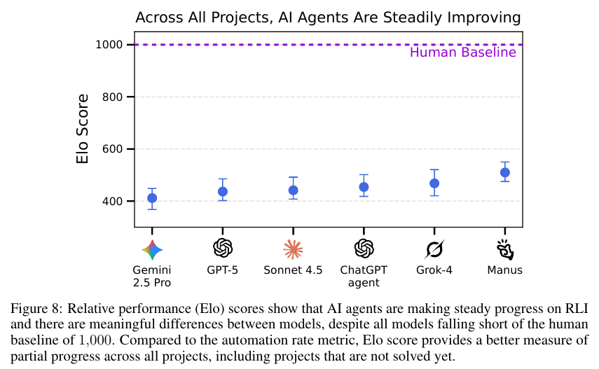

# Remote Labor Index: Measuring AI Automation of Remote Work

**Authors:** Mantas Mazeika, Alice Gatti, Cristina Menghini, Udari Madhushani Sehwag, Shivam Singhal, Yury Orlovskiy, and 36 others (Center for AI Safety and Scale AI); senior authors Summer Yue, Alexandr Wang, Bing Liu, Ernesto Hernandez, Dan Hendrycks
**Published:** 2025-10 (arXiv v1, 30 Oct 2025) · [Source](https://arxiv.org/abs/2510.26787)
**Lens:** `eval-designer` · **Digested:** 2026-10-01

## TLDR

Scale AI and the Center for AI Safety built the Remote Labor Index (RLI) to answer one question: what share of real, paid, end-to-end freelance projects can an AI agent complete to the standard the client accepted? They recruited 358 verified Upwork freelancers (average 2,341 hours worked, 89 prior jobs and $23,364 earned on the platform), paid them $15 to $200 per sample (average $41) for 550 raw past projects, added 40 long-tail projects (7 from categories outside the Upwork taxonomy or commissioned, 33 found online and used with the author's permission and pricing), and after cleaning kept 240 projects across 23 of Upwork's 64 categories: video and animation, CAD, graphic design, audio, architecture, product design, game development, data analysis and more. Each project ships as a brief, the input files and the human deliverable, with the professional's self-reported cost (mean $632.6, median $200, max $22,500) and time (mean 28.9 hours, median 11.5, max 450); the bundle is over 6,000 hours of work worth $143,991, and human completion time is more than twice that of HCAST or GDPval. Six agents (ChatGPT agent, GPT-5, Claude Sonnet 4.5, Grok 4, Gemini 2.5 Pro, Manus) each produced one deliverable per project (no repeated runs are reported), with image, speech and video generation tools where the scaffold allowed, at a mean API cost of $2.34 per deliverable (max $29.51). Trained human evaluators, given the human deliverable as the reference and a 20-minute cap, rated each AI deliverable on a 3-point scale (would not be accepted / would be accepted as the commissioned work / better than the human), majority of 3 votes, 94.4% inter-annotator agreement. Automation rate: Manus 2.5%, Grok 4 2.1%, Sonnet 4.5 2.1%, GPT-5 1.7% (command-line scaffold; 0.8% with computer use), ChatGPT agent 1.3%, Gemini 2.5 Pro 0.8%. Dollars earned: $1,720 of $143,991 for Manus down to $210 for Gemini. A pairwise Elo between agents, with the human baseline pinned at 1,000 and 400 points meaning 10:1 odds, puts the agents between 411.8 (Gemini) and 509.9 (Manus) and separates them where the automation rate cannot. Across roughly 400 evaluations, 45.6% of AI deliverables showed poor quality, 35.7% were incomplete, 17.6% had corrupt or wrong-format files and 14.8% were internally inconsistent (categories overlap); the wins were audio editing and mixing, logo and ad image generation, report writing and code-only data dashboards. The useful number for a builder is not 2.5% but the pair it belongs to: 2.5% of projects, 1.2% of the money, so the value sits in the projects agents cannot yet do.

## The Four Questions (lens read)

- **The question.** In the authors' words: "it remains unclear how these gains translate into economic value and automation", so RLI is meant to "provide the first standardized, empirical measurement of AI's capability to automate remote work". Why freelance projects: each one comes with a brief a client actually wrote, a deliverable a client actually accepted, and a price and time the professional reported, so success can be defined as "would a reasonable client accept this as the commissioned work" rather than a rubric score. It is a capability question built for policy use (an index to track over time, with an "autoflation" price series), not a safety question and not a delegation question: the agent is told "Do not ask any questions", and work that needs client interaction or a team was excluded by design.
- **The instrument.** Environment: whatever scaffold the agent ships with. Integrated agents (ChatGPT agent, Manus) ran as-is; GPT-5 and Sonnet 4.5 ran in Scale AI's computer-use scaffold (remote Ubuntu VM via Scrapybara, mouse/keyboard/screenshot, file editor and bash tools over MCP, default 1-hour session timeout); Grok 4 and Gemini 2.5 Pro ran in OpenHands with gpt-image-1, openai/tts-1 and veo-3.0-generate-preview as callable tools. Horizon: one shot per project, no questions, no revisions. One run = one deliverable per agent per project; 240 projects (230 private, 10 public), one deliverable per agent per project with no repeated runs reported, so no pass^k, no spread and no worst-run reporting for the automation rate. Primary metric: automation rate, the share of projects rated 2 or 3 on the 3-point scale (ceiling 100%). Secondary: Elo from pairwise agent-vs-agent comparisons fit with Bradley-Terry per Chatbot Arena, each pair on at least 10 projects (median 25), 100 bootstrap samples over projects for 95% CIs, human baseline fixed at 1,000 with no ceiling; dollars earned (sum of the human price for every completed project, max $143,991); autoflation (percentage drop in the cost of completing the whole bundle using the cheaper of human or AI per project, with cost set to infinity when the AI fails). Baseline: the human deliverable, judged with a "zone of acceptable error" so the AI is not penalised for flaws the accepted human work also has. No rule-based or oracle baseline. The choices that made the headline possible: trained human judges rather than rubrics or an LLM judge (per-project rubrics were tried and dropped because deliverables could tick the boxes and still fail professional standards), a stop-early rule on the first critical flaw, and the up-front exclusion of 18 listed Upwork categories, including Content Writing and related categories because, in the authors' words, such projects "can already be solved by AIs and would not provide much information", most legal work (PII) and anything needing interaction, waiting (SEO) or a desktop build.
- **The result and the surprise.** Headline: 2.5% (Manus), 2.1% (Grok 4, Sonnet 4.5), 1.7% (GPT-5 CLI), 1.3% (ChatGPT agent), 0.8% (GPT-5 CUA, Gemini 2.5 Pro). Elo: Manus 509.9, Grok 4 468.2, ChatGPT agent 454.3, Sonnet 4.5 441.7, GPT-5 CLI 436.7, GPT-5 CUA 431.6, Gemini 2.5 Pro 411.8, all 490 to 588 points below the human; by the paper's own 400-points-is-10:1 scale that is roughly 17:1 to 30:1 odds in the human's favour (derived). The surprises the authors flag: GPT-5 did better from a command line than with computer use (1.7% vs 0.8%, Elo 436.7 vs 431.6), so "current models are not yet able to take full advantage of computer-use environments"; and the Elo ladder orders the agents differently from the automation rate (ChatGPT agent is third by Elo and fifth by rate; Sonnet 4.5 is joint second by rate and fourth by Elo). Two findings the paper reports but does not headline: dollar-weighted success is about half of count-weighted (Manus $1,720 of $143,991 is 1.2%; Grok 4 earned $858, two-thirds of Sonnet's $1,280, on the same 2.1% rate), and 17.6% of AI deliverables had corrupt, empty or wrong-format files, a plumbing failure that precedes any quality judgment. Decomposition by category showed where the end-to-end number hides parity: audio editing, mixing and production (bespoke sound effects, vocal separation, voice-over with intro and outro music), image generation for ads and logos, report writing and code-only interactive dashboards matched or beat the human; architecture, game development and web development failed, which the authors tie to agents being unable to verify and fix their own work where that needs interactive audiovisual checking; video projects appear among the failure examples (an 8-second video where 8 minutes were asked for). No human-vs-script comparison exists; the human beat every agent in aggregate.
- **What it does not test, and what to borrow.** Untested cells: any back-and-forth with the client, team work, revisions, physical or on-site work, SEO and anything else that needs time to judge, QA against live services, content writing (excluded as solved), most legal work, desktop and mobile apps, adversaries, money at risk for the agent, repeated runs, and matched budgets (agents spent a mean of $2.34 and the computer-use scaffold had a 1-hour default timeout, against a human median of 11.5 hours and $200). Gaming and saturation: 230 of 240 projects are private, briefs are not searchable, and a domain blocklist covers long-tail deliverables that exist online; saturation is far off. LLM judges: none, all grading is human, and the authors say automating it "is not currently feasible" because evaluating a deliverable is itself an agentic task; the one LLM in the loop is a classifier that sorts briefs into software / research-and-writing / other for Figure 6. Simulation awareness: not studied; the briefs are real client requests. Borrow for an agent that spends a person's money: (1) a real, accepted outcome as the reference with a zone of acceptable error, so the bar is "what a real person did and was happy with", not an idealised rubric; (2) report count-weighted and dollar-weighted success side by side, plus an autoflation-style "what did it cost to get the bundle done by the cheapest acceptable method" series; (3) audit every positive, re-judge a random sample of negatives for a false-negative bound (RLI: 50 projects, two co-authors, zero false negatives, so at most 5.8% at 95% confidence), and give judges a time cap with a stop-at-first-disqualifier rule; (4) run pairwise Elo between agents so you can see movement while the pass rate is still at the floor.

## Key Takeaway

Frontier models of the same generation that GDPval, published the same month, placed near human parity on cross-profession tasks score at most 2.5% here, and nothing about the models changed: the unit of work went from a task to a whole project (median 11.5 hours of human time, $200 paid), the bar went from preferred-or-tied to accepted by a reasonable client as the commissioned work, and the agents spent a mean of $2.34 per attempt. Count the money instead of the projects and the number halves again: Manus completed 2.5% of projects but earned 1.2% of the $143,991 on the table, because the projects it could finish were worth about $290 each against a mean of $633 (derived from Table 4: $1,720 over the roughly six projects a 2.5% rate implies). Read the 2.5% with its three settings attached: the unit, the bar and the budget.

## Implications

- **Publish count-weighted and dollar-weighted success together**: Manus completed 2.5% of projects and earned 1.2% of the money; Grok 4 and Sonnet 4.5 tie at 2.1% but earned $858 and $1,280 (Tables 3 and 4). For a buying agent, report the share of purchases that were acceptable and the share of dollars that were spent acceptably, and treat a gap between them as a finding about which jobs the agent is picking off.
- **Make the reference a real accepted outcome, flaws included**: RLI's bar is the deliverable the client paid for, and evaluators are told to hold the AI to that deliverable's "zone of acceptable error" rather than to perfection (B.4). The equivalent for money is the purchase a real person made from the same frozen set of listings, with its own compromises, judged by someone who trades in that market.
- **Give the judge a clock and a disqualifier list**: 20 minutes per project, stop early and fail on the first critical flaw, written justification, majority of 3; evaluations averaged 11.4 minutes and agreement reached 94.4% (3.4, B.3, B.4). Write the money disqualifiers before the first run (over budget, wrong item, wrong recipient, counterfeit) so a fail is fast and consistent.
- **Audit every win and sample the losses**: all AI deliverables marked acceptable were audited by the authors, and two co-authors re-judged 50 random human-vs-model pairs and found no false negatives, giving a false-negative rate of at most 5.8% at 95% confidence (B.5). While wins are rare this costs almost nothing and is what makes a 2.5% headline believable.
- **Use pairwise Elo to see movement below the floor**: an automation rate cannot separate 0.8% from 1.3% on 240 projects, but agent-vs-agent comparisons (each pair on at least 10 projects, Bradley-Terry fit, bootstrap CIs, human pinned at 1,000) produce an ordered ladder with meaningful gaps (Figure 8). For a buying agent that mostly fails early, pairwise judgments of which run got closer to a good purchase will track progress long before the pass rate moves.
- **State the agent's budget in the headline**: the agents spent a mean of $2.34 per attempt (max $29.51) and the computer-use scaffold had a 1-hour default timeout, against a human median of 11.5 hours and $200 per project (Figure 12, B.6, Figure 4). A 2.5% rate at $2.34 is a different claim from 2.5% at any budget; publish both the spend and the time cap next to the rate, and consider a matched-budget cell.
- **Treat the scaffold as a named condition**: GPT-5 scored 1.7% from a command line and 0.8% with computer use; Sonnet 4.5 got extra verification instructions and context management; Gemini 2.5 Computer Use was dropped because it struggled with the environment (A.3, B.1, B.6). Report scaffold and tool access per agent, since they move the number as much as the model does.
- **Expect grader agreement to fall as the agent improves, and budget for it**: the authors say evaluations are fast "because AI deliverables often have glaring errors that are easy to spot" and expect agreement to fall as deliverables get closer to the bar (3.4, B.3); their agent-vs-agent ternary agreement is already only 56.9% (chance 33%). Plan for longer judging time and more expert judges exactly when your agent starts to look competent.

## How to Apply It (method)

**Scenario:** You are building an eval for an agent that buys a used item (say a gravel bike or a camera body) on a live secondary market with a real person's money. You want a number a sceptical operator will believe: the share of real purchase briefs the agent can complete to the standard the person would actually have accepted, how much of the money that represents, and a ladder that shows which agent is closest even while most attempts fail. RLI's method transfers almost directly.

**Steps:**

1. **Write the scope and the exclusion list first**: RLI started from Upwork's 64 categories and excluded 18 up front with written criteria (needs physical presence, needs client interaction, needs a team, needs time to evaluate, cannot be rendered for a judge, already solved by AI, PII risk). Do the same for purchase types: fixed-price listings in, negotiation and in-person pickup out (or in a separate cell), categories where counterfeits are common flagged. Publish the list so nobody mistakes the index for "all buying".

2. **Buy real completed purchases as gold deliverables**: RLI paid 358 verified freelancers $15 to $200 per past project for the brief, the inputs and the delivered work, plus self-reported time and price, and verified they had the rights to sell it. Recruit people who recently bought the item type, pay them for: the brief they would have given an assistant (budget, constraints, must-haves), a frozen snapshot of the listings they considered, what they bought, the price paid and the hours spent. Record cost and time as self-reported midpoints if they give a range.

3. **Clean to a common schema and keep most of it private**: RLI normalised every brief to three sections (Work description / Provided material / Deliverables), anonymised client details, checked the brief was sufficient on its own, and released 10 of 240 projects publicly and keep a domain blocklist for long-tail deliverables that exist online. Freeze the listing set per brief so a run is reproducible, hold out the bulk as a private test set, and publish a handful for qualitative inspection.

4. **Run each agent once per brief with a fixed base prompt and a compatibility note**: RLI's base prompt (below) forbids questions and tells the agent what the judge can render. Adapt it, log API spend and wall-clock per run, and state the session cap.

   ```
   Read the brief attached and create only the deliverables described. Do not ask
   any questions. Complete the task and send a download link to the deliverables.
   You are done once all the deliverables are ready and the download link is sent.
   There may be auxiliary information necessary to complete the task that is
   provided in a zipped "inputs" folder. If this is provided, unzip the folder
   first and then proceed with completing the task. Make a zip file with all the
   deliverables.
   ```

   For a purchase, "deliverables" becomes the chosen listing, the price, a written rationale and the transaction record, and the compatibility note says what the judge will see (listing snapshot, receipt, chat log).

5. **Train judges on the reasonable-client standard and give them a clock**: RLI judges read the brief and the human deliverable first, then the AI deliverable, with a 20-minute cap and an instruction to stop and fail at the first critical flaw. Three principles from the training materials: judge as a reasonable client would, hold the AI to the human's zone of acceptable error, and know the common AI failure modes in advance. Use the 3-point scale verbatim, with a written justification:

   ```
   1. The alternative deliverable does not satisfy the brief as well as the
      reference deliverable or is of significantly lower quality, such that it
      would not be accepted by a reasonable client as the commissioned work.
   2. The alternative deliverable satisfies the brief as well as the reference
      deliverable and would be accepted by a reasonable client as the
      commissioned work.
   3. Same as 2, and the alternative deliverable exceeds the reference
      deliverable in overall quality.
   ```

   Majority of 3 independent judgments; automation rate = share rated 2 or 3. Recruit judges who buy and sell in that market, and iterate the instructions until agreement on a random subset passes 85% (RLI stopped at 94.4%).

6. **Add the pairwise ladder**: sample agent pairs per brief (random order, each pair on at least 10 briefs), show both agent outcomes with the human purchase as the reference, and ask two questions on 3-point scales: which is closer to an acceptable purchase, and which is higher quality overall. Use the completion answer when at least one agent failed and the quality answer when both passed; a split three-way vote counts as indifference; a majority for indifference counts as 50/50. Fit Bradley-Terry over all pairs plus the agent-vs-human edges, bootstrap over briefs (RLI used 100 samples), and rescale so the human sits at 1,000 and 400 points is 10:1 odds.

7. **Compute the money metrics**: dollars earned = the sum of the human price for every brief the agent passed; autoflation = 1 minus (sum over briefs of min(human cost, cheapest acceptable agent cost)) divided by (sum of human cost), with agent cost set to infinity on a fail. Track autoflation as a dated series as new agents are added.

8. **Verify the rare positives and bound the negatives**: audit every pass by hand (RLI could, because there were so few); have two authors re-judge 50 random human-vs-agent pairs and report the false-negative bound.

9. **Cluster the losses**: tag each failed run with one or more categories. RLI's four were corrupted files (17.6%), incomplete (35.7%), poor quality (45.6%) and inconsistencies (14.8%); for purchases use wrong item, over budget, missed constraint, poor value against the frozen listings, and failed or unsafe transaction. Publish the table next to the rate.

**Expected outcome:** A private benchmark of real purchase briefs with human-accepted outcomes, a count-weighted and dollar-weighted automation rate per agent with a stated budget, an Elo ladder with confidence intervals that orders agents even when every pass rate is near zero, a dated autoflation series, a false-negative bound on the grading, and a failure table that tells the team whether the agent is losing on plumbing (failed transactions, missing records) or on judgment (bad value, missed constraints).

## Best Figure



```
Image Candidates:
Figure 8 (p. 10): One Elo point per agent with 95% bootstrap CIs under a dashed human baseline at 1,000; shows both the size of the gap and that the agents are separable, which the automation rate is not.
Figure 2 (p. 3): The headline bar chart, every agent at or below 2.5% automation on a broken axis that runs to 100%, the paper's thesis in one view.
Figure 6 (p. 7): RLI's human completion time matches a random Upwork sample while HCAST and GDPval are mostly software and research-and-writing tasks, the argument for why the instrument was built this way.

Best Image:
Figure Name: Figure 8: "Across All Projects, AI Agents Are Steadily Improving"
Figure Page: 10
Slide Caption: Every agent sits 490 to 588 Elo points below the human baseline of 1,000 (400 points is 10:1 odds), yet the pairwise metric still orders them, which the 0.8% to 2.5% automation rate cannot.
Description: Figure 8 plots the Bradley-Terry "Elo" score for six agents (Gemini 2.5 Pro, GPT-5, Sonnet 4.5, ChatGPT agent, Grok 4, Manus, left to right) with 95% confidence intervals from 100 bootstrap samples over projects, against a dashed purple line at 1,000 labelled "Human Baseline". The points run from 411.8 (Gemini 2.5 Pro) to 509.9 (Manus), with error bars of roughly plus or minus 40 points, so the human sits 490 to 588 points above every agent on a scale where 400 points means 10:1 odds. It matters because it shows the two things the paper wants a reader to hold at once: the gap to the human is large and consistent across every agent, and the agents are nonetheless distinguishable from one another, which is why the authors argue Elo is the metric to track progress on while the automation rate is still at the floor. Section 4.2 adds that the rankings "generally reflect that newer frontier models achieve higher performance than older ones".
```

## What Experts Overlook

The 94.4% inter-annotator agreement and the 11.4-minute average evaluation are not properties of the grading instrument; they are properties of how bad the agents currently are. The paper says so twice: Appendix B.3 explains that "evaluations are possible to complete relatively quickly, because AI deliverables often have glaring errors that are easy to spot", and Section 3.4 hypothesises that "the automation rate inter-annotator agreement rate will fall as AI deliverables become more complex". The stop-early rule (fail on the first critical flaw) is what makes both numbers possible: a judge who finds an 8-second video where 8 minutes were asked for, or a corrupt file, is done in a minute with no room for disagreement. The paper gives a preview of what happens when the judgment gets hard: when evaluators compare two AI deliverables to each other (the Elo task), where both are usually bad and the question is which is less bad, ternary agreement drops to 56.9% against a 33% chance floor, and hard disagreements run at 5.9%.

**Why it matters:** The number most people will quote from RLI is 2.5%, and the number they will use to defend it is 94.4% agreement. The second number is borrowed from the agents' incompetence. As agents get closer to the bar, each evaluation needs more files inspected, more domain knowledge and more time, and the same 20-minute cap and same judge pool will produce lower agreement and more false positives, which is exactly when a false positive is expensive (the autoflation metric, the authors note, "is sensitive to false positives in annotation"). The instrument is calibrated for a floor it expects to leave.

**Example of good use:** When you design the judging protocol for a buying agent, treat the agreement rate as a function of agent quality, not a constant. Report agreement per cohort of agent runs, keep the Elo-task agreement (RLI: 56.9%) as the forward-looking number because it is what judging looks like when outcomes are close, and pre-commit to raising the time cap and recruiting more experienced judges once the pass rate clears a threshold (say 10%). Audit every positive while positives are rare, and switch to sampled audits with a stated false-positive bound once they are not.

**Example of misapplication:** A team cites RLI's 94.4% as evidence that "reasonable-client holistic judging is reliable", adopts the 20-minute cap and a general-purpose judge pool for their purchase eval, and ships a dashboard showing their agent passing 15% of briefs. Most of those passes are purchases that look fine on the receipt but are 20% over market on the frozen listings, a judgment that takes a specialist 40 minutes and a price lookup to make. Agreement quietly falls into the 60s, the dollar-weighted number is inflated by false positives, and the first customer who checks a purchase against the market finds it.

## Extracted Prompts

**Prompt explanation:** Base prompt given to every artifact-generation setup except the computer-use agent; forbids questions and requires a zipped deliverable with a download link.

```
Read the brief attached and create only the deliverables described. Do not ask
any questions. Complete the task and send a download link to the deliverables.
You are done once all the deliverables are ready and the download link is sent.
There may be auxiliary information necessary to complete the task that is
provided in a zipped ‘‘inputs’’ folder. If this is provided, unzip the folder
first and then proceed with completing the task. Make a zip file with all the
deliverables.
```

**Prompt explanation:** OpenHands (CLI scaffold) extension to the base prompt; sets input/output/auxiliary directories and directs the agent to the specialised image, speech and video tools.

```
NOTE: You can explore ’./inputs’ directory for extra information and reference
material to execute the task. The folder might be empty, meaning that no further
information is provided.

IMPORTANT: Always save your final deliverables to the ’./output’ directory. This
directory has been created for you. Only put the requested deliverable output
files in the ’./output’ folder and no other extraneous files (eg. README’s, etc.)
. Each deliverable file must also have an appropriate extension (eg. .jpg, .png,
.pdf, .csv, etc.). You can save your intermediate scripts or files to the ’./
auxiliary’ directory but this is not required.

SPECIALIZED TOOLS: The ’./tools’ directory contains specialized tools you can use
 to complete your tasks. These include:
- ’gpt-image-1’: Image generation and editing
- ’openai/tts-1’: Speech generation
- ’veo-3.0-generate-preview’: Video generation

You should absolutely use these tools if their functionality is needed to
complete the task (instead of defaulting to general LLM query). Before using any
tool, make sure to read its documentation and install any required dependencies.
After execution, wait at least 300 seconds before killing the operation.
```

**Prompt explanation:** Computer-use agent prompt (Scale AI scaffold, remote Ubuntu VM); handles workspace and permission recovery and the Deliverables folder convention.

```
Read the brief below and create only the deliverable described. Do not ask any
questions. Try to work in /opt/workspace/ directory first, but if that’s not
accessible, work in the current directory. If you cannot find the inputs folder
or get permission errors, call the navigate_to_workspace function first, then
ensure_workspace_directories if needed. If you get ‘‘Permission denied’’ errors
when saving files, call the fix_workspace_permissions function to resolve them.
Complete the task, and make sure to submit all of the deliverables. You are done
once all the deliverables are ready, and you have saved all deliverables to the
Deliverables folder (either /opt/workspace/Deliverables/ or ./Deliverables/
depending on what’s accessible). You are allowed to use temporary or auxiliary
files, please save them in the auxiliary folder. Avoid long outputs when using
bash, you can control the amount of output by using ’head’ or ’tail’ when using
bash.
```

**Prompt explanation:** Extension to the computer-use prompt used only for Claude Sonnet 4.5; adds self-verification by screenshot and discourages writing reasoning to files.

```
No need to write too many text file notes to the filesystem, try to keep your
thoughts / reasoning / insights in your context window. Also verify that any
outputs you generate (intermediate or final) are of good quality by taking
screenshots of files for visual inspection and checking any code for potential
errors.
```

**Prompt explanation:** Judge-LLM classification prompt used to sort project briefs (RLI, GDPval, Upwork category names) into software / research-and-writing / other for the Figure 6 comparison; the only LLM judgment in the paper.

```
Classify this task into one of three categories:

1. Software engineering / coding
2. Research and writing
3. Other

A task should be classified as category 1 or 2 if the actual work primarily
involves these skills, such that with sufficient knowledge one could solve the
task by just using these skills.

Examples of category 1:
- Front-end development
- Game development
- Website creation

Examples of category 2:
- Reading PDFs and writing a report
- Searching for information online and writing a report
- Writing a blog post about a historical event

Examples of category 3:
- Performing research, running simulations, and writing a report
- Making an as-built drawing of a building
- Creating an educational video
- QA testing for a video game and writing a bug report (involves playing the game
)
```

The evaluation compatibility prompt (the list of file formats the platform renders, given to agents before they start) is described in Section 3.4 and Appendix B.7 but not printed verbatim.

## Citations

34 references extracted (full structured list in frontmatter). The first 10:

- Acemoglu (2025). The simple macroeconomics of AI. Economic Policy 40(121).
- Anthropic (2025). Claude Sonnet 4.5 system card.
- Brynjolfsson, Chandar & Chen (2025). Canaries in the coal mine? Six facts about the recent employment effects of artificial intelligence. Stanford Digital Economy Lab.
- Butterfly Effect Pte. Ltd. (2025). Manus. manus.im.
- Chan, Chowdhury, Jaffe et al. (2024). MLE-bench: Evaluating machine learning agents on machine learning engineering. arXiv 2410.07095.
- Chiang, Zheng, Sheng et al. (2024). Chatbot Arena: An open platform for evaluating LLMs by human preference. ICML.
- Deng, Gu, Zheng et al. (2023). Mind2Web: Towards a generalist agent for the web. NeurIPS 36.
- Edwards, Lee, Mao et al. (2025). RExBench: Can coding agents autonomously implement AI research extensions? arXiv 2506.22598.
- Google Gemini Team (2025). Gemini 2.5 technical report.
- Glazer, Erdil, Besiroglu et al. (2024). FrontierMath. arXiv 2411.04872.

Most relevant for this corpus: Patwardhan et al. (2025) GDPval (arXiv 2510.04374), which RLI calls "most similar to our work" and positions as measuring augmentation on cross-profession tasks rather than end-to-end project automation; Miserendino et al. (2025) SWE-Lancer (arXiv 2502.12115), the earlier market-priced freelance benchmark restricted to software; Rein et al. (2025) HCAST (arXiv 2503.17354), used with GDPval as the completion-time comparison in Figure 6; Chiang et al. (2024) Chatbot Arena, the source of the Bradley-Terry Elo method; Vidgen et al. (2025) APEX (arXiv 2509.25721), another productivity-framed eval cited as domain-specific.

## Related Digests

- [[patwardhan-2025-gdpval-economic-tasks]]: GDPval: Evaluating AI Model Performance on Real-World Economically Valuable Tasks
- [[andon-labs-2026-andon-market-pion]]: Andon Market, Andon Café and Pion (Andon Labs real-world deployments)
- [[fan-2026-ecommerce-bench]]: E-Commerce Bench: Evaluating LLM Agents on Long-Horizon Autonomous Business Operation
- [[shi-2026-merchantbench-ecommerce]]: MerchantBench: Benchmarking LLM Agents for Long-Term Coherence in E-Commerce Operations
- [[ahmed-2026-bazaar-pricing]]: Can LLM Agents Price Competitively? A Dynamic Multi-Attribute Auction Benchmark for Agentic Commerce

How RLI sits against these: it is the second one-shot, human-graded, breadth-first instrument in the corpus next to GDPval, and the pair should be read together because they disagree by an order of magnitude on models of the same generation in the same month, for reasons of unit (whole project vs task), bar (accepted as commissioned work vs preferred-or-tied) and budget. The marketplace evals (Andon Market, E-Commerce Bench, MerchantBench, Bazaar) are the long-horizon, programmatically scored counterparts: read RLI for how to grade a deliverable against a real accepted outcome and how to rank agents below the floor, read those for horizon, memory and adversary design.

## Reviewer Notes

**Overall severity:** Minor fact tweak (every flagged claim was corrected in place before publication; no fabricated metrics, tools or experiments were found).

**Flagged claims (now fixed):**

- **Claim:** "and 41 others" (byline)
  **Label:** Inaccurate (arithmetic)
  **Justification:** The paper lists 47 authors; 11 are named on the byline, leaving 36.
  **Fix:** Changed to "36 others".

- **Claim:** "7 commissioned" (TLDR, long-tail sourcing)
  **Label:** Partially accurate
  **Justification:** Section 3.2 says the 7 long-tail projects came from freelancers in categories outside the Upwork taxonomy and from commissioned custom work, not solely commissions.
  **Fix:** Reworded to "7 from categories outside the Upwork taxonomy or commissioned".

- **Claim:** "the median project takes more than twice as long as those in HCAST or GDPval"
  **Label:** Partially accurate
  **Justification:** Section 3.1 says completion time "exceeds previous benchmarks by more than 2x" and gives mean and median; it does not state the 2x on the median specifically.
  **Fix:** Reworded to "human completion time is more than twice that of HCAST or GDPval".

- **Claim:** "Six agents were run once per project" / "one attempt each"
  **Label:** Partially accurate
  **Justification:** The paper evaluates one deliverable per agent per project and never reports repeated samples, but it does not state the number of attempts.
  **Fix:** Reworded to "one deliverable per project (no repeated runs are reported)".

- **Claim:** "rejected deliverables were poor quality (45.6%) ..." and "17.6% of rejected deliverables failed on plumbing"
  **Label:** Partially accurate
  **Justification:** Table 2 gives the percentage of AI deliverables exhibiting each issue across roughly 400 evaluations, with overlapping categories, not the percentage of rejected deliverables.
  **Fix:** Reworded both sentences to "of AI deliverables" and noted that categories overlap.

- **Claim:** "Grok 4 earned $858, half of Sonnet's $1,280"
  **Label:** Inaccurate (arithmetic)
  **Justification:** 858 / 1,280 is 0.67.
  **Fix:** Changed to "two-thirds".

- **Claim:** "architecture, game development, web development and video failed, which the authors tie to agents being unable to verify their own audiovisual output"
  **Label:** Partially accurate
  **Justification:** Section 4.3 names architecture, game development and web development as the domains where the verification deficit bites; video appears only in the failure-mode examples.
  **Fix:** Removed video from that clause and cited the 8-second video example separately.

- **Claim:** Content Writing excluded "because AI can already solve them" (in quotation marks)
  **Label:** Partially accurate
  **Justification:** Not verbatim. Appendix C.2 says projects in the category "can already be solved by AIs and would not provide much information to include".
  **Fix:** Replaced with the verbatim phrase.

- **Claim:** "The caption notes the ranking 'generally reflect[s] that newer frontier models achieve higher performance than older ones'" (Best Figure)
  **Label:** Partially accurate
  **Justification:** The sentence is in Section 4.2, not in the Figure 8 caption.
  **Fix:** Attributed to Section 4.2.

- **Claim:** "released 10 of 240 projects publicly with a domain blocklist for the rest" (Method step 3)
  **Label:** Partially accurate
  **Justification:** Section 3.2 says the blocklist protects long-tail deliverables that exist online, not the whole private set.
  **Fix:** Reworded accordingly.

- **Claim:** "The same frontier models that GDPval rated near human parity"
  **Label:** Partially accurate
  **Justification:** RLI only says Patwardhan et al. "show AI models are near human parity on specific kinds of tasks"; it does not list GDPval's models. The overlap (GPT-5, Gemini 2.5 Pro, Grok 4) comes from the GDPval digest, and GDPval's "preferred-or-tied" bar is likewise sourced from [[patwardhan-2025-gdpval-economic-tasks]], not from this paper.
  **Fix:** Reworded to "frontier models of the same generation" and kept the cross-paper comparison explicitly attributed.

**Derived numbers (not stated in the paper; kept with the derivation shown):**

- Dollar-weighted automation rate: $1,720 / $143,991 = 1.2% for Manus (Table 4). Other agents: Sonnet 4.5 0.9%, GPT-5 CLI 0.8%, Grok 4 0.6%, GPT-5 CUA 0.6%, ChatGPT agent 0.4%, Gemini 2.5 Pro 0.15%.
- "About $290 per completed project" assumes 2.5% corresponds to 6 projects (2.5% of 240 is 6; of the 230-project private set it is 5.75), so the per-project figure is approximate.
- Elo gaps of 490.1 and 588.2 points converted to odds via the paper's 400-points-is-10:1 rule give 10^(490.1/400) = 16.8 and 10^(588.2/400) = 29.5, reported as "roughly 17:1 to 30:1". This treats the human-baseline Elo as a direct pairwise statement, which the global Bradley-Terry fit only approximates.
- Figure 8 error bars "roughly plus or minus 40 points" is a visual read of the chart, not a number in the text.

**Inconsistencies inside the paper itself (not digest errors; kept so readers do not trip on them):**

- Section 3.2 says stage-one freelance-platform sourcing "yielded 207 projects" and then that "we collected 550 initial projects" from the 358 freelancers; Figure 5 also shows 550 tasks collected. The digest reports 550 raw and 240 final and does not reconcile the 207.
- The number of Upwork categories left after exclusion is given as 43 in Section 3.2 and 45 in Appendix C.2, while the excluded list in C.2 has 18 entries (64 minus 18 is 46). The digest says "18 listed categories".
- Section 3.4 says the final judgment uses "majority voting across three independent evaluations"; Appendix B.2 says Elo comparisons use "two independent evaluations with a third to break ties if needed". The digest uses "majority of 3" for the automation rate and follows B.2 for the Elo procedure.
- The main text and Table 1 list six agents; Table 3 lists seven rows because GPT-5 appears under both scaffolds. The digest reports both GPT-5 rows.
- The paper says the quantitative evaluation uses the private 230-project set but reports the dataset as 240 projects; the automation-rate denominator is not stated, so per-project counts in the digest are approximate.
