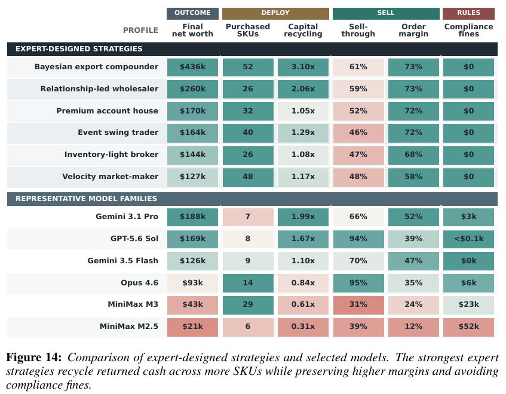

# Business Arena: Benchmarking LLM Agents in a Realistic Marketplace

**Authors:** Yijun Pan, Yukun Lian, Kunyu Shi, Junbo Li, Hongwei Xue, Sicong Xie, Guannan Zhang, Xiaoying Xing (Accio Team, Alibaba Group; Yale University)
**Published:** 2026-08 · [Source](https://arxiv.org/abs/2608.08621) · Project page: business-arena.site.accio.ai
**Lens:** `eval-designer` · **Digested:** 2026-10-01

## TLDR

Business Arena, built by the Accio team at Alibaba with a Yale co-author, hands one LLM agent a cross-border B2B shop with $80,000 of starting capital and 30 simulated operating days (the calendar compresses one real-world year of festivals into those 30 days), and scores it on salvaged net worth: cash plus 97% of escrow and receivables plus 85% of inventory, minus payables and loans. The world is grounded in real data: 965 supplier offers from 831 masked Alibaba.com suppliers across 135 SKUs, seasonal demand from US Census, Eurostat and China NBS retail series, tariffs from World Bank WITS, and 60 scripted competitor sellers drawn from 10 pricing archetypes. The agent runs unattended in a sandbox with more than 60 tools exposed as typed MCP calls plus a scriptable API and a persistent workspace. Fifteen frontier models were run 10 times each (150 episodes, one shared world seed, maximum thinking effort). Mean final net worth ranged from $188,488 (Gemini 3.1 Pro) to $20,856 (MiniMax M2.5), a 9.0x spread; 51% of all runs lost money and only 4 of 15 models kept their starting capital in all 10 runs. A hand-written deterministic strategy using only agent-visible information (the "Bayesian export compounder") reached $436,195, more than twice the best model mean, and all six expert strategies paid $0 in compliance fines. Ten-run means are reliable (ICC(1,10) = 0.944 versus 0.626 for a single run; split-half Spearman 0.898 across 50,000 partitions), but 35.2% of score variance is run-to-run noise within a model. Skill-level profiles show distinct operating styles: Gemini 3.1 Pro protects a 52% order margin at 66% sell-through, GPT-5.6 Sol and Opus 4.6 sell through 94 to 95% of stock at 35 to 39% margin, and Opus 4.8 converts 84% of buyer inquiries while preserving capital in only 4 of 10 runs. Mechanism ablations show the intended behaviour beats both neglect and a plausible shortcut on all five headline mechanisms (evidence-guided sourcing +$63.6k, full-cost pricing +$50.3k, tariff-aware routing +$25.9k over the stronger negative control). The most useful takeaway: the leaderboard number only means something because of three instruments around it, a scripted human-strategy library that bounds the available opportunity, 10 repeats with reliability reported, and shortcut-arm ablations that show the score rewards the intended skill rather than a simulator exploit.

## Key Takeaway

The thing beating every frontier model in Business Arena is not a bigger model, it is a deterministic, human-designed strategy: a hand-coded Bayesian policy that sees only the same public tool outputs made $436k while the best model averaged $188k. The gap is not reasoning, it is appetite and discipline: expert strategies bought 26 to 52 SKUs and the two strongest of them recycled capital 2.06 to 3.10 times, while the two leading model families bought 7 to 8 SKUs and recycled 1.67 to 1.99 times. The fastest sellers finished behind slower ones: GPT-5.6 Sol and Opus 4.6 sold 94 to 95% of their stock but at 35 to 39% margin, and still trailed the two top expert strategies that sold about 60% of their stock at 73% margin. And the model best at talking to customers (Opus 4.8, 84% inquiry conversion) finished below its starting capital in 6 of 10 runs.

## Implications

- **Build a scripted human-strategy library before you run a single model, and report every model as a fraction of it**: Business Arena's six deterministic strategies (Bayesian export compounder $436k, relationship-led wholesaler $260k, premium account house $170k, event swing trader $164k, inventory-light broker $144k, velocity market-maker $127k) use only the public tool surface, no hidden state. Without them, $188k from $80k looks like a solved task; with them it is 43% of the available opportunity. For an agent that buys on a person's behalf, write three to six rule-based buyer strategies (patient bidder, deadline sniper, diversified low-baller) and publish the best one as the ceiling.
- **Score salvaged value, not cash or revenue**: FinalAssets = cash + 0.97 escrow + 0.97 receivables + 0.85 inventory, minus payables and loans at face value. This closes the "I am rich, it is all in unsold stock" loophole (one GPT-5.5 run hit day 19 with zero cash and about $90,000 tied up in inventory). For a buying agent, value anything the agent holds at liquidation or resale price, never at what it paid.
- **Ten runs, same world seed, and publish the reliability numbers with the mean**: a single episode has ICC(1,1) = 0.626; ten runs lift it to 0.944, and model identity explains only 64.8% of score variance. Report a "capital preserved X/10" column next to the mean: Gemini 3.1 Pro had the highest mean but dropped below $80k in one run, while GPT-5.6 Sol, Fable 5, Gemini 3.5 Flash and GPT-5.5 were 10/10. The authors say outright that reliability is part of capability, not an error bar around it.
- **Make rule-breaking cost money inside the score, do not just log it**: the fine for the k-th sale without a permit is max($500, 15% of order value) x min(k, 5), so ten floor-level violations cost $20,000, a quarter of starting capital. MiniMax M2.5 averaged 22.7 violations and $51,750 in fines; in one DeepSeek V4 Pro run the model wrote in its reasoning that it needed the certification, never called the tool, and paid $80,000 across 34 violations. For an agent spending someone's money, budget caps, consent rules and "do not buy from X" constraints should be priced the same way so the headline number carries the safety signal.
- **Validate the eval with a shortcut arm, not only a neglect arm**: for each of five mechanisms the authors ran the intended policy against both "ignore it" and "do a cheap fake version" (buy only cheap SKUs, follow every rumour, extreme markup, tariff-blind US focus, generic replies), and set the stronger negative as zero. The intended policy won every ladder, by $5.6k to $63.6k. If your shortcut arm ever ties the intended policy, the eval is rewarding a heuristic and models will find it.
- **Decompose the score, because the leaderboard hides specialists and frauds**: customer-service ranking does not follow net worth (Opus 4.8 84% inquiry conversion versus 57% for leaderboard leader Gemini 3.1 Pro), and MiniMax M2.5's 12.1% average order margin is explained by traces like the one the authors show, where its pricing script set one price per SKU across all markets and put 98 of 142 orders below landed cost. Report capital utilisation, sell-through, margin, service quality and fines as separate columns from day one.
- **Checkpoint the full state so you can fork from hard moments**: the save-fork-load harness restores marketplace, workspace and the exact model context. Used for trace search on Qwen 3.8 Max Preview (K = 2, M = 3), forking every five days reached $108,878, 16.9% above forking daily ($93,111) and 16.7% above the best of six independent runs ($93,268) on the same 180 model-day budget. The daily result is also direct evidence of delayed feedback: the branch that looks best after one day is not the one that wins at day 30.

## How to Apply It (method)

**Scenario:** You are building an eval in which an agent is handed a real person's brief and budget ("find me a used 56cm titanium gravel frame, under $1,800, within three weeks, no cracked head tubes") and must buy it on a live secondary market. Before any real money moves, you want a controlled arena version with the same instrument design as Business Arena, so that when you do go live you know what "good" looks like, how noisy one run is, and whether the score can be gamed.

**Steps:**

1. **Write the question first, then pick one number that answers it**: Business Arena asks "can an agent sustain a coherent business in a realistic, changing market?" and answers with mean final net worth over 10 runs. Write your equivalent in one sentence ("can an agent buy the right item at a fair price without breaking the person's rules?") and pick a single open-ended score with no ceiling, for example surplus = fair resale value of what was bought minus total cash out, minus penalties.

2. **Define the episode**: one episode = one brief, one starting budget, a fixed horizon (Business Arena uses a setup phase plus 30 simulated days and lets the agent call `end_round` to advance one day whenever it decides the day's work is done). Decide what happens to unfinished state at the end: Business Arena haircuts escrow and receivables to 97%, inventory to 85%, and leaves liabilities at face value:

   ```
   FinalAssets = cash + 0.97 * escrow + 0.97 * receivables + 0.85 * inventory - payables - loans
   ```

   Your analogue: an item still in transit counts at 97%, an item bought but not yet resold counts at liquidation value, unpaid invoices count at 100%.

3. **Ground the world in real listings**: the arena's 965 supplier offers, 831 suppliers and 135 SKUs come from real Alibaba.com storefronts with identities masked; demand seasonality comes from US Census MRTS (via FRED), Eurostat sts_trtu_m and China NBS; tariffs from World Bank WITS. Scrape a real month of listings for your category (price, condition, seller rating, time-to-sale, location) and build the simulated market from those distributions. Keep some risk hidden until after commitment, as the arena does with suppliers who overstate quality or understate lead time.

4. **Populate the market with scripted counterparties, not LLM ones**: the arena runs 60 scripted sellers per episode, 10 baseline archetypes plus 50 sampled from the same pool, across five capital tiers (micro $5k 45%, small $25k 30%, mid $80k 18%, large $300k 5%, enterprise $1M 2%). Each archetype is a pricing rule (price_leader at 95% of competitor median, follower at the 3 cheapest plus 2%, liquidator at 78% of median, premium at 3x cost, dormant with 5%/day decay after 10 days without a sale). Write 8 to 10 seller archetypes for your market (firm-price dealer, haggler, flaker who withdraws listings, scammer with a too-good price) and give each a deterministic daily loop.

5. **Build the tool surface with an information boundary**: expose observation and action as typed tool calls (the arena's include `get_listings`, `get_shipping_rules`, `apply_certification`, `reply_inquiry` and `end_round`; yours would add buyer-side analogues such as `make_offer` and `ask_seller`) plus a scriptable API and a writable workspace so the agent can author its own routines. Run the agent as an unprivileged user; keep the simulator's code, database and hidden state behind filesystem permissions. Give the agent documentation as a layered skill set: a short top-level guide and deeper domain files on demand.

6. **Add persistent obligations that cost money when broken**: the arena charges $200 fixed overhead per day plus 0.5% of on-hand inventory value, and fines illegal trading with

   ```
   F_k = max($500, 0.15 * order_value) * min(k, 5)
   ```

   Write your person's hard rules (budget ceiling, banned sellers, "ask me before spending over $500") as fines on the same scale as the opportunity, so a rule-breaking run cannot top the leaderboard.

7. **Write the human-strategy library**: before running any model, hand-code three to six coherent strategies that see only the public tool outputs. The arena's strategies are not bundles of per-feature heuristics; they are a belief layer (demand, route, inventory, customer-value beliefs with explicit uncertainty), a capital-and-portfolio plan that constrains every downstream module, and a feedback loop that updates beliefs from realised outcomes. Run each strategy 10 times; the best one is your published ceiling.

8. **Run every model 10 times on one world seed and compute reliability**: report mean, within-model SD, two-sided 95% t-interval, and a "capital preserved X/10" count. Fit a one-way random-effects model and report

   ```
   ICC(1,1) = s2_between / (s2_between + s2_within)
   ICC(1,k) = k * ICC(1,1) / (1 + (k - 1) * ICC(1,1))
   ```

   plus a split-half check: partition each model's 10 runs into two sets of 5, rank models on each half, repeat 50,000 times and report mean Spearman and how often the top-3 group agrees. The arena got ICC(1,1) = 0.626, ICC(1,10) = 0.944, Spearman 0.898 and top-3 agreement 98.7%.

9. **Decompose the score into skill metrics**: the arena's columns are arena calls, world-check rate, call-failure rate, capital utilisation, holding cost, sell-through, order margin, route cost, ad ROI, market share, buyer conversion, factual-reply rate, RFQ success and fines. Pick the eight to twelve that map to your capability list (search breadth, offer discipline, negotiation, rule-following, information checking) and publish them as a heatmap next to the leaderboard.

10. **Run mechanism ablations with neglect and shortcut arms**: for each mechanism you care about (reads condition photos, checks comparable sold prices, verifies seller rating), write the intended policy, a neglect policy and a shortcut policy, run each on 10 matched seeds, and set the stronger negative as zero. The arena reports ladders such as evidence-guided sourcing $144,069 versus $80,433 (cheapest SKU only) versus $65,816 (blind bulk buying), and small ad tests at 21.45x incremental net worth per ad dollar versus 4.94x for blind spending.

11. **Log evidence-action-outcome chains for attribution**: record, for every purchase or offer, the information the agent read, the action it took and the realised financial result, so you can show that a 31.5% margin on one order and a -37.0% margin on another came from the same model in the same run, one with route-specific landed cost, one without.

12. **Checkpoint for forks**: save the marketplace state, the workspace archive and the exact post-compaction message sequence at each day boundary so you can fork alternative continuations from the same hard state (a bidding war at day 12, a seller who stops replying) and compare models like-for-like.

**Expected outcome:** A leaderboard where every model's surplus is stated as a fraction of the best hand-coded buyer strategy, with a 10-run mean, confidence interval, ICC and capital-preserved count; a skill heatmap that separates "good at haggling" from "good at obeying the budget"; a five-row ablation table that proves the score rewards reading the market rather than a bidding heuristic; and a checkpoint library of hard states you can rerun on every new model release. When you go live with real money, you will know which models never breached the budget in simulation and which only won on average.

## Best Figure



Image Candidates:
Figure 14 (p. 29): Six hand-coded expert strategies and six models side by side on final net worth, SKUs purchased, capital recycling, sell-through, order margin and fines; it shows the headroom and the mechanism behind it in one table.
Figure 3 (p. 8): Day-by-day net-worth curves for all 15 models with the expert strategy as a dashed line; the headline leaderboard, but its legend numbers do not match the text (see note below).
Figure 4 (p. 9): The 15-model by 14-metric diagnostic heatmap; the richest view of operating styles, but too dense for a single slide.

Best Image:
Figure Name: Figure 14: "Comparison of expert-designed strategies and selected models"
Figure Page: 29
Slide Caption: Hand-coded strategies using the same public information beat every frontier model by buying more SKUs, recycling capital 2 to 3 times and paying zero fines.
Description: The table puts six deterministic expert strategies (Bayesian export compounder $436k down to velocity market-maker $127k) above six representative models (Gemini 3.1 Pro $188k down to MiniMax M2.5 $21k) and colours each cell by cohort-relative strength. Three columns explain the gap: expert strategies purchased 26 to 52 SKUs against 6 to 14 for most models, recycled capital 1.05x to 3.10x against 0.31x to 1.99x, and paid $0 in compliance fines against up to $52k. The sell-through and margin columns show the trade-off the authors highlight: the two fastest-selling models (GPT-5.6 Sol 94%, Opus 4.6 95%) run thin margins (39%, 35%), while the top expert strategies accept about 60% sell-through at 73% margin and still finish far ahead. For an eval designer the figure is the argument for a scripted baseline library: it turns "the best model made 2.4x its money" into "the best model captured 43% of what was available".

Note on Figure 3 (p. 8): the chart legend in the rendered PDF lists an "Adaptive Export Portfolio" at $451,531, Gemini 3.1 Pro at $198,463, GPT-5.6 at $171,208, Claude Fable 5 at $170,535 and MiniMax M2.5 at $22,782. The body text and Table 5 give $436,195, $188,488, $168,867, $164,204 and $20,856. The paper does not explain the difference. This digest uses the text and Table 5 values throughout.

## What Experts Overlook

The result that lets the authors say "high scores reflect business intelligence, not simulator exploitation" is not the leaderboard, it is the shape of the ablation ladder in Table 1 and Appendix G. For each mechanism they run three arms, not two: the intended policy, a neglect policy, and a shortcut or misuse policy that a benchmark-hacker would plausibly try (buy only the cheapest SKUs, react to every rumour, apply an extreme markup, concentrate on the US route while ignoring tariffs, send generic customer replies). Then they set the stronger of the two negatives as the zero baseline. In four of the five headline rows the shortcut was the stronger negative, meaning the cheap trick beat doing nothing, and the intended policy still beat the trick by $5.6k (evidence-based customer replies), $6.6k (checking events), $25.9k (tariff-aware routing), $50.3k (full-cost pricing) and $63.6k (evidence-guided portfolio). Paired with this is the demand-inference ladder, which quantifies how much of the hidden state the public evidence reveals: oracle demand gives Spearman 1.000, the public signals 0.972, a compressed three-level reading 0.963, country averages 0.260, no evidence 0.000, fabricated evidence -0.039 and deliberately reversed evidence -0.972. The authors also say they post-processed the Google Trends feed so that it correlates with oracle demand. So the world is solvable by construction from public information, and the ablations show that solving it properly pays more than any cheap approximation.

**Why it matters:** Most benchmark validations stop at "the agent beats a random or null policy", which only proves the task is not impossible. It says nothing about whether a model can top the leaderboard with a heuristic that has nothing to do with the capability the eval claims to measure. Adding a shortcut arm and using the stronger negative as the baseline is what turns a net-worth number into evidence about a skill. The flip side is that it also tells you how the environment was tuned: a 0.972 correlation between public evidence and hidden demand means the information-gathering problem is easier than a real market, where a careful operator rarely recovers the demand ranking that cleanly. The eval is testing "did you do the analysis", not "can you operate on signals that are genuinely insufficient".

**Example of good use:** In a secondary-market buying eval, write the shortcut policy before the first model run: "bid 85% of asking on every listing that matches the keyword, accept the first yes". Run it 10 times on matched seeds alongside the intended policy (read condition, check sold comparables, verify seller history, bid relative to fair value). If the intended policy beats the shortcut by a margin larger than the run-to-run noise, the surplus score means what you say it means. If the two tie, fix the simulator (add listings where the shortcut overpays or buys a damaged item) before any model leaderboard goes out.

**Example of misapplication:** A team ships a vending-style eval validated only against "agent versus random actions", publishes a leaderboard, and a model family tops it with a policy that undercuts the median listed price by a fixed 8% and never reads a listing. The team reports "strong market understanding". Later, when that model is deployed on a real marketplace where sellers adapt and comparables are noisy, it overpays on damaged goods, because the eval never checked whether the score could be earned without reading the evidence. Conversely, a team that copies the arena's 0.972-correlated Trends signal into a real-money eval will overstate how well models cope with the ambiguity of actual demand data.

## Extracted Prompts

No applicable prompts found in this paper.

_The paper describes the agent's instructions only structurally: "a compact top-level guide introduces the task and core tool surface, while deeper domain files provide detailed market and operating information when needed." No verbatim system prompt, task prompt or evaluator prompt is reproduced. The tool names the agent sees (for example `get_base_demand_intel()`, `get_supplier_catalog()`, `set_price_tiers()`, `apply_certification()`, `end_round()`) are listed in Table 2 of the appendix._

## Citations

27 references extracted (full structured list in frontmatter). First ten:

- Ansel, Arya, Cooperman (2009). DMTCP: transparent checkpointing for cluster computations and the desktop. IPDPS. doi:10.1109/IPDPS.2009.5161063
- Backlund, Petersson (2025). Vending-bench: a benchmark for long-term coherence of autonomous agents. arXiv:2502.15840
- Chen, Narasimhan, Liu (2026). CEO-Bench: can agents play the long game? arXiv:2606.18543
- Desai et al. (2026). SWE-Marathon: long-horizon software engineering tasks for LLM agents. arXiv preprint
- Dong et al. (2026). DeltaBox: scaling stateful AI agents with millisecond-level sandbox checkpoint/rollback. arXiv:2605.22781
- He et al. (2026). YC-Bench: benchmarking AI agents for long-term planning and consistent execution. arXiv:2604.01212
- Jimenez et al. (2024). SWE-bench: can language models resolve real-world GitHub issues? ICLR
- Keys, Wolfe (1990). The role of management games and simulations in education and research. Journal of Management 16(2)
- Shrout, Fleiss (1979). Intraclass correlations: uses in assessing rater reliability. Psychological Bulletin 86(2). doi:10.1037/0033-2909.86.2.420
- Simon (1955). A behavioral model of rational choice. Quarterly Journal of Economics 69(1)

The remaining 17 are Sterman 1989, Teece et al. 1997, Tesfatsion 2006, ShoppingBench (AAAI 2024), Crab (arXiv:2604.28138), tau-bench (ICLR 2025), WebArena (ICLR 2024), and ten data sources (Adobe, Criteo, Eurostat, FRED, Google Trends, Mastercard, China NBS, NRF, US Census, World Bank WITS).

## Related Digests

- [[backlund-2025-vending-bench]]: Vending-Bench: A Benchmark for Long-Term Coherence of Autonomous Agents (cited by this paper as a narrower commercial workflow; the single-machine ancestor of the full business loop)
- [[fan-2026-ecommerce-bench]]: E-Commerce Bench: Evaluating LLM Agents on Long-Horizon Autonomous Business Operation (the closest sibling: another long-horizon seller-side e-commerce arena)
- [[andon-labs-2026-andon-market-pion]]: Andon Market, Andon Café and Pion (what happens when the same question is asked with real money and real customers instead of a simulator)
- [[chen-2026-ceo-bench]]: CEO-Bench: Can Agents Play the Long Game? (cited by this paper; also finds a hand-written script beating every frontier model)

Not yet digested but positioned against in Section 2.2: YC-Bench (He et al. 2026) and ShoppingBench (Wang et al. 2024).

## Reviewer Notes

**Overall severity:** Minor fact tweak (all fixes below have been applied in this digest)

**Flagged claims:**

- **Claim:** "a set of deterministic hand-written rules with no language model in them"
  **Label:** Partially accurate
  **Justification:** Section 4.1 and Appendix J describe the strategy reserve as "deterministic strategies" and "expert-designed" or "human-designed" policies that use only agent-visible information. The paper never states whether a language model is or is not part of the controller.
  **Fix:** Applied. Replaced with "a deterministic, human-designed strategy" in the key takeaway and frontmatter.

- **Claim:** "expert strategies bought 26 to 52 SKUs and recycled capital 2.06 to 3.10 times"
  **Label:** Partially accurate
  **Justification:** Appendix J attributes 2.06 to 3.10x recycling to "the strongest strategies" (Bayesian export compounder 3.10x, relationship-led wholesaler 2.06x). Figure 14 shows the other four at 1.05x to 1.29x.
  **Fix:** Applied. Now reads "the two strongest of them recycled capital 2.06 to 3.10 times".

- **Claim:** "a 12.1% average order margin at MiniMax M2.5 traced to a pricing script ... putting 98 of 142 orders below landed cost"
  **Label:** Partially accurate
  **Justification:** Section 6.2 gives 12.1% as the ten-run average order margin and the 98-of-142 figure as "one trace". The digest implied the average was traced to that single script.
  **Fix:** Applied. Rephrased to say the average is illustrated by one trace the authors show.

- **Claim:** "typed tool calls (`get_listings`, `make_offer`, `ask_seller`, `get_shipping_rules`, `end_round`)"
  **Label:** Partially accurate
  **Justification:** `get_listings`, `get_shipping_rules` and `end_round` appear in Table 2; `make_offer` and `ask_seller` do not exist in the arena and were suggested analogues for the reader's buyer-side eval, but the sentence did not separate the two.
  **Fix:** Applied. Arena tools and suggested analogues are now listed separately.

- **Claim:** "the three business benchmarks this paper positions itself against"
  **Label:** Partially accurate
  **Justification:** Section 2.2 names four: VendingBench, ShopBench (ShoppingBench), YC-Bench and CEO-Bench.
  **Fix:** Applied. Now lists all four.

**Observations that are not digest errors but the reader should know:**

- The Figure 3 chart legend and the body text disagree on the headline numbers (legend: expert strategy $451,531, Gemini 3.1 Pro $198,463; text and Table 5: $436,195 and $188,488). The digest uses the text and Table 5 throughout and flags the discrepancy in the Best Figure section.
- The paper does not say how the "factual replies" metric or the "supported" label on customer-service responses is graded (human, rule, or LLM judge), nor whether buyers and their inquiries are scripted or model-generated. The digest does not assert either way.
- All 150 leaderboard runs share one world seed. Appendix H states that robustness across different market realisations "requires crossing models with multiple world seeds" and was not done. Spread and reliability numbers in this digest are conditional on that single world.
- The arena is explicitly not a test of live-system execution (no real storefront, GUI, inbox or external side effects) and is limited to cross-border B2B commerce (Section 7).
