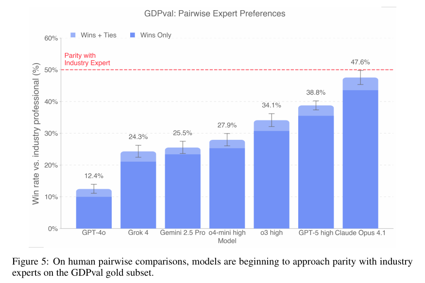

# GDPval: Evaluating AI Model Performance on Real-World Economically Valuable Tasks

**Authors:** Tejal Patwardhan, Rachel Dias, Elizabeth Proehl, Grace Kim, Michele Wang, Olivia Watkins, Simón Posada Fishman, Marwan Aljubeh, Phoebe Thacker, Laurance Fauconnet, Natalie S. Kim, Patrick Chao, Samuel Miserendino, Gildas Chabot, David Li, Michael Sharman, Alexandra Barr, Amelia Glaese, Jerry Tworek (OpenAI)
**Published:** 2025-10 (arXiv v1, 5 Oct 2025; announcement post 25 Sep 2025) · [Paper](https://arxiv.org/abs/2510.04374) · [OpenAI page](https://openai.com/index/gdpval/)
**Lens:** `eval-designer` · **Digested:** 2026-10-01
**Source used:** arXiv PDF (29 pages) as primary; the OpenAI announcement page as supplementary.

## TLDR

OpenAI built GDPval to answer one question: can frontier models produce the deliverables that paid professionals actually get paid for? The full set has 1,320 tasks across 44 occupations drawn from the 9 U.S. sectors that each contribute over 5% of GDP (the 44 occupations earn about $3T a year in wages); 220 tasks are open-sourced as a gold subset. Tasks were written by professionals with 14 years' average experience (under 10% of applicants accepted, at least 5 per occupation), each reviewed an average of 5 times, and each comes with the writer's own deliverable as the human baseline. Gold tasks take an expert 9.5 hours on average (median 5), are worth about $398 at median wages (median $175), and carry up to 17 reference files; 67.7% need at least one file, and outputs span documents, slides, spreadsheets, CAD, audio and video. The primary metric is a blind pairwise comparison by a separate occupational expert of the model deliverable against the human one, 3 samples x 3 graders = 9 comparisons per task per model, reported as wins plus ties with 95% CIs. Headline: Claude Opus 4.1 wins or ties 47.6% of comparisons, GPT-5 high 38.8%, o3 high 34.1%, o4-mini high 27.9%, Gemini 2.5 Pro 25.5%, Grok 4 24.3%, GPT-4o 12.4%; OpenAI's own line rose roughly linearly over 15 months (12.4% to 38.8%, about 3x). Claude won on formatting and layout, GPT-5 on accuracy and instruction following; the most common reason experts picked the human was that the model did not fully follow instructions. Naively, the OpenAI models are 90x to 327x faster and 474x to 5,172x cheaper than experts (no cost data was obtained for Claude, Gemini or Grok), but once you add the 109 minutes ($86) an expert spends reviewing each output and a full redo on every loss, a "try once, then fix it" workflow saves only 1.12x time and 1.18x cost with GPT-5 and loses time with GPT-4o (0.87x); the repeated-retry scenario in Table 2 gives GPT-5 1.39x time and 1.63x cost. Of GPT-5's losses, about 3% were rated catastrophic and about 29% bad or catastrophic. Win rates fall as task length rises and fall further when prompts are cut to 42% of their length. A thoroughness prompt that makes the agent render its own PDFs and slides to PNG and inspect them lifted GPT-5's win rate by 5 points, removed the black-square artifacts that had hit over half of its PDFs, and raised self-inspection from 15% to 97% of runs. An automated GPT-5-based grader agrees with human experts 65.7% of the time against 70.8% human inter-rater agreement, and is least reliable on OpenAI's own strongest models. The useful number for anyone delegating work to an agent is not the inference cost but the win rate, because review is paid on every attempt and rework on every failure.

## The Four Questions (lens read)

- **The question.** "Can AI models perform the economically valuable tasks that experts do, and how fast is that changing?" A capability question framed as an economic leading indicator: the authors argue adoption and GDP statistics lag by years (David 1990, Solow 1987), so they measure capability directly. The instance (44 occupations, 9 sectors) was picked top-down from GDP share and wage totals, not from where AI is already used.
- **The instrument.** One run = one deliverable for one task prompt plus reference files, produced one-shot with tools (web search, code interpreter for OpenAI models; Claude via its UI with file creation). 220 gold tasks x 3 samples x 3 graders. Metric: blind pairwise win rate against the task writer's own deliverable, reported as wins plus ties; no ceiling, since the baseline can be swapped for a stronger model later. Baseline: human expert. Spread: 95% CIs per model in Figure 5; no pass^k or worst-run reporting. The choice that made the headline possible: counting ties as parity-or-better, and grading subjective quality (format, aesthetics) alongside correctness.
- **The result and the surprise.** Claude Opus 4.1 at 47.6% wins plus ties, GPT-5 high at 38.8%, GPT-4o at 12.4%. The surprises: a non-OpenAI model topped OpenAI's own benchmark, and it did so on aesthetics rather than accuracy; and the speed and cost story inverts once oversight is priced (Table 2). Decomposition shows win rates near parity in Government, Retail Trade and Wholesale Trade, and low in others; shorter tasks (0 to 2 hours) score best.
- **What it does not test, and what to borrow.** Not tested: interactive or multi-draft work, ambiguous briefs (a side experiment shows models do worse), tacit knowledge, PII, proprietary tools, communication between people, physical work, adversaries, real money at risk, and the cost of catastrophic errors (explicitly excluded from the cost model). Blinding leaked through style (em dashes, first person, Grok naming itself). The LLM grader prefers its own family. Borrow: (1) the oversight-adjusted savings formula, (2) failure severity grading of every loss into catastrophic / bad / acceptable-but-subpar / grader-disagrees, (3) pairwise comparison against what the specific person would have done, with the comparison written up by a third party.

## Key Takeaway

The 100x speed and cost advantage of models over experts almost vanishes the moment you count the human who checks the work: with review (109 minutes, $86 per task) and a redo on every loss, GPT-5 saves 1.12x on time and GPT-4o costs more than doing the task yourself (0.87x). The lever is not inference price but win rate, because review cost is paid on every attempt and rework cost on every failure, so a model that loses two tries in three is roughly break-even and the paper's best repeated-retry scenario still tops out at 1.4x time saved. Cheap inference buys nothing until the model clears the bar often enough to amortise the reviewer's hour.

## Implications

- **Price the reviewer, not the model**: GDPval's naive ratios (90x to 5,172x) collapse to 0.87x to 1.63x when review time (109 min) and rework are included (Table 2). For an agent spending someone's money, publish the savings net of the time the person spends approving or refusing each action and the losses on bad purchases; put the naive ratio in a footnote.
- **Compare against what the specific person would have done, graded blind by a third party**: the baseline is the task writer's own deliverable, judged by a different expert in the same occupation, 9 comparisons per task per model. The equivalent for a buying agent is the purchase the owner (or a hired proxy buyer) would have made from the same frozen set of listings, judged by someone who trades in that market and does not know which choice was the agent's.
- **Expect the headline to be inflated by short, well-specified tasks**: win rates are highest for 0 to 2 hour tasks and fall with duration (Fig. 13); 89% of tasks were rated well-specified (Table 7); cutting prompts to 42% of their length made GPT-5 worse (A.2.7). Include cells with the brief people actually give ("find me a good deal on a gravel bike under 2k") and report them separately from the fully specified cells.
- **Grade severity on every loss, and track catastrophic as its own number**: among GPT-5 losses, about 3% were catastrophic and about 29% bad or catastrophic; the cost model explicitly excludes catastrophic cost (A.2.1). For money, define catastrophic in advance (paid more than X% over market, bought a counterfeit, exceeded budget, sent funds to the wrong party) and report its rate next to the win rate.
- **Run the self-verification scaffold as a named condition, not a hidden default**: a prompt that forced rendering deliverables to PNG and inspecting them raised GPT-5's win rate 5 points, removed black-square artifacts from over half of its PDFs, cut egregious PowerPoint errors from 86% to 64%, and raised inspection from 15% to 97% of runs (3.4). Report both the raw and the scaffolded number so readers can see how much of the agent's ability is the harness.
- **Do not let a model grade its own family at the top of the table**: the GPT-5-based grader reached 65.7% agreement vs 70.8% inter-human, and agreement was lowest on OpenAI's strongest models (A.6.2, citing Panickssery 2024 on self-preference); 12 of 220 tasks were ungradable by the auto-grader. Use human judges or a cross-family judge for the models you expect to win.
- **Assume blinding leaks through style**: experts could likely spot OpenAI by em dashes, Claude by first-person phrasing, Grok by naming itself (footnote 2). In a market eval, sellers and graders will read "this is a bot" from message style; measure that leak and decide whether to scrub it.
- **Report spread, replicate, and say what the grader could not grade**: 3 samples per task, 3 graders per sample, 95% CIs on every bar, and an explicit list of the 12 tasks the auto-grader could not grade. No pass^k or worst-run is reported here; for an agent with money, add both, because the owner cares about the worst purchase, not the mean.

## How to Apply It (method)

**Scenario:** You are building an eval for an agent that buys on behalf of a real person in a live secondary market (used gravel bikes, concert tickets, vintage watches on marketplace sites). You want a headline number an enterprise operator will believe, plus the oversight-adjusted savings and a catastrophic-error rate.

**Steps:**

1. **Pick categories top-down by money, not by where agents already work**: GDPval chose sectors contributing over 5% of GDP and the 5 highest-wage occupations in each, then kept only occupations where at least 60% of O*NET tasks (weighted by relevance, importance and frequency) were classified digital by a prompted GPT-4o. Equivalent: rank marketplace categories by transaction volume, keep those where at least 60% of the buying work is done on a screen (search, compare, message, pay), and take the top 5 per category group.

2. **Recruit task writers who are the baseline**: minimum 4 years' experience, video interview, background check, training and quiz; under 10% of applicants accepted; at least 5 qualified people per occupation. For the market: people who have completed 50 or more purchases in the category, screened the same way. Pay them properly; GDPval's writers averaged 14 years' experience.

3. **Have each writer produce a task and their own gold deliverable**: a request (budget, preferences, constraints, deadline) plus reference files (frozen snapshot of 20 to 40 listings with photos and seller history, the person's past purchases), plus the writer's own choice with a written justification. Record self-reported time to complete; have reviewers validate it. Tag each task to the category's "work activities" so coverage can be reported (GDPval covered 63.4% of O*NET work activities and 71.4% of skills in the gold set).

4. **Run at least three review stages per task**: a generalist check against project rules, a category-expert check that the task is representative and completable by another expert from the files given, and an iterative feedback loop until it passes. GDPval averaged 5 human reviews per task, minimum 3, plus a model screen for relevance, digital-only, trivial difficulty and missing files (model feedback was advisory only). Have reviewers score difficulty, representativeness and overall quality on a 1 to 5 scale; GDPval's gold set averaged 3.32, 4.50 and 4.47.

5. **Sample the agent 3 times per task with its full toolset and log time and cost**: GDPval enabled web search and code interpreter for OpenAI models, ran Claude through its UI with file creation, preinstalled libraries, and recorded API latency and invoiced cost per task. For the buying agent, give it the same frozen listing snapshot, a messaging sandbox and a payment stub; log wall-clock time, tokens, and the simulated spend.

6. **Grade blind and pairwise, 3 graders per sample, with written justifications**: present the request, the files, and two unlabelled choices (agent vs human); ask "which is better, considering both objective and subjective criteria" with better / as good as / worse. Scrub filenames and identifiers but do not rewrite content. Each GDPval comparison took over an hour. Compute win rate, wins plus ties, and bootstrapped 95% CIs by resampling grades per sample. Compute human inter-rater agreement as the mean over sample pairs of 1 minus |H1 minus H2| with scores in {0, 0.5, 1}; this is your grader noise floor.

7. **Cluster every loss and grade its severity with a second grader**: cluster the justifications into mutually exclusive failure labels (GDPval found instruction-following, formatting, missing deliverable, ignored reference data, wrong format, accuracy errors). Then have a different expert rate each loss as catastrophic, bad, acceptable-but-subpar, or "disagree, agent was better". Report the catastrophic rate on its own line. For money: overpaid, counterfeit, budget breach, wrong recipient.

8. **Compute oversight-adjusted savings**: let HT and HC be the human's time and cost, RT and RC the review time and cost per agent output, MT and MC the agent's time and cost, and w the win rate. Then:

   ```
   Naive ratio:            HT / MT                and  HC / MC
   Try once, then fix:     E[T1] = MT + RT + (1 - w) * HT
                           E[C1] = MC + RC + (1 - w) * HC
   Try n times, then fix:  E[Tn] = (MT + RT) * (1 - (1 - w)^n) / w  +  (1 - w)^n * HT
                           E[Cn] = (MC + RC) * (1 - (1 - w)^n) / w  +  (1 - w)^n * HC
   Limit as n grows:       speedup -> HT / ((MT + RT) / w)
   ```

   GDPval's gold-set inputs were HT = 404 min, HC = $361, RT = 109 min, RC = $86. Report the three ratios side by side, as in Table 2. State what the model leaves out: review of the human's own work, the chance the human deliverable is also bad, and catastrophic-error cost.

9. **Run the ablations that show how cheaply the headline moves**: reasoning effort at low, medium and high; a thoroughness prompt (condensed from A.3 below; the verbatim text is in Extracted Prompts); best-of-4 with a judge; and an under-specified variant of every brief cut to roughly 40% of its tokens. Report each as a separate bar with CIs.

   ```
   Before you submit, you MUST perform these mandatory checks.
   STEP 1: Convert every visual deliverable to PNG, one page or slide per image.
   STEP 2: Display the PNGs. Look for text or graphics that are cut off, overlapping,
           distorted, blank, or hard to read. Zoom in. Any cut-off is an error.
   STEP 3: Write programmatic checks for blank pages, overflow, overlap, and page limits.
   STEP 4: Summarise the request's deliverable instructions and match each to the part of
           the deliverable that addresses it.
   STEP 5: Confirm the submitted files are exactly the ones you intend, and open each
           to confirm it is not corrupted.
   If any check fails, fix it and repeat steps 1-5.
   On the last line, write CONFIDENCE[XX], an integer 0-100, for your confidence that
   the submission is correct, follows instructions, and is well-formatted.
   ```

   (For a buying agent, the steps become: re-open the listing, re-read the budget and constraints, check seller history, confirm the price against three comparables, and state the confidence that the owner would approve.)

10. **If you build an automated grader, calibrate it against the human noise floor and check for family bias**: GDPval's GPT-5-high grader hit 65.7% agreement vs 70.8% inter-human, scored lowest on OpenAI's strongest models, and could not grade tasks needing internet, non-Python code, specific fonts, or non-speech audio. List what it cannot grade and exclude those tasks from its numbers (GDPval excluded 12 of 220).

**Expected outcome:** A per-model table with win rate, wins plus ties, CIs, failure clusters, catastrophic rate, and three savings ratios (naive, try once, try n), plus ablation bars showing how much the harness and the brief move the number. The headline becomes "the agent matches or beats the owner's own choice X% of the time, with Y% catastrophic purchases, and saves Z hours per task after the owner's review", which is a sentence an operator can act on.

## Best Figure



```
Image Candidates:
Figure 5 (p. 5): One bar per model showing wins-plus-ties and wins-only against a dashed 50% parity line, the whole claim in one view with 95% CIs.
Table 2 (p. 13): Naive 90x to 5,172x speed and cost gains collapse to 0.87x to 1.63x once review and rework are counted, the finding builders most need.
Figure 9 (p. 8): Reasoning effort and prompt tuning each move GPT-5's win rate predictably, showing how cheaply the headline moves.

Best Image:
Figure Name: Figure 5: "On human pairwise comparisons, models are beginning to approach parity with industry experts on the GDPval gold subset."
Figure Page: 5
Slide Caption: Blind expert graders rated Claude Opus 4.1 as good as or better than the human professional in 47.6% of GDPval gold tasks; GPT-4o managed 12.4% fifteen months earlier.
Description: Figure 5 plots, for seven frontier models, the share of 9-way expert comparisons per task in which the model's deliverable was rated better than (dark bar) or as good as or better than (light bar) the human expert's, with bootstrapped 95% CIs and a dashed red line at 50% marked "Parity with Industry Expert". Values run from GPT-4o at 12.4% through Grok 4 (24.3%), Gemini 2.5 Pro (25.5%), o4-mini high (27.9%), o3 high (34.1%) and GPT-5 high (38.8%) to Claude Opus 4.1 at 47.6%. It matters because it is the paper's whole argument in one chart: the ordering of models, the distance to parity, the size of the ties component, and the width of the error bars that a reader needs before believing any "approaching parity" sentence.
```

## What Experts Overlook

The number that quietly governs everything in GDPval is 70.8%: the rate at which two human experts agree on which of two deliverables is better (A.6.2, Figure 4b). On the paper's 0 / 0.5 / 1 scale that is about 29 points of disagreement between two graders of the same pair, part of it full reversals and part tie-versus-win. The paper shows the fingerprint of this noise in A.2.6: when a second set of experts re-rated GPT-5's "failures", 23% of them said the model deliverable was actually better, and the authors note this "roughly corresponds to the level of inter-rater agreement". The same floor bounds the automated grader: it reaches 65.7%, and no grader can be expected to exceed the humans' own 70.8% by much. This is why the design uses 9 comparisons per task per model, counts ties, and reports 95% CIs; without those, the gap between GPT-5 (38.8%) and Claude (47.6%) or the 5-point prompt-tuning gain would be inside the noise.

**Why it matters:** The headline "approaching parity" is a statement about the mean of a noisy judgment, not about any one deliverable. For any eval whose primary metric is a human preference, the first number to establish is inter-rater agreement, because it sets the smallest difference the eval can detect and the ceiling any LLM judge can reach. GDPval's inclusion of ties as "parity" also matters here: with grader noise near 30%, a share of ties is unavoidable, and how you count them moves the headline by several points.

**Example of good use:** In a buying-agent eval, before scoring any model, have two expert buyers independently grade 60 agent-vs-owner pairs and compute agreement. If it lands near 70%, plan for at least 3 graders per sample and 3 samples per task, and treat any model-to-model gap under about 5 points as unresolved. Re-grade every agent loss with a second grader and report the "grader disagrees" share next to the catastrophic share, exactly as A.2.6 does.

**Example of misapplication:** A team runs one grader per sample, finds their agent at 45% wins plus ties, and reports "near parity with human buyers". With 70% agreement and no replicates, a 45% figure is compatible with anything from the mid 30s to the mid 50s, so the claim is noise. Worse, if they then use a same-family LLM judge to scale up, the judge's self-preference (lowest agreement on the maker's own strongest models in Figure 16) can push their own agent several points above where human buyers would put it, and nobody will see it because the human comparison was never replicated.

## Extracted Prompts

**Prompt explanation:** Capability-elicitation and self-verification prompt given to the GPT-5 agent in the prompt-tuning experiment (A.3). It removed black-square artifacts, cut egregious PowerPoint formatting errors from 86% to 64%, raised self-inspection from 15% to 97% of runs, and lifted the human-preference win rate by 5 points. Reproduced from the paper, which says it was "lightly edited to remove some specific details of our scaffolding setup"; curly quotes and dashes normalised to ASCII.

```
Special characters - Never use the character - (U+2011), since it will render poorly on some people's computers. Instead, always use - (U+002D) instead. - Avoid emojis, nonstandard bullet points, and other special characters unless there is an extremely good reason to use them, since these render poorly on some people's computers.
Graphics embedded within PDFs/slides - Make sure that any diagrams or plots are large enough to be legible (though not so large that they are ugly or cut off). In most cases they should be at least half the page width. - Plots and charts to visualize data are good. Simple graphics (like a flowchart with arrows) are good. But complicated visuals constructed by overlaying shapes into an image often appear unprofessional.
PDFs - Always use LibreOffice to create the PDF (it must be LibreOffice! If LibreOffice is not installed, you can install it yourself). Other libraries sometimes show weird artifacts on some computers.
Fonts - Always use fonts which are available across all platforms. We recommend Noto Sans / Noto Serif unless there is an extremely good reason to use something else. If you must use another font, embed the font in the pptx/word/etc doc.
Deliverable text - Do not link to submitted files in the deliverable text (links are not supported on the interface where these will be viewed). - Ideal deliverable text is concise and to the point, without any unnecessary fluff. 4 sentences max. - Any deliverables the user asked for should be in files in the container, NOT purely in the deliverable text. - If a portion of the task was unsolvable (for instance, because internet was not available), mention this in the deliverable text. - Your submission should be complete and self-contained. Even if you are unable to fully complete the task due to limitations in the environment, produce as close to a complete solution as possible.
Verbosity Always be clear and comprehensive, but avoid extra verbosity when possible.
Filetypes If the prompt does not request a specific filetype, use "standard" filetypes like PDF, PPTX, DOCX, XLSX, MP4, ZIP, etc.
Video files (mp4, mov) Extract a string of images from the video files and check the images to see whether the visual elements are corrupted.
Mandatory formatting checks Before you submit your deliverable, you MUST perform the following mandatory formatting checks. Take your time, do these thoroughly, they are extremely important!
STEP 1: Convert all visual deliverables to PNGs using LibreOffice. This includes pptx, docx, pdf, xlsx, etc. Convert it so that each page or slide is a separate PNG. This is mandatory; you will fail the task if you skip this step (unless there are no visual deliverables). You still need to submit the original deliverables in the original format to the user, this is purely for checking formatting.
STEP 2: Display the PNGs. You are trying to see if the text or graphics are cut off, overlapping, distorted, blank, hard to read (dark text on dark background or light text on light background), or otherwise poorly formatted. Look at each image thoroughly, zoom in if you need to see more closely. Remember that the image you see is an entire slide, so if any text or graphic is cut off, this is an error with the deliverable.
STEP 3: Programmatic formatting checks. For highly visual submissions (e.g. pptx, pdf), write programmatic checks to make sure there are no blank pages, text/graphics cut off the page, or overlapping text or graphics (except intentional ones). Also check that if there is a page or slide limit, it is respected.
STEP 4: Summarize the prompt's deliverable instructions, and match that to the portion of the deliverable that addresses it.
STEP 5: Right before submitting, check that the deliverables you have produced are exactly what you want to submit: deliverables should contain exactly the files you want to submit, with no extra files. Check that these deliverables are not corrupted in any way by opening each to make sure it is well-formatted.
If any of these checks reveal a formatting issue, fix them and go through steps 1-5 again. Take your time, be thorough, remember you can zoom in on details.
This is IMPORTANT and MANDATORY, go through each step one-by-one meticulously! Every formatting error is a MAJOR ISSUE THAT YOU NEED TO FIX! There is no time limit, be thorough, go slide by slide or page by page.
Finally - on the last line of your output text, add CONFIDENCE[XX], where XX is an integer between 0 and 100, inclusive, indicating your confidence that the submission is correct, follows instructions, and is well-formatted.
```

**Prompt explanation:** Pairwise grading instruction shown to human expert graders (Figure 4a; only this short instruction is printed, not a full rubric).

```
Pick which is better (considering both subjective and objective criteria)
```

Two further prompts are described but not printed: the GPT-4o classifier that labels each O*NET task as digital or non-digital (2.1, A.7), and the GPT-5 best-of-4 judge that receives the prompt, reference files and four deliverables and picks the best (A.3).

## Citations

24 references extracted (full structured list in frontmatter). The first 10:

- Acemoglu (2025). The simple macroeconomics of AI. Economic Policy 40(121).
- Acemoglu & Autor (2011). Skills, tasks and technologies: Implications for employment and earnings. Handbook of Labor Economics vol. 4.
- Appel, McCrory, Tamkin et al. (2025). Anthropic Economic Index report: Uneven geographic and enterprise AI adoption.
- Bick, Blandin & Deming (2024). The rapid adoption of generative AI. NBER.
- Brynjolfsson & Hitt (2000). Beyond computation. Journal of Economic Perspectives 14(4).
- Brynjolfsson, Rock & Syverson (2017). Artificial intelligence and the modern productivity paradox. NBER WP 24001.
- Brynjolfsson, Li & Raymond (2025). Generative AI at work. QJE 140(2).
- Chatterji, Cunningham, Deming et al. (2025). How people use ChatGPT. NBER WP 34255.
- Chen, Srinivasan & Zakerinia (2025). Displacement or complementarity? The labor market impact of generative AI. HBS.
- David (1990). The dynamo and the computer. American Economic Review 80(2).

Most relevant for this corpus: Miserendino et al. (2025) SWE-Lancer (arXiv 2502.12115), the market-priced predecessor; Panickssery et al. (2024) on LLM judges favouring their own generations (arXiv 2404.13076); Eloundou et al. (2023) GPTs are GPTs (arXiv 2303.10130) for the task-based occupation method.

## Related Digests

- [[pan-2026-business-arena]]: Business Arena: Benchmarking LLM Agents in a Realistic Marketplace
- [[ivanov-2026-erp-bench]]: Anchor: Mitigating Artifact Drift in Agent Benchmark Generation
- [[han-2026-enterprise-arena-cfo]]: Can LLM Agents Be CFOs? Benchmarking Long-Horizon Resource Allocation in an Uncertain Enterprise Environment
- [[backlund-2025-vending-bench]]: Vending-Bench: A Benchmark for Long-Term Coherence of Autonomous Agents
- [[chen-2026-ceo-bench]]: CEO-Bench: Can Agents Play the Long Game?

How GDPval sits against these: it is the one-shot, human-graded, breadth-first instrument (44 occupations, expert pairwise win rate, oversight-adjusted cost) where the others are long-horizon simulations with programmatic scores. Read it for the grading and cost method; read the others for horizon, memory and environment design.

## Reviewer Notes

**Overall severity:** Minor fact tweak (every flagged claim was corrected in place before publication; no fabricated metrics, tools or experiments were found).

**Flagged claims (now fixed):**

- **Claim:** "reported as wins plus ties with bootstrapped 95% CIs" (TLDR, Four Questions, Implications, What Experts Overlook)
  **Label:** Partially accurate
  **Justification:** Figure 5 shows 95% CIs, but the paper only describes the bootstrap procedure for the grader-agreement plots (A.6.2); the CI method for Figure 5 is not stated.
  **Fix:** Removed "bootstrapped" wherever it referred to Figure 5.

- **Claim:** "unlimited retries cap GPT-5 at 1.39x time and 1.63x cost"
  **Label:** Partially accurate
  **Justification:** Table 2's "Try nx" column does not state n; the n-to-infinity limit is given as a formula only (A.2.1).
  **Fix:** Reworded to "the repeated-retry scenario in Table 2".

- **Claim:** "by a third occupational expert"
  **Label:** Partially accurate
  **Justification:** Section 2.5 says additional occupational experts were sourced to grade; "third" implied a specific count the paper does not give.
  **Fix:** Changed to "a separate occupational expert".

- **Claim:** "models are 90x to 327x faster and 474x to 5,172x cheaper"
  **Label:** Partially accurate
  **Justification:** Table 2 covers the four OpenAI models only; footnote 4 says no cost estimates were obtained for Claude, Gemini or Grok.
  **Fix:** Scoped the claim to the OpenAI models and added the footnote 4 caveat.

- **Claim:** "roughly 3 comparisons in 10 flip depending on who is grading"
  **Label:** Partially accurate
  **Justification:** The agreement metric is 1 minus |H1 minus H2| on a 0 / 0.5 / 1 scale (A.6.1), so a 29-point gap mixes full reversals with tie-versus-win disagreements.
  **Fix:** Reworded to describe the scale.

**Inconsistencies inside the paper itself (not digest errors; kept so readers do not trip on them):**

- Average expert time per task appears as 7 hours (Section 1), 9.49 hours mean for the gold set (Table 3), and 404 minutes (6.7 hours) in the cost analysis (A.2.1). The digest cites Table 3 and A.2.1 separately and labels each.
- Section 3.1 says model deliverables matched or beat humans "in just over half the tasks" while the best value in Figure 5 is 47.6%; the OpenAI announcement page says "just under half". The digest uses 47.6%.
- Table 2 lists GPT-5's win rate as 39.0% while Figure 5 shows 38.8% wins plus ties; Table 2 defines w as "rated better than" the human. The digest quotes each table's own number.
- Maximum reference files is "up to 17" for the gold subset in Section 1 but 38 in Table 5 (titled gold set). The digest uses the Section 1 figure.
- Section 3.4 says prompting cut PowerPoint formatting errors from 86% to 64% and raised inspection from 15% to 97%; these are stated in prose with no table, so they cannot be checked against a figure.
