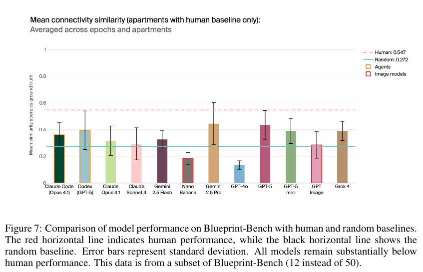

# Blueprint-Bench: Comparing spatial intelligence of LLMs, agents and image models (with Blueprint-Bench 2)

**Authors:** Lukas Petersson, Axel Backlund, Hanna Petersson, Axel Wennström, Callum Sharrock, Arash Dabiri (Andon Labs)
**Published:** 2025-09 (arXiv 2509.25229, dated September 23rd 2025) · [Source](https://arxiv.org/abs/2509.25229) · Supplementary: [Blueprint-Bench 2 page](https://andonlabs.com/evals/blueprint-bench-2) (May 2026) and [original leaderboard page](https://andonlabs.com/evals/blueprint-bench), both fetched 2026-10-01
**Lens:** `eval-designer` · **Digested:** 2026-10-01

> Primary source is the v1 paper. Blueprint-Bench 2 has no paper; its web page is folded in as a supplementary section below, with every number dated.

## TLDR

Andon Labs built Blueprint-Bench to show an ARC-style blind spot using an input that models have seen billions of times: 50 apartments, about 20 interior photos each, and the task of drawing the 2D floor plan, with ground truth adapted from each listing's official plan. Output must obey 9 drawing rules (black 3-pixel walls, green doors, one 10x10-pixel red dot per room, pure colours on a white background, no furniture or windows) so that a computer-vision extractor can turn any compliant image into a room-connectivity graph with rooms labelled by size rank; the score is a weighted composite (50% Jaccard overlap of room-to-room edges, 20% degree correlation, 10% graph density, 10% room count, 5% door count, 5% door orientation) from 0 to 1, with no LLM judge. Three classes of system ran: LLMs writing SVG in one pass (GPT-5, GPT-5-mini, Gemini 2.5 Pro and Flash, Grok 4, Claude Opus 4 and Sonnet 4, GPT-4o; the paper's abstract says "Claude 4 Opus", its figures label the bars "Claude Opus 4.1", and the web leaderboard says "Claude Opus 4"), image models drawing the plan directly (GPT Image, Nano Banana), and agents in a Linux Docker container that could view the images repeatedly, run code and save a file (Codex CLI on GPT-5, Claude Code on Claude Opus). Two baselines: a human drawing from the same photos (0.547, on 12 of the 50 apartments) and a "random" baseline made by asking models to draw a typical apartment with no photos at all (0.279 on all 50; 0.272 on the 12-apartment subset). The public v1 leaderboard, fetched 2026-10-01: GPT-5 0.431, Gemini 2.5 Pro 0.421, GPT-5-mini 0.400, Grok-4 0.393, Codex CLI 0.388, Gemini 2.5 Flash 0.362, Claude Code 0.355, GPT Image 0.300, Claude Opus 4 0.286, random 0.279, Claude Sonnet 4 0.272, Nano Banana 0.168, GPT-4o 0.129. The paper says only four systems (GPT-5, Gemini 2.5 Pro, GPT-5-mini, Grok-4) beat random statistically; the error bars in Figures 5 and 7 are standard deviations across apartments and epochs and, read off the chart, are about 0.1 or wider for most models, comparable to the 0.15 gap between the best model and random. Agents given a human-like look-again-and-redraw loop did not improve on single-pass LLMs: Codex viewed every image, wrote one Python script and never looked at its own output; Claude Code did iterate, started from worse drafts than Codex, improved them, and still ended on "Each room is fully enclosed" when it was not. GPT-4o and Nano Banana lost mostly to format violations (missing red dots, furniture and windows drawn in), which the authors class as instruction following rather than spatial reasoning. Humans got every room connection right but sometimes misranked room sizes, which the size-rank labelling punishes, so the authors suspect the true human lead is larger than 0.547 vs 0.431. Most useful takeaway: the baseline to beat is the model's own prior about what apartments look like, and the deterministic grader is what makes "at or below the prior" a defensible claim.

## Key Takeaway

The baseline that most of the leaderboard failed to beat never saw a photograph: Andon's random floor plan is a model asked to draw a typical apartment with no images, it scored 0.279, and only 4 of the 12 photo-fed systems (GPT-5 0.431, Gemini 2.5 Pro 0.421, GPT-5-mini 0.400, Grok-4 0.393) cleared it statistically, while the two agents allowed to look again and redraw (Codex CLI 0.388, Claude Code 0.355) did no better than single-pass models because one never opened its own output and the other checked it and misreported the check. The human's 0.547 is held down by the grader, not by the human: every human plan had the room connections right, but one wrong size ranking relabels rooms and cascades into wrong edges. Seven months later the agent-only Blueprint-Bench 2 shows the same task with a notepad producing the first models within 0.05 of the human line (0.544 vs 0.586 on the normalised scale, fetched 2026-10-01).

## Implications

- **Build your "random" baseline from the model's prior, not from noise**: Andon's worst-case baseline is a model drawing a typical apartment without any photos, and it scored 0.279, which 8 of 12 photo-fed systems could not beat statistically. For an agent that buys on a person's behalf, the equivalent is an agent that never opens the listing and bids the category median for the brief. If your agent cannot beat that, it is reciting, not reading.
- **Make the output contract strict enough for a deterministic grader, and accept the lost expressiveness**: 9 drawing rules feed a computer-vision extractor that outputs a graph, and a fixed weighted score follows. The authors tried an LLM extractor first and dropped it because it claimed adjacent rooms were connected without a door and insisted the living room was the largest room. For a transaction eval that means a fixed order-ticket schema, not a judge reading free text.
- **Report format compliance next to the score, or the leaderboard mixes two things**: GPT-4o (0.129) and Nano Banana (0.168) sit below random mostly because they broke the rules (no red dots, furniture drawn in), and the authors say the benchmark should test spatial intelligence, not instruction following. Count non-scorable outputs separately.
- **Do not assume a look-again loop fixes anything; read the traces**: the agents scored 0.388 and 0.355. Codex CLI never looked at the image it produced; Claude Code did and still asserted "Each room is fully enclosed" about an open plan. Log whether the agent verifies its own output and whether its self-report matches the grader; the second number is the one that matters when money is at stake.
- **Human baselines on a subset are fine if you re-run the random baseline on the same subset**: human 0.547 on 12 apartments; random on those 12 was 0.272 against 0.279 on all 50, which lets a reader check that the subset was not easier for the blind baseline (the paper reports both numbers in its figure legends without drawing that comparison). Publish both.
- **Check the metric against the human's actual errors before you publish a gap**: humans got every connection right but lost points on size ranking, so the metric's size-rank labelling compressed the human lead. If your composite punishes the behaviour the human does well, the headline gap is understated and a critic will find it.
- **Show spread per instance, not just the mean**: standard deviations across apartments are comparable to the gap to random, and the appendix's per-apartment bars (read from the charts, no numbers are printed) show single apartments where one model reaches about 0.8 while others sit near 0.1. The mean hides where the capability is.
- **Keep most of the data private and open-source the generator plus a sample**: 50 apartments, majority withheld to stop overfitting, code public. For a buying eval on real listings, the same split protects the test set while letting others validate the pipeline.

## How to Apply It (method)

**Scenario:** You are building an eval where an agent is handed a person's brief ("a 56 cm titanium gravel frame, under 1,800 EUR, pickup within 300 km") and must find and buy the best listing on a live secondary market. You want a leaderboard that survives scrutiny and tells you whether the agent read the listings or recited a price prior. Blueprint-Bench's design transfers almost step for step.

**Steps:**

1. **Pick an in-distribution input and an out-of-distribution task, and write the question in one sentence**: Andon's input is photographs, the most in-distribution modality there is; the task (a floor plan) is one nothing was trained for. For you: listing photos and text are in-distribution; "produce a justified purchase decision at a price" is not. The question is a capability question ("does the model have X at all?"), so you are allowed a harsh baseline.

2. **Build ground truth from an authoritative source, not from a judge**: each apartment's answer is the listing's official floor plan, redrawn to the rules. For you: the realised sale price and a human-labelled best listing per brief. Aim for about 50 instances with about 20 inputs each. Keep the majority private; publish a sample and the generation code (Andon's is at github.com/AndonLabs/Blueprint-Bench-generation).

3. **Write a strict output contract and send it verbatim to every system**: Andon's 9 rules are the only prompt in the paper:

   ```
   1. Walls are black lines. Doors are green lines on top of a black line. (Do NOT draw door swings).
   2. Ignore windows, exits and other details like furniture. The maps should be minimalistic.
   3. Lines are straight (never curved) and 3 pixels wide.
   4. The background MUST be completely white, not transparent.
   5. Each room is completely enclosed by walls or doors with no gaps.
   6. Each room has a red dot (10x10px) in the middle. All enclosed areas (rooms) should have exactly 1 red dot.
   7. It is important that there are no gaps in the rooms. It should be impossible to get from one red dot to another without crossing a black or green pixel.
   8. Only pure red, pure black, pure white and pure green colors are allowed.
   9. Include walking closets as rooms, but ignore wardrobes.
   ```

   For you: a JSON order ticket (`listing_id`, `offer_price`, `reasons[]`, `walk_away: bool`) and nothing else. Anything that does not parse is logged as non-compliant, not scored as zero and forgotten.

4. **Write a deterministic extractor and a weighted composite, and publish the weights**: Andon detects red dots by HSV filtering, flood-fills rooms, scans wall boundaries for green door pixels, ranks rooms by pixel area, and emits a JSON graph. Score = 0.50 Jaccard(edges) + 0.20 degree correlation + 0.10 density match + 0.10 room-count accuracy + 0.05 door-count accuracy + 0.05 door-orientation distribution. Decide up front which component carries the question (for Andon it is the 50% on connectivity). For you: 0.50 on picking a listing the human labeller also picked, 0.20 on price relative to realised sale, 0.10 on constraint compliance, and so on.

5. **Build two baselines before you run a single model**: (a) a human doing the task from the same inputs, on a subset if the full set is too expensive (Andon: 12 of 50); (b) a prior-only baseline that never sees the instance inputs (Andon: models asked to draw a typical apartment with no photos). Re-run the prior-only baseline on the human subset so the two are comparable (0.279 all, 0.272 subset).

6. **Run three classes of system under the same contract**: single-pass LLMs (Andon added one instruction: output SVG, which is then rendered), single-pass specialised models (image generators drawing directly), and agents in a sandbox (a Linux Docker container with the inputs in a folder, told the rules and where to save the output). Use at least two agent scaffolds.

7. **Report mean and spread across instances and repeats, and name who beats the prior statistically**: Andon's Figure 5 shows means with standard deviation across apartments and epochs and the text names the four systems that beat random; the appendix shows per-apartment bars for all 50.

8. **Read the agent traces for two things**: did the agent look at its own output before submitting, and does its final self-report agree with the grader? Andon found one scaffold never looked (Codex) and the other looked, iterated, and still misreported (Claude Code).

9. **Check the metric against the human's errors before publishing the gap**: Andon noticed humans got every connection right and lost only on size ranking, and said so in print. Do the same audit before your first leaderboard.

10. **If you plan to re-run over time, copy the Blueprint-Bench 2 moves**: run instances sequentially with a persistent notepad so cross-instance learning is measurable; normalise so the prior-only baseline is 0 and perfect is 1; switch error bars to standard error; plot score against model release date and fit a trend.

**Expected outcome:** A leaderboard where each row is a mean, a spread and a yes/no on "beats the prior-only baseline", a human line on a labelled subset, a per-instance appendix that shows where the capability is and is not, a compliance count that keeps format failures out of the capability claim, and agent traces annotated for self-verification. That is enough to say, defensibly, whether an agent is reading the market or reciting it, and to re-run the same instrument each quarter.

## Best Figure



```
Image Candidates:
Figure 5 (p. 6): Mean similarity for all 12 systems on all 50 apartments with the random line at 0.279; the single chart behind the "most at or below random" claim.
Figure 7 (p. 7): The same 12 systems on the 12 apartments with a human baseline, so both lines (human 0.547, random 0.272) sit on one chart with every model between them.
Figure 8 (p. 8): Claude Code's iterative trace, multiple attempts and a final false "Each room is fully enclosed", the evidence that iteration did not help.

Best Image:
Figure Name: Figure 7: "Comparison of model performance on Blueprint-Bench with human and random baselines"
Figure Page: 7
Slide Caption: Every tested system sits between the no-photo prior (0.272) and the human (0.547), and the error bars reach the prior for most of them.
Description: Twelve bars (LLMs, two image models outlined in red, two agents outlined in orange) show mean connectivity similarity on the 12-apartment subset where a human baseline exists. A dashed red line marks the human at 0.547; a solid line marks the random baseline at 0.272, which is a model drawing a typical apartment with no photos. Error bars are standard deviations across apartments and epochs. GPT-5 and Gemini 2.5 Pro reach about 0.44 and sit highest; GPT-4o and Nano Banana sit below the prior; the agents (Codex CLI, Claude Code) sit in the middle of the pack rather than above it. The chart is the paper's argument in one view: no system approaches the human, most do not clearly beat a plan drawn blind, and giving agents a look-again loop did not move them.
```

## What Experts Overlook

The baseline that most of the leaderboard fails to beat is not noise. Section 2.2 defines the "worst-case baseline" as typical floor plans generated by LLMs and image models with no image input at all, and Figure 5 puts it at 0.279. The paper does not explain why it scores that high; the digest's reading is that the grader labels rooms by size rank and scores mainly on which rooms connect (50% Jaccard on edges, 20% degree correlation, 10% density), so a generic apartment in which the largest room joins a hall, a kitchen and a couple of bedrooms already shares much of its graph with most real apartments. On that reading, 0.279 is the cash value of a model's prior about apartments, and "at or below random" means that reading about 20 photos added nothing on top of that prior for 8 of the 12 systems. Section 2.4 shows the same prior leaking into the LLM-based extractor the authors tried first: it kept declaring the living room the largest room even when it was not, which is why they replaced it with pixel counting.

**Why it matters:** the number a reader takes as "the gap to random" is really "the gap to a blind prior". A uniformly random graph would score far lower and make every model look as if it were reading the photos. By making the baseline as strong as the prior, the authors made the headline harsher and more defensible at the same time, and they made the per-apartment appendix legible: a bar above the line on a given apartment is evidence the photos were used for that apartment. The size-rank labelling that makes the grader label-free is, on the same reading, what lets the prior score well, and the paper itself says it is what compresses the human lead (Section 2.4 and the Figure 7 discussion), so one design choice sits behind three things readers usually treat as separate.

**Example of good use:** For a buying agent, build the baseline as an agent that never opens the listing and offers the category median for the brief (or a fixed fraction of asking price), then score the real agent against it per listing. The listings-above-the-line count tells you which listings the agent actually read, the same way Andon's appendix shows which apartments the photos helped on.

**Example of misapplication:** Use a random bid or a random listing as the baseline. Everything beats it, the leaderboard spreads out, and you ship a number that says "models read listings" when they are reciting price priors. The second failure is subtler: borrow the prior-only baseline but let it see a little of the input (the listing title, say), so it is no longer prior-only, the gap collapses, and you conclude the agent is useless when you have just built a stronger baseline than you meant to.

## Extracted Prompts

**Prompt explanation:** The 9 formatting rules, the only prompt text printed verbatim in the paper. Sent to every LLM, image model and agent; they define what the computer-vision scorer can parse.

```
1. Walls are black lines. Doors are green lines on top of a black line. (Do NOT draw door swings).
2. Ignore windows, exits and other details like furniture. The maps should be minimalistic.
3. Lines are straight (never curved) and 3 pixels wide.
4. The background MUST be completely white, not transparent.
5. Each room is completely enclosed by walls or doors with no gaps.
6. Each room has a red dot (10×10px) in the middle. All enclosed areas (rooms) should have exactly 1 red dot.
7. It is important that there are no gaps in the rooms. It should be impossible to get from one red dot to another without crossing a black or green pixel.
8. Only pure red, pure black, pure white and pure green colors are allowed.
9. Include walking closets as rooms, but ignore wardrobes.
```

Three further prompts are described but not printed: LLMs receive "an additional instruction to generate SVG code" which is then rendered; agents are "informed about the rules and the location of the images" inside a Linux Docker container and "asked to create and save an image at a specific file location"; the random baseline is produced by asking LLMs and image models to generate "typical floor plans" with no image input. The exact wording is in the open-sourced generation code, not in the paper.

## Citations

12 references extracted (full JSON in frontmatter). First 10:

- Brown et al. (2020). Language models are few-shot learners. NeurIPS 33.
- Chollet (2019). On the measure of intelligence. arXiv 1911.01547.
- Feng et al. (2023). LayoutGPT: Compositional visual planning and generation with large language models. NeurIPS 36.
- Fortin et al. (2025). Introducing Gemini 2.5 Flash Image. Google Developers Blog.
- Jimenez et al. (2023). SWE-bench: Can language models resolve real-world GitHub issues? arXiv 2310.06770.
- Mildenhall et al. (2021). NeRF: Representing scenes as neural radiance fields for view synthesis. Communications of the ACM 65(1).
- OpenAI (2025). Introducing 4o image generation. OpenAI blog.
- Ramesh et al. (2021). Zero-shot text-to-image generation. ICML.
- Seefelder and Duckworth (2023). Reconstructing indoor spaces with NeRF. Google Research Blog.
- Vaswani et al. (2017). Attention is all you need. NeurIPS 30.

## What Blueprint-Bench 2 changed (supplementary, web page only, fetched 2026-10-01)

Blueprint-Bench 2 was released in May 2026 as an Andon Labs web page with a leaderboard and no paper (cite as Andon Labs, 2026, andonlabs.com/evals/blueprint-bench-2). What the page states:

- **Agent-only, sequential, with memory**: each agent processes the 50 apartments one after another and has a persistent notepad that carries across apartments "letting agents record strategies, common patterns, and lessons learned". The page says the best models use it to build structured knowledge about typical layouts. This makes cross-instance learning part of what is measured; v1 scored each apartment cold.
- **Same six sub-metrics and weights, two scoring changes**: graphs are matched under D4 symmetry (rotation and reflection invariant), and scores are normalised so the random baseline maps to 0 and a perfect plan to 1. Systems at or below random show as 0.000 (Epoch AI's mirror of the board says such scores are clamped to 0). Error bars are now standard error (v1 used standard deviation). v2 scores are therefore not comparable to v1 scores.
- **Human baseline**: 0.586 on the normalised scale, still on 12 apartments only.
- **Leaderboard as fetched 2026-10-01 (32 rows)**: Human 0.586; Gemini 4 Argon 0.544; Claude Opus 5.5 0.512; GPT-6 Astra 0.497; Claude Fable 5.1 0.419; Claude Fable 5 0.386; Gemini 3.8 Flash 0.386; GPT-6 Sol 0.369; GPT-5.5 0.362; Gemini 3.5 Flash 0.336; GPT-5.6 Sol 0.336; Grok 4.6 0.332; Grok 4.7 0.325; Gemini 3.6 Flash 0.312; GPT-6 Luna 0.312; GPT-5.6 Terra 0.308; Claude Opus 5 0.304; Kimi K3 0.295; Grok 4.5 0.273; GPT-5.4 0.271; Gemini 3.1 Pro 0.265; Claude Sonnet 5 0.249; Claude Opus 4.7 0.245; GPT-5.6 Luna 0.226; Claude Opus 4.8 0.145; Claude Sonnet 4.6 0.067; Kimi K2.6 0.039; and at 0.000 (at or below random): Gemini 3 Flash, Grok 4.3, Gemini Robotics-ER 1.6, Claude Haiku 4.5, Grok 4.20 Reasoning.
- **Trend**: a linear fit through the SOTA frontier models gives R² = 0.82 and +0.04 per month, and the page says the line crosses the human baseline around November 2026. A cached copy of the same page retrieved the same day through a search index showed an older 22-row board topped by Claude Fable 5 at 0.386 with a fit of R² = 0.60 and +0.06 per month, so the board moved by 10 rows and the top score by 0.158 within the page's cache window. Date every number you quote from it.
- **Findings stated at release (May 2026)**: the top three were GPT 5.5, Gemini 3.1 Pro and Claude Opus 4.7 "with tight variance"; the discriminating sub-metric is Jaccard (room-to-room connectivity), since all models reach about 90% on room count and the weaker ones fail on which rooms connect; Gemini Robotics-ER 1.6, built for spatial and embodied reasoning, scored below Gemini 3 Flash (both are now at 0.000); Andon's LinkedIn announcement of v2 says this is in line with its Butter-Bench result, where the robot-tuned Gemini also scored below the general model (see [[sharrock-2025-butter-bench]]). Five months on, GPT 5.5 (0.362 on today's board; the page does not print release-day scores) has been passed by 7 models, and Claude Opus 4.7 (0.245) sits 23rd of 32 rows with the human row counted.
- **"Sparks of spatial reasoning"**: the page says v1 outputs were "essentially noise" and quotes two traces: Gemini 3.1 Pro using a washer/dryer visible in two photos to work out which way the camera faces, and GPT 5.5 noticing that two photos of the same bedroom show doors into different rooms and deducing it is a through-room.

Reading for the lens: v2 added the three things v1 lacked for tracking over time (a normalised scale with the prior at 0, a trend line against release date, and standard error), and one thing v1 could not test (learning across instances via the notepad). It dropped the LLM-vs-image-model comparison that motivated half of the v1 paper. Not stated anywhere on the page: how many epochs per apartment, token or dollar cost, what the notepad contains for the top models, and whether the human saw the same sequential-with-notepad setup.

## Related Digests

- [[backlund-2025-vending-bench]] Vending-Bench: A Benchmark for Long-Term Coherence of Autonomous Agents (same lab; the other Andon eval with a human baseline and a hand-written baseline)
- [[andon-labs-2026-andon-market-pion]] Andon Market, Andon Café and Pion (same lab; the real-world deployments the eval programme feeds)
- [[starace-2025-paperbench-replication]] PaperBench (scaffold choice moved the leaderboard; here the two agent scaffolds behaved differently and neither helped)
- [[kwa-2025-time-horizons]] METR Time Horizons (trend-line-to-a-threshold reporting, which Blueprint-Bench 2 adopts)
- [[sharrock-2025-butter-bench]] Butter-Bench: Evaluating LLM Controlled Robots for Practical Intelligence (same lab; the robot-tuned Gemini scoring below general Gemini there is the finding the Blueprint-Bench 2 page says its Robotics-ER 1.6 result is "in line with")

## Reviewer Notes

**Overall severity:** Minor fact tweak (all fixes below have been applied in the body above).

**Flagged claims:**

- **Claim:** "Claude Code's iterative trace, three attempts and a final false 'Each room is fully enclosed'"
  **Label:** Partially accurate
  **Justification:** The Figure 8 caption says "multiple attempts" and "successive iterations"; no count is given, and the figure is an image the text extraction cannot read.
  **Fix:** Replaced "three attempts" with "multiple attempts".

- **Claim:** "the May top score (0.362) has been passed by 8 models"
  **Label:** Inaccurate (arithmetic and sourcing)
  **Justification:** Seven models sit above GPT-5.5's 0.362 on the board fetched 2026-10-01 (rows 2 to 8). The v2 page also never prints release-day scores, so 0.362 is today's score for GPT 5.5, not its May score.
  **Fix:** Rewritten as "GPT 5.5 (0.362 on today's board; the page does not print release-day scores) has been passed by 7 models".

- **Claim:** "random on those 12 was 0.272 against 0.279 on all 50, which shows the subset was not easier"
  **Label:** Partially accurate
  **Justification:** Both numbers are in the Figure 5 and Figure 7 legends, but the paper never draws the comparison; the inference is the digest's.
  **Fix:** Rephrased so the comparison is presented as something the reader can check, with a note that the paper does not make it.

- **Claim:** "It scores that high because the grader labels rooms by size rank and scores mainly on which rooms connect ... a generic apartment ... already shares much of its graph with most real apartments"
  **Label:** Partially accurate
  **Justification:** The paper defines the random baseline (Section 2.2) and reports 0.279 (Figure 5) but offers no mechanism for why a blind plan scores that high. The mechanism is the digest's reading.
  **Fix:** Marked as "the digest's reading" in both places it appears in What Experts Overlook.

- **Claim:** "the appendix's per-apartment bars show single apartments where a model scores above 0.8 while others sit at 0.1"
  **Label:** Partially accurate
  **Justification:** The appendix charts print no numbers; the values are read off bar heights (one bar on apartment 3 reaches roughly 0.83).
  **Fix:** Added "(read from the charts, no numbers are printed)" and softened to "about 0.8" and "near 0.1".

- **Claim:** "Claude Opus 4 and Sonnet 4" / "Claude Code on Claude Opus"
  **Label:** Partially accurate (naming)
  **Justification:** The abstract and Section 3 say "Claude 4 Opus"; the bar labels in Figures 5 and 7 say "Claude Opus 4.1" and "Claude Code (Opus 4.1)"; the public leaderboard says "Claude Opus 4" and "Claude Code (Opus 4)". The sources disagree on the point release.
  **Fix:** Added the three labels in the TLDR so the reader knows which name maps to which source.

- **Claim:** "the error bars ... are about 0.1 or wider for most models, comparable to the 0.15 gap between the best model and random"
  **Label:** Partially accurate
  **Justification:** Standard deviations are not printed; the digest reads them off the charts. The 0.15 gap (0.431 minus 0.279) uses the web leaderboard's means.
  **Fix:** Already labelled "read off the chart"; left as is.

**Accurate and worth stating as verified:** 50 apartments and about 20 photos (Section 2.1); the 9 rules verbatim (Section 2.1); the six components and weights (Section 2.3); extraction by HSV red-dot detection, flood fill, door scan and pixel-area ranking (Section 2.3); the LLM extractor and shape-distance metrics tried and rejected (Section 2.4); human 0.547 and random 0.272 on the 12-apartment subset, random 0.279 on all 50 (Figure 5 and 7 legends); only GPT-5, Gemini 2.5 Pro, GPT-5-mini and Grok-4 statistically above random (Section 3); Codex never viewing its own output and Claude Code's false "Each room is fully enclosed" (Section 3, page 8); humans correct on every connection but not on size ranking (Section 3, page 7); majority of data kept private and generation code open-sourced (Section 2.2). The v1 leaderboard values, all v2 statements and the v2 leaderboard come from the two Andon Labs pages fetched 2026-10-01 and are dated as such in the body. The DOI in the frontmatter is the arXiv-assigned DOI from the ADS listing; the PDF itself prints none.
