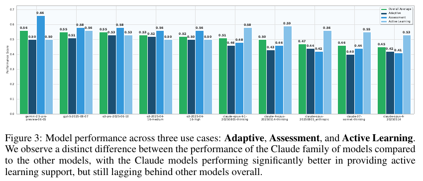

# TutorBench: A Benchmark To Assess Tutoring Capabilities Of Large Language Models

**Authors:** Rakshith S Srinivasa, Zora Che, Chen Bo Calvin Zhang, Diego Mares, Ernesto Hernandez, Jayeon Park, Dean Lee, Guillermo Mangialardi, Charmaine Ng, Ed-Yeremai Hernandez Cardona, Anisha Gunjal, Yunzhong He, Bing Liu, Chen Xing (Scale AI)
**Published:** 2025-10 · [Source](https://arxiv.org/abs/2510.02663)
**Lens:** `eval-designer` · **Digested:** 2026-10-01

## TLDR

Scale AI built TutorBench to ask whether frontier LLMs can tutor, as distinct from whether they can solve the problem: 1,490 expert-written high-school and AP STEM samples (Biology, Physics, Chemistry, Statistics, Calculus, Computer Science; 828 of them include an image of the student's handwritten or typed work) across three tasks, an adaptive explanation after a student's follow-up question (475 samples), an assessment of an incorrect student solution (508), and a hint for a stuck student that must not give the answer away (507). Each sample carries 3 to 39 expert-written pass/fail rubric criteria (15,220 in total) weighted 5 for critical, 1 for ordinary and -5 for forbidden behaviour such as revealing the answer; a Claude Sonnet 4 judge grades every criterion, and on a 250-sample check with 3 human experts per criterion it agreed with the humans at 0.78 against a 0.75 mean agreement between the humans themselves, with an F1 of 0.82 against the majority vote on 1,900 non-critical criteria (best single human: 0.91 on 321 criteria). Samples were kept only if at least 3 of 5 frontier models (Gemini 2.5 Pro, o3, Claude 3.7 Sonnet, DeepSeek-R1, Llama 4 Maverick) scored under 50% on them, so the ceiling is partly by construction: Gemini 2.5 Pro tops the board at 55.65%, GPT-5 at 55.33%, o3 Pro at 54.62%, Claude Opus 4.1 (Thinking) at 50.78%, Llama 4 Maverick at 40.20% and GPT-4o at 36.12%, while open-weight gpt-oss-120b reaches 56.01% on the text-only subset, 1.04 points behind Gemini 2.5 Pro's text-only 57.05%. Averages by task are 47.16% for adaptive explanation, 51.56% for assessment and 54.07% for hints; the five Claude models fill ranks 6 to 10 but the two Claude Opus thinking variants post the top hint scores (0.59 and 0.58, against 0.56 for GPT-5 and 0.50 for Gemini 2.5 Pro), and o3 at high reasoning effort (52.09%) did no better than at medium (52.76%). Models pass only 32.8% of criteria that ask for an example or analogy and 41.9% of those that ask for an alternative solution, against about 53% for spotting a correct or incorrect student step. OpenAI's purpose-built Study Mode scored 46.94%, 8.4 points below plain GPT-5 with a one-sentence system prompt, because it stops to ask the student a question and the benchmark grades only one final response to a pre-written conversation. The practical read: a rubric-per-sample LLM judge can match human raters on open-ended work, but what the number measures is how much of an expert's golden response a model covers in a single turn, and the products that behave most like tutors score lower on it.

## Key Takeaway

OpenAI's product built for tutoring lost to its own raw model: GPT-5 Study Mode scored 46.94% while GPT-5 through the API with a one-sentence system prompt scored 55.33%, and the two Claude Opus thinking models that post the highest scores on the hint task (0.59 and 0.58, the one task where a tutor must hold back) rank 6th and 7th overall. The benchmark grades a single final response for how much of an expert's golden answer it contains, so pausing to ask the student a question, the move a human tutor is trained to make, is scored as a missing answer. TutorBench measures one-turn rubric coverage, and the behaviours that look most like teaching are the ones it marks down.

## Implications

- **Write the rubric from a golden response, then score each criterion as pass or fail**: Every TutorBench sample has 3 to 39 criteria that the expert derived from their own "golden tutoring response", weighted 5 (critical), 1 (ordinary) or -5 (forbidden), with the weighted pass rate as the score. For an agent that spends a person's money, write the golden transaction first (what a careful human proxy would have done with that brief) and decompose it into checkable lines, with -5 items for "spent above the limit", "committed without the agreed confirmation" or "bought the wrong variant".
- **Validate the judge against a human panel before trusting the leaderboard**: The authors tried several judge models, picked Claude Sonnet 4, then checked it on 250 samples rated by 3 human experts each (2,475 criteria, 69 experts): judge-to-human agreement 0.78 against 0.75 between humans, F1 0.82 on the majority vote of 1,900 non-critical criteria against 0.91 for the best single human. Budget the same check (a few hundred items, three raters) and report both numbers; the judge sitting above the median human is the claim that makes every other number in the paper usable.
- **Decide up front whether asking the principal a question is a pass or a fail**: TutorBench grades only the final turn of a pre-written conversation, so Study Mode's habit of ending with "do you want me to walk you through..." cost it 8.4 points against plain GPT-5, and the authors say so (Section 3.6). In a delegation eval, an agent that stops to confirm a purchase is behaving well; give the confirmation its own criterion, or run a scripted principal that answers so the episode can continue, but do not let the single-turn design decide the question for you.
- **Adversarial filtering buys an unsaturated benchmark at the price of a moving target**: Only samples that at least 3 of 5 frontier models scored under 50% on were kept, which is why the top score is 55.65% and why the paper can call itself "comprehensive and unsaturated". The score is then relative to the 2025 frontier, not to the task. If you filter this way, say so in the headline and keep the unfiltered pool so you can report both and re-filter at each model release.
- **Report a decomposition, because overall ties hide opposite profiles**: Gemini 2.5 Pro (55.65 plus or minus 1.11) and GPT-5 (55.33 plus or minus 1.02) overlap, but Gemini scores 0.66 on assessment against 0.58 for GPT-5 and leads on emotional cues and tone, GPT-5 and o3 Pro lead on truthfulness, student-level calibration and instruction following, and the Claude models invert the pattern (0.40 to 0.46 on adaptive explanation, 0.53 to 0.59 on hints). Tag each criterion with a dimension and a skill at authoring time; it costs little and it is where every finding beyond the leaderboard came from.
- **Do not assume more reasoning buys more of this**: o3 at high effort scored 52.09% against 52.76% at medium (CI about plus or minus 1.0), thinking lifted Claude Opus 4.1 by 3.4 points and Claude Opus 4 by 4.3, and open-weight gpt-oss-120b reached 56.01% on text-only samples, 1.04 points behind Gemini 2.5 Pro. Where the task is calibrating to a person rather than solving a hard problem, reasoning budget is a weak lever; include a cheap open model in the lineup so the cost column means something.
- **Put a human in the baseline column**: TutorBench has no human score. The golden responses exist but were never graded against the rubrics they generated, so nobody knows whether a good human tutor would score 70% or 95% on this instrument. For a money-at-stake eval, grade a sample of human proxies with the same judge; without it, 55% has no reference point and "room for improvement" is an assertion.
- **Expect the hard criteria to be the generative ones**: Models passed about 53% of criteria for spotting a correct or incorrect student step but 41.9% for offering an alternative solution and 32.8% for giving an example or analogy, and those two skills are also the rarest in the rubric pool (236 and 312 of 15,220 criteria). In a buying agent the analogue is "offered the person a cheaper alternative they did not ask for"; write those criteria explicitly, because the recognising-the-error criteria will dominate the pool and the score if you do not.

## How to Apply It (method)

**Scenario:** You are building an eval for an agent that buys on a person's behalf in a live secondary market (used bikes, concert tickets, collectible parts). The capability you care about is not "can it find the listing" but "does it calibrate to this person": clarify what they meant, check the offer they drafted, nudge them when they are stuck without taking the decision away from them. TutorBench's recipe, expert-written samples with sample-specific weighted rubrics graded by a validated LLM judge, transfers directly; the single-turn design and the missing human baseline are the two places to deviate.

**Steps:**

1. **Pick three use cases that test calibration to the person, not the domain**: TutorBench chose adaptive explanation (student asks a follow-up on an explanation), assessment and feedback (student submits a wrong solution) and active learning support (student is stuck part way, tutor must hint without answering). The analogues: (i) the person asks a follow-up on the agent's recommendation ("why this seller and not the cheaper one?"), (ii) the person drafts an offer or bid and asks the agent to check it, (iii) the person is stuck mid-purchase and the agent must move them forward without committing their money. Each use case gets its own one-sentence system prompt; keep it light, the paper deliberately avoids prescriptive prompts so it measures "natural" behaviour (Appendix A.6).

2. **Have domain experts write the samples, in persona**: TutorBench's writers held a Bachelor's or higher in the subject and had tutoring or professional experience. Each sample starts with a question, then use-case-specific content: for adaptive explanation, a tutor's explanation plus a student follow-up; for assessment, an incorrect solution in the student's voice; for hints, a partial solution in the student's voice. Write yours the same way, with experienced buyers and resellers producing the person's brief, the listing context, the person's draft or follow-up, and, for half the samples, a screenshot or photo (828 of 1,490 TutorBench samples are image-based) so the agent has to read a listing or a chat thread rather than a tidy text summary.

3. **Write the golden response, then derive 3 to 39 rubric criteria from it**: The expert writes what a good tutor would say, then turns it into criteria that are self-contained, mutually exclusive, verifiable, and collectively cover what a desirable response contains. Weight critical criteria 5, ordinary ones 1, and forbidden behaviours -5 (TutorBench's example: "The response reveals the final answer (2.74) directly" at -5). Tag every criterion four ways: evaluation dimension (instruction following, truthfulness, style and tone, conciseness and relevance, student-level calibration, emotional component, visual perception, visual reasoning), skill, explicit or implicit (asked for in the prompt or inferred from context), objective or subjective. Criterion template:

   ```
   The response must <single verifiable requirement>.        weight: 5 | 1 | -5
   dimension: <one of 8>   skill: <one of 8, if applicable>
   explicit | implicit     objective | subjective
   ```

4. **Decide the difficulty filter, and keep both pools**: TutorBench prompted 5 frontier models with each sample and kept only those where at least 3 of 5 scored under 50% weighted. This produces an unsaturated benchmark whose scores are relative to the models used for filtering. If you do it, keep the unfiltered pool and report both numbers.

5. **Choose the judge by measuring it, not by picking it**: Collect 3 independent human ratings per criterion on about 250 samples. Compute (a) mean agreement between each human and the other two, (b) agreement between each candidate judge and the humans, (c) F1 of each judge against the majority-vote label on the non-critical criteria (TutorBench dropped the plus and minus 5 criteria for this, leaving 1,900 of 2,475). Pick the judge with the best alignment and publish the three numbers (TutorBench: 0.75 human-human, 0.78 judge-human, F1 0.82 against best single human 0.91).

6. **Score with the weighted rubric rate and report the spread**: Per sample, score = sum over criteria of (weight × pass) divided by the sum of the positive weights, so a -5 criterion that fails subtracts from a denominator that does not include it; the paper normalises to [0, 1]. Report the mean across samples with a confidence interval (TutorBench's are plus or minus about 1 point on 1,490 samples), split by text and image inputs, and then by use case, dimension and skill. The decomposition is where the findings are: the two leaders tie overall and diverge by task.

7. **Add the two columns TutorBench lacks**: Grade a sample of the golden responses, or fresh human proxies, with the same judge, so there is a human number next to the model numbers. And decide how to score a check-in: either a criterion that passes when the agent asks for confirmation before committing money, or a scripted principal who replies so the run continues. TutorBench scored OpenAI's Study Mode separately because its check-in questions could not be graded as final answers; do not inherit that gap.

8. **Run the product variants, not only the APIs**: TutorBench collected Study Mode responses manually through the web interface with short preambles and reported them outside the main table. If the agent your users will meet is a consumer product with its own system prompt, score that too, and expect it to differ from the API model by several points in either direction.

**Expected outcome:** A benchmark of a few hundred to a few thousand expert-written delegation samples, each with a weighted rubric and tags, an LLM judge whose agreement with human raters is published next to the inter-human agreement, a leaderboard with confidence intervals, a per-task and per-skill decomposition that shows where models diverge while tied overall, a human reference score, and an explicit rule for how check-ins and confirmations are graded. You will also know which criteria models fail most (in TutorBench, the generative ones: alternatives and analogies), which is the list of behaviours to design the product around.

## Best Figure



```
Image Candidates:
Figure 3 (p. 6): Four bars per model for the top 10 show the Claude family last overall but first on hints, and Gemini 2.5 Pro winning assessment at 0.66; it is the paper's one view where the leaderboard order and the task order disagree.
Table 1 (p. 6): The full leaderboard with text-only, multimodal and overall columns plus confidence intervals; shows the 55.65% ceiling, the o3 high-vs-medium inversion and gpt-oss-120b at 56.01% text-only.
Figure 6 (p. 8): Histogram of per-expert agreement rates for 69 human raters with the LLM judge's 0.78 marked above the 0.75 human mean; the figure that licenses the automatic grading.

Best Image:
Figure Name: Figure 3: "Model performance across three use cases: Adaptive, Assessment, and Active Learning."
Figure Page: 6
Slide Caption: The models that rank 6th to 10th overall post the highest hint scores, and the overall leader wins on assessment by 8 points: one number hides three different tutors.
Description: Figure 3 plots, for each of the top 10 models in Table 1, four bars: overall average, adaptive explanation, assessment and feedback, and active learning support (hints). The non-Claude models (Gemini 2.5 Pro, GPT-5, o3 Pro, o3 medium, o3 high) are flat across tasks around 0.50 to 0.58, with one outlier, Gemini 2.5 Pro at 0.66 on assessment. The five Claude variants show the opposite shape: 0.40 to 0.46 on adaptive explanation, 0.41 to 0.48 on assessment, and 0.53 to 0.59 on hints, the task that requires withholding the answer, where the two Claude Opus thinking models (0.59 and 0.58) beat every other model. It matters because the overall leaderboard (Gemini 2.5 Pro 55.65%, GPT-5 55.33%) reads as a near-tie and the Claude models read as simply behind, while the task breakdown shows three different capability profiles that a single score cannot distinguish.
```

## What Experts Overlook

The benchmark is a residual set. Section 1 and Appendix A.1 state that after the experts wrote each sample and its rubric, five frontier models (Gemini 2.5 Pro, o3, Claude 3.7 Sonnet, DeepSeek-R1, Llama 4 Maverick) were prompted with it, graded against the rubric, and the sample was kept only if at least 3 of the 5 scored under 50% weighted. Everything that follows, the 55.65% ceiling, the "none above 56%" abstract claim, the 47.16% / 51.56% / 54.07% use-case averages, the 32.8% pass rate on examples and analogies, is measured on the subset of expert-written tasks that the mid-2025 frontier had already mostly failed. Three of the five filter models are on the leaderboard, and one of them, Gemini 2.5 Pro, is first. The paper reports this in one sentence each in two places and never returns to it, and the phrase "comprehensive and unsaturated" in the abstract does not mention that the unsaturation was selected for.

**Why it matters:** The construction has two consequences that are easy to miss. First, the score is non-stationary: it measures distance from a particular frontier, and a model released later that happens to share the filter models' failure modes will look as weak as they did, while one with different failure modes will look stronger than it is. The evidence that the retained failures are shared rather than model-specific is that GPT-5, which was not a filter model, lands at 55.33%, within the confidence interval of Gemini 2.5 Pro, which was; so the filter mostly removed tasks that everybody could already do, rather than handicapping the filter models specifically. Second, the per-skill findings are findings about hard tasks, not about tutoring in general: models may give examples and analogies perfectly well on the 50% of samples that were discarded. Adversarial filtering is a legitimate way to keep headroom, and TutorBench is honest that it did it, but the readers who quote "AI tutors score 55%" are quoting the selection rule as much as the capability.

**Example of good use:** A builder designing an eval for a buying agent filters the expert-written sample pool against five current models, keeps only the samples where at least three fail, and reports two leaderboards: the filtered set, which has headroom and discriminates between frontier models, and the unfiltered set, which says what share of real briefs the agent can handle today. At each major model release the filter is re-run on the full pool, so the eval stays unsaturated and the drift in the unfiltered number tracks real progress. The write-up says in the first paragraph that the hard set was selected against named models.

**Example of misapplication:** A team reads the 55.65% headline, builds a tutoring product on Gemini 2.5 Pro with a "we score 56% on TutorBench, the best available" claim, and then compares itself a year later with a model that scores 70% on the same frozen set, concluding capability rose by a quarter. Both numbers are distances from the 2025 frontier on tasks selected because that frontier failed them; neither says what fraction of a real student's questions get a good answer, and the later model may simply have trained on the same failure modes. Worse, a team that copies the filtering rule but not the disclosure ships a benchmark that looks hard for reasons its users cannot see, and when a new model saturates it they have no unfiltered pool to fall back on.

## Extracted Prompts

The paper uses deliberately light system prompts ("We refrain from using overly prescriptive system prompts to measure the 'natural' tutoring abilities of LLMs", Appendix A.6). Six API system prompts (three use cases, text-only and multimodal variants) and six preambles used when collecting GPT-5 Study Mode responses through the web interface. The Figure 1 example shows the active-learning multimodal prompt with slightly different wording ("part way through problem", "Offer a helpful hint or question to guide them toward the next step, without giving away the full answer. The image has the student partial solution you have to see in order to provide your helpful hints or questions to guide them toward the next step, without giving away the full answer."); the Appendix A.6 versions are reproduced below as the canonical ones.

**Prompt explanation:** System prompt, adaptive explanation generation, text-only samples. The model sees the student's initial question, a tutor's explanation and the student's follow-up, and must address the specific confusion.

```
You are an AI tutor helping a high school student understand a concept. Answer their question clearly and adjust your explanation based on what the student says they're confused about.
```

**Prompt explanation:** System prompt, adaptive explanation generation, multimodal samples. Identical text to the text-only variant; the image is attached in the conversation.

```
You are an AI tutor helping a high school student understand a concept. Answer their question clearly and adjust your explanation based on what the student says they're confused about.
```

**Prompt explanation:** System prompt, assessment and feedback, text-only samples. The incorrect solution appears in the conversation history as a model response, which is why the prompt says "first response".

```
You are an AI tutor reviewing a student's answer to a question. Evaluate whether it is correct, identify any mistakes, and explain your reasoning clearly. Provide an assessment of the student incorrect solution in the first response
```

**Prompt explanation:** System prompt, assessment and feedback, multimodal samples. The incorrect solution is in the attached image.

```
You are an AI tutor reviewing a student's answer to a question. Evaluate whether it is correct, identify any mistakes, and explain your reasoning clearly. Provide an assessment of the student incorrect solution present in the image.
```

**Prompt explanation:** System prompt, active learning support, text-only samples. The model must hint without revealing the answer; revealing it fails a -5 criterion.

```
You are an AI tutor helping a student who got stuck partway through a problem. Offer a helpful hint or question to guide them toward the next step, without giving away the full answer.
```

**Prompt explanation:** System prompt, active learning support, multimodal samples. The partial solution is in the attached image.

```
You are an AI tutor helping a student who got stuck partway through a problem. Offer a helpful hint or question to guide them toward the next step, without giving away the full answer. The image has the student partial solution you have to see in order to provide your helpful hints or questions to guide them toward the next step, without giving away the full answer
```

**Prompt explanation:** Web-interface preamble for GPT-5 Study Mode, adaptive explanation generation, text-only samples (Study Mode does not accept a system prompt, so the instruction is typed as the user).

```
You will be presented with an initial question, a solution to the question, and a follow-up question seeking clarification. Help answer the follow-up question.
```

**Prompt explanation:** Web-interface preamble for GPT-5 Study Mode, adaptive explanation generation, multimodal samples. Includes a guard for a missing image.

```
You will be presented with an initial question, a solution to the question, and a follow-up question seeking clarification. The initial question will refer to the attached image. If an image is not provided, do not answer the question and say 'Image not provided'. Otherwise, answer the follow-up question.
```

**Prompt explanation:** Web-interface preamble for GPT-5 Study Mode, assessment and feedback, text-only samples.

```
You will be presented with an initial question and a solution to the question. Provide an assessment of the solution.
```

**Prompt explanation:** Web-interface preamble for GPT-5 Study Mode, assessment and feedback, multimodal samples. Same text as the text-only variant.

```
You will be presented with an initial question and a solution to the question. Provide an assessment of the solution.
```

**Prompt explanation:** Web-interface preamble for GPT-5 Study Mode, active learning support, text-only samples. Written in the student's first person.

```
Offer a helpful hint or question to guide me toward the next step.
```

**Prompt explanation:** Web-interface preamble for GPT-5 Study Mode, active learning support, multimodal samples.

```
Offer a helpful hint or question to guide me toward the next step. My solution is shown in the attached image
```

**Prompt explanation:** Example rubric criteria (not a model prompt, but the text the judge grades against). From Figure 1's statistics hint sample, with weights; the first is a forbidden-behaviour criterion.

```
The response reveals the final answer (2.74) directly.                                                         Weight: -5
The response should use clear formatting or structure (e.g., headers) to organize explanation into sections.   Weight: 1
The response must explain that taking the square root of the variance gives the standard deviation in original units.   Weight: 5
```

The LLM-judge prompt (how Claude Sonnet 4 is asked to grade a response against a criterion) is not given in the paper.

## Citations

25 references extracted; the first 10 below, the full structured list in the frontmatter `citations:` field.

- Ammari, Chen, Zaman et al. (2025). How students (really) use ChatGPT: Uncovering experiences among undergraduate students. arXiv 2505.24126.
- Anthropic (2025). Claude 3.7 Sonnet and Claude Code. Product announcement.
- Anthropic (2025). Claude Sonnet 4: Hybrid reasoning model from Anthropic. Product page.
- Arora, Wei, Hicks et al. (2025). HealthBench: Evaluating large language models towards improved human health. arXiv 2505.08775.
- Bastani, Bastani, Sungu et al. (2025). Generative AI without guardrails can harm learning: Evidence from high school mathematics. PNAS 122(26).
- DeepSeek (2025). DeepSeek-R1 release. Model announcement.
- Geraghty and Goldstein (2024). 11th grader takes an AI tutoring deep dive: And a human tutoring expert takes notes. Education Next.
- Glazer, Erdil, Besiroglu et al. (2024). FrontierMath: A benchmark for evaluating advanced mathematical reasoning in AI. arXiv 2411.04872.
- Google (2025). Google Gemini: Free Pro plan for students. Web page.
- Google DeepMind (2025). Gemini 2.5: Our most intelligent AI model. Blog post.

Of these, the ones that matter for eval design are Arora et al. (HealthBench, the rubric-per-sample grading pattern TutorBench cites as its model), Maurya et al. (MRBench, 192 math tutoring conversations with a learning-principles taxonomy, the prior tutoring benchmark TutorBench says GPT-4 nearly saturates), Gupta et al. (Beyond final answers, the other prior tutoring eval), Bastani et al. (the PNAS field study showing students do worse when unguarded GPT-4 access is removed, the paper's motivation for measuring hints rather than answers), and Pal Chowdhury et al. and Wang et al. (guardrailed and expert-decision-model tutors, the approaches the benchmark is meant to score).

## Related Digests

- [[starace-2025-paperbench-replication]]: PaperBench: Evaluating AI's Ability to Replicate AI Research (hierarchical rubrics graded by an LLM judge validated against human graders; the same rubric-plus-judge pattern applied to a long-horizon agent task)
- [[patwardhan-2025-gdpval-economic-tasks]]: GDPval: Evaluating AI Model Performance on Real-World Economically Valuable Tasks (expert-written tasks with expert graders and a reported grader-agreement number; the human-baseline column TutorBench lacks)
- [[mazeika-2025-remote-labor-index]]: Remote Labor Index: Measuring AI Automation of Remote Work (expert-commissioned projects, judge agreement with human reviewers, and how a change of unit and bar moves the headline)
- [[su-2026-salesllm-selling-skill]]: Sell More, Play Less: Benchmarking LLM Realistic Selling Skill (swapping the judge or counterpart reshuffles the leaderboard; the same sensitivity TutorBench's judge-selection step is designed to control)

## Reviewer Notes

**Overall severity:** Minor fact tweak

**Flagged claims:**

- **Claim:** "an F1 of 0.82 against the majority vote on 1,900 non-critical criteria"
  **Label:** Accurate as stated, with a paper-internal inconsistency
  **Justification:** Section 3.7 reports F1 0.82 on the 1,900 non-critical criteria; Section 2.3 summarises the same experiment as "an F1 score of 0.81 with respect to the majority vote". The digest uses the Section 3.7 figure, which is the one attached to the method description.
  **Fix:** None to the digest; read 0.81 and 0.82 as the same number reported twice.

- **Claim:** "the two Claude Opus thinking variants post the top hint scores (0.59 and 0.58, against 0.56 for GPT-5 and 0.50 for Gemini 2.5 Pro)" and the per-model values quoted in the Implications and Best Figure sections
  **Label:** Accurate (figure reading)
  **Justification:** These values are read from the bar labels in Figure 3, which the body text does not restate; the text says only that the Claude family "performs much better in the active learning support use case". Claude Opus 4.1 (non-thinking) also reads 0.56, tied with GPT-5, and Claude 3.7 Sonnet (Thinking) 0.55 and Claude Opus 4 0.53 sit below GPT-5, so "the Claude models lead the hint task" would be an overstatement; the digest restricts the claim to the two Opus thinking models.
  **Fix:** Applied during drafting: wording restricted to "the two Claude Opus thinking variants" throughout.

- **Claim:** "828 of them include an image of the student's handwritten or typed work" alongside the per-use-case totals 475 / 508 / 507
  **Label:** Accurate, with a figure caveat
  **Justification:** 828 is from Section 1; the use-case totals are from Figure 7 and sum to 1,490. Figure 7's stacked bars for the use cases (329 + 146, 341 + 167, 341 + 166) imply a 1,011 / 479 split between the two modalities, which does not match the 828 / 662 split implied by the subject bars (140 + 138 + 140 + 137 + 137 + 136 = 828). The digest does not quote a per-use-case modality split for that reason.
  **Fix:** None; the digest avoids the inconsistent numbers.

- **Claim:** "Samples were kept only if at least 3 of 5 frontier models (Gemini 2.5 Pro, o3, Claude 3.7 Sonnet, DeepSeek-R1, Llama 4 Maverick) scored under 50% on them"
  **Label:** Accurate
  **Justification:** Section 1 lists the five models (naming "o3 OpenAI (2025a)") and the rule; Appendix A.1 repeats it with "GPT-o3" and adds that the responses "are then graded against the rubric criteria" and that the kept samples are those where "3 out of the 5 models achieve less than 50% score (weighted)". The paper does not say whether the leaderboard scores for the three filter models that also appear in Table 1 were regenerated or reused.
  **Fix:** None.

- **Claim:** "those two skills are also the rarest in the rubric pool (236 and 312 of 15,220 criteria)"
  **Label:** Accurate (figure reading)
  **Justification:** Figure 12b's bar labels read 236 for "Provides alternative solutions/paths" and 312 for "Includes examples/analogy"; the skill tags are applied "if applicable" and sum to 9,955, so not every one of the 15,220 criteria carries a skill tag. The phrase "of 15,220 criteria" is the pool size, not the tagged count.
  **Fix:** None; the ratio is correctly framed against the full pool.

- **Claim:** The digest refers to "15 models in Table 1" implicitly by listing leaderboard entries, while the paper's abstract and Section 1 say "16 frontier LLMs"
  **Label:** Paper-internal inconsistency, not a digest claim
  **Justification:** Table 1 has 12 ranked rows plus 3 text-only rows (15). The sixteenth is presumably GPT-5 Study Mode, which Section 3.6 reports separately; the paper does not say so.
  **Fix:** None; the digest does not assert a total count.

- **Claim:** "a Claude Sonnet 4 judge"
  **Label:** Accurate
  **Justification:** Section 2.3 says "an LLM-judge based on Claude Sonnet 4 (Anthropic, 2025b)"; Section 3.7 says "Claude-4-Sonnet". Same model.
  **Fix:** None.

- **Claim:** "a -5 criterion that fails subtracts from a denominator that does not include it; the paper normalises to [0, 1]" (Method step 6)
  **Label:** Partially accurate
  **Justification:** Equation 1 sums w × r over all criteria in the numerator and sums w over criteria with w > 0 in the denominator, so a failed -5 criterion contributes -5 to the numerator and nothing to the denominator, as stated. The paper says the final score "is normalized to the range [0,1]" but does not say whether negative per-sample values are clipped or how normalisation is done; the digest's reading that negatives are handled by normalisation is an inference.
  **Fix:** Applied: the sentence now says "the paper normalises to [0, 1]" without claiming a clipping rule.

- **Claim:** "thinking lifted Claude Opus 4.1 by 3.4 points and Claude Opus 4 by 4.3"
  **Label:** Accurate (digest arithmetic)
  **Justification:** Table 1: Claude Opus 4.1 (Thinking) 50.78 against Claude Opus 4.1 47.40 (3.38); Claude Opus 4 (Thinking) 49.71 against Claude Opus 4 45.46 (4.25). The paper does not comment on the thinking-versus-non-thinking gap.
  **Fix:** None.

All other claims (1,490 samples; six subjects; three use cases and their definitions; 3 to 39 criteria per sample and 15,220 in total; weights 5 / 1 / -5; the ARRw formula; expert qualifications; 250 samples, 3 ratings, 2,475 criteria, 69 experts, 0.75 and 0.78 agreement, 1,900 non-critical criteria, best human F1 0.91 on 321 criteria; every Table 1 value and confidence interval; the 47.16 / 51.56 / 54.07 use-case averages; Gemini 2.5 Pro's strength on emotional cues and tone and GPT-5 and o3 Pro's on truthfulness, calibration and instruction following; the Bloom's annotation by three LLMs with two-of-three agreement covering over 97% of samples; the 53.7 / 53 / 41.9 / 32.8 skill pass rates; Study Mode at 46.94 plus or minus 1.06 with 48.19 text-only and 45.93 multimodal, collected via the web interface, excluded from the main table, and the two stated reasons; the objective / subjective 13,673 / 1,547 and explicit / implicit 11,437 / 3,783 counts; the limitations list; the 30-sample Hugging Face release with the full dataset "to be released soon"; the twelve prompts and the Figure 1 rubric lines; the 25 references) were checked against the paper text and are accurate.
