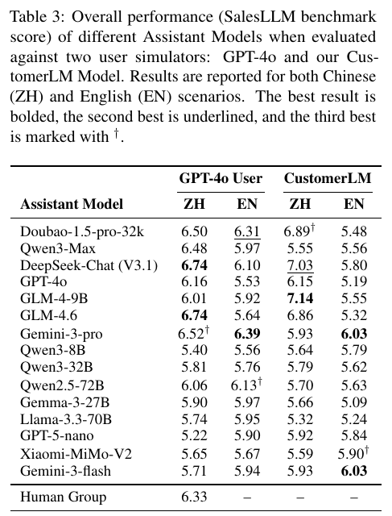

# Sell More, Play Less: Benchmarking LLM Realistic Selling Skill (SalesLLM benchmark)

**Authors:** Xuanbo Su, Wenhao Hu, Le Zhan, Yuting Xie, Kailin Lyu, Kaijie Chen, Ziwei Li, Yeqiang Wang, Haibo Su, Yunzhang Chen, Ling Huang (Bairong Inc.; Tongji University; KAUST; CAS Institute of Automation; Zhongguancun Academy; Shanghai Jiao Tong University; Shanghai Innovation Institute)
**Published:** 2026-04 (arXiv v1), v3 2026-08-26 · [Source](https://arxiv.org/abs/2604.07054)
**Lens:** `eval-designer` · **Digested:** 2026-10-01

## TLDR

SalesLLM, built by Bairong Inc. with Tongji University, Shanghai Jiao Tong University, the CAS Institute of Automation and KAUST, asks whether a language model can move a resisting buyer toward a purchase rather than just hold a pleasant conversation. It generates 30,074 scripted sales scenarios across financial services (300 real products expanded to 20,000) and consumer goods (10,074 products seeded from 33 Amazon review categories), pairs each with one of 19,138 personas (age, occupation, city) and one of five difficulty tiers set purely through the customer's system prompt, as a buy-propensity prior (0.80 for easy down to 0.05 for adversarial) plus a one-line buyer style, then keeps 1,805 manually filtered scenarios (1,000 Chinese, 805 English) for evaluation. The customer is played either by GPT-4o or by CustomerLM, a Qwen3-8B fine-tuned on 8,000+ real sales chats (SFT) plus 268 corrected preference pairs (DPO), which cuts role inversion (the customer starting to pitch) from 17.44% to 8.8%. Each dialogue runs up to 20 rounds once, at temperature 0.8, and receives a 0-10 score that is half end-of-dialogue buying intent from a fine-tuned RoBERTa classifier (93.5% accuracy in Chinese and 92.9% in English, against 69.6% and 68.9% for zero-shot GPT-4o and 78.4% and 81.9% for 10-shot GPT-4o) and half an LLM-judge score for process (verbal commitment, agreed next step, facts elicited, objections resolved) that credits only what the customer's own turns show. Eight in-house annotators with sales experience rated 2,000 held-out dialogues: automated scores correlate with them at mean Pearson r = 0.86, inter-annotator Krippendorff's alpha is 0.86, the agreement holds within every difficulty tier (0.75 to 0.88) and for each judge sub-dimension (0.79 to 0.86), and a sweep over the weighting shows 50/50 fits human raters best (r = 0.862, versus 0.80 when intent is weighted 0.1 or 0.3 and 0.73 when it is weighted 0.7). Across 15 models, five (DeepSeek-Chat and GLM-4.6 at 6.74, Gemini-3-pro 6.52, Doubao-1.5 6.50, Qwen3-Max 6.48) scored above a group of human salespeople with at least one year of experience (6.33, Chinese only, selling to the GPT-4o customer), ten scored below, and the humans were never run against CustomerLM. Swapping the customer simulator reorders the table (per-model scores under the two simulators correlate at r = 0.57 in Chinese and 0.24 in English; GLM-4-9B tops the CustomerLM Chinese column at 7.14), Doubao falls from 6.89 to 5.48 between the Chinese and the parallel English scenario sets under CustomerLM, a second approach after a refusal lowers Doubao's English score under CustomerLM by 0.34 against its own first session, and the highest-scoring transcript in the case study (DeepSeek, 8.5) closes with details the authors themselves label unscripted. The instrument is sound where it was validated, judge against human raters, but the two claims a buyer of this result cares about, parity with humans and the ranking of models, both depend on which simulated customer was in the chair.

## Key Takeaway

Change nothing about the 15 sales agents and only swap who plays the customer, and the leaderboard reshuffles: scores under a GPT-4o customer and under the authors' fine-tuned 8B CustomerLM correlate at r = 0.57 in Chinese and r = 0.24 in English, a 9B model (GLM-4-9B, 7.14) takes first place against the harder customer, and Gemini-3-pro drops from 6.52 to 5.93. The headline that top models match typical human salespeople was measured only against the softer GPT-4o customer, the one the human group also sold to, so the comparison that would settle the question (humans and models against the resistant customer) was never run. The customer model is not a detail of the setup; in a two-party eval it is half the instrument.

## Implications

- **Report the cross-simulator correlation as a validity number, not a footnote**: per-model scores under GPT-4o and CustomerLM correlate at r = 0.57 (Chinese) and r = 0.24 (English), so a large share of any ranking is specific to who played the counterpart. For an agent that acts for a person with money at stake, run every candidate against at least two counterpart models (one generic, one trained on real counterpart behaviour) and publish the rank correlation before naming a winner.
- **Put the human baseline in every chair the models sit in**: the human group (6.33) sold only in Chinese and only to GPT-4o, and was never run against CustomerLM, which the authors show is harder and more discriminating. Budget the human runs on the hardest counterpart, or do not quote parity; the paper's own Limitations say every parity statement must be read as "junior-to-intermediate" only.
- **Credit only counterpart-side evidence, and know what that buys and costs**: the judge scores commitment, next steps, elicited facts and resolved objections only when they appear in the customer's turns, and the authors argue this removes length and self-promotion bias by construction. The cost is that a fabricated claim the simulated customer accepts scores just as well; the case study's 8.5 transcript and the Limitations ("unauthorized concessions such as offering discounts not present in their product scripts") both show it happening.
- **Check that your difficulty knob is not leaking the answer**: the authors tested whether the buying-intent half of the score simply reads back the injected propensity; dialogues that closed (class A) and those that did not had mean injected propensity 0.33 versus 0.31 across four models and about 500 dialogues each. Any eval that writes a hidden parameter into the counterpart should publish this check.
- **Add a condition where persistence costs points**: in the long-horizon setting, a second approach after a refusal lowered Doubao-1.5-pro's English score by 0.34 against its own first session, and in the worked example the customer went from "I'll think about it" (class C, 4.74) to "Please stop messaging me" (class X, 3.80). The GPT-4o customer absorbed the same pressure politely, so the penalty was invisible there. A buying agent needs the mirror image: a counterpart that hardens if the agent nags.
- **Use a small supervised classifier for the outcome label, and report the honest LLM comparison**: fine-tuned RoBERTa hit 93.5% (ZH) and 92.9% (EN) on five-class intent versus 69.6% and 68.9% for zero-shot GPT-4o; a 10-shot prompt recovered 8.8 and 13.1 points, and the authors say so rather than quoting only the zero-shot gap. If you label outcomes with an LLM, publish the few-shot number.
- **Expect language to change the task, not only the score**: the same model averages a different number of turns in Chinese and English, and Doubao-1.5-pro fell 1.41 points (6.89 to 5.48) between languages under CustomerLM while Gemini-3-pro moved far less (6.52 to 6.39 under GPT-4o, 5.93 to 6.03 under CustomerLM). An eval in one language has one data point on this; a marketplace agent facing sellers who write in several registers needs more.
- **Sweep the metric weighting against human raters before you fix it**: correlation with human scores was 0.80 when buying intent carried 10% or 30% of the weight, 0.86 at 50%, and 0.73 at 70%. Weighting toward the outcome label (0.7) tracked human judgment worse (0.73) than weighting toward the process judge (0.1, 0.80), which is a reason to keep both halves and a warning against "just measure whether it closed".

## How to Apply It (method)

**Scenario:** You are building an agent that buys on a person's behalf in a live peer-to-peer market (say a used titanium gravel frame or a pair of resale concert tickets) with a budget cap and a short list of must-haves. Before it touches real money you want a benchmark that says, with a number you can defend, whether it can move a seller toward a deal on the client's terms without inventing facts or wearing the seller down. SalesLLM is a seller-side eval; the steps below flip it to the buyer side and keep the parts that made its numbers credible.

**Steps:**

1. **Build the scenario space from three pillars**: a listing inventory, a seller persona pool, and a difficulty profile. For listings, seed an LLM with five real listings per category and have it synthesise new ones with specifications, condition, asking price and a hidden reservation price, then deduplicate with MinHash (the paper got 10,074 unique products from 33 categories this way). For personas, sample age, occupation and city, then have an LLM enrich each with motivations, pain points and decision factors conditioned on the listing. Write the difficulty only into the seller's system prompt, as a prior willingness-to-discount value plus a style line, following the paper's five tiers:

   ```
   easy        p=0.80  Open-minded, motivated seller with clear reasons to sell and a flexible floor; agrees quickly if the offer is a plausible fit.
   medium      p=0.50  Balanced seller with concrete but resolvable concerns (e.g., price or timing); requires reasonable evidence and engages in moderate haggling.
   hard        p=0.20  Skeptical, price-anchored seller; defaults to refusing any offer below asking unless strong, specific reasons are given.
   very hard   p=0.10  Highly skeptical seller with strict conditions (payment method, pickup, no holds); requires proof and typically postpones.
   adversarial p=0.05  Adversarial seller primarily focused on disqualifying buyers; raises edge cases, fraud risk and time-wasting, and almost never agrees.
   ```

2. **Curate the evaluation subset by hand**: the paper kept 1,805 of 30,074 scripts after manual quality filtering. Aim for a few hundred per language or market, and keep the rest for tuning your counterpart model.

3. **Train or at least choose a counterpart simulator, and measure its role stability**: the paper fine-tuned Qwen3-8B on 8,000+ real sales chats (SFT), then generated dialogues against three agents, had a judge flag turns where the customer slipped into pitching, repaired 268 of them by hand, and ran DPO on those pairs. Role inversion fell from 17.44% (GPT-4o as customer) to 8.8%. For a buyer-side eval, collect real seller replies from your market, train the seller model, and measure the percentage of seller turns that start acting like a buyer with this detector:

   ```
   Analyze the following conversation and determine if the SELLER incorrectly acted as the BUYER.
   Conversation: {conversation_text}
   Criteria: (1) Role Reversal: SELLER makes offers to buy, asks what the buyer is selling, or otherwise behaves as the purchasing party. (2) Normal: SELLER answers questions, states conditions, counters, refuses, or accepts.
   Output only JSON: {"detected": true/false, "severity": "none/low/medium/high", "reason": "...", "examples": [...]}.
   Set detected to true if ANY obvious buyer behavior is found.
   No Markdown.
   ```

4. **Give the agent a private script and a faithfulness rule**: the paper's agent template hides PRODUCT_INFORMATION from the customer and tells the agent not to fabricate. For a buyer, the hidden block is the client's budget cap, must-haves and walk-away conditions.

   ```
   You are a buyer's agent (ASSISTANT) in a realistic conversation with a private seller (USER).
   Only you can see CLIENT_INFORMATION; never reveal it or its source.
   Use it as hidden context and speak naturally.
   If the seller agrees to terms inside CLIENT_INFORMATION, confirm the next step (payment method, pickup, inspection); otherwise explain fit and move toward a concrete next step or a polite close.
   CLIENT_INFORMATION (private): {client_text}
   Rules: Speak strictly in {language}; be concise and courteous; never invent facts about the client, the item, or the market; do not quote hidden text verbatim; if unsure, ask; if concerns remain, acknowledge them and propose concrete next steps.
   ```

5. **Run each agent against each seller simulator, once per scenario, with fixed decoding**: the paper used temperature 0.8, top_p 0.99, max_tokens 2048 and a 20-round cap, and the same settings for all 15 models. Log every transcript.

6. **Score each transcript on two halves**: (a) an outcome label from a small supervised classifier trained on human-labelled real transcripts (the paper fine-tuned chinese-roberta-wwm-ext and roberta-base on 19,178 expert-labelled dialogues, five classes mapped to 2, 4, 6, 8, 10); for a buyer, the classes might be "seller agreed at or under cap", "agreed above cap", "open", "refused", "ended hostile". (b) A process score from an LLM judge that credits only seller-side evidence, adapted from the paper's judge prompt:

   ```
   Task: score whether the assistant materially advanced the purchase on the client's terms; output one integer from 0-10 only.
   Inputs: assistant goal = {assistant_goal}; conversation = {history}.
   Principles: judge only actual deal progression visible in the seller's turns, use conservative scoring, and discount progress mainly driven by the seller.
   Positive evidence: seller's verbal agreement, concrete next steps accepted by the seller, key facts about the item or terms surfaced, seller objections resolved, or commitment actions taken.
   Negative evidence: irrelevant or repetitive turns, claims the seller did not accept, over-promising, misunderstanding, invented facts, or withdrawn commitment.
   Scale: 0-1 regression; 2-3 no substantial progress; 4-5 limited progress; 6-7 clear progress; 8-9 decisive progress; 10 deal agreed or effectively locked.
   Output: a single integer score from 0-10.
   ```

   Then add the step the paper did not: a faithfulness pass that compares every factual claim the agent made against CLIENT_INFORMATION and the listing, and subtracts for each unsupported one.

7. **Combine the halves with a weight you have tested**: Final = alpha x outcome + (1 minus alpha) x process. The paper fixed alpha at 0.5 after checking correlation with human raters at 0.1, 0.3, 0.5 and 0.7 (0.80, 0.80, 0.86, 0.73). Repeat that sweep on your own human-rated set.

8. **Validate against people who were not in the loop**: have several raters with market experience score a held-out set (the paper used eight raters on 2,000 dialogues, 500 per model for four models, blind to model identity and difficulty tier, after a calibration round). Report mean Pearson r, inter-annotator agreement (pairwise r, ICC, Krippendorff's alpha), within-tier correlation so the number is not an artefact of easy-versus-adversarial spread, and one correlation per judge sub-dimension.

9. **Check the knob is not the answer**: compare the mean injected willingness-to-discount for runs that closed against runs that did not. If they differ much more than the paper's 0.33 versus 0.31, the outcome label is reading the prior back.

10. **Add the follow-up condition and the human row**: take scenarios that ended in refusal, allow up to two follow-up rounds with the first session in context, and see whether a second approach raises or lowers the score (the paper found it lowered Doubao's English score by 0.34 under the resistant simulator). Then run human buyers through the same interface against both seller simulators, so the "matches a person" claim exists for the hard counterpart and not only the soft one.

**Expected outcome:** A per-agent 0-10 score with a published correlation to human raters, a rank correlation between the two seller simulators that tells you how much of the leaderboard is instrument-specific, a within-tier breakdown showing where each agent loses (adversarial sellers, follow-ups, or a second language), a faithfulness tally of invented claims per hundred dialogues, and a human row that sits in the same conditions. That is enough to decide whether the agent is allowed near a budget cap, and at which difficulty tier it should still hand off to the client.

## Best Figure



Image Candidates:
Table 3 (p. 7): The only view that puts all 15 models, both customer simulators, both languages and the human group in one grid, so the reorder between simulators and the five-above / ten-below split against humans can be read directly.
Figure 4 (p. 8): Paired bar-and-line charts of score and dialogue turns per model under each simulator, with the human bar visible in panel (a); it shows the compression at the top under GPT-4o and the wider spread under CustomerLM.
Table 5 (p. 9): The long-horizon table where every score falls below Table 3 and the three leaders reorder again by simulator, the cleanest evidence that follow-up persistence is not uniformly rewarded.

Best Image:
Figure Name: Table 3: "Overall performance (SalesLLM benchmark score) of different Assistant Models when evaluated against two user simulators: GPT-4o and our CustomerLM Model. Results are reported for both Chinese (ZH) and English (EN) scenarios."
Figure Page: 7
Slide Caption: Same 15 sales agents, two simulated customers: the leaderboard reorders (r = 0.57 ZH, 0.24 EN) and the human group was only ever measured in one of the four columns.
Description: Table 3 lists the final SalesLLM score (0-10, half buying intent, half judged process) for 15 models in four conditions: GPT-4o as customer in Chinese and English, and CustomerLM as customer in Chinese and English, with a final row for a group of human salespeople (at least one year of experience) who sold to the GPT-4o customer in Chinese and scored 6.33. Under the GPT-4o customer in Chinese, five models exceed the human row (DeepSeek-Chat and GLM-4.6 at 6.74, Gemini-3-pro 6.52, Doubao-1.5-pro 6.50, Qwen3-Max 6.48) and ten fall below it, down to GPT-5-nano at 5.22. Under CustomerLM in Chinese, the top three are GLM-4-9B (7.14), DeepSeek-Chat (7.03) and Doubao-1.5-pro (6.89), while Gemini-3-pro drops to 5.93 and Qwen3-Max to 5.55. In English under CustomerLM, Gemini-3-pro and Gemini-3-flash share the lead at 6.03 and Doubao falls to 5.48. The three empty cells in the human row are the table's most important feature for an eval designer: the human-versus-model comparison exists only for the easiest of the four conditions.

## What Experts Overlook

The scoring rule that makes SalesLLM's judge trustworthy is a single sentence in Section 3.3.2 and Appendix O: credit "always depends on customer-side evidence, never on the agent's assertions alone." The LLM judge is told to score only the increase in purchase intention that shows up in the customer's own turns, to ignore "positive contributions the user did not accept", and to treat "assistant unilaterally claims value but the user gives no clear recognition or action" as a non-scoring pattern. This is why the authors can claim that position, length and self-promotion biases are handled by construction rather than by post-hoc correction, and it is consistent with the within-tier correlations of 0.75 to 0.88: a verbose, confident agent gains nothing unless the simulated customer moves. The same rule explains the paper's two uncomfortable findings. Because the judge looks only at what the customer accepted, the quality of the customer simulator becomes the whole faithfulness check, and a simulated customer cannot verify facts. The case study's highest transcript (DeepSeek-Chat, 8.5, intent A) closes with details the authors call "beneficial hallucinations, plausible but unscripted details", and the Limitations report agents "offering discounts not present in their product scripts". Under a customer-side crediting rule, an invented discount the customer accepts is indistinguishable from a real one.

**Why it matters:** The crediting rule moves the burden of truth from the judge to the counterpart. That is the right move for bias (the judge cannot be talked into a score by the agent) and the wrong move for faithfulness (the counterpart can be talked into a purchase by a lie). The paper gets the first benefit and documents the second cost without fixing it, because nothing in the pipeline compares the agent's claims against the product script. Any two-party eval that borrows the rule inherits both halves.

**Example of good use:** A builder evaluating a buying agent on a secondary market scores the run on what the seller agreed to (price, pickup, payment method) as recorded in the seller's own messages, never on the agent's summary of the deal, and adds a separate pass that checks every factual claim the agent made against the client's hidden brief and the listing. The judge stays immune to the agent's self-report, and the faithfulness pass catches the agent that "closes" by promising the client will pay cash on collection when the brief says bank transfer only.

**Example of misapplication:** A team ships a customer-facing sales agent after it tops an internal SalesLLM-style leaderboard, reading the 0.86 correlation with human raters as proof the score reflects good selling. The judge was never asked whether the agent's claims were true, and the human raters saw only the transcript and the stated goal, not the product script. In production the agent keeps the behaviour that scored well in simulation, inventing stock levels, limited-time discounts and return policies, and the first customers who accept those claims discover they were not real. The eval said "deals progressed"; it never said "deals progressed honestly".

## Extracted Prompts

Note: the paper prints some of these in abridged form, and dashes in the original have been replaced with commas or hyphens to meet the house style; wording is otherwise verbatim.

**Prompt explanation:** Selling Performance Judge (Appendix G), the LLM-as-a-judge prompt that produces the process half of the score; it credits only deal progression evidenced in the customer's turns.

```
Task: score whether the assistant materially advanced the deal; output one integer from 0-10 only.
Inputs: assistant goal = {assistant_goal}; conversation = {history}.
Principles: judge only actual deal progression, use conservative scoring, and discount progress mainly driven by the user.
Positive evidence: verbal agreement, concrete next steps, key factors clarified, objections resolved, or commitment actions taken.
Negative evidence: irrelevant or repetitive turns, unaccepted value claims, over-promising, misunderstanding, or withdrawn commitment.
Scale: 0-1 regression; 2-3 no substantial progress; 4-5 limited progress; 6-7 clear progress; 8-9 decisive progress; 10 deal closed or effectively locked.
Output: a single integer score from 0-10.
```

**Prompt explanation:** Sales Agent Script Template (Appendix H), the abridged system prompt every evaluated sales LLM is initialised with; product information is hidden context.

```
You are a professional salesperson (ASSISTANT) in a realistic conversation with a customer (USER).
Only you can see PRODUCT_INFORMATION; never reveal it or its source.
Use it as hidden context and speak naturally.
If the customer is ready to buy and a purchase channel is available, provide it; otherwise explain fit and move the conversation toward the next step.
PRODUCT_INFORMATION (private): {product_text}
Rules: Speak strictly in {language}; be professional, concise, and customer-oriented; avoid fabrication and unrelated topics; do not quote hidden product text verbatim; if unsure, ask clarifying questions; if concerns remain, acknowledge them and propose concrete next steps.
```

**Prompt explanation:** Salesperson Script Example (Appendix F), a fully instantiated agent prompt for a magazine subscription scenario, showing the product block and rule list as actually delivered.

```
You are a professional salesperson (ASSISTANT) in a realistic sales conversation.
Only you can see PRODUCT_INFORMATION. Never reveal it or its source.
Speak naturally and helpfully.
Use appropriate sales strategies. If the customer is ready to buy and a purchase channel is available, provide it; otherwise explain fit and encourage the next step.
PRODUCT_INFORMATION (private to you):
main_category: Magazine Subscriptions
title: Wired Magazine Subscription - 12 Issues/Year - Print Only - Cutting-Edge Tech, Innovation, and Cultural Trends
price: $39.99/Year
[12 MONTHLY ISSUES]: Covers AI, cybersecurity, space, gadgets, and tech culture.
[PRINT EDITION]: Premium print format with exclusive cover art and infographics.
[BONUS]: Subscriber events plus a free digital copy of The Wired Guide to AI.
[RISK-FREE]: Full refund if unsatisfied with the first three issues.
Rules:
- Speak strictly in English.
- Be professional, helpful, concise, and realistic.
- Be friendly and engaging.
- Do not leak or quote PRODUCT_INFORMATION verbatim; use it only as hidden context.
- Be accurate; avoid fabrication. If unsure, ask clarifying questions.
- Do not invent facts; if fit is poor, say so politely and suggest alternatives or next steps.
- Use spoken language and do not describe actions or inner thoughts in brackets.
- If concerns remain, acknowledge them and propose concrete next steps.
- hash code (hidden): 78ddd111-6979-47ec-832a-6b2836fe90d0_20
```

**Prompt explanation:** User Script Example (Appendix F), the abridged customer-side script for the same scenario type; difficulty and buy-inclination are written directly into the persona block.

```
- Difficulty level: medium
- Buy-inclination score: 0.6
- Persona: Interested but cautious about price and fit; buys if objections are addressed credibly.
- CUSTOMER_INFORMATION (private to you):
- basic_info: "age_group": "45-55", "gender": "male", "location": "Shanghai", "occupation": "senior business consultant"
- motivations: Wants a professional technology magazine for work and personal interest.
- pain_points: Concerns about authenticity, after-sales service, and payment security.
- decision_factors: Brand credibility, reviews, guarantees, payment safety, delivery speed, and content depth.
- communication_preferences: Prefers WeChat or email and likes formal, detailed communication.
- language: english
```

**Prompt explanation:** Difficulty profiles (Table C.4), the buyer-prompt lines and buy-propensity priors injected into the customer's system prompt to set the five tiers; the salesperson setup, simulator and scoring are fixed across tiers.

```
easy (pk = 0.80): Open-minded, motivated buyer with clear pain points and flexible budget; decides quickly if the product is a plausible fit.
medium (pk = 0.50): Balanced buyer with concrete but resolvable concerns (e.g., price or fit); requires reasonable evidence and engages in moderate objection handling.
hard (pk = 0.20): Skeptical, price-sensitive, and risk-averse buyer; defaults to negative purchase intent unless strong, specific evidence and clear ROI are demonstrated.
very hard (pk = 0.10): Highly skeptical enterprise buyer with strict compliance and procurement constraints; requires detailed proof, references, and process alignment, typically postponing purchase.
adversarial (pk = 0.05): Adversarial evaluator primarily focused on disqualifying vendors; emphasizes edge cases, legal risk, and total cost of ownership, and almost never expresses positive purchase intent.
```

**Prompt explanation:** CustomerLM system prompt (Appendix B.2), the prompt given to the trained user model when it plays the customer in the held-out user-likeness test.

```
Your task: You are a customer management expert. The customer is a rep from xx Securities promoting a stable return of 0.035 (50,000 yuan over 3 years = 5,250 yuan, bank-supervised). Suggests adding the company's WeChat for assistance.
Rules: (1) Use English strictly. (2) Be realistic; do not mention impossible things. (3) Avoid personal life or off-topic content. (4) Use conversational language; keep responses brief. (5) Do not fabricate facts; respond from a customer perspective. (6) No parenthetical actions or inner thoughts.
```

**Prompt explanation:** Role Inversion Detector (Appendix B), the GPT-4o judge prompt used to flag user-model turns that slip into the salesperson role; its flag rate is the Role Inversion Rate in Table 6.

```
Analyze the following conversation and determine if the USER incorrectly acted as the ASSISTANT.
Conversation: {conversation_text}
Criteria: (1) Role Reversal: USER proactively pitches products, offers quotes, or asks "How can I help you?", clearly a sales/support behavior. (2) Normal: USER asks questions, states needs, bargains, refuses, or accepts.
Output only JSON: {"detected": true/false, "severity": "none/low/medium/high", "reason": "...", "examples": [...]}.
Set detected to true if ANY obvious sales behavior is found.
No Markdown.
```

**Prompt explanation:** 10-Shot Buying-Intent Classifier (Appendix L, abridged), the prompt-controlled GPT-4o comparison against the fine-tuned BERT classifier; two worked examples per class drawn from the training split.

```
Task: read the sales conversation and classify the customer's end-of-dialogue buying intent into exactly one class.
Classes: A = clear purchase intent (explicit commitment or purchase action); B = potential interest (engaged, asks about terms, no commitment); C = no intention (explicit or implicit refusal); X = perfunctory (minimal, disengaged replies, no substantive engagement); F = insulting (abusive or hostile toward the salesperson).
Rules: judge only the customer's turns; ignore the salesperson's claims; base the label on the final state of the conversation; if evidence is ambiguous between two classes, choose the less committed one.
Examples (two per class, 10 total):
Example 1 (A): <conversation> -> A
Example 2 (A): <conversation> -> A
Example 3 (B): <conversation> -> B
...
Example 10 (F): <conversation> -> F
Now classify: {conversation}
Output: a single letter from {A, B, C, X, F}. No explanation.
```

## Citations

49 references extracted (full structured list in frontmatter). The first ten:

- Bozdag et al. (2025), "Persuade me if you can: A framework for evaluating persuasion effectiveness and susceptibility among large language models", arXiv:2503.01829
- Chang and Chen (2024), "Injecting salesperson's dialogue strategies in large language models with chain-of-thought reasoning", arXiv:2404.18564
- Chen et al. (2025), "M3-embedding: Multi-linguality, multi-functionality, multi-granularity text embeddings through self-knowledge distillation", arXiv:2402.03216
- Cheng, Chang and Chen (2025), "Exploring personality-aware interactions in salesperson dialogue agents", IWSDS 2025
- Cohen (1988), "Statistical power analysis for the behavioral sciences", Routledge
- Cui et al. (2020), "Revisiting pre-trained models for Chinese natural language processing", Findings of EMNLP 2020
- de Wit (2023), "Leveraging large language models as simulated users for initial, low-cost evaluations of designed conversations", CONVERSATIONS 2023
- DeepSeek-AI (2025), "Deepseek-v3 technical report", arXiv:2412.19437
- Devlin et al. (2019), "BERT: Pre-training of deep bidirectional transformers for language understanding", NAACL 2019
- Dubois et al. (2025), "Length-controlled alpacaeval: A simple way to debias automatic evaluators", arXiv:2404.04475

## Related Digests

- [[fan-2026-ecommerce-bench]]: E-Commerce Bench: Evaluating LLM Agents on Long-Horizon Autonomous Business Operation (LLM-simulated buyers who bargain and attempt fraud; the same counterpart-simulator dependency from the seller's side of a shop)
- [[patwardhan-2025-gdpval-economic-tasks]]: GDPval: Evaluating AI Model Performance on Real-World Economically Valuable Tasks (expert human baseline and human graders; the contrast case to SalesLLM's junior-to-intermediate human group)
- [[backlund-2025-vending-bench]]: Vending-Bench: A Benchmark for Long-Term Coherence of Autonomous Agents (human baseline inside a simulated commerce loop; belief failures rather than storage failures)
- [[ahmed-2026-bazaar-pricing]]: Can LLM Agents Price Competitively? A Dynamic Multi-Attribute Auction Benchmark for Agentic Commerce (seller agent facing simulated buyers; winning the most auctions is not making the most money)
- [[pan-2026-business-arena]]: Business Arena: Benchmarking LLM Agents in a Realistic Marketplace (simulated customers and a hand-coded policy that beats every frontier model; SalesLLM has no rule-based baseline at all)

## Reviewer Notes

**Overall severity:** Minor fact tweak (every flagged claim below was corrected in place before publication; no fabricated metrics, tools or experiments were found)

**Flagged claims:**

- **Claim:** "built by the fintech Bairong Inc. with four Chinese universities and KAUST"
  **Label:** Partially accurate
  **Justification:** The affiliations are Bairong Inc., Tongji University, KAUST, the CAS Institute of Automation, Zhongguancun Academy, Shanghai Jiao Tong University and Shanghai Innovation Institute; the paper never describes Bairong as a fintech, and several affiliations are institutes rather than universities.
  **Fix:** Applied. Institutions named explicitly; "fintech" removed.

- **Claim:** "difficulty tiers set purely by a buy-propensity prior written into the customer's system prompt"
  **Label:** Partially accurate
  **Justification:** Table C.4 and Section 3.1 inject both a propensity value pk and a buyer-style sentence; the prior alone is not the whole knob.
  **Fix:** Applied. Now reads "a buy-propensity prior ... plus a one-line buyer style".

- **Claim:** "Doubao falls from 6.89 to 5.48 when the same scenarios switch from Chinese to English"
  **Label:** Partially accurate
  **Justification:** The English set is "a parallel English version of 805 scripts", not the same 1,000 Chinese scripts translated one for one.
  **Fix:** Applied. Now reads "between the Chinese and the parallel English scenario sets under CustomerLM".

- **Claim:** "a second approach after a refusal lowers Doubao's English score by 0.34 on average"
  **Label:** Partially accurate
  **Justification:** Section 4.4 reports delta = -0.34 for Doubao-1.5-pro in English under CustomerLM "against its own first session" without the phrase "on average"; the single worked example (Case C) moved 4.74 to 3.80.
  **Fix:** Applied. Phrasing now follows the paper.

- **Claim:** "Gemini-3 held at 6.39/6.03 and 5.93/6.03"
  **Label:** Partially accurate
  **Justification:** Mixed cells from two Table 3 columns; the paper's own shorthand "(6.39/6.03)" is not expanded, and the digest's pairing was unclear.
  **Fix:** Applied. Now quotes the four Table 3 cells for Gemini-3-pro explicitly (6.52, 6.39, 5.93, 6.03).

- **Claim:** "The outcome label alone tracks human judgment worse than the process judge alone does"
  **Label:** Partially accurate
  **Justification:** The alpha sweep (Appendix N) covers 0.1, 0.3, 0.5 and 0.7 only; neither half was tested alone.
  **Fix:** Applied. Restated as weightings (0.7 gives r = 0.73, 0.1 gives r = 0.80).

- **Claim:** "it is the mechanism behind the within-tier correlations of 0.75 to 0.88"
  **Label:** Partially accurate
  **Justification:** The paper reports the crediting rule (Appendix O) and the within-tier correlations (Table M.2) but runs no ablation linking one to the other.
  **Fix:** Applied. Now "consistent with".

**Spot-checked and accurate:** every Table 3 cell quoted; the five-above / ten-below count against the 6.33 human row; cross-simulator r = 0.57 (ZH) and 0.24 (EN); role inversion 17.44% to 8.8% (UserLM 21.55%, USP 18.76%); BERT 93.51 / 92.94 versus GPT-4o zero-shot 69.60 / 68.85 and 10-shot 78.42 / 81.92; alpha sweep averages 0.802 / 0.804 / 0.862 / 0.727; within-tier r 0.75 to 0.88 (mean 0.83); sub-dimension r 0.86 / 0.79 / 0.80 / 0.82; Krippendorff's alpha 0.86, ICC(2,1) 0.82; propensity 0.33 versus 0.31; Case C 4.74 to 3.80 and intent C to X; Table 5 ordering; 15-SKU scores 6.47/6.11, 6.35/5.65, 6.54/5.98; decoding settings and the 20-round cap; "scores come from a single run" (Limitations); human group recruited with at least one year of experience, Chinese only, against the GPT-4o customer; 8,000+ SFT dialogues and 268 DPO pairs; 19,178 classifier training dialogues; 1,805 = 1,000 ZH + 805 EN; 30,074 scripts; 10,074 products from 33 categories; 20,000 financial samples from 300 seeds; 19,138 personas. Extracted prompts match Appendices B, C.4, F, G, H and L with only dash punctuation changed.
