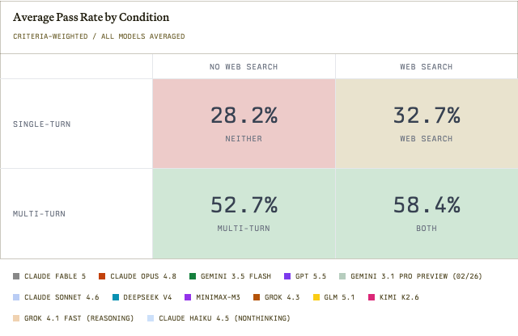

# Public Benefits Bench: Can AI Help People Navigate SNAP Benefits?

**Authors:** Meghana Kotcherlakota, Omar Almatov, Rayan Krishnan (Vals AI), with the Center for Civic Futures (funder, via its Public Benefit Innovation Fund) and Code for America as partners in evaluation
**Published:** 2026-06 (v1 on 2026-06-09, v1.1 on 2026-06-25; page stamped "Updated 9/29/2026" at fetch) · [Source](https://www.vals.ai/benchmarks/public-benefits-bench)
**Lens:** `eval-designer` · **Digested:** 2026-10-01

Source note: this is a live web page, not a paper. The entry reads the benchmark page (narrative, methodology, sample transcript, BibTeX) together with the Vals general methodology page. The leaderboard table is rendered client-side; the top 16 of 45 rows were captured from the rendered DOM on 2026-10-01 and the tail was cross-checked against two mirrors (BenchLeader, data as of 2026-09-19; LLMLearner, read 2026-09-25). The narrative analysis on the page is frozen at the four-condition study of June 2026; later models were run only in the "both" condition.

## TLDR

Vals AI, funded by the Center for Civic Futures and working with Code for America, built 459 SNAP scenario questions covering all 50 states plus Guam and the U.S. Virgin Islands, each with a base query, hidden household context and about 7 expert-validated rubric criteria (2,931 criteria in total), and scores models on a private 230-question test set as the share of criteria passed. Each run is a three-model system: a target model, an auditor model playing the beneficiary (GPT-5.5, chosen for 99.89% fidelity to its persona instructions) and a judge grading against the rubric (Claude Opus 4.7, chosen because it agreed with SNAP experts on 80.6% of 124 graded criteria, against 79.0% to 79.8% for GPT 5.5, Gemini 3.1 Pro and Grok 4.3). Twelve models were run in four independent conditions; averaged across models, a single turn with no tools passed 28.2% of criteria, adding web search 32.7%, letting the model ask the auditor follow-up questions 52.7%, and both 58.4%, so conversation was worth about 24.5 points and search about 4.5. Claude Opus 4.8 led that study at 68.1% (36.6% with nothing) and no model crossed 70%; GLM 5.1 went from 26.0% to 61.8% with tools, Claude Haiku 4.5 gained 39.0 points, and Kimi K2.6 ran 57.8 searches per question for 56.6% while Opus 4.8 ran 18.8 for 68.1%. Opus 4.8 cost $1.89 per question and took about 15 minutes; MiniMax-M3 scored 64.1% at $0.25 and about 14 minutes with about half the output tokens. Overpayment and fraud was the hardest phase at 41.5% (n = 6), topics ran from certification periods at 86.1% to denial at 41.2%, and county-administered states were no harder than state-administered ones (medians 57.9% vs 59.9%). As of 2026-10-01 the live board lists 45 systems with Claude Opus 5 at 76.93% ± 1.10 ($3.95 per test, 30 minutes per question), Claude Fable 5.1 at 74.90%, Claude Opus 5.5 at 70.64% and Claude Fable 5 at 70.43%. The authors' conclusion: the bottleneck is state-held procedural information and tool use, not model capability, so agencies should publish authoritative documents (an `llms.txt`, process manuals) and build narrowly scoped RAG chatbots validated against real client questions, rather than let residents rely on general chatbots.

## Scores as of 2026-10-01

Live leaderboard, top 16 of 45 systems, as rendered on the page (stamp "Updated 9/29/2026"). Accuracy is criteria-weighted pass rate on the 230-question test set with a standard error; cost is per test; time is the target agent's wall-clock per question.

| # | System | Accuracy | Cost / test | Time per question |
|---|---|---|---|---|
| 1 | Claude Opus 5 | 76.93% ± 1.10 | $3.95 | 30 m 09 s |
| 2 | Claude Fable 5.1 | 74.90% ± 1.13 | $7.48 | 48 m 02 s |
| 3 | Claude Opus 5.5 | 70.64% ± 1.19 | $5.95 | 1 h 20 m |
| 4 | Claude Fable 5 | 70.43% ± 1.19 | $4.59 | 21 m 17 s |
| 5 | Gemini 4 Argon | 69.76% ± 0.00 | $2.79 | 26 m 07 s |
| 6 | MiMo V2.6 Pro | 68.94% ± 1.20 | $0.08 | 37 m 14 s |
| 7 | Hy4 Preview | 68.61% ± 1.21 | $0.25 | 1 h 03 m |
| 8 | GLM 5.3 | 68.54% ± 1.21 | $0.95 | 35 m 51 s |
| 9 | Muse Spark 1.2 | 68.47% ± 1.21 | $0.59 | 8 m 55 s |
| 10 | Kimi K3 | 68.27% ± 1.21 | $1.03 | 26 m 04 s |
| 11 | Claude Opus 4.8 | 68.13% ± 1.21 | $1.89 | 12 m 48 s |
| 12 | MiMo V2.6 Flash | 67.59% ± 1.22 | $0.03 | 20 m 56 s |
| 13 | Claude Sonnet 5.5 | 67.19% ± 1.22 | $4.25 | 1 h 15 m |
| 14 | Qwen 3.8 Max | 67.12% ± 1.22 | $0.99 | 40 m 44 s |
| 15 | Grok 4.6 | 66.85% ± 1.23 | $0.92 | 25 m 53 s |
| 16 | GPT-5.6 Sol | 66.51% ± 1.23 | $8.85 | 1 h 01 m |

Tail of the board from the mirrors (as of 2026-09-19 and 2026-09-25): Claude Sonnet 5 66.0, Grok 4.7 65.6, Gemini 3.8 Flash 65.3, DeepSeek V4.1 Flash 64.3, MiniMax M3 64.1, DeepSeek V4 Pro 62.9, Claude Sonnet 4.6 62.5, GPT-5.6 Terra 62.4, GLM 5.1 61.8, GPT-5.5 60.9, Gemini 3.5 Flash 59.5, GPT-6 Luna 57.6, GPT-6 Sol 56.6, Kimi K2.6 56.6, Claude Haiku 4.5 54.3, Gemini 3.1 Pro 53.8, Grok 4.3 51.7, Grok 4.1 Fast 44.8, Laguna XS.2 41.4 (lowest).

Three things to read off this table. First, the four-condition narrative on the page stops at Opus 4.8's 68.1%, and the live board has moved 8.8 points above it in three months with the task unchanged (v1 on June 9 had the best model at 62%; v1.1 on June 25 changed the auditor so it no longer reveals the household's details in its first message, and Opus 4.8 moved to 68%). Second, the standard errors are about 1.1 to 1.2 points, so ranks 5 through 16 (69.76 down to 66.51) sit in a 3.3-point band where no adjacent pair is separated by its error bars; Gemini 4 Argon's ± 0.00 reads as a placeholder. Third, cost per test spans $0.03 (MiMo V2.6 Flash, 67.59%) to $8.85 (GPT-5.6 Sol, 66.51%), a 295x range for a 1-point difference, and the live table shows Opus 4.8 at 12 m 48 s where the narrative says "around 15 minutes". The page's own narrative also names Opus 4.8 (36.6%) as the top no-tools model while its table shows Gemini 3.5 Flash at 37.9% in that column; the table is the better source.

## Key Takeaway

Letting the model ask the person questions was worth 24.5 points on this board and giving it a search engine was worth 4.5, so on a benchmark built to find out whether models know SNAP rules, what the model knew turned out to be the smallest lever: GLM 5.1 started fifth from the bottom with no tools (26.0%) and finished 6 points behind the leader once it could ask and search (61.8%), and Claude Haiku 4.5 gained 39.0 points the same way. The number that caps the whole board is not a model: the judge that grades every answer agrees with the SNAP experts on 80.6% of criteria, and the live leader now scores 76.9%.

## Implications

- **Put a simulated person in the loop and make the agent earn the facts**: multi-turn conversation added about 24.5 points on average and web search about 4.5, and the main v1.1 change, after which the leader moved from 62% to 68%, was that the auditor stopped volunteering the household's details in its first message. For an agent that spends someone's money, write the brief with the budget, constraints and preferences held by an auditor persona that answers only what is asked, and score the asking as part of the run.
- **Calibrate the judge against human graders before you run a single target, and publish the confusion matrix**: four judge candidates were scored on the same 124 expert-graded criteria from 20 target outputs; the winner (Claude Opus 4.7) agreed with experts on 80.6%, with 15 false fails and 7 false passes, and the others were within 1.6 points. Report false passes separately: in a money context a judge that passes a bad purchase is the dangerous direction.
- **Select the auditor by fidelity, with a fixed target, then freeze both**: GPT-5.5 was chosen as auditor at 99.89% fidelity to its persona instructions using Gemini 3.5 Flash as a fixed target, and the page commits to Opus 4.7 as judge and GPT-5.5 as auditor going forward. The SalesLLM digest shows what happens when the simulated counterpart changes (the leaderboard reshuffles), so version the auditor as part of the instrument.
- **Score criteria, not tasks, and say so**: the metric is criteria passed out of 2,931 (about 7 per question), which gives partial credit (the sample transcript scores 3/5 = 60% while stating the governing rule correctly). It separates models that a question-level score would tie, but it means "76.9% correct" is not "76.9% of people got a right answer". Pair it with a question-level pass rate on the harm-bearing criteria.
- **Run the capability ablation as four independent conditions, not a cumulative ladder**: neither, search only, conversation only, both, each from scratch, so the marginal value of each capability is clean. For a market agent the 2x2 is: no tools, read-only market access, ask the principal, both. Expect the interaction term (both minus the sum of the singles) to be small, as here (58.4 vs 28.2 + 4.5 + 24.5 = 57.2).
- **Count tool calls and tokens next to accuracy, and publish cost and wall-clock as first-class columns**: Kimi K2.6 ran 57.8 searches per question for 56.6% while Opus 4.8 ran 18.8 for 68.1%; MiniMax-M3 reached 64.1% with about half Opus 4.8's output tokens at $0.25 against $1.89 per test. The live leader takes 30 minutes and $3.95 per question. A buyer waiting on a live listing cannot wait 30 minutes, so time-to-decision belongs on the board, not in a footnote.
- **Slice by topic, not by phase, and print n for every slice**: phase pass rates span 20 points (41.5% to 61.1%) while topic pass rates span 45 (certification periods 86.1% to denial 41.2%), and the hardest phase has n = 6. The top-3 and bottom-3 models fail on the same phases by wider margins, so a difficulty map built once will keep predicting where the next model fails.
- **Stakes-weighting is the missing column, and the authors say so**: they list classifying questions by stakes as future work, along with under-representation of citizenship and immigration questions and over-representation of California and New York. Build the stakes tag into the rubric from day one; retrofitting it means regrading.

## How to Apply It (method)

**Scenario:** You are building an eval for an agent that buys a used carbon wheelset for a cyclist on a live resale marketplace, with a budget the cyclist set and preferences they did not fully write down. You want to know whether the agent can act as the first point of contact (take the brief, ask what it needs, search listings, act) and you want to publish a board other builders will trust. The Public Benefits Bench pipeline maps onto this almost one for one.

**Steps:**

1. **Write each scenario as a base brief plus hidden context**: the base brief is what the person would type ("find me a used 50 mm carbon wheelset under $900"); the hidden context is what they would say if asked (rim brake or disc, hub standard, tolerance for cosmetic wear, deadline, whether they will pay for shipping). Public Benefits Bench pairs each of 459 base queries with demographic and situational detail the auditor releases only when asked.

2. **Attach about 7 criteria per scenario and have domain experts validate them**: Public Benefits Bench averages 7 criteria per question (2,931 across 459), validated by SNAP policy experts. For a purchase: stayed within budget, confirmed the hub standard before bidding, checked seller history, did not share card details outside the platform's checkout, disclosed total cost including shipping, flagged the return policy, asked at least one clarifying question before acting. Tag each criterion as harm-bearing or coverage.

3. **Map scenarios onto a phase x topic grid and record n per cell**: the benchmark uses 7 lifecycle phases and 25 topics, weighted toward common pain points rather than uniform coverage, and flags its n = 6 overpayment cell as too small to read. For a purchase: search, verify, negotiate, pay, dispute, return; by component type and marketplace. Refuse to report a cell below about 20 criteria.

4. **Hold out a private test set and keep it private**: 230 of 459 questions were randomly chosen as the only set used for published scores; Vals' general methodology page says the test set never leaves the house to prevent training on it. Publish a small validation set so readers can see what the questions look like.

5. **Build the three roles**: a target (the agent under test), an auditor (plays the cyclist; answers follow-ups from the hidden context, offers nothing unprompted, ends with a summary of what it understood) and a judge (grades the transcript against the criteria). The page does not reproduce the auditor's instructions in the extracted text; the template below is written for this digest, not taken from the page.

   ```
   You are playing a real person who has asked an assistant for help with a purchase.
   Your opening message is exactly: {base_brief}
   You know the following about your situation but you only say it when the assistant
   asks a question that calls for it: {hidden_context}
   Answer in your own words, one question at a time, and do not volunteer facts the
   assistant has not asked about. Do not evaluate the assistant. When the assistant
   says it is done, reply with a two-sentence summary of what you now believe it will
   do with your money, then stop.
   ```

6. **Calibrate the judge before anything else**: run one default target with one default auditor, take 20 transcripts, have human experts grade every criterion (124 criteria in the benchmark), then run 3 or 4 judge candidates on the same criteria and build a 2x2 for each (true pass, true fail, false fail, false pass). Pick the highest agreement and publish all four matrices. The benchmark's winner scored 80.6% with 7 false passes out of 124.

7. **Select the auditor by fidelity with a fixed target**: run a fixed target in the full condition against several auditor candidates and measure how often each stays inside its persona instructions (GPT-5.5 scored 99.89%). Then freeze judge and auditor and name them on the page.

8. **Run four independent conditions**: no tools and single turn; market access only; conversation only; both. Each condition is a fresh run, not a cumulative one, so the marginal value of each capability is clean.

9. **Score criteria-weighted pass rate with a standard error, and log the run**: SEM over instance-level scores (Vals follows Miller 2024). Per run, record tool calls per question, output tokens, cost per test and wall-clock. Plot calls against accuracy; the benchmark's point is that the relationship is noisy and the heaviest searcher was mid-table.

10. **Version the instrument and re-baseline on every change**: when the benchmark changed how the auditor behaves (v1.1), the same model moved from 62% to 68%. Treat any change to auditor, judge or rubric as a new version and re-run the reference models.

**Expected outcome:** A board where each agent has an accuracy with error bars, a harm-free run rate, calls-per-question, cost and time-to-decision, broken out by purchase phase and component type with n shown, plus a published judge confusion matrix and auditor fidelity score that let a reader decide how much of the number is the agent and how much is the instrument.

## Best Figure



Image Candidates:
Figure 1 (web page, section "What Helps More: Web Search vs. Conversation"): the 2x2 of search against conversation, four numbers that carry the paper's whole argument.
Figure 2 (web page, section "Overall Model Performance"): 12 models by 4 conditions, showing every model gaining 20 to 39 points from tools and the order changing between columns.
Figure 3 (web page, section "Evaluation Pipeline"): judge confusion matrices for four candidate judges against 124 expert-graded criteria, the instrument's own accuracy.

Best Image:
Figure Name: Figure 1: "Average Pass Rate by Condition (criteria-weighted / all models averaged)"
Figure Page: 1
Slide Caption: Letting the model ask questions was worth 24.5 points; giving it web search was worth 4.5.
Description: A 2x2 table with single-turn and multi-turn as rows and no web search and web search as columns, each cell the criteria-weighted pass rate averaged over the 12 models in the June 2026 study: 28.2% (neither), 32.7% (web search only), 52.7% (multi-turn only), 58.4% (both). Reading down a column shows the conversation effect (about 24.5 points); reading across a row shows the search effect (about 4.5 points); the "both" cell is within 1.2 points of the additive prediction, so the two capabilities barely interact. It is the figure to show anyone who assumes the fix for a knowledge-heavy domain is more knowledge.

| | No web search | Web search |
|---|---|---|
| Single turn | 28.2% (neither) | 32.7% (web search) |
| Multi-turn | 52.7% (multi-turn) | 58.4% (both) |

## What Experts Overlook

The accuracy number is a criteria pass rate, not a question pass rate. The methodology defines the metric as the number of criteria passed out of the 2,931 in the dataset (about 7 per question), so a model that states the governing rule correctly but skips two of five rubric items scores 60% on that question, and a model that covers six peripheral items while getting the decisive one wrong scores 86%. The page's headline wording, that the top model "provided correct answers to SNAP-related questions only 76.9% of the time", is the question-level reading of a criteria-level number. The sample transcript makes the gap visible: the target's Missouri answer gave the 274-day expungement rule correctly with manual and CFR citations and still scored 3/5, because it did not say whether benefits are taken offline before expungement and did not warn about theft risk from carrying a large balance. The authors list classifying questions by stakes as future work, which confirms that today every criterion weighs the same.

**Why it matters:** A criteria-weighted score is a coverage score. It fits a domain where omissions hurt (a missed notice period) and it gives partial credit that separates models a pass/fail score would tie, which is why the board can rank 45 systems inside a 35-point range with 1.2-point error bars. But it means 76.9% cannot be read as "77 of 100 beneficiaries got a correct answer", and it means a harmful error and a harmless omission move the number by the same amount. The judge's 7 false passes out of 124 criteria land somewhere inside that, and the page does not say whether they fell on decisive or peripheral criteria.

**Example of good use:** For an agent buying on a live market, keep the 7-criteria rubric but tag each criterion as harm-bearing (overspent the budget, paid outside the platform, bought the wrong hub standard) or coverage (explained shipping, mentioned the return window). Report two numbers side by side: the criteria pass rate, and the share of runs with zero harm-bearing failures. Run the judge calibration on the harm-bearing criteria separately so the false-pass count is known where it costs money.

**Example of misapplication:** Publish "the agent is 80% correct" from an unweighted rubric and let a reader conclude that 4 in 5 purchases went fine, when the agent could have overpaid in a third of runs while collecting coverage points on the other six criteria. The mirror failure is just as likely: a terse agent that makes exactly the right purchase and explains nothing scores badly for omissions, while a verbose agent that explains everything and overpays scores better, so the board rewards talking over buying.

## Extracted Prompts

The page displays the inputs for the sample transcript (the auditor's opening question and the rubric the judge grades against) but the text extraction does not contain the auditor's persona instructions or the judge's grading instructions verbatim, even though the page says the auditor instructions are shown in the transcript viewer. What is reproduced verbatim is below.

**Prompt explanation:** Auditor input, the base query the auditor uses as its opening message and the context it answers follow-ups from (Missouri EBT expungement scenario).

```
Input question: How long do remaining SNAP benefits stay on my EBT card after I'm no longer eligible in Missouri?
```

**Prompt explanation:** Judge rubric for the same question, the five expert-validated criteria the target's transcript is graded against (3 of 5 passed in the displayed run).

```
- Emphasize benefits only expire after 9 months of complete inactivity or 9 months after issuance, regardless of account activity, and explain the state's chosen option.
- Cite exact timeframe and conditions for benefit expiration and if benefits are taken offline prior to expungement
- Mention notice period before benefits are expunged
- Warn against building large balances due to theft risk activity.
- Note Missouri specifically expunges SNAP benefits daily if they have not been used 274 days after date of issuance, regardless of account activity.
```

## Citations

The page has no bibliography. The entries below are the references on the Vals methodology page that governs this benchmark's error bars and private test set, plus the partner and version announcements the page points to.

- Miller, E. (2024). Adding Error Bars to Evals: A Statistical Approach to Language Model Evaluations. arXiv 2411.00640. (Vals' SEM method for single-run benchmarks.)
- Zhang, A. K., Klyman, K., Mai, Y., et al. (2024). Language model developers should report train-test overlap. arXiv 2410.08385. (Cited for test-set leakage.)
- Matton, A., Sherborne, T., et al. (2024). On Leakage of Code Generation Evaluation Datasets. arXiv 2407.07565. (Cited for contamination through synthetic data.)
- Center for Civic Futures (2025-12-09). Center for Civic Futures and partners commit $8.5M for AI solutions that improve safety net program delivery. (PBIF funding of the SNAP benchmarks; also promises benchmarking of state-built tools.)
- Vals AI. Methodology page. vals.ai/methodology. (Private test sets, rubric-based LLM-as-judge accuracy, latency and cost columns, SEM error bars.)
- Vals AI (2026-06-09). Public Benefits Bench v1 launch post: best model 62%, weakest on state-specific questions such as EBT card replacement.
- Vals AI (2026-06-25). SNAP Benchmark v1.1 post: auditor no longer reveals demographics in its first message; Opus 4.8 at 68.0%.
- United States Congress (2025). One Big Beautiful Bill Act (H.R. 1), SNAP provisions. (Named on the page as the source of new beneficiary confusion the next version should cover.)

## Related Digests

- [[arora-2025-healthbench-physician-rubric]]: HealthBench: Evaluating Large Language Models Towards Improved Human Health (physician-written rubric criteria graded by a model judge; the same criteria-weighted design in medicine)
- [[su-2026-salesllm-selling-skill]]: Sell More, Play Less: Benchmarking LLM Realistic Selling Skill (swap the simulated counterpart and the leaderboard reshuffles; why the auditor must be frozen and versioned)
- [[patwardhan-2025-gdpval-economic-tasks]]: GDPval: Evaluating AI Model Performance on Real-World Economically Valuable Tasks (expert grading and the cost of the human who checks the work)
- [[dsouza-2026-underwrite-insurance]]: Benchmarking Agents in Insurance Underwriting Environments (UNDERWRITE, Snorkel AI) (a simulated-user, rules-heavy domain with a model judge)
- [[bock-2025-taxcalcbench]]: TaxCalcBench: Evaluating Frontier Models on the Tax Calculation Task (rules that vary by jurisdiction and change yearly, the same recency and coverage gaps)

## Reviewer Notes

[populated in Step 7]
