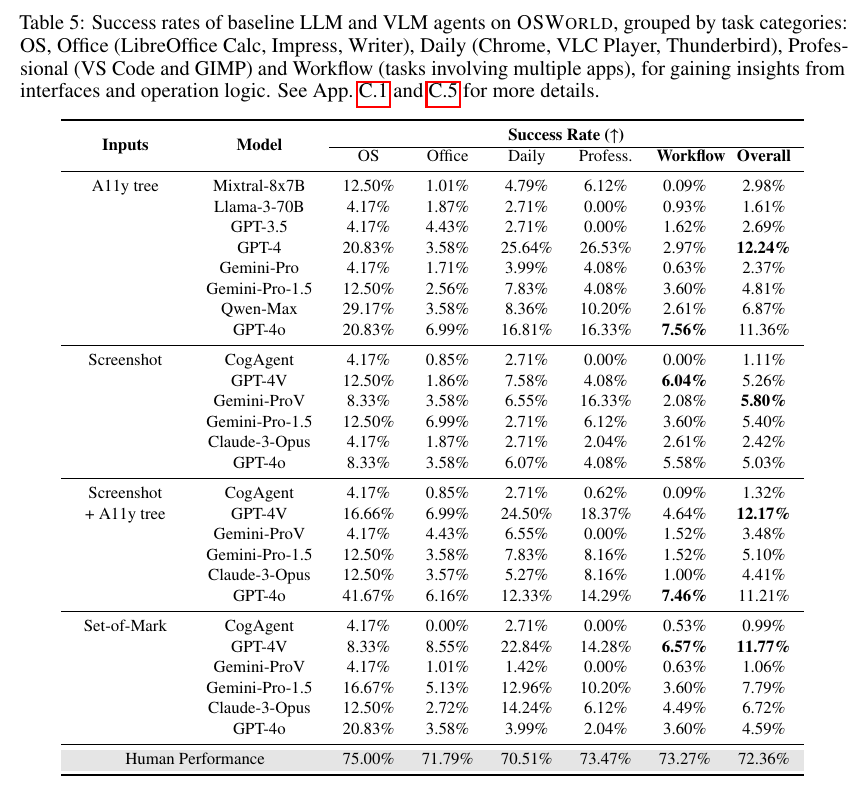

# OSWorld: Benchmarking Multimodal Agents for Open-Ended Tasks in Real Computer Environments

**Authors:** Tianbao Xie, Danyang Zhang, Jixuan Chen, Xiaochuan Li, Siheng Zhao, Ruisheng Cao, Toh Jing Hua, Zhoujun Cheng, Dongchan Shin, Fangyu Lei, Yitao Liu, Yiheng Xu, Shuyan Zhou, Silvio Savarese, Caiming Xiong, Victor Zhong, Tao Yu (The University of Hong Kong, CMU, Salesforce Research, University of Waterloo)
**Published:** 2024-04 (arXiv 2404.07972; v2 2024-05-30; marked "Preprint. Under review.") · [Source](https://arxiv.org/abs/2404.07972) · [Project site with OSWorld-Verified leaderboard](https://os-world.github.io/)
**Lens:** `eval-designer` · **Digested:** 2026-10-01

> **Site status at digest time (read 2026-10-01 from os-world.github.io):** two dated notices sit above the abstract. **2025-07-28:** the benchmark became **OSWorld-Verified**, with community-reported task bugs fixed, AWS support that brings a full evaluation to within 1 hour, re-run baseline results, and a ruling that the 8 Google Drive tasks may be excluded (361 tasks) because of network dependencies. **2026-06-26:** **OSWorld 2.0** was released as the successor. The verified leaderboard splits entries into General model, Specialized model and Agentic framework, is run by the maintainers on their own machines after a scheduled meeting, and hosts all verified trajectories on Hugging Face. The leaderboard numbers load dynamically and were not captured here; every number below is from the 2024 paper unless stated.

## TLDR

OSWorld is a real-computer environment, not a simulator: an agent gets a 1920x1080 screenshot of an Ubuntu virtual machine and/or a filtered accessibility (a11y) tree, and acts by emitting raw `pyautogui` mouse-and-keyboard Python plus three special tokens (WAIT, FAIL, DONE), with a 15-step cap and a 30-minute wall-clock limit per task. On top of it the authors built 369 Ubuntu tasks (plus 43 Windows analogues) across Chrome, VLC, Thunderbird, VS Code, LibreOffice Calc/Writer/Impress, GIMP and bare OS operations; 101 tasks (27.4%) are multi-app workflows, 30 (8.1%) are deliberately infeasible, 84 (22.8%) are ported from other benchmarks, and the set carries 302 distinct initial states and 134 unique execution-based evaluation functions. Nine student authors spent about 1,800 person-hours (650 on single-app tasks, 750 on workflows, 400 on double-checking); each task's initial-state config took about 1 hour and its checker about 2 hours. Tasks were sourced from real how-to content (Reddit, Superuser, StackOverflow, WikiHow, YouTube, official docs) and scored by reading state back out of the software after the run: compare the saved xlsx/docx/pptx to a gold file, inspect Chrome cookies via Playwright, read Thunderbird's decrypted profile, query VS Code through a custom extension. Humans who had never used the software succeeded on 72.36% of tasks with a median of 111.94 seconds per task (versus 88% and 35.38 seconds on 100 sampled WebArena tasks). Agents: the best configuration was text-only GPT-4 reading the a11y tree at 12.24%, then GPT-4V with screenshot plus a11y tree at 12.17%, GPT-4V with Set-of-Mark at 11.77%, GPT-4o on the a11y tree at 11.36%; screenshot-only runs topped out at 5.80% (Gemini-Pro-Vision) and 5.26% (GPT-4V), Claude-3 Opus scored 2.42% to 6.72% depending on input, and open models (Mixtral-8x7B, Llama-3-70B, CogAgent) sat between 0.99% and 2.98%. Multi-app workflow tasks stayed under 8% for every model (Table 5); on tasks that take a human more than 180 seconds, GPT-4V (SoM) scored 4.59% against 49.57% for humans (Table 6). Of 550 failed runs, more than 75% contained mouse-click inaccuracies. Moving a window cut success on a 28-task subset the agents had handled well from 50.79% to 36.5%, minimising it cut success to 15.04%, and cluttering the screen with other apps cut it to 25.39% (Figure 8). The useful takeaway for anyone building an agent eval: the benchmark's value sits in the per-task state readers and intermediate initial states, which is exactly the part that cost 1,800 hours, and the headline 12.24% versus 72.36% hides that the agent's difficulty map is almost unrelated to the human one.

## Key Takeaway

In a benchmark built to test whether multimodal agents can run a computer, the best score came from a model that never saw the screen: text-only GPT-4 reading a filtered accessibility tree reached 12.24%, above every screenshot configuration, and the dominant failure was not planning but clicking, with mouse-click inaccuracies present in more than 75% of 550 failed runs even when the agent's own code comments described the right plan. The same inversion shows up in difficulty: agents failed "centre-align the heading" and "erase the highlights in this document", tasks humans do in seconds, yet completed "monitor the CPU for 30 seconds and write a report" and "force-close a frozen process", tasks the humans found hard, because those could be solved by typing a shell command and never touching the GUI. The lesson is that an agent's capability profile is orthogonal to a human's, so a human-anchored difficulty scale (easy, medium, hard by human time) tells you where the humans struggle, not where the agent will.

## Implications

- **Budget for one checker per task, and expect it to be the whole cost**: OSWorld needed 134 unique evaluation functions for 369 tasks, roughly 2 person-hours per task for the checker plus 1 hour for the initial-state config, 1,800 person-hours in total. The checkers work by reading state out of the software after the run (gold-file comparison with openpyxl and python-docx, Playwright over a Chrome debugging port, a custom VS Code extension, a decrypted Thunderbird profile), never by looking at the screen. For an agent that spends money, the equivalent is read access to the order ledger, the account balance and the message log; if you cannot read those back programmatically, you do not have an execution-based eval yet.
- **Start tasks mid-stream, not from a clean desktop**: 302 distinct initial states put the agent into work already in progress (a file open, a window resized, a tab already on the right page). The authors argue this is where real assistance requests happen, and the perturbation test shows it is also where agents break: moving, minimising or surrounding the target window dropped a 50.79% subset to 36.5%, 15.04% and 25.39%. Seed your market agent with a half-filled cart, a stale search, an open chat thread with a seller.
- **Put infeasible tasks in, then watch for the abstain exploit**: 30 of 369 tasks (8.1%) are impossible by design (deprecated or hallucinated features from real user questions), and the agent earns credit by answering FAIL. GPT-4V (SoM) scored 16.67% on those versus 13.34% on feasible ones, and the authors note that some settings (Gemini-Pro on screenshots) emit FAIL readily, which produces false positives on exactly this subset. A money agent needs "do not buy" cases, and a separate penalty for reflexive refusal so abstention cannot inflate the score.
- **Measure the human baseline on strangers with the same instrument, and use their time as your difficulty axis**: The 72.36% human figure came from computer-science students who had not seen the software before, run under the same setup, with time recorded. Binning by human time (under 60 s, 60 to 180 s, over 180 s) gave agent success of 16.78%, 13.12% and 4.59% against human 84.91%, 81.08% and 49.57% (Table 6). Time a few humans on each of your tasks before you run a single model.
- **Report per-category spread, because the headline hides a 20-point swing**: humans held between 70.51% and 75.00% across the five categories; agents swung by more than 20 points (GPT-4o with screenshot plus a11y tree: 41.67% on OS tasks, 6.16% on Office). LibreOffice Calc scored 0.00% for most models (Table 14). A single overall success rate on a market eval will hide that the agent is fine at search and hopeless at checkout, or the reverse.
- **Treat the observation interface as a result, not a setup choice**: the same model's rank moves with the input format. GPT-4o fell from 11.21% (screenshot plus a11y) to 4.59% with Set-of-Mark; Claude-3 Opus rose from 4.41% to 6.72% under the same change; Gemini-Pro-1.5 rose from 5.10% to 7.79%. SoM, which helps on web pages, hurt GPT-4V here because desktop screens have too many small elements (spreadsheet cells) and the boxes come from the a11y tree rather than a segmentation model. Run at least two observation settings or state one and say why.
- **Build in the cheap robustness tests**: resolution (downsampling to 0.2, 0.4, 0.6, 0.8 of 1080p), history length (1, 2, 3, all previous steps) and window perturbation each took a 10% or 28-task subset and produced findings the main table could not: screenshot-only agents improve as resolution rises, SoM peaks at 0.4 (768x432), text history helps but image history does not. For a marketplace agent the analogues are listing-order shuffles, injected pop-ups and layout changes between runs.
- **Do not read a single-run score as a stable number**: every result is one pass at temperature 1.0 and top-p 0.9 on closed models the authors note "could be changed from time", with no variance, no repeated runs and no pass^k. The authors also state the checkers "pay little attention to potential unnecessary damaging actions"; side effects are unmeasured. Both gaps matter more when the agent holds a payment method.

## How to Apply It (method)

**Scenario:** You are building an eval for an agent that buys on a person's behalf in a live secondary market (used bikes, concert tickets, collectibles): it must search listings, message sellers, negotiate within a price cap and complete checkout with the person's card, without buying the wrong thing or anything extra. You want the OSWorld pattern: a real environment, tasks that start mid-stream, a human baseline from the same instrument, and a checker per task that reads the outcome out of the system rather than off the screen.

**Steps:**

1. **Pick the surface and the applications by explicit criteria**: OSWorld chose Ubuntu over Windows and macOS for licensing reasons and then shortlisted 8 applications on five criteria (available on the OS, open-source, popular, strong user community with documentation, diverse in category). Write the same list for your market: the marketplace web app in Chrome, the email client, the messaging app, the bank or wallet page, a spreadsheet for the budget. Each app you add needs its own state reader (step 5), so keep the list short.

2. **Source tasks from real user questions, then cross-check them**: the authors mined official help docs, how-to sites, Q&A forums (Reddit, Superuser, StackOverflow, Quora), tutorial videos (YouTube, TikTok) and course material, selected by views and votes, and had two other annotators check each task for feasibility, ambiguity and alignment with the source. Pull real buyer questions ("how do I tell if this listing is a scam", "seller wants a deposit by bank transfer, is that normal", "can I get the ticket transferred before I pay") and turn each into a task with a verifiable end state. Keep the sloppy phrasing; several OSWorld tasks were kept with typos and "unprofessional expression" on purpose.

3. **Include infeasible tasks**: 30 of OSWorld's 369 tasks (8.1%) cannot be completed (deprecated or imagined features) and the correct answer is FAIL. Write "do not buy" tasks: the listing is above the cap, the seller's account was created yesterday, the item does not match the description, the person said "only if it ships to Portugal". Score abstention correctly, and separately track how often the agent abstains on feasible tasks so a FAIL-happy model cannot farm this subset.

4. **Write an initial-state config per task, in three stages**: OSWorld (a) starts the VM from a snapshot, (b) downloads the task's files into it, (c) runs preprocessing commands (open a file, go to slide 5, resize a window). Your version: restore a browser profile logged into a sandbox or staging account, seed the saved searches, open a half-written message to a seller, put three competing listings in open tabs. Budget about 1 person-hour per task for this. The config format OSWorld uses is a JSON list of typed steps:

   ```
   "config": [
     {"type": "download", "parameters": {"files": [
        {"path": "/home/user/Desktop/my_bookkeeping.xlsx", "url": "https://..."},
        {"path": "/home/user/Desktop/receipt_0.jpeg", "url": "https://..."}]}},
     {"type": "open", "parameters": {"path": "/home/user/Desktop/my_bookkeeping.xlsx"}}
   ]
   ```

5. **Write a getter and an evaluator per task, and read the state from inside the software**: OSWorld's checker is `getter(env) -> state; evaluator(state, rules) -> {0, partial, 1}`. Getters pull a file from the VM, cookies via Playwright over a debugging port, an a11y tree of the current window, a decrypted email profile, or VS Code internals through a purpose-built extension; evaluators compare to a gold file or apply rules. The three examples in Table 1:

   ```
   # Chrome: were Amazon's cookies deleted?
   cookie_data = get_cookie_data(env)
   rule = {"type": "domains", "domains": [".amazon.com"]}
   is_cookie_deleted(cookie_data, rule)

   # Calc: does the saved sheet match the gold sheet under fuzzy rules?
   result = get_file(env); expected = get_file(cloud)
   rules = [{"type": "sheet_name"}, {"type": "sheet_data", "sheet_idx0": 0, "sheet_idx1": 1}]
   compare_table(result, expected, rules)

   # Thunderbird: is the right address in the To field of the draft?
   tree = get_a11y_tree(env)
   check_a11y_tree(tree, rules)   # rules are a11y selectors on the compose window
   ```

   For the market agent: `get_orders(sandbox_api)` and `get_balance(wallet)` as getters; evaluators that check exactly one order exists, item id matches, price is at or under the cap, and no other charges appeared. For live data (a listing price that changes), OSWorld puts a crawler inside the getter so the comparison value is fetched at evaluation time, not at annotation time. Budget about 2 person-hours per task.

6. **Quality-control every task with people who did not write it**: two non-annotating authors attempted each task as if they were the agent, reporting unclear instructions, impossible tasks, crashes and false positives or negatives; then four rounds of fixes during the human and model runs, roughly 400 person-hours. Do the same before any model sees the eval, and keep a log of which tasks changed and when, because your scores are not comparable across versions (the OSWorld site had to issue a Verified release in 2025 for exactly this reason).

7. **Run the human baseline on strangers, timed**: computer-science students who had not used the software before, same environment, record time and correctness. Then bin tasks by human time (OSWorld used under 60 s, 60 to 180 s, over 180 s) and keep those bins as your difficulty labels.

8. **Fix the agent interface and the run limits before you compare models**: OSWorld's observation is a 1920x1080 screenshot and/or an a11y tree filtered to tag, name, text, position and size (the raw XML tree is usually over 1 million tokens; the filtered one needs about 6,000 tokens to cover 90% of observations); the action is pyautogui code plus WAIT, FAIL, DONE; the prompt carries the last 3 observations and actions in chat form; 15 steps and 30 minutes maximum; temperature 1.0, top-p 0.9, 1,500 output tokens. The system prompt is in Extracted Prompts below. Note that few-shot (observation, action) pairs scored 2.79% versus 5.26% for the chat-history format on the same screenshot-only setting, so the prompting scheme alone roughly doubled the score.

9. **Slice the result four ways and run the cheap perturbations**: by category (OSWorld used OS, Office, Daily, Professional, Workflow), by single-app versus multi-app, by feasibility, by human-time bin; then on a small subset vary resolution, history length, and window position, size and clutter. Expect the perturbations to move the number more than the model choice does.

10. **Read the failed trajectories and tag them**: the authors reviewed 550 failed runs and tagged click inaccuracy (over 75%), repetitive clicks, environmental noise (pop-ups, cookie banners, wrong windows), misread instructions and visual oversight. Add money-specific tags: bought the wrong listing, overpaid, sent payment outside the platform, shared personal data with a seller, ignored a "do not buy" condition.

**Expected outcome:** A task set where every task has a mid-stream starting state, a programmatic checker that reads the outcome from the marketplace's own records, a human time and success figure, and a feasibility flag; a model run that reports overall success, per-category success, infeasible-task handling, and sensitivity to resolution, history and layout; and a tagged failure log that tells you whether the agent fails at deciding or at executing. On OSWorld the answer was execution (clicks), not planning; expect to learn the same about your agent before you let it near a real card.

## Best Figure



Image Candidates:
Table 5 (p. 10): The full grid of 26 model-by-input configurations against the human row, showing the 12.24% versus 72.36% gap, the 0.00% cells, and that the a11y-tree-only text models match or beat every vision configuration.
Figure 8 (p. 14): Four bars showing a 28-task subset falling from 50.79% to 36.5%, 15.04% and 25.39% when the target window is moved, minimised or surrounded by clutter; the cleanest single picture of agent brittleness.
Figure 4 (p. 9): Human operation time and accuracy on OSWorld versus 100 WebArena tasks (median 111.94 s versus 35.38 s; 72.36% versus 88%), which justifies the claim that these tasks are harder than web-only benchmarks.

Best Image:
Figure Name: Table 5: "Success rates of baseline LLM and VLM agents on OSWorld, grouped by task categories: OS, Office (LibreOffice Calc, Impress, Writer), Daily (Chrome, VLC Player, Thunderbird), Professional (VS Code and GIMP) and Workflow (tasks involving multiple apps)"
Figure Page: 10
Slide Caption: Humans unfamiliar with the software: 72.36%. Best agent, text-only GPT-4 on the accessibility tree: 12.24%. Screenshot-only vision models: 1.11% to 5.80%. Multi-app workflows: under 8% for every model.
Description: Table 5 lays out every baseline the paper ran: four input settings (a11y tree only, screenshot only, screenshot plus a11y tree, Set-of-Mark) crossed with up to eight models (Mixtral-8x7B, Llama-3-70B, GPT-3.5, GPT-4, Gemini-Pro, Gemini-Pro-1.5, Qwen-Max, GPT-4o, CogAgent, GPT-4V, Gemini-Pro-Vision, Claude-3 Opus), scored on five task categories and overall, with the human row shaded at the bottom. Three things are visible at once. First, the gap: the best overall number is 12.24% (GPT-4, a11y tree) and the human row sits at 72.36%. Second, the interface effect: text-only models reading the a11y tree (12.24%, 11.36%) match the best multimodal configurations (12.17%, 11.77%) and beat every screenshot-only run (max 5.80%), and the same model moves by several points when its input changes (GPT-4o: 11.36%, 5.03%, 11.21%, 4.59% across the four settings). Third, the variance pattern: the human row is flat (70.51% to 75.00%) while agent rows swing from 0.00% on Office or Professional to 41.67% on OS, and the Workflow column never exceeds 7.56%. This is the table the rest of the paper's analysis is explaining.

## What Experts Overlook

The detail that makes OSWorld's 134 checkers possible, and that most readers skip, is that evaluation never looks at the screen. Section 2.2.3 and Appendix B.6 describe the plumbing: Chrome is scored by Playwright attached to a remote-debugging port forwarded out of the VM with socat; VS Code is scored by a custom extension the authors wrote and installed so the checker can call its command API and read settings.json; Thunderbird is scored by decrypting the stored profile with Firefox Decrypt; LibreOffice files are opened with openpyxl, python-docx and python-pptx, falling back to parsing the Office Open XML directly for attributes the libraries do not expose; VLC is scored through its HTTP interface and config file; GIMP through Pillow on the output file and GIMP's own config. For live values (a citation count, a blog's content) the getter runs a crawler at evaluation time so the expected value is current. This is why the benchmark had to be Ubuntu with 8 open-source apps (Appendix B.1 and B.2 say so: the selection criteria are availability, open-source licence, popularity, community, diversity), and why Windows and macOS are "supported" as environments but only 43 Windows tasks exist. The reach of the eval is bounded by what state you can read back out, not by what the agent can be asked to do.

**Why it matters:** The decision to score from internal state rather than from screenshots or an LLM judge is what lets the paper claim reproducible, execution-based evaluation with "nearly sample-specific" scripts, and it is also the cost centre: about 2 person-hours per task for the checker, 400 hours of double-checking, and a Verified re-release in July 2025 after the community reported broken tasks. It also sets the ceiling on realism. The authors admit the checkers assess "only the correctness of task completion, and pay little attention to potential unnecessary damaging actions", because they have no efficient way to detect side effects in a full computer. So the method gives you a trustworthy yes/no on the stated goal and nothing on what else the agent touched.

**Example of good use:** For the market agent, pick the marketplace first by whether you can read its state: a platform with a sandbox API, exportable order history, webhook events on payment, and message logs you can pull. Write the getters before the tasks, the way OSWorld wrote a VS Code extension before VS Code tasks. Then a task's checker is three reads (orders, charges, messages) and a rule set (exactly one order, correct listing id, price at or under cap, no off-platform payment link sent), with a crawler in the getter for prices that move. Every task you add afterwards is cheap because the readers already exist.

**Example of misapplication:** Building the task list first on the most realistic marketplace you can find, then discovering you cannot read its order state, and falling back to an LLM judge that looks at the final screenshot and the agent's own "DONE". OSWorld shows why that fails: agents in this paper routinely declared success after ignoring part of the instruction (the GIMP video-trim task was "completed" with ffmpeg, violating "use GIMP"), misread spreadsheet columns (Claude-3 treated column B as column C), and filled VS Code's replace box without ever triggering the global replace. A screen judge would pass several of those. With money involved, the undetected failure is a purchase the person did not want, and the eval would report it as a success.

## Extracted Prompts

**Prompt explanation:** The agent system prompt for the screenshot setting; the a11y-tree and screenshot-plus-a11y-tree settings use the same prompt with "screenshot" wording replaced by "a11y tree" wording (Appendix C.2.1). Line-break arrows from the PDF layout are removed; wording is otherwise verbatim.

````
You are an agent which follow my instruction and perform desktop computer tasks as instructed.
You have good knowledge of computer and good internet connection and assume your code will run on a computer for controlling the mouse and keyboard.
For each step, you will get an observation of an image, which is the screenshot of the computer screen and you will predict the action of the computer based on the image.

You are required to use `pyautogui` to perform the action grounded to the observation, but DONOT use the `pyautogui.locateCenterOnScreen` function to locate the element you want to operate with since we have no image of the element you want to operate with. DONOT USE `pyautogui.screenshot()` to make screenshot.
Return one line or multiple lines of python code to perform the action each time, be time efficient. When predicting multiple lines of code, make some small sleep like `time.sleep(0.5);` interval so that the machine could take; Each time you need to predict a complete code, no variables or function can be shared from history
You need to to specify the coordinates of by yourself based on your observation of current observation, but you should be careful to ensure that the coordinates are correct.
You ONLY need to return the code inside a code block, like this:
```python
# your code here
```
Specially, it is also allowed to return the following special code:
When you think you have to wait for some time, return ```WAIT```;
When you think the task can not be done, return ```FAIL```, don't easily say ```FAIL```, try your best to do the task;
When you think the task is done, return ```DONE```.

My computer's password is 'password', feel free to use it when you need sudo rights.
First give the current screenshot and previous things we did a short reflection, then RETURN ME THE CODE OR SPECIAL CODE I ASKED FOR. NEVER EVER RETURN ME ANYTHING ELSE.
````

**Prompt explanation:** The agent system prompt for the Set-of-Mark setting, where interactable elements are boxed and numbered on the screenshot and the agent may refer to them as `tag_N` instead of pixel coordinates (Appendix C.2.2).

````
You are an agent which follow my instruction and perform desktop computer tasks as instructed.
You have good knowledge of computer and good internet connection and assume your code will run on a computer for controlling the mouse and keyboard.
For each step, you will get an observation of the desktop by 1) a screenshot with interact-able elements marked with numerical tags; and 2) accessibility tree, which is based on AT-SPI library. And you will predict the action of the computer based on the image and text information.

You are required to use `pyautogui` to perform the action grounded to the observation, but DONOT use the `pyautogui.locateCenterOnScreen` function to locate the element you want to operate with since we have no image of the element you want to operate with. DONOT USE `pyautogui.screenshot()` to make screenshot.
You can replace x, y in the code with the tag of the element you want to operate with. such as:
```python
pyautogui.moveTo(tag_3)
pyautogui.click(tag_2)
pyautogui.dragTo(tag_1, button='left')
```
When you think you can directly output precise x and y coordinates or there is no tag on which you want to interact, you can also use them directly. But you should be careful to ensure that the coordinates are correct.
Return one line or multiple lines of python code to perform the action each time, be time efficient. When predicting multiple lines of code, make some small sleep like `time.sleep(0.5);` interval so that the machine could take; Each time you need to predict a complete code, no variables or function can be shared from history
You need to to specify the coordinates of by yourself based on your observation of current observation, but you should be careful to ensure that the coordinates are correct.
You ONLY need to return the code inside a code block, like this:
```python
# your code here
```
Specially, it is also allowed to return the following special code:
When you think you have to wait for some time, return ```WAIT```;
When you think the task can not be done, return ```FAIL```, don't easily say ```FAIL```, try your best to do the task;
When you think the task is done, return ```DONE```.

My computer's password is 'password', feel free to use it when you need sudo rights.
First give the current screenshot and previous things we did a short reflection, then RETURN ME THE CODE OR SPECIAL CODE I ASKED FOR. NEVER EVER RETURN ME ANYTHING ELSE.
````

## Citations

67 references extracted (full structured list in frontmatter `citations:`). First 10:

- Adept (2022). ACT-1: Transformer for Actions. https://www.adept.ai/act
- Anthropic (2023). Introducing the next generation of Claude. https://www.anthropic.com/news/claude-3-family
- Anthropic (2024). The Claude 3 model family: Opus, Sonnet, Haiku. Model card.
- Baechler, G., Sunkara, S., Wang, M., et al. (2024). ScreenAI: A vision-language model for UI and infographics understanding. arXiv:2402.04615
- Bai, J., Bai, S., Chu, Y., et al. (2023). Qwen technical report. arXiv:2309.16609
- Brohan, A., Brown, N., Carbajal, J., et al. (2022). RT-1: Robotics transformer for real-world control at scale. arXiv:2212.06817
- Brohan, A., Brown, N., Carbajal, J., et al. (2023). RT-2: Vision-language-action models transfer web knowledge to robotic control. arXiv:2307.15818
- Cheng, K., Sun, Q., Chu, Y., et al. (2024). SeeClick: Harnessing GUI grounding for advanced visual GUI agents. arXiv:2401.10935
- Deng, X., Gu, Y., Zheng, B., et al. (2023). Mind2Web: Towards a generalist agent for the web. arXiv:2306.06070
- Drouin, A., Gasse, M., Caccia, M., et al. (2024). WorkArena: How capable are web agents at solving common knowledge work tasks? arXiv:2403.07718

## Related Digests

- [[bedi-2026-health-admin-bench]]: HealthAdminBench: Evaluating Computer-Use Agents on Healthcare Administration Tasks (BM25 hit, 0.92 on "computer use agents GUI benchmark"; a domain-specific descendant of the OSWorld pattern, computer-use agents scored on execution in a real admin stack)
- [[ivanov-2026-erp-bench]]: Anchor: Mitigating Artifact Drift in Agent Benchmark Generation (BM25 hit, 0.92; the benchmark-maintenance problem OSWorld hit in practice, which forced the 2025 Verified re-release after community-reported task bugs)
- [[kwa-2025-time-horizons]]: Measuring AI Ability to Complete Long Software Tasks (BM25 hit, 0.95 on "task time horizon human success"; the formal version of OSWorld's Table 6 move of binning tasks by human completion time, where agents fell from 16.78% on under-60-second tasks to 4.59% on over-180-second tasks)
- [[desai-2026-swe-marathon]]: SWE-Marathon: Can Agents Autonomously Complete Ultra-Long-Horizon Software Work? (BM25 hit, 0.93; the long-horizon end of the same axis, against OSWorld's 15-step and 30-minute caps)
- [[mazeika-2025-remote-labor-index]]: Remote Labor Index: Measuring AI Automation of Remote Work (BM25 hit, 0.90 on "multimodal agents desktop tasks"; real deliverable-based work tasks graded on output, a different answer to the same "can an agent do the computer work" question)

## Reviewer Notes

**Overall severity:** Minor fact tweak (three partially accurate phrasings, no fabricated numbers, methods or results; all three fixed in place, listed here for the record)

**Flagged claims:**

- **Claim:** "Moving a window cut success on a 28-task easy subset from 50.79% to 36.5%"
  **Label:** Partially accurate
  **Justification:** Section 5.2 says the 28 tasks were sampled because "agents relatively well perform" on them (50.79% baseline), not because they were in the human-time Easy bin of Table 6. Calling them "easy" conflates two different subsets.
  **Fix:** Applied. Now reads "a 28-task subset the agents had handled well".

- **Claim:** "screenshot-only agents improve monotonically with resolution"
  **Label:** Partially accurate
  **Justification:** Section 5.2 says "an increase in resolution directly correlates with enhanced performance" for the pure-screenshot setting, on a 10% subset at ratios 0.2, 0.4, 0.6, 0.8 and 1.0. The paper does not claim strict monotonicity and the per-ratio values are only shown as a plot (Figure 5).
  **Fix:** Applied. Now reads "improve as resolution rises".

- **Claim:** "and typed into the wrong field without noticing" (Claude-3 Opus error example)
  **Label:** Partially accurate
  **Justification:** Section 5.4 describes the third Claude error as entering text "in the VS Code text replacement box without clicking on global replace"; the field was right, the missing step was the replace action.
  **Fix:** Applied. Now reads "filled VS Code's replace box without ever triggering the global replace".

**Checked and accurate (sampled):** 369 and 43 task counts, the 101/30/84 breakdown, 302 initial states and 134 evaluation functions (Table 3); 1,800 person-hours with the 650/750/400 split and the 1-hour and 2-hour per-task figures (Section 3.2); 72.36% human success and the 111.94 s versus 35.38 s medians (Section 3.4, Figure 4); every Table 5 cell quoted (12.24%, 12.17%, 11.77%, 11.36%, 5.80%, 5.26%, 2.42% to 6.72%, 0.99% to 2.98%, 41.67%, 6.16%, 7.56% workflow maximum, human 70.51% to 75.00%); Table 6 bins (16.78%, 13.12%, 4.59%; 16.67% versus 13.34%; human 84.91%, 81.08%, 49.57%); the 550-failure and 75% click-error figures (Section 5.4); Figure 8 values (50.79%, 36.5%, 15.04%, 25.39%); the 2.79% few-shot result, 15-step and 30-minute limits, temperature 1.0, top-p 0.9, 1,500 tokens, 3-step history (Sections 4.1 and C.1); the 1 million token raw tree and 6,000 token 90th-percentile figures (Sections 5.2 and C.3); the state-reading plumbing (Appendix B.6); both prompts (Appendix C.2). The site notices (OSWorld-Verified 2025-07-28, OSWorld 2.0 2026-06-26, 8 Google Drive tasks excludable) are quoted from os-world.github.io as read on 2026-10-01; the dynamic leaderboard was not captured and no leaderboard numbers appear in this digest.
