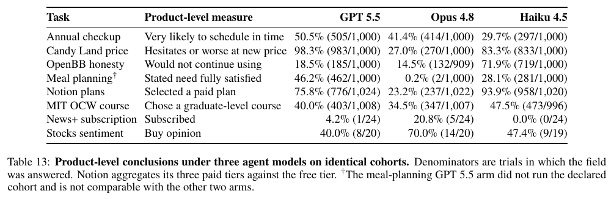

# MatrAIx: Simulating the World with 8.3 Billion Persona Agents

**Authors:** Xiaomin Li, Yuexing Hao (organizers) and 91 contributors and advisors (81 contributors, 10 advisory committee; Harvard, MIT, Stanford, Berkeley, Oxford, Wharton and others); full list in frontmatter
**Published:** 2026-08 · [arXiv 2608.04205](https://arxiv.org/abs/2608.04205) · [GitHub repo](https://github.com/MatrAIx-ai/MatrAIx-Persona-8B) · [Persona 1M dataset](https://huggingface.co/datasets/MatrAIx2026/MatrAIx_Persona_1M_Public_Release)
**Lens:** `synthetic-personas` · **Digested:** 2026-09-03

> **Source note.** The entry point was the GitHub repository (MIT licence, 1,781 stars at digest time). The primary text for this digest is the companion arXiv technical report (47 pages). Repo docs (dataset card, sampling method, validation probes, task specs) were read as a supplement for operational detail the paper leaves out.

## TLDR

MatrAIx (Harvard/MIT, August 2026; MIT-licensed code, dataset released under source-specific terms with the volunteer records under CC BY 4.0) turns persona records into LLM "users" and runs them through four test environments: surveys, chatbot conversations, live websites, and native desktop/mobile apps. Its pool holds 8.3 billion persona records described by 1,290 categorical attributes (demographics, personality, values, skills, habits, health). Synthetic records are sampled from a dependency graph of 6,999 edges so education is drawn given age and English proficiency given primary language and region, with impossible combinations blocked outright; human-grounded records are extracted from Wikipedia biographies, Amazon review histories, the Stack Overflow survey, GSS, PRISM and 355 volunteer surveys. The public release is a 1 million coreset (599,847 human-grounded, 400,000 synthetic) calibrated to UN and World Bank population shares on only four fields (age, region, gender, urbanicity), plus 1,010 reusable task specs. Across 18,189 trials on eight tasks with Claude Opus 4.8, GPT 5.5 and Claude Haiku 4.5, the dominant finding is that the model playing the persona matters more than the persona: on an identical 1,000-persona cohort run through a price-increase survey (the "Candy Land" price-sensitivity task), 98.3% hesitated under GPT 5.5, 27.0% under Opus 4.8 and 83.3% under Haiku 4.5; on a Notion pricing page, paid-plan choice ranged from 23.2% to 93.9% by model; and median Cohen's kappa between model pairs across 88 joinable fields was roughly zero. Persona attributes shifted outcomes only when directly task-relevant (trust level in a finance-chatbot task, Cramér's V 0.228 to 0.363, same ordering under all three models); stratifying 1,000 personas on economic motivation produced no detectable effect, and several survey items collapsed to one answer from every persona. Style conditioning works: in a 400-trial probe (10 attributes, 4 environments, 5 personas per pole), Opus expressed or correctly suppressed the declared trait 91.5% of the time (Survey 96%, Chat 92%, Web 95%, App 83%) versus 79.2% for GPT-5.6, with failures clustering where a persona must be ruder, more rambling or less polished than the model's default. Extracted human-grounded personas scored 4.135/5 with six human raters. None of the market-research outputs are validated against real human survey or purchase data, and the authors warn that a persona model sharing a backbone with the product under test can inflate satisfaction through self-preference. Most useful takeaway: treat the persona LLM as an experimental variable, run every study on at least two backbones, one of which does not share a backbone with the product under test, and report results per model, and capture free-text rationale next to each closed-ended answer, since persona-specific reasoning showed up in 23 of 24 app trials where the binary conversion rate showed nothing.

## Key Takeaway

The LLM behind a synthetic panel moves the result more than the personas in it do. The same 1,000 personas run through the same price-increase survey (the "Candy Land" task) hesitated 98.3% of the time under GPT 5.5 and 27.0% under Claude Opus 4.8, while splitting those personas into cost-sensitive versus premium-seeking segments produced no significant difference under any model, and across 88 joinable fields the median agreement between two models playing the identical persona was a Cohen's kappa of about zero. A 1,290-attribute profile sits on top of each model's own defaults, and the defaults win: Haiku 4.5 was the only one that reliably reported its assigned age (100%, against roughly 16%, chance level, for GPT 5.5 and Opus 4.8), and no model would play a rude persona inside the desktop-app environment (Opus 0/5 there, 10/10 in the other three environments), while GPT-5.6 would not play a long-winded one in any environment. Persona effects only surfaced where the attribute had a direct behavioral channel (trust level in a chatbot-honesty task ordered the subgroups identically under all three models), so the model is a variable to cross and report, not a setting, and a headline rate not reproduced under a second model is a hypothesis, not a finding.

## Implications

- **Treat the model behind the persona as part of the result, not a background setting**: On identical 1,000-persona cohorts and the same price-increase survey, 98.3% of GPT 5.5 personas hesitated versus 27.0% under Claude Opus 4.8 and 83.3% under Claude Haiku 4.5; on a pricing-page task the share choosing a paid plan ranged from 23.2% to 93.9% by model, and agreement between models on the same persona's answers across 88 fields was near zero (median Cohen's kappa 0.000 to 0.001). Never report a single-model figure as a market estimate: rerun any decision-relevant study under at least two models and treat disagreement as the finding. When the product under test is itself powered by the same model family as the personas, add a persona model that does not share that backbone, since a model can prefer its own output and hide friction.

- **Expect scale questions to collapse toward one or two answers**: In the price-sensitivity survey, two of five response options (stock up cheaply, walk away) were never chosen across 3,000 trials, GPT and Opus each used only two options, 100% of GPT and Opus personas picked the middle "balance" answer on price versus quality, and every Opus persona gave the midpoint on how much price matters. For Van Westendorp, MaxDiff, or Likert instruments, log the number of distinct options used and the response spread per question and compare against a human benchmark; a near-degenerate distribution means the instrument is not being simulated, no matter how large the cohort.

- **Stratify only on attributes with an obvious path to the decision, and do not rely on cohort size to rescue weak ones**: Trust level ordered four subgroups identically under all three models in a chatbot-honesty task (Cramér's V 0.228 to 0.363, all q < 1e-8), while "economic motivation" produced no significant subgroup difference in a 1,000-persona price survey under any model (cost-sensitive 18.4% versus premium-seeking 32.4% hesitation under Opus), and a 20-point life-stage gap in meal-plan adherence (66% versus 46%) also failed correction (best q across all 82 dimensions was 0.51, in an arm the authors flag for a cohort-integrity exception). Before a segmentation study, write down why the attribute should change the answer, and apply Benjamini-Hochberg correction so descriptive gaps are not reported as segment effects.

- **Run cheap adherence checks before trusting any subgroup cut**: Asked their own age band after a task, GPT 5.5 and Opus 4.8 personas matched their assigned band 16.3% and 16.9% of the time, no better than guessing (16.7%), while Haiku matched 1,000 of 1,000. Style traits were expressed or suppressed correctly in 91.5% of 400 controlled trials under Opus, but failures cluster in one direction: personas asked to be less polished than the model's default lose (impolite persona 0/5 in the app environment; the "rambling, long-winded" persona 0/5 in all four environments under GPT-5.6, which scored 79.2% overall). Add a demographic-recall question and one trait-expression probe to every run, and expect rude, terse, or low-effort respondents to be under-represented.

- **In interviews and chatbot tests, code the reasons and the conversation path, not only the final choice**: In a 24-persona live-app subscription test, conversions were 1, 5, and 0 of 24 across models with 95% intervals up to 31 points wide (upper bounds reaching 40%), so the binary outcome was unusable, yet 23 of 24 stated reasons in every arm cited something persona-specific (own language, field, or region against the catalog browsed), and price appeared in 24, 23, and 24 reasons for subscribers and decliners alike, so price salience separated nothing. In 1,000 meal-planning chats, personas kept surfacing constraints after seeing a draft (482 returns from "request plan" to "state constraints" in 500 cost-sensitive chats, over 1,000 constraint moves after the fourth move), and cost-sensitive personas moved more often from rejecting a suggestion to asking for a substitute (283 versus 204). Require a free-text rationale on every choice, tag transcripts against a fixed move vocabulary, and instruct simulated interviewees to reveal needs gradually (1 to 3 sentences per turn, no spec-sheet opening).

- **Generate personas by sampling attributes conditionally, with hard compatibility rules kept separate from statistical likelihood**: Each of 1,290 attributes is drawn given its parents (education given age; English proficiency given primary language and region) over a graph of 6,999 edges, plus 18 hidden root factors such as financial security that keep families of attributes moving together; soft likelihood adjustments make rare combinations unlikely while a separate hard mask removes impossible ones, so rare-but-valid profiles survive. Only 239,310 of 10 billion records failed the 21 contradiction rules, and calibration matched just four marginals (age, region, gender, urbanicity), not a joint distribution. For audiences built from scratch, replace independent attribute draws with parent-conditioned draws plus a short list of hard rules, state which marginals were calibrated, and do not claim joint representativeness.

- **Use the Persona 1M release as a seed pool, not as a representative panel**: The public set holds 599,847 human-grounded records (323,438 Wikipedia biographies, 97,915 Amazon reviewer histories, 113,120 Stack Overflow respondents, 63,532 GSS respondents, 1,487 PRISM, 355 volunteers) plus 400,000 synthetic records; synthetic rows are attribute-only skeletons with no text, and "human-grounded" means derived from a real source, not fact-checked (human raters scored extraction quality 4.135/5, with 84.7% of scores at 4 or 5). The human sources skew to notable people, power reviewers, and developers, and the volunteer sample is 5.8% North American and 61.8% low or lower-middle income. The Amazon reviewer subset is the most useful for consumer categories: filter cohorts from it and reweight to the target market rather than sampling the file as-is.

- **Validate against real behaviour logs, because population-scale persona work still has not**: None of the 18,189 task trials or the 400 adherence trials compares a persona's answer with what a real person did on the same task; adherence measures whether the prompt was obeyed, not whether the output resembles a human. The proposed recipe is cheap to copy: compare simulated turns with matched real transcripts on turn length, question type, volunteered versus withheld context, correction and abandonment rates, and response-option spread, then train a real-versus-simulated classifier and aim for AUC near 0.5; at the individual level, build a persona from the first half of a real conversation, simulate the second half, and score it against the actual turns with shuffled-persona and no-persona baselines. Run it per persona model, and screen public logs for conversations the model may have memorised.

## How to Apply It (method)

**Scenario:** A coffee-pod brand sells its 30-pod box at $12.99 through its own web store and in grocery. Input costs have risen and finance has proposed $16.24, a 25% increase. Before the change is announced, marketing needs three things: an estimate of what share of current buyers would hesitate, buy less often, or stop buying at the new price; whether cost-sensitive and premium-seeking buyers react differently enough to justify segment-specific messaging; and which of two draft price-change notices produces fewer walk-aways. The procedure below runs that price-sensitivity study on a cohort of about 1,000 personas drawn from the public Persona 1M coreset under a declared, seeded sampling design, executes it under two persona models from different providers, scores every response with a rules-first verifier, tests subgroup differences with the paper's statistics, and then checks that the one persona attribute the segment claim depends on actually changes behaviour. The same recipe extends to a support-chatbot test of how buyers react when they complain about the increase.

**Steps:**

1. **Install the runtime and import the persona coreset**: Clone `MatrAIx-ai/MatrAIx-Persona-8B` (MIT licence), install with `uv`, pull the 1M coreset from Hugging Face, and confirm the Survey lane works with the no-key smoke test. The checked-in dev sample (~200 personas) is for smoke only and undershoots narrow filters; real cohorts must come from the 1M import.

   ```bash
   git clone <repo-url> && cd MatrAIx
   uv venv --python 3.12
   uv pip install -e .
   uv pip install -e packages/playground
   huggingface-cli download MatrAIx2026/MatrAIx_Persona_1M_Public_Release \
     --repo-type dataset --local-dir persona/datasets/matraix-persona-1m/release
   uv run matraix smoke application/tasks/example-survey_product-feedback   # prints "Smoke: ok"
   export ANTHROPIC_API_KEY="sk-ant-..."    # persona model, provider A
   export OPENAI_API_KEY="sk-..."           # persona model, provider B
   ```

   What is in the coreset: 999,847 rows, 599,847 human-grounded (Wikipedia 323,438; Stack Overflow survey 113,120; Amazon review histories 97,915; GSS 63,532; PRISM 1,487; consented volunteer survey 355) plus 400,000 synthetic. Every row carries the same 1,290 categorical attributes (background, psychology, capability, behaviour, lifestyle). Human-grounded rows have natural-language descriptions per populated attribute and leave unsupported attributes null; synthetic rows are complete skeletons with no descriptions. The coreset is calibrated to 2024 global UN/World Bank marginals on four fields only: `age_bracket`, `region`, `gender_identity`, `urbanicity`. It is not a probability sample of any national market.

2. **Declare the target audience as a schema query, not a prose brief**: Write the cohort as filters over schema dimensions, name the fields to stratify on, fix the sample size, fix the seed, and state the null policy (a human-grounded persona with the stratification field missing is ineligible; nothing is imputed). For a US grocery buyer this means filtering `region` to North America rather than relying on the global marginals. Stratify on the dimension the segment claim depends on (`economic_motivation`, the four segments the paper stratified on, including Cost-sensitive and Premium-seeking) crossed with `socioeconomic_band` (Low, Lower-middle, Middle, Upper-middle, High). Target about 1,000 personas, which is what the paper used per model arm for Survey tasks. In the Playground: choose Dataset `matraix-persona-1m`, choose Stratified, set filters and strata, Pull cohort, then Save cohort (frozen id list under `persona/datasets/saved-cohorts/<id>/cohort.json`). On the CLI the same declaration lives in the task's `persona_strategy.json`; shape below is illustrative, copy the reference task's file and edit it.

   ```json
   {
     "dataset": "persona/datasets/matraix-persona-1m",
     "dimensionFilters": {
       "region": ["North America"],
       "age_bracket": ["25-34", "35-44", "45-54", "55-64"],
       "economic_motivation": ["Cost-sensitive", "Value-balanced", "Quality-first", "Premium-seeking"]
     },
     "sampling": { "mode": "stratified", "stratify": ["economic_motivation", "socioeconomic_band"],
                   "sample_size": 1000, "seed": 20260903, "null_policy": "exclude_if_stratum_unknown" }
   }
   ```

   If a stratum comes back thin, fill it with synthetic personas pinned to that cell (`uv run python persona/scripts/generate_dev_personas.py --strategy application/tasks/<task>` or `--filter economic_motivation=Cost-sensitive --count 200`). These are raw DAG draws: each attribute is sampled after its parents as prior x source-informed likelihood ratio x compatibility mask, `p(X_i = v | parents) ∝ π_i(v) · r_i(v; parents) · m_i(v; parents)`, so age-education, region-language and similar dependencies hold, but they skip the quality filter, dedup and calibration that the published coreset went through. Record the split of human-grounded vs synthetic in the run notes.

3. **Author the task from the reference survey task**: Every study is a versioned directory with six parts: task metadata (`task.toml`), the persona-facing scenario (`instruction.md`), the stimulus and questionnaire (`input/`), the cohort strategy (`persona_strategy.json`), the verifier, and the reporting policy (`reporting.json`). Product credentials and scoring rules never go in the persona instructions.

   ```bash
   cp -R application/tasks/example-survey_product-feedback \
         application/tasks/survey_coffee-pod-price-increase
   ```

   `instruction.md` (persona-facing; the runtime prepends the sampled persona record as the identity):

   ```
   You are the person described in the attached persona record. Stay in character.
   Answer as that person would given their income, habits and priorities. Do not
   describe the persona; just answer.

   SITUATION
   You currently buy a 30-pod box of this coffee at $12.99. Today the store page
   shows this notice: "[NOTICE_VARIANT]". Nothing about the product has changed.

   TASK
   Complete every item in input/questionnaire.yaml with a value from its allowed
   set. For the rationale item write 2-4 sentences in your own words. Refer to
   your own situation (budget, the alternatives you would actually consider, how
   much this product matters to you), not to consumers in general.
   ```

   `input/questionnaire.yaml`. Two design rules taken from the paper's own price-sensitivity run: give no neutral midpoint or "balance" option (its price-versus-quality item was answered "balance" by 100%, 100% and 98.4% of personas across three models, and every Opus persona picked the midpoint on the price-importance item, so those fields carried no information), and make the rationale a required field the verifier can check.

   ```yaml
   items:
     - id: q_threshold
       type: single_choice
       required: true
       prompt: "At $16.24 per box, what would you most likely do?"
       options: [stock_up_before_increase, buy_as_usual, hesitate_then_decide, buy_less_often, walk_away]
     - id: q_max_price
       type: number
       required: true
       prompt: "What is the highest price per box you would still pay? (USD)"
     - id: q_switch_target
       type: single_choice
       required: true
       prompt: "If you cut back, where does that money go instead?"
       options: [cheaper_pod_brand, ground_or_instant_coffee, cafe_or_office, nowhere_i_keep_buying]
     - id: q_rationale
       type: text
       required: true
       min_chars: 120
       prompt: "In 2-4 sentences, why?"
   ```

4. **Write the verifier rules-first, then add a judge only where rules cannot decide**: The verifier converts each trial's submission into typed findings (numeric, categorical, boolean, text), each linked to the artifact that supports it. Objective checks come first and run without a model; a judge directive is declared in `reporting.json` only for interpretive properties and its outputs stay labelled as judge-derived. Map findings into the shared `task_outcome` context (`outcome_status`, `goal_completion_ratio`, `verifier_mode`, `primary_failure_reason`, `outcome_explanation`); in the repo this contract is defined for web and os-app tasks, so reuse the same names for a Survey task so reports aggregate.

   ```
   rules:
     required_present: [q_threshold, q_max_price, q_switch_target, q_rationale]
     q_threshold in options
     q_max_price numeric, 0 < value < 100
     q_rationale length >= 120 chars
     q_rationale mentions at least one of {"$", "price", "cost", "budget", "16"}   # rationale is about the decision
   task_outcome.outcome_status = pass only if all rules hold; otherwise fail with primary_failure_reason
   findings emitted: q_threshold (categorical), q_max_price (numeric), q_switch_target (categorical),
                     q_rationale (text, keyed by persona id and stratum)
   optional judge directive: theme-tag q_rationale into {price, habit, alternatives, brand_loyalty, quality}
                             with a verbatim quote per tag
   ```

5. **Generate the job and run it under two persona models with different backbones**: One trial is the tuple (persona, task, agent interface, model, seed); a job replicates it over the seeded cohort, trials share no state, and the run manifest stores the requested population, the realized cohort, the task version and the model. Generate the recipe, run it, then regenerate with a second provider's model and rerun on the identical cohort. This is the paper's most important operating rule: on identical cohorts and an identical price-increase brief, the share answering "hesitate" was 98.3% under GPT 5.5, 27.0% under Claude Opus 4.8 and 83.3% under Claude Haiku 4.5, and the paid-plan share on a pricing page spanned 23.2% to 93.9%. A single-model result is not a result. Failed or missing trials stay in the accounting and are never back-filled after results are seen.

   ```bash
   uv run python application/scripts/generate_application_job.py \
     --task application/tasks/survey_coffee-pod-price-increase \
     --execution-mode auto \
     --dataset persona/datasets/matraix-persona-1m \
     --sample-size 1000 \
     --model-name anthropic/claude-sonnet-4-6
   uv run matraix run -c configs/jobs/application-task-job-recipe/survey-coffee-pod-price-increase-auto-n1000.yaml

   # second arm: same task version, same cohort ids, different provider
   uv run python application/scripts/generate_application_job.py \
     --task application/tasks/survey_coffee-pod-price-increase \
     --execution-mode auto --dataset persona/datasets/matraix-persona-1m \
     --sample-size 1000 --model-name openai/gpt-5.5
   uv run matraix run -c configs/jobs/application-task-job-recipe/<generated>.yaml
   ```

6. **Aggregate deterministically before any model touches the results**: `uv run matraix results <job>` reports launched, completed, failed and valid-finding counts, distribution statistics for numeric findings, ranked frequencies for categorical findings, and text samples grouped by outcome. Use the answered denominator for every rate (the paper's OpenBB run had 980 usable trials of 1,000 under one model and reports 132/909 for one field). Put a 95% Wilson interval on every proportion:

   ```
   p = k / n,  z = 1.96
   centre    = (p + z^2 / (2n)) / (1 + z^2 / n)
   halfwidth = z * sqrt( p(1-p)/n + z^2/(4n^2) ) / (1 + z^2 / n)
   ```

   With 24 trials, 5 subscribers gives [9.2%, 40.5%]; with 1,000 trials the same 20.8% gives roughly [18.4%, 23.4%]. Binary outcomes need the large cohort; small cohorts are only useful for free text.

7. **Test the segment claim, then test whether it survives a change of model**: For each persona dimension compute Cramér's V against the primary outcome, run one omnibus chi-squared test across arms rather than picking a pair after looking, and control multiplicity with Benjamini-Hochberg within the declared family of tests. Then rank the subgroups by outcome rate separately under each model and compare orderings with Spearman's rho and an exact permutation p (four groups gives 24 orderings, so rho = 1.0 has p = 0.042).

   ```
   Cramér's V = sqrt( chi2 / ( n * (min(rows, cols) - 1) ) )
   BH: sort p(1) <= ... <= p(m); k* = largest k with p(k) <= (k/m) * alpha;
       declare tests 1..k* significant; q(j) = min over i >= j of m * p(i) / i
   Spearman rho between the two arms' subgroup rank vectors; report exact p over all permutations
   ```

   Decision rule: a segment difference is reportable only if it is significant after BH under each model AND both models order the segments the same way. The paper's price-sensitivity run is the cautionary case: 1,000 personas stratified on economic motivation, yet the four segments spanned only 80.4% to 86.0% hesitation under one model and 97.2% to 99.2% under another, economic motivation was not significant under any arm, and the cross-model rank correlations were -0.40, -0.20 and +0.80, none distinguishable from chance. The positive case is a chatbot-honesty task where trust level separated four subgroups under all three models (V = 0.228 to 0.363, all q < 10^-8) with an identical ordering, probability 0.0017 by chance. Persona effects show up when the task gives the attribute a direct behavioural channel.

8. **Check for response collapse and mine the free text**: Count option support. In the paper's five-option price item, two options (stock up, walk away) were never selected by 1,000 personas and two models each used only two of five options. Any option with zero support across a 1,000-trial arm is a flag on the instrument or on the persona model, not a finding about buyers. Then theme-tag the rationales. In the paper's iOS subscription task the binary outcome was too sparse to use (1, 5 and 0 subscribers out of 24) but 23 of 24 free-text reasons in every arm cited something specific to the persona's own field, language or region against the catalogue it actually browsed; price was named by 24, 23 and 24 respondents, so it separated nothing. Expect the same here: price will appear in almost every rationale, so tag for what else appears (habit strength, named alternatives, brand attachment, household budget pressure) and cross-tab those tags by stratum.

9. **Run a persona-adherence probe on the attribute the study depends on**: This is the paper's controlled check that a declared attribute drives behaviour rather than just sitting in the prompt. Build two cohorts of five: positive personas declaring `economic_motivation = Cost-sensitive`, negative personas declaring `Premium-seeking`, drawn by stratified sampling on that single attribute with everything else left at the population distribution. Give them a neutral task that never names the attribute's direction. An LLM judge reads only the produced text and returns a binary verdict with a verbatim quote. A positive persona succeeds if the declared value is expressed; a negative persona succeeds if the opposite value is expressed (the target was correctly suppressed). A cell is strong when both arms score at least 4/5. The shipped validation matrix covers only the paper's ten style attributes, so first generate a probe task for the new attribute (`gen_survey_tasks.py`), then run:

   ```bash
   python persona/validation/scripts/run_matrix.py --attrs economic_motivation --envs survey --n 5
   # or judge an existing job directory:
   python persona/validation/scripts/judge_adherence.py jobs/<job> \
       --attribute economic_motivation --value "Cost-sensitive"
   python persona/validation/scripts/build_report.py
   ```

   Judge prompt (one verdict per trial):

   ```
   You are auditing whether a simulated survey respondent behaved in line with one
   declared attribute. Judge behaviour only; do not use the persona profile.
   Attribute: economic_motivation
   Declared value for this respondent: Cost-sensitive
   Opposite value: Premium-seeking
   TEXT PRODUCED BY THE RESPONDENT:
   [answers and rationale]
   Return JSON: {"expressed": "declared" | "opposite" | "neither",
                 "evidence": "<exact quote from the text that shows it>"}
   A verdict of "declared" or "opposite" is invalid without a verbatim quote.
   ```

   Reference numbers: across 10 attributes x 4 environments x 10 personas the declared behaviour was expressed or correctly suppressed in 366/400 trials (91.5%) with Claude Opus 4.8 acting, 317/400 (79.2%) with GPT-5.6; Survey was the cleanest environment (96 of 100). Suppression fails more than expression (181/200 vs 185/200): personas asked to be less polished, ruder or more rambling than the model's own default lose to the model's prior (politeness suppressed in 0/5 app trials, meaning no persona told to be impolite managed it; GPT produced the "rambling" persona in 0/5 trials in every environment). Attributes that map to a concrete, structured behaviour (comment style, naming) transferred at 91-100% across both models; soft stylistic ones at 73-88%. Report the negative arm separately; it is the arm that exposes where conditioning stops working.

10. **A/B the price-change notice with cohort, seed and task version held fixed**: Change only `[NOTICE_VARIANT]` in `instruction.md` (for example a bare price line versus a line that names the input-cost reason and a loyalty discount), bump the task version, rerun the same frozen cohort ids under both persona models, and compare walk-away and buy-less-often shares with Wilson intervals and a chi-squared test across variants. Because trials are seeded and the cohort is re-drawable, the comparison isolates the stimulus. Repeat with the questionnaire unchanged after any product or copy change to track movement over versions.

11. **Extend to the support-chatbot environment for the complaint journey**: Attach the brand's support bot as a REST or MCP sidecar in the chat reference task (`application/tasks/example-chat-api_support_chatbot`), set the user goal ("find out whether the increase applies to existing subscribers and what to do about it"), and add post-run self-report questions in `input/self_report_schema.yaml` using the shared `user_feedback` facets so results aggregate alongside other tasks. The persona agent follows the runtime's user-simulation guidelines, which are the behaviours the paper argues interactive simulation must reproduce (disclosure, correction, refusal, abandonment); note the paper states it has not measured whether the resulting behaviour resembles real users:

    ```
    You are a human end-user in a multi-turn chat with a support assistant.
    - Send one message per step with send_message. Keep it to 1-3 sentences in plain
      end-user language. No essays, no analysis of the system.
    - Open with a realistic, incomplete request. Do not reveal every constraint at once;
      share details gradually, as the conversation calls for them.
    - React to the assistant: if the answer fits, say so; if not, push back, refine, or
      ask a clarifying question. Do not invent prices, policies or product facts the
      assistant did not state.
    - When your goal is met call end_conversation with reason "satisfied". If you would
      quit in real life use "give_up". Use "out_of_scope" or "transferred" when the
      chat is no longer productive.
    ```

    ```yaml
    # input/self_report_schema.yaml
    questions:
      - id: overall_experience_rating        # 1-5
      - id: feedback_reason                  # free text
      - id: need_constraint_satisfaction     # yes / partially / no
      - id: trust_level                      # 1-5
      - id: effort_rating                    # 1-5
      - id: clarity_of_next_step             # yes / no
      - id: would_still_continue_use         # yes / unsure / no
    ```

    Raw answers land in `user_feedback.json`; map them into the `user_feedback` context in `verifier/structured_output.json`. Analyse the transcript as a move-transition graph (open goal, state constraint, push back, ask substitution, flag error, accept and close, end reason); in the paper's meal-planning chat the average conversation ran about six exchanges and fourteen moves, personas kept adding constraints after seeing a first answer (482 returns from "request plan" to "state constraints" in 500 cost-sensitive conversations), and cost-sensitive personas routed more often from "reject as unrealistic" to "ask substitution" (283 vs 204) while premium-seeking ones spent more turns on formatting and eating out. "Would not continue using" in the chatbot-honesty task ranged from 14.5% to 71.9% by persona model, so run this under two models as well. One extra rule for this environment: always add at least one persona model that does not share a backbone with the support bot, and treat the shared-backbone arm's result as a hypothesis, since a favourable result there cannot be separated from a model preferring its own output.

12. **Optional: calibrate a mixed human-grounded plus synthetic cohort to a target population**: When the cohort blends human-grounded rows with synthetic rows and must hit known marginals (say, a client's customer base by age and urbanicity), use the coreset's own method rather than quota-filling. Human rows are taken as they are; synthetic rows fill the residual; missing values get no update and are never imputed.

    ```
    residual target for value v of dimension d:   r_dv = p_dv * (H_d + n_syn) - h_dv
        (p_dv = target share, H_d = human rows with d known, h_dv = human rows with value v;
         negative residuals clip to 0 and the clipped mass is reported as infeasible)
    shared weight update, cycled age, region, gender, urbanicity in turn, up to 200 sweeps:
        w_i <- w_i * T_dv / E_dv   for candidates with x_id = v
        E_dv = sum over those candidates of pi_i,   pi_i = 1 - exp(-t * w_i),   t solved so sum pi_i = n
    exact-size draw (order-independent, reproducible from seed + stable row id):
        q_i = -log(U_i) / w_i ; keep the n smallest q_i
    ```

    Worked example from the dataset card: a 60/40 target on a field known for 500,000 human rows, of which 350,000 are A and 150,000 are B, with 400,000 synthetic rows to add, gives synthetic targets of 190,000 A and 210,000 B (47.5%/52.5%), so the combined pool lands on 60/40. Report target vs achieved share, absolute error and clipped mass per dimension, as the coreset's `audit.json` does.

13. **Apply the paper's interpretation rules before anything reaches a decision**: Record the persona model as part of every result, never as a footnote. Treat any rate as hypothesis-generating: it is a persona-agent result, not a claim about people, and models agreed near zero on paired answers (median Cohen's kappa across 88 joinable fields was 0.000, 0.000 and +0.001 across the three model pairs; two of three models matched their own persona's age band at chance, 16.3% and 16.9% against 16.7%). Before the price change is decided, run the same questionnaire on a human panel drawn to the same strata and compare on the same instrument; the paper's own human check used 100 records, six raters each, with 97.2% of rater-rater scores within one point and its better LLM judge within one point of the human mean in 93.8% of comparisons, which is the bar an LLM-scored free-text theme should meet before it is trusted unsupervised.

**Expected outcome:** A versioned task directory that anyone can rerun, a frozen cohort of about 1,000 schema-typed personas with the requested and realized composition on record, and two complete result sets (one per persona model) giving the share of buyers who hesitate, buy less often or walk away at $16.24, each with a Wilson interval and answered denominator, a distribution of stated maximum prices per box, and a switch-destination breakdown. A subgroup table showing whether economic motivation and income band move the outcome, with BH-corrected q-values and a cross-model rank agreement that says whether the segment story holds up or is an artifact of one model. A theme-tagged rationale set that shows what buyers name besides price, which is where the persona signal is most likely to live. A ten-persona adherence probe on `economic_motivation` that states, per arm, whether cost-sensitivity is actually expressed and whether premium-seeking suppresses it. And, if the notice A/B and the chatbot extension are run, a like-for-like comparison of two message variants and a transcript-level map of how buyers push back on the support bot, each under two models. Together these decide whether the segment-specific messaging is worth building, which notice wording to test with real buyers, and what a human validation panel must look like before the price change is committed.

## Best Figure



```
Image Candidates:
Figure 3 (p. 11): Grid of 10 behavioral attributes by 4 environments showing how often persona agents actually expressed or suppressed their assigned trait (366/400, 91.5%), the paper's headline validation result.
Table 13 (p. 40): Same 1,000-persona cohort, same task, three different LLMs playing the personas, and the product conclusion swings from 27% to 98% hesitation on a price rise and 23% to 94% choosing a paid plan.
Table 20 (p. 45): The only place real humans enter the validation: six human raters versus two LLM judges on whether 100 extracted persona profiles faithfully reflect their source material (human mean 4.135/5; Claude within one point of humans 93.8% of the time, GPT 79.2%).

Best Image:
Figure Name: Table 13: "Product-level conclusions under three agent models on identical cohorts"
Figure Page: 40
Slide Caption: Identical persona cohorts produce opposite business conclusions depending on which LLM plays the persona: paid-plan uptake ranges from 23% to 94% and price-rise hesitation from 27% to 98%.
Description: Table 13 lists eight simulated research tasks (a health survey, a price-sensitivity survey, two chatbot studies, two website studies, two native-app studies) and reports one product-facing metric per task under three persona-agent models, GPT 5.5, Claude Opus 4.8 and Claude Haiku 4.5, each run on the same sampled cohort of roughly 1,000 personas (24 and 20 for the app tasks; the meal-planning task is the exception, where the GPT 5.5 arm failed the cohort check and each model drew its own cohort), with numerators and answered denominators shown. The comparison isolates the effect of the model that voices the persona, holding the personas, the stimulus and the verifier fixed. The spread is large: 98.3% of GPT personas hesitate at the new price in the Candy Land price-sensitivity task versus 27.0% under Opus; 93.9% of Haiku personas pick a paid Notion plan versus 23.2% under Opus; 71.9% of Haiku personas would stop using the OpenBB chatbot in the honesty task versus 14.5% under Opus. Page 40 also carries Table 12, which confirms these gaps are statistically significant after correction on seven of eight tasks. The table matters because it shows the persona model is a first-order variable in any synthetic study, not an implementation detail: a single-model run can support either side of a go/no-go decision, so headline rates need cross-model replication and human calibration before they are used.
```

## What Experts Overlook

The synthetic 8.3 billion records in Persona 8B stay internally coherent without collapsing into stereotypes because the sampler treats "unlikely" and "impossible" as two different objects, and then deliberately limits how hard many agreeing attributes can push a single downstream attribute. Equation 4 (Section 3.2) scores each candidate value as prior x dependency adjustment x compatibility mask. The adjustment is a multiplier saying how much more or less common a value becomes once a parent attribute is known (Table 6 walks through it with an illustrative worked example, not the deployed parameters: knowing primary language is English and region is North America lifts "Native" English proficiency from a 15% prior to 75%). It can make a value rare but never removes it. The mask is a 0/1 switch, collected during the same three review passes but recorded as a separate object, that removes only combinations a rule asserts cannot exist (an English-primary speaker with no English, a child with an adult work history). Appendix C.1 states the design rule plainly: "Statistical rarity is represented only by r_i, so a rare but admissible combination is not penalized again by the mask," and adds that association and prohibition are "never entered as the same object" so each can be audited independently. The repository's sampling-method doc adds the piece the paper leaves implicit: every node's parent contributions are multiplied by a shrinkage factor gamma = 1 / max(1, sqrt(sum of squared edge weights)), which "keeps dense multi-parent nodes from becoming too sharp," and masks come in three grades (hard guards with multiplier 0, soft downweights, and applicability gates). The scale makes this load-bearing: 1,308 nodes, 6,999 edges (about 5 parents per node on average, with some nodes reaching a directed degree in the hundreds, mostly the fan-out of the 18 latent root factors), 54 full conditional tables, 524 conditional masks. The evidence it works: the 21 post-hoc contradiction rules rejected only 239,310 of 10.0 billion records (about 24 per million), a 10,000-row audit found zero hard consistency issues, and low-prior values survived sampling rather than being squeezed out (Self-described gender 0.33% sampled vs 0.20% prior; Non-binary 0.26% vs 0.30%).

**Why it matters:** The paper's own justification for simulated users is that "even an imperfect but diverse simulated population can expose corner cases, subgroup-specific friction, and failure modes." Corner cases live in the tail, meaning the rare-but-real combinations. A single "plausibility" dial cannot protect the tail and kill contradictions at the same time: turn it up and the low-income premium buyer disappears alongside the impossible 12-year-old primary purchaser; turn it down and both come through. Splitting tendency from prohibition is what lets a population be clean and wide simultaneously. The shrinkage term addresses a second, easily missed failure: multiplying five, ten or twenty agreeing parent effects drives richly conditioned attributes to near-certainty, which is the graph-level version of the stereotype amplification and flattened within-group variation the related-work section warns about (Santurkar et al. 2023; Wang et al. 2025a). Keeping the two mechanisms separate also makes them fixable: a wrong tendency can be re-estimated from a better source without touching a rule, and a wrong rule can be deleted without disturbing the statistics. The same paper also shows population coherence is necessary but not sufficient: on identical cohorts the persona-agent model alone moved a paid-plan share from 23.2% to 93.9%, so a clean audience does not by itself make outputs trustworthy.

**Example of good use:** A 2,000-persona audience built for a Van Westendorp price test on a premium home-espresso machine. Household income, urbanicity and coffee-consumption frequency are wired to the four price-threshold questions as soft multipliers estimated from a consumer-expenditure table, so low-income personas are less likely, not unable, to call 600 GBP "acceptable." Hard masks are reserved for genuine impossibilities only: no "current owner" for a persona in shared accommodation without a kitchen, no "primary household purchaser" under 16. Each rule is tagged as either tendency or prohibition in the rules file, and the combined push from many agreeing parents is shrunk so a persona who is urban, 25-34, high-income and a daily drinker lands at roughly 70-80% acceptance rather than 99%. The audience keeps the low-income daily drinker who budgets for coffee gear (a real segment a plausibility filter deletes), the four price curves show their true spread instead of a compressed band, and when a curve looks wrong the analyst can check whether a tendency or a prohibition produced it.

**Example of misapplication:** The same price test built with one "consistency score" per persona, produced by asking an LLM "does this profile make sense?", thresholded at 0.7, and applied as a single multiplier to every attribute. Three things break. First, rare-but-real profiles are cut with the same blade as impossible ones: "low income and owns a 600 GBP machine" scores about as low as "age 12 and primary purchaser," so the aspirational and enthusiast tails vanish, the price-sensitivity curves compress toward the middle, and the recommended price point comes out below what the market would bear. Second, with no shrinkage, every persona that is urban, high-income and a daily drinker is multiplied toward "acceptable" by each attribute in turn, so the cohort behaves like a handful of clones and the response distribution degenerates the way the paper's Candy Land task did, where 100% of GPT 5.5 and Opus 4.8 personas chose the same price-versus-quality option and stratifying 1,000 personas on economic motivation produced no detectable segment difference. Third, because tendency and prohibition were fused into one number, nobody can tell afterwards which decision removed a segment, so the result cannot be corrected without rebuilding the audience from scratch.

## Extracted Prompts

The paper reproduces very few prompts verbatim; most of its prompt scaffolding (persona-to-instruction materialisation, the 50-dimension chunked extraction judge, the binary adherence judge) is described only in prose. The items below are the verbatim text that does appear in the paper, plus the two prompt-grade artefacts in the open-source repo.

**Prompt explanation:** (paper) Section 5.3 / Figure 2: two of the eight post-conversation self-report questions the persona agent answers in the meal-planning chatbot task (the first is the declared primary outcome); the other six items are not reproduced in the paper.

```
How likely are you to follow the meal plan from 1 to 10? (1–10)
How well did the meal plan satisfy your core dietary constraints and health goals? (yes / partially / no)
```

**Prompt explanation:** (paper) Appendix J.1, Table 18: the five-metric extraction-quality rubric that Appendix J.2 says was included, byte-identical, in the prompts sent to the GPT-5.5 and Claude judges together with each extracted persona card (field, value, evidence, description, assignment type); the surrounding prompt scaffolding is not reproduced in the paper.

```
Extraction-quality metrics. Higher scores indicate better extraction quality.

M1 Claim validity: Does each populated claim remain defensible when its value, cited evidence, and free-text description are considered jointly? A field is problematic if its value is indefensible, its evidence is plainly unrelated or non-supporting, or its description adds implausible unsupported specifics.

M2 No over-claiming: Has an attribute been populated without any plausible basis? Clearly unsupported assignments count as problems, while a plausible, appropriately labeled inference does not.

M3 Coverage: Did the extraction omit an important attribute that was clearly available in the source?

M4 Internal consistency: Do extracted fields contradict one another, especially on core identity, role, region, life stage, language, or technology-use information?

M5 Overall fidelity and plausibility: Is the extracted record usable for faithfully role-playing the source person, and are its inferred psychological, interest, and communication traits plausible and coherent?
```

**Prompt explanation:** (repo: `packages/playground/src/playground/user_sim/sim_guidelines.md`) System guidelines for the persona user-simulator agent in the AI Chatbot environment: how to behave as a human end-user, disclose needs progressively, and end the conversation via tools.

```
# User guidelines

You are a human end-user in a multi-turn chat with an application.

## Behavior

- Send **one** user message per step using the `send_message` tool.
- Keep messages short and natural (usually 1-3 sentences).
- Prefer plainspoken end-user language over analytical or essay-like wording.
- Do not explain your hidden reasoning, critique the system at length, or write monologues unless you truly would.
- React to the agent: if recommendations or answers fit, say so; if not, push back, refine, or ask clarifying questions.
- Do not invent product facts, prices, or capabilities that were not mentioned by the agent.
- If the agent returns an error or empty reply, acknowledge it briefly and retry or rephrase.

## Progressive disclosure

- **Do not reveal everything at once.** Share needs gradually, as you would in real life.
- Open with a realistic, incomplete request — not a full spec sheet.
- Answer follow-up questions naturally before volunteering extra constraints.
- Let who you are and the task guide which details matter, but still reveal them gradually.

## Ending

- When your goal is met, call `end_conversation` with reason `satisfied`.
- If the agent cannot help and you would quit in real life, use `give_up`.
- Use `out_of_scope` or `transferred` when the conversation is no longer productive for your goal.
- Prefer `end_conversation` over typing stop tokens in the message body.

## Tools

- Use exactly one primary action per step: `send_message` or `end_conversation`.
- Only text passed to `send_message` is shown to the application chatbot.
```

**Prompt explanation:** (repo: `persona/human_extraction/docs/EXTRACTION_QUALITY_RUBRIC.md`) Seven-metric LLM-judge rubric for scoring Qwen3.6-35B persona extractions against the source profile, plus the required structured JSON output contract; the file states the judge is given the source profile, the extracted fields, and this rubric. Human-annotator notes and the placeholder worked example are omitted as non-prompt prose.

````
# Persona Extraction: Extraction-Quality Rubric

**Purpose.** Score how well an automatic extraction (the Qwen3.6-35B persona extractor) turned a
*source profile* into structured persona *fields*. One rubric, two raters: an **LLM judge** and
**human annotators** apply the *same* seven metrics and the *same* 1–5 Likert scale, so their scores
are directly comparable and we can measure agreement.

**Unit of scoring.** One extracted persona record at a time. The rater sees two things:

- the **source profile** (the ground truth; everything is judged against this), and
- the **extracted fields**, each with `field_id`, `value`, `evidence`, `assignment_type`, `confidence`.

**Order of work (top to bottom):**

1. **Step 1 (quality of what it extracted, field by field):** M1 value → M2 evidence → M3 description
2. **Step 2 (did it extract the right set, whole record):** M4 over-claim → M5 coverage
3. **Step 3 (coherence & gut check):** M6 consistency → M7 overall

Each metric looks at a **different part** of the record: M1–M3 judge the `value` / `evidence` /
`description` fields, M4–M5 judge the *set* of attributes, M6 judges *across* fields, and M7 judges
the whole.

## The 1–5 Likert scale (shared by every metric)

| Score | Meaning | Rule of thumb |
|:--:|---|---|
| **5** | No problem | nothing a careful reader would flag |
| **4** | Minor issue | cosmetic; does not mislead |
| **3** | Moderate issue | a few clear errors; usable only with caution |
| **2** | Major issue | many or serious errors; misleading |
| **1** | Completely wrong | unusable for this person |

Each metric below spells out the five levels concretely. Use `n/a` when a metric does not apply to a
record (for example, M3 when the record has no `description` field).

## Metrics

### Step 1: quality of what it extracted (look at each field)

**M1. Value accuracy** (for attributes the profile supports, is the `value` in the right bucket?)
- **5:** almost all values correct
- **4:** one or two borderline-bucket slips, nothing that misleads
- **3:** several values in the wrong bucket
- **2:** many wrong, some plainly contradict the profile
- **1:** values broadly contradict the profile
- *Example:* profile says "born 1809, died 1865", so `age_bracket = 55–64` fits (56 at death) and scores 5; `age_bracket = 25–34` is a wrong bucket and pulls M1 down.

**M2. Evidence grounding** (is each `evidence` a real span from the profile that supports the value?)
- **5:** quotes are present in the profile and genuinely support the value
- **4:** mostly grounded; a couple of weak-but-not-wrong quotes
- **3:** some evidence weak, loose, or only tangentially related
- **2:** much evidence fabricated or mismatched to its value
- **1:** evidence largely missing or fabricated
- *Example:* for `urbanicity = Rural`, evidence "Born in a one-room log cabin in Kentucky" supports it (5); evidence "led the United States" says nothing about rural/urban, so it is mismatched and scores low.

**M3. Description faithfulness** (does any `description` / free text invent or exaggerate?)
- **5:** concrete, accurate, traceable to the profile
- **4:** minor vagueness, no invention
- **3:** some vague or mildly exaggerated detail
- **2:** notable invented or exaggerated detail
- **1:** fabricates detail or contradicts the profile
- *Example:* description "self-educated frontier lawyer" is traceable to the profile (5); "beloved by all Americans, never told a lie" exaggerates beyond it and scores low.
- *(score `n/a` if this record has no `description` field)*

### Step 2: did it extract the right set (step back to the whole record)

**M4. No over-claiming** (did it assign values to attributes the profile does *not* support?)
- **5:** nothing invented; unsupported attributes left null
- **4:** a single thin-evidence call
- **3:** a few over-claims on thin evidence
- **2:** several hallucinated attributes
- **1:** many hallucinated attributes
- *Example:* the profile never mentions marriage, so `demo_marital_status = null (unsupported)` is correct (5); filling `demo_marital_status = Married` with no evidence is an over-claim and scores low.

**M5. Coverage** (did it miss attributes the profile clearly states?)
- **5:** almost everything the profile states is captured
- **4:** caught the obvious, missed one or two
- **3:** got the obvious, missed some
- **2:** missed a lot of clearly stated attributes
- **1:** misses most of what the profile states
- *Example:* the profile clearly states his occupation ("became a lawyer", "president"); capturing `occupation` scores well, leaving it empty despite that clear statement lowers coverage.
- *(judge on the full record, not on a short field excerpt)*

### Step 3: coherence & gut check

**M6. Internal consistency** (do fields contradict each other? age ↔ generation ↔ life_stage, job ↔ region, …)
- **5:** fully coherent, all fields fit one person
- **4:** one very mild tension
- **3:** one or two mild tensions
- **2:** a clear contradiction between fields
- **1:** fields clearly contradict each other
- *Example:* `age_bracket = 55–64` with `life_stage = Adolescent`, or `region = North America` with `nationality = Japanese`, are contradictions and score low; fields that all fit one person score 5.

**M7. Overall fidelity** (could you faithfully role-play this person from the record?)
- **5:** faithful and usable as-is
- **4:** broadly right, a couple of harmless errors
- **3:** broadly right, several misleading errors
- **2:** distorted in important ways
- **1:** seriously distorted, not this person
- *Example:* from the example record below you could plausibly role-play a 19th-century American statesman (5); if half the fields were wrong or invented, you would be role-playing a different person, which scores low.

> **Note on M7.** It is a deliberate summary gut-check, so it will correlate with M1–M6. For a more
> *independent* seventh signal, swap it for **Assignment-type correctness**: is each field labeled
> `direct` / `summary_inference` / `structured_claim` / `unsupported` correctly? (same 1–5 scale).

**LLM judge.** Give it the source profile, the extracted fields, and this rubric, and require a
**structured** result: one JSON object, one entry per metric, each with a `score` and a short `reason`
that cites the field(s) or profile span that drove it.

```json
{
  "M1_value":       {"score": 5, "reason": "..."},
  "M2_evidence":    {"score": 4, "reason": "..."},
  "M3_description": {"score": "n/a", "reason": "no description field"},
  "M4_overclaim":   {"score": 5, "reason": "..."},
  "M5_coverage":    {"score": 3, "reason": "..."},
  "M6_consistency": {"score": 5, "reason": "..."},
  "M7_overall":     {"score": 4, "reason": "..."}
}
```
````

## Citations

113 references extracted (full structured list in frontmatter). Roughly half are the public statistical data sources the persona schema's priors are drawn from (UN, World Bank, OECD, GSS, Pew, ACS PUMS, World Values Survey and similar). The ten scholarly references most relevant to synthetic-audience work:

- Argyle et al. (2023) · Out of one, many: Using language models to simulate human samples. *Political Analysis*
- Santurkar et al. (2023) · Whose opinions do language models reflect? *ICML*
- Wang, Morgenstern & Dickerson (2025) · Large language models that replace human participants can harmfully misportray and flatten identity groups. *Nature Machine Intelligence*
- Park et al. (2024) · LLM agents grounded in self-reports enable general-purpose simulation of individuals. arXiv 2411.10109
- Ge et al. (2024) · Scaling synthetic data creation with 1,000,000,000 personas. arXiv 2406.20094
- Sun et al. (2024) · Random silicon sampling: Simulating human sub-population opinion using a large language model based on group-level demographic information. arXiv 2402.18144
- Li et al. (2025) · How far are LLMs from being our digital twins? A benchmark for persona-based behavior chain simulation. *Findings of ACL*
- Dou et al. (2025) · SimulatorArena: Are user simulators reliable proxies for multi-turn evaluation of AI assistants? *EMNLP*
- Zhou et al. (2026) · Mind the sim2real gap in user simulation for agentic tasks. arXiv 2603.11245
- Chapuis, Taillandier & Drogoul (2022) · Generation of synthetic populations in social simulations: A review of methods and practices. *JASSS*

## Related Papers

Digested through the same lens in the source wiki but not yet published in this repository. Listed as reading suggestions.

- Peng et al. (2026) · Digital Twins are Funhouse Mirrors: Five Systematic Distortions. Model defaults dominate individual-level persona data; the same mechanism as the age-recall and cross-model kappa results here.
- Bisbee et al. (2024) · Synthetic Replacements for Human Survey Data? The Perils of Large Language Models. Variance collapse in synthetic surveys; matches the response-option collapse in the price task.
- Atari et al. (2023) · Which Humans? Whose defaults the model carries; explains why personas "less polished than the model's default" fail.
- Gui et al. (2023) · The Challenge of Using LLMs to Simulate Human Behavior: A Causal Inference Perspective. Price-sensitivity simulation pitfalls; a direct comparison for the Candy Land task.
- Argyle et al. (2023) · Out of One, Many: Using Language Models to Simulate Human Samples. The silicon-sampling baseline this infrastructure scales up.
- Sarstedt et al. (2024) · Using large language models to generate silicon samples in consumer and marketing research: Challenges, opportunities, and guidelines. Marketing-research framing and validation guidelines.

## Reviewer Notes

**Overall severity:** Minor fact tweak (reviewed 2026-09-03; all 19 flagged claims below were corrected in the digest text before publication)

The reviewer verified every headline number against the paper or the repo supplement: 18,189 trials; 98.3 / 27.0 / 83.3% hesitation; 23.2 to 93.9% paid-plan share; kappa 0.000 / 0.000 / +0.001; 16.3 / 16.9 / 100% age recall; 366/400 and 317/400 adherence; Cramér's V 0.228 to 0.363; 239,310 of 10,002,288,277 contradiction rejections; the Table 2 source counts; the D.5 volunteer shares; the Wilson interval [9.2, 40.5]; the coreset calibration equations; the verbatim prompts; page and table references. No fabricated metrics, tools, or experiments. The flags were overextensions and slips, listed in rough order of importance.

**Flagged claims (as originally drafted, with the fix applied):**

- **"no model would play a rude persona or, in GPT's case, a long-winded one"** (Partially accurate). Opus expressed the impolite pole 10/10 in Survey, Chat and Web (Figure 3); the 0/5 collapse is OS-App only, and Table 17 quotes the rude Survey output. Only the GPT-5.6 verbosity failure is environment-wide. Fixed to say so.
- **"soda price rise" / "$2 price-rise question" / "soda price increase"** (Partially accurate). The paper never states the product or price in the Candy Land task (F.6, Tables 12/13 say only "hesitate" / "new price"). The soda / $2 wording is an illustrative example in Section 1 and a Playground screenshot caption (Figure 8c). Replaced with "price-increase survey (the Candy Land price-sensitivity task)" in all three places.
- **"95% intervals up to 40 points wide"** (Partially accurate). The Wilson intervals in F.8 are [0.7, 20.2], [9.2, 40.5] and [0.0, 13.8]; the widest spans 31.2 points. Fixed to "up to 31 points wide (upper bounds reaching 40%)".
- **"life-stage gap ... failed correction (q = 0.51)"** (Partially accurate). Figure 2 gives q = 0.51 as the best q across all 82 dimensions in the GPT 5.5 arm, which also carries the cohort-integrity exception (G.2: 43 of 370 matched IDs). Rephrased accordingly.
- **"88 contributors and advisors"** (Partially accurate). Appendix A.1 lists 81 contributors and a 10-person advisory committee. Fixed to 91 (81 + 10).
- **"MIT-licensed code and data" / "MIT-licensed Persona 1M"** (Partially accurate). The repo LICENSE is MIT, but the dataset card declares no licence and says source licences continue to apply; D.3 releases the volunteer records under CC BY 4.0. Fixed.
- **"mask ... collected in a separate review pass"** (Partially accurate). C.1: compatibility rules are collected in the same three passes but recorded as a separate object. Fixed.
- **"impoliteness suppressed in 0/5 app trials"** (Partially accurate, inverted wording). I.2 reports that no persona instructed to drop politeness did so, i.e. politeness failed to be suppressed. Fixed.
- **"after the fourth turn"** (Partially accurate). F.7 says "after the fourth move"; a message can carry several moves. Fixed.
- **"the cheapest model tested, Haiku 4.5"** (Partially accurate). The paper never ranks model cost. Removed.
- **"some with hundreds" of parents** (Partially accurate). Figure 5 scales by directed degree; the hundreds-degree nodes are mostly high out-degree latent root factors. Fixed.
- **"Table 6 walks through it: ... 15% prior to 75%"** (Partially accurate). C.1 and the Table 6 caption state the numbers are illustrative, not deployed parameters. Fixed.
- **"each run on the same sampled cohort ... holding the personas ... fixed"** (Partially accurate). Table 13 footnote and G.2: the meal-planning GPT 5.5 arm did not run the declared cohort, and Figure 2 states each persona LLM drew its own 1,000 personas for that task. Exception added.
- **"finance chatbot after it was caught being wrong" / "after a bot failure"** (Partially accurate). The paper names the task only "OpenBB honesty" and never describes its scenario; the hallucinate-then-correct script is an illustrative example in Section 1. Fixed to "OpenBB chatbot in the honesty task".
- **"never let the persona model share a backbone" / "two backbones from different providers"** (Partially accurate). Appendix M recommends at least one persona model that does not share a backbone with the system under test and treats matched-model agreement as a hypothesis; the criterion is backbone, not vendor. Fixed in TLDR, Implications and Step 11.
- **"88 answer fields" / "88 shared survey fields"** (Partially accurate). Table 15 calls them "88 joinable fields", not restricted to survey items. Fixed.
- **"`economic_motivation`, four levels"** (Partially accurate). The paper reports four groups in Candy Land (Table 14) but three in the News+ cohort (Figure 10) and never states the dimension's full level count. Fixed.
- **"Map findings into the shared `task_outcome` context"** (Partially accurate, repo-sourced). The shared-core-metrics doc scopes these contexts to web and os-app tasks. Caveat added.
- **"`run_matrix.py --attrs economic_motivation`"** (Partially accurate, repo-sourced). The shipped validation suite covers only the ten style attributes; a new probe task must be generated first. Prerequisite added.
- **"the behaviours the paper argues interactive simulation must reproduce"** (Partially accurate). Section 2 argues this, but Appendix M states the present experiments do not measure these behaviours. Caveat added.

**Residual cautions for readers:** the paper validates persona *adherence* (did the agent obey the prompt) and cross-model *disagreement*; it contains no comparison of any persona output against real human survey, purchase or conversation data. Treat every rate in this digest as a persona-agent result, not a claim about people.

